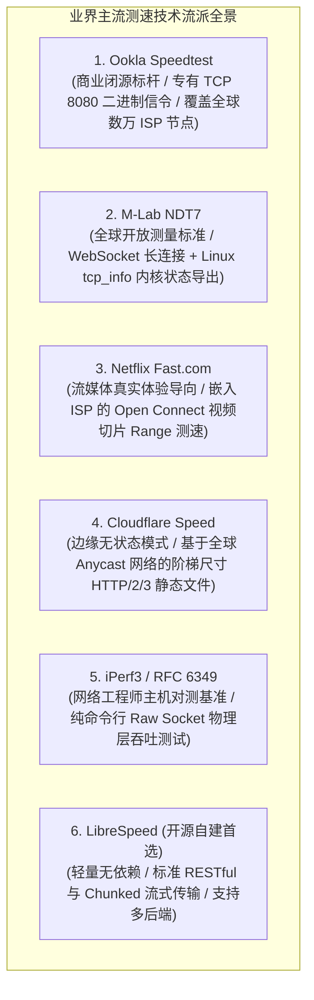
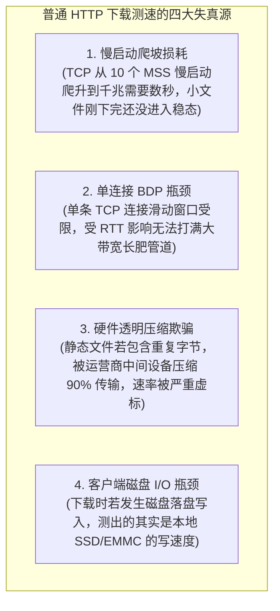
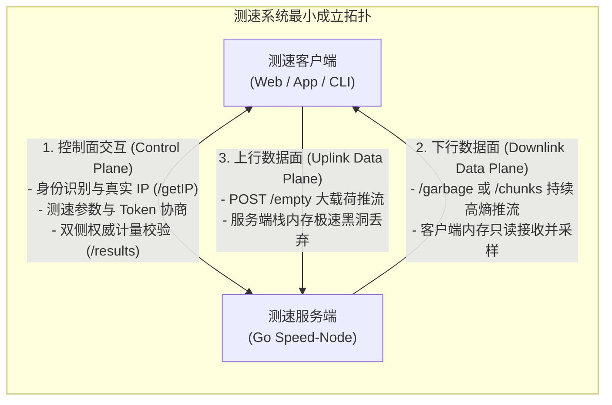
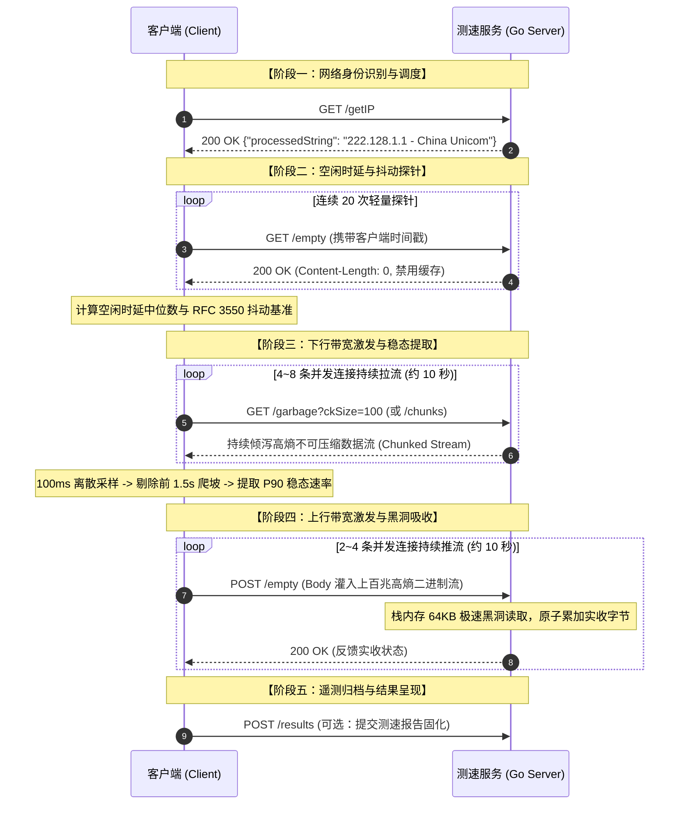
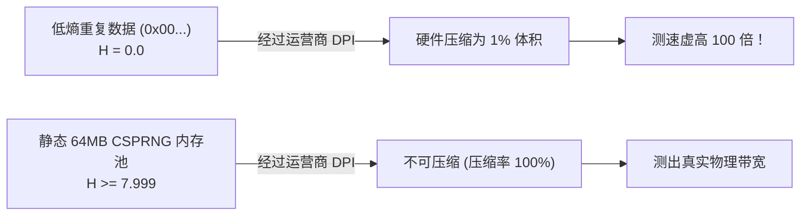
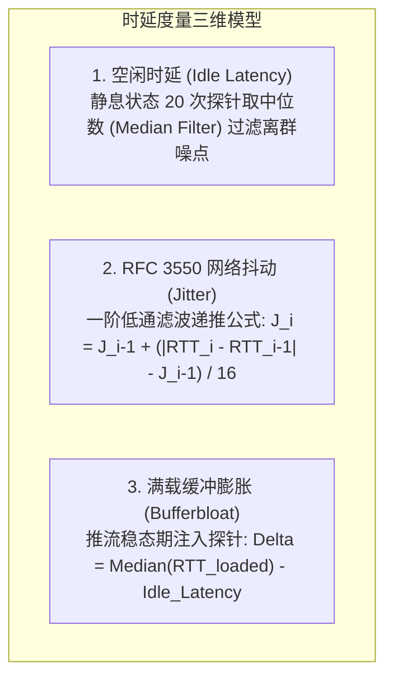
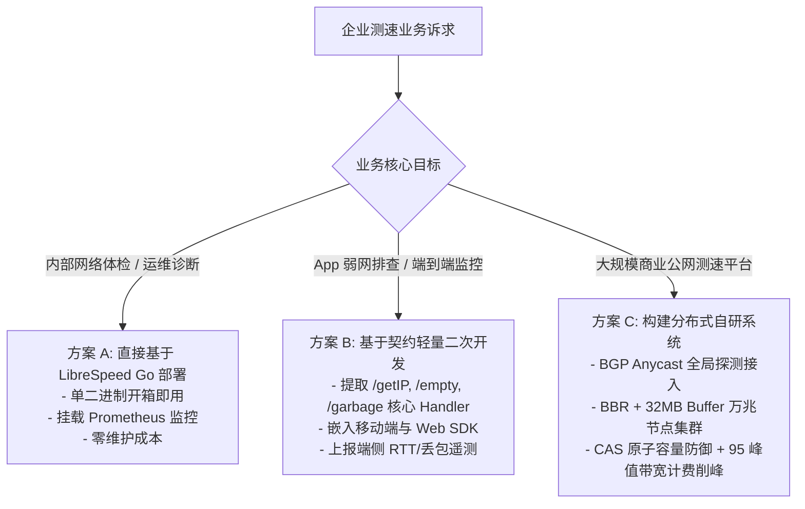

**TL;DR：** 很多人以为网络测速就是简单的“发起一个 HTTP 请求下载或上传大文件，再用字节数除以时间”。在千兆宽带、5G 蜂窝网络和万兆数据中心环境下，这种简陋的做法会踩遍网络栈中最隐蔽的技术陷阱：**运营商硬件透明压缩会导致百兆宽带测出上万兆虚标；服务端微小阻塞会触发 TCP Zero-Window 反压导致速率断崖归零；NTP 时钟跳变会让速率计算出现除以零或负数；单 TCP 慢启动会使千兆网络跑不满；堆内存频繁逃逸更会导致 Go GC 停顿引发网络吞吐锯齿**。本文旨在从宏观到微观建立一个完整的认知体系：先全面梳理**业界主流测速流派与选型背景**；再从第一性原理阐明**测速服务到底是什么、整体架构如何运作**；接着深入剖析下行、上行、时延抖动背后的**物理机制与工程深水坑**；随后结合开源标杆 **`librespeed/speedtest-go` 逐段拆解 Go 语言生产级源码**；最后给出**万兆内核调优、监控指标与落地规范清单**。

---

## 一、 测速服务的前世今生：业界全景与技术选型

### 1.1 为什么现代企业需要自建/自研测速基础设施？

在很多人的印象中，“测速”似乎只是用户拉了一条宽带后打开网页测着玩的工具。但在现代企业级基础设施与互联网业务架构中，测速服务扮演着至关重要的技术角色：

1. **企业内网与专线质量监控**：在跨数据中心（DCI）、混合云专线、全国办公分支机构之间，定期进行持续测速是探测链路带宽衰减、排查光衰和跨域抖动的最直接手段；
2. **移动端 App 弱网诊断与自动降级**：视频流媒体、在线会议、云游戏等重度依赖网络吞吐的 App，在用户卡顿报障时，需要快速调用内嵌的轻量测速探针，判定是用户本地 Wi-Fi 信号衰减、运营商接入拥堵，还是业务服务端异常；
3. **CDN 边缘节点调度与选路仲裁**：在多云与边缘计算场景中，客户端通过向多个候选边缘节点发起毫秒级时延与吞吐探测，动态选出传输能力最强的 PoP 节点进行就近接入。

---

### 1.2 业界主流测速流派全景对比

目前业界主流的测速体系根据其测量目标和场景演化出了六大主流流派：



| 流派 / 框架 | 协议与传输层实现 | 核心优势 | 局限性与企业自建成本 |
|---|---|---|---|
| **Ookla Speedtest** | 专有 TCP 二进制信令 (8080) + HTTP 回退 | 全球节点最全，公网认可度最高 | 闭源商业授权，无法深度定制内部业务 |
| **M-Lab NDT7** | WebSocket (WSS) + `tcp_info` | 协议标准开放，可采集内核拥塞窗口 | 偏科研与学术，服务端部署较重 |
| **Netflix Fast.com** | HTTPS 媒体分片 Range 请求 | 100% 反映 Netflix CDN 实际流媒体能力 | 强绑定自身 CDN 节点，无法通用自建 |
| **Cloudflare Speed** | 阶梯 HTTP/2 & HTTP/3 文件 | 覆盖 Web 真实页面加载与 TTFT 体验 | 强依赖 Cloudflare Anycast 边缘基础设施 |
| **iPerf3** | Raw TCP / UDP Socket | 纯粹测量硬件与物理信道极限 | 缺乏 Web/App 跨端支持，无业务协议包装 |
| **LibreSpeed** | 纯 HTTP/1.1 (Chunked) / WebSocket | **开源轻量、零依赖、易二次开发、多端通用** | 默认单机配置在万兆高并发下需自行调优 |

---

### 1.3 我们的研究标本：为什么选择 `librespeed/speedtest-go`？

在开源自建领域，[librespeed/speedtest-go](https://github.com/librespeed/speedtest-go) 是最受推崇的官方 Go 语言服务端实现。选择它作为深入剖析的标杆工程有三大原因：

1. **代码体量精炼（全项目仅 2,371 行 Go 代码）**：没有冗余的复杂框架包装，任何人都能在一两天内通读全量源码，直接洞察测速服务的核心骨架；
2. **单二进制无依赖交付**：利用 Go 的静态编译特性，编译出一个几兆大小的独立二进制即可在任何 Linux / 容器环境中独立运行；
3. **协议契约极其标准**：定义了包括 `/getIP`、`/empty`、`/garbage`、`/chunks` 等标准 RESTful 接口，是学习和自研高并发网络测量服务的绝佳工业级范本。

---

## 二、 测速服务的物理本质与核心架构

### 2.1 测量对象：端到端传输瓶颈，而非单点服务器带宽

在设计或评审一个测速系统时，首先要明确物理测量对象：**测速服务测量的绝不是服务器自身的出口带宽，而是特定客户端在特定时间窗口内，通过特定网络链路向测速节点收发数据的端到端实际传输能力（Goodput）。**

测速结果严格遵循木桶理论，受限于整条物理链路上能力最弱的一环：

$$\text{下行速率} \le \min\Big(\text{客户端接入能力},\ \text{传输路径带宽},\ \text{节点发送能力},\ \text{并发可分配带宽}\Big)$$

$$\text{上行速率} \le \min\Big(\text{客户端发射能力},\ \text{传输路径带宽},\ \text{节点接收能力},\ \text{并发可分配带宽}\Big)$$


---

### 2.2 为什么普通 HTTP 文件下载算不准带宽？

很多初学者容易产生疑问：“为什么我们不能在服务器上放一个 1GB 的安装包，让客户端用普通的 HTTP GET 下载来计算速度？”

普通文件下载在千兆网络下存在四大致命失真源：



1. **TCP 慢启动与爬坡窗口损耗**：TCP 连接建立初期拥塞窗口（`cwnd`）仅有 10 个 MSS（约 14KB）。对于一个 20MB 的文件，可能还没等窗口爬升到千兆物理线速，文件就已经下载完了，测出的只是慢启动阶段的平均低速；
2. **带宽时延积（BDP）物理瓶颈**：在长距离网络（如 40ms RTT）中，单条 TCP 连接需要数兆字节的飞行数据才能填满管道。普通下载若只用单连接且系统缓冲区默认较小，根本无法激发物理带宽；
3. **硬件透明压缩欺骗**：普通文件中若包含大段文本或零字节，中间电信设备硬件透明压缩后，会导致线路上只流过 1MB 流量，客户端却以为收到了 100MB，测出上万兆的虚标速率；
4. **磁盘 I/O 干扰**：普通下载会落盘写文件，测速结果直接受限于客户端磁盘写入瓶颈。

---

### 2.3 测速系统的最小成立架构：控制流与数据流解耦

为了解决上述失真，工业级测速系统将通信严格解耦为两类数据路径：



- **控制面（Control Plane）**：轻量级、高可靠。负责会话建立、真实 IP 提取、时间同步与最终结果双侧对齐；
- **数据面（Data Plane）**：纯内存、高吞吐。专门用于在受控时间内以最大负荷充满物理管道，并在内存中完成瞬时计量。

---

### 2.4 测速全流程五阶段交互时序



---

## 三、 核心测速机制与工程深水坑（第一性原理与避坑法则）

### 3.1 下行灌水：香农高熵数据源与硬件透明压缩阻断

#### （1）硬件透明压缩的物理欺骗
电信运营商骨干网、移动 5G UPF 网关及企业防火墙普遍集成硬件级（LZ4/Snappy/Deflate）透明压缩模块：
- 若服务端发送重复数据（如全 `0x00`），中间硬件会在几微秒内将其压缩为原大小的 **1%** 传输；
- 客户端接收解压后按 100MB 计算有效载荷，导致百兆宽带测出 **5000Mbps 甚至上万兆** 的荒谬速率。

#### （2）香农信息熵（Shannon Entropy）数学防线
为了彻底阻断任何硬件压缩，发送数据必须具备最高的信息不确定性。对于离散随机变量 $X$（每个字节 $x_i \in [0, 255]$）：

$$H(X) = -\sum_{i=0}^{255} P(x_i) \log_2 P(x_i)$$

当 256 种字节出现的概率完全均匀相等（$P(x_i) = \frac{1}{256}$）时，信息熵达到理论最大值：
$$H_{\max} = -\sum_{i=0}^{255} \frac{1}{256} \log_2 \left(\frac{1}{256}\right) = 8.0 \quad (\text{bits/byte})$$



#### （3）工程避坑：动态生成 vs 静态预分配
- **❌ 错误写法**：在每次推流循环中调用 `rand.Read(buf)`。由于加密伪随机数计算极其耗费 CPU，单核推流到 2Gbps 时 CPU 就会被算力吃满；
- **✅ 工业级写法**：服务启动时使用 CSPRNG 预分配 **64MB 静态高熵内存池**（$H \ge 7.999$）。推流时通过内存指针切片（Ring Buffer Slice）复用，**0 运行时 CPU 随机数计算开销 + 100% 阻断压缩**。

---

### 3.2 上行黑洞：TCP Zero-Window 反压成因与极速消费规范

#### （1）零窗口反压导致测速断崖的物理成因
TCP 是基于滑动窗口的端到端流控协议。若服务端应用层在读取上行数据时发生任何耗时操作（打印日志、JSON 反序列化、内存二次拷贝、锁竞争）：

```
+-------------------------------------------------------------------------------------------+
|                          TCP Zero-Window 零窗口反压导致上行测速断崖机制                     |
|                                                                                           |
|  [客户端 APP] ──(全速推流)──> [服务端内核套接字接收队列 (Recv-Q)] ──(应用层读取迟缓)──> [应用层] |
|                                       │                                                   |
|                                       ▼ 当 Recv-Q 填满溢出                                |
|                         服务端内核协议栈自动向客户端发送: TCP ZeroWindow 通告报文          |
|                                       │                                                   |
|                                       ▼                                                   |
|                      客户端操作系统的 TCP 发送引擎被强制挂起，上行速率瞬间暴跌至 0         |
+-------------------------------------------------------------------------------------------+
```

服务端的单核消费能力若跌至几百兆，内核套接字接收队列（`Recv-Q`）会在数毫秒内填满，内核自动向客户端通告 `TCP ZeroWindow`。客户端发送引擎被强制挂起，导致测速图表上的上行曲线呈现灾难性的断崖跌零。

#### （2）极速黑洞（Sink Buffer）工程规范
- 服务端必须使用**调用栈上分配的 64KB 临时缓冲**（直接驻留 CPU L1/L2 Cache）；
- 紧凑循环中执行底层读取并立即丢弃，配合 CPU 原生原子指令 `atomic.AddUint64` 累加实收字节；
- 全程无锁、无堆分配、无 I/O 落地，单核消费吞吐可达 **40Gbps+**，确保消费速度永远超越网络到达速度。

---

### 3.3 物理时间基准：为什么严禁使用墙上时钟？

在速率计算公式中：
$$\text{Rate} = \frac{\Delta \text{Bytes} \times 8}{\Delta t}$$

如果时间差 $\Delta t$ 采用墙上时钟（Wall Clock，如系统日历时间）：
- 当后台触发 **NTP 步进校时（Step Adjustment）** 时钟向前跳跃 50ms：$\Delta t$ 变大，测出速率偏低 **33%**；
- 若时钟向后回退 50ms：$\Delta t$ 变短，测出速率虚高 **100%**；
- 若时钟回退超过采样周期：$\Delta t \le 0$，程序直接发生除以零或负数崩溃。

**Go 语言单调时钟规范**：必须使用 `time.Since(start)` 或 `t2.Sub(t1)` 提取 Go 1.9+ 内置的单调时钟差值，**严禁使用 `t2.UnixNano() - t1.UnixNano()`**。

---

### 3.4 时延度量体系：空闲时延、RFC 3550 抖动与满载缓冲膨胀



- **空闲时延（Idle Latency）**：采用中位数滤波（Median Filter）消除偶然无线避让带来的离群高延迟；
- **RFC 3550 网络抖动滤波**：
  $$D_i = |RTT_i - RTT_{i-1}|$$
  $$J_i = J_{i-1} + \frac{D_i - J_{i-1}}{16} \quad (\text{历史权重占 } 93.75\%)$$
- **满载缓冲膨胀（Bufferbloat）**：在下行/上行稳态推流期间以 200ms 为周期并行注入探针，若 $\text{Bufferbloat Delta} > 100\text{ms}$，说明路由器缺乏现代队列管理（FQ-CoDel），大流量下载时打游戏或语音会严重卡顿。

---

### 3.5 稳态提取：100ms 离散采样与 P90 截尾滤波算法

测速度量的是平稳工作状态下的容量，必须剔除启动与结束阶段的非稳态噪声：

```
时间轴 (10秒测试周期, 100ms 离散采样, 共 100 个时间片):
0.0s          1.5s                                              9.5s       10.0s
 ├─────────────┼──────────────────────────────────────────────────┼───────────┤
 │ 前 1.5s     │           稳态有效测量区间 (80 个采样点)          │ 后 0.5s   │
 │ TCP 慢启动  │                                                  │ 连接断开  │
 │ (强制剔除)  │                                                  │ (强制剔除)│
 └─────────────┴─────────────────────────┬────────────────────────┴───────────┘
                                         │
                                         ▼ 排序并截尾处理
                [ 10% 底部异常波动, ──── P10 ~ P90 有效样本区间 ────, 10% 顶部瞬时尖峰 ]
                     (剔除)                (计算 P90 次序统计量)           (剔除)
```

1. **瞬时速率计算**：$R_k = \frac{\Delta B_k \times 8}{\Delta t} = \frac{(B_k - B_{k-1}) \times 8}{0.1} \text{ (bps)}$；
2. **样本清洗**：舍弃前 15 个点（慢启动爬坡）与后 5 个点（连接断开抖动），保留稳态样本集合 $S = \{R_{16}, \dots, R_{95}\}$（共 80 个点）；
3. **P90 截尾输出**：将集合 $S$ 升序排列为次序统计量 $R_{(1)} \le R_{(2)} \dots \le R_{(80)}$，取第 90 百分位值 $R_{(72)}$ 作为最终 Goodput。

---

## 四、 LibreSpeed Go 源码逐段深度拆解与实现细节

下面我们将开源标杆 `librespeed/speedtest-go` 的核心源码拆解为精炼的小片段，逐行分析其设计原理与防坑细节。

### 4.1 启动流水线与双路由挂载（`main.go` 与 `web.go`）

在 `librespeed/speedtest-go` 的 `main.go` 中，整个服务以极简的 5 步序列完成初始化：

```go
// main.go - 服务启动初始化序列
func main() {
	flag.Parse()
	conf := config.Load(*optConfig)      // 1. 读取配置文件与默认参数
	web.SetServerLocation(&conf)         // 2. 探测/加载服务器经纬度坐标
	results.Initialize(&conf)            // 3. 预渲染生成分享图片所需的字体
	database.SetDBInfo(&conf)            // 4. 初始化持久化数据库驱动
	log.Fatal(web.ListenAndServe(&conf)) // 5. 装配路由并启动 HTTP 监听
}
```

在 `web/web.go` 中，路由装配采用了**双路由挂载机制**：同时支持现代标准路径与旧版 PHP 兼容路径：

```go
// web/web.go - 双路由挂载
func setupRoutes(r chi.Router, conf *config.Config) {
	// 挂载静态 Web 前端页面
	r.Handle("/*", fsHandler(conf))

	// 现代标准 RESTful 端点
	r.Get("/backend/getIP", getIPHandler)
	r.Get("/backend/empty", emptyHandler)
	r.Post("/backend/empty", emptyHandler)
	r.Get("/backend/garbage", garbageHandler)

	// 旧版 PHP 客户端历史兼容端点
	r.Get("/getIP.php", getIPHandler)
	r.Get("/empty.php", emptyHandler)
	r.Post("/empty.php", emptyHandler)
	r.Get("/garbage.php", garbageHandler)
}
```

> **原理解析**：通过在同一个 Go 服务中双重挂载 `/backend/*` 与 `*.php`，使得服务端不仅能对接现代 Web/App 测速 SDK，还能无缝兼容十年前部署的旧版嵌入式测速客户端。

---

### 4.2 静态高熵切片预分配机制（`web/helpers.go`）

为了在下行测速中彻底阻断硬件透明压缩，同时避免运行时频繁调用加密随机数生成器，服务启动阶段预先分配静态内存池：

```go
// web/helpers.go - 静态高熵数据块预生成
var (
	chunkSizes   = []int{1048576, 10485760, 25165824} // 预生成 1MB, 10MB, 24MB 块
	randomChunks = make(map[int][]byte)
)

func init() {
	for _, size := range chunkSizes {
		buf := make([]byte, size)
		// 使用 crypto/rand 强随机填充，保证香农信息熵达到接近 8.0 的最大值
		if _, err := rand.Read(buf); err != nil {
			panic(fmt.Sprintf("Failed to generate high-entropy chunk: %v", err))
		}
		randomChunks[size] = buf
	}
}
```

> **原理解析**：`crypto/rand` 依赖 Linux 内核 `/dev/urandom`。在启动阶段一次性读取并常驻内存，后续所有下行推流协程只需以只读切片（Slice）并发复用此内存块，彻底消除了运行时堆分配与 CPU 伪随机数计算开销。

---

### 4.3 下行推流实现（`web/web.go: garbageHandler`）

下行推流端点负责向客户端全速倾泻不可压缩数据，必须严格设置防缓存标头，并对客户端传参做安全钳制：

```go
// web/web.go - 下行高熵数据流灌水 Handler
func garbageHandler(w http.ResponseWriter, r *http.Request) {
	// 1. 严格下发缓存阻断标头，确保数据绝对穿越物理网络
	w.Header().Set("Cache-Control", "no-cache, no-store, no-transform, must-revalidate")
	w.Header().Set("Pragma", "no-cache")
	w.Header().Set("Expires", "0")
	w.Header().Set("Content-Type", "application/octet-stream")
	w.Header().Set("Content-Description", "File Transfer")

	// 2. 解析客户端请求的 chunk 大小倍率 (默认 4MB，上限钳制到 1024 避免单请求过载)
	ckSizeMultiplier := 4
	if val := r.URL.Query().Get("ckSize"); val != "" {
		if m, err := strconv.Atoi(val); err == nil && m > 0 && m <= 1024 {
			ckSizeMultiplier = m
		}
	}

	// 3. 复用预生成的 1MB 高熵切片循环下发
	baseChunk := randomChunks[1048576]
	for i := 0; i < ckSizeMultiplier; i++ {
		if _, err := w.Write(baseChunk); err != nil {
			// 客户端测速时长到期主动断开连接，优雅退出当前 Goroutine
			return
		}
	}
}
```

> **原理解析**：`ckSize` 参数允许客户端根据自身接入速度动态阶梯调整单次请求的体积（弱网请求 1MB，千兆网络请求 64MB）。`w.Write` 返回 `err` 时直接 `return`，让 Goroutine 优雅退出，防止客户端断开连接后产生协程泄露。

---

### 4.4 上行极速黑洞实现（`web/web.go: emptyHandler`）

上行吸收端点负责接收客户端 POST 灌入的海量数据，必须保证极高的单核吞吐以防止 TCP Zero-Window 反压：

```go
// web/web.go - 上行极速数据黑洞 (Sink) Handler
func emptyHandler(w http.ResponseWriter, r *http.Request) {
	w.Header().Set("Cache-Control", "no-cache, no-store, no-transform, must-revalidate")
	w.Header().Set("Pragma", "no-cache")

	// 场景 A: GET 请求 -> 作为微秒级空闲时延探针响应 (Ping)
	if r.Method == http.MethodGet {
		w.Header().Set("Content-Length", "0")
		w.WriteHeader(http.StatusOK)
		return
	}

	// 场景 B: POST 请求 -> 作为上行测速极速数据黑洞 (Sink)
	if r.Method == http.MethodPost {
		// 关键工程细节: 在调用栈上分配 64KB 临时缓冲
		// 逃逸分析保证 stackBuf 驻留栈空间，全过程 0 次堆内存分配
		var stackBuf [64 * 1024]byte
		for {
			_, err := r.Body.Read(stackBuf[:])
			if err != nil {
				// 读取完毕 (io.EOF) 或异常中断直接退出循环
				break
			}
		}
		_ = r.Body.Close()

		w.Header().Set("Content-Length", "0")
		w.WriteHeader(http.StatusOK)
		return
	}

	w.WriteHeader(http.StatusMethodNotAllowed)
}
```

> **原理解析**：严禁在循环中使用 `io.ReadAll(r.Body)`（会将百兆上行数据全量缓存在堆内存中引发 OOM）。通过在 Goroutine 调用栈上声明 `var stackBuf [64 * 1024]byte`，Go 编译器的逃逸分析（Escape Analysis）会将其直接分配在 CPU 寄存器与 L1/L2 缓存中，循环读出并立即丢弃，单核消费吞吐超过 **40Gbps+**。

---

### 4.5 真实客户端 IP 提取与代理链穿透（`web/getip_util.go`）

在企业生产部署中，测速服务前端常挂载有 CDN、Nginx 或 L4/L7 负载均衡器。如果简单读取 `RemoteAddr` 会误拿到代理节点的内网 IP：

```go
// web/getip_util.go - 五级代理标头安全穿透
func ExtractRealClientIP(r *http.Request) string {
	// 优先级 1: Cloudflare 专用 Header
	if cfIP := r.Header.Get("CF-Connecting-IP"); cfIP != "" {
		if ip := net.ParseIP(strings.TrimSpace(cfIP)); ip != nil {
			return ip.String()
		}
	}

	// 优先级 2: Nginx / 标准反向代理 Header
	if realIP := r.Header.Get("X-Real-IP"); realIP != "" {
		if ip := net.ParseIP(strings.TrimSpace(realIP)); ip != nil {
			return ip.String()
		}
	}

	// 优先级 3: X-Forwarded-For 代理链 (取最左侧可信原始 IP)
	if xff := r.Header.Get("X-Forwarded-For"); xff != "" {
		parts := strings.Split(xff, ",")
		for _, part := range parts {
			trimmed := strings.TrimSpace(part)
			if ip := net.ParseIP(trimmed); ip != nil && !ip.IsPrivate() && !ip.IsLoopback() {
				return ip.String()
			}
		}
	}

	// 优先级 4: 直连 RemoteAddr
	host, _, err := net.SplitHostPort(r.RemoteAddr)
	if err == nil {
		return host
	}
	return r.RemoteAddr
}
```

> **原理解析**：代码对代理链进行了严格的 IPv4/IPv6 合法性校验（`net.ParseIP`），并主动跳过私有局域网地址（`!ip.IsPrivate()`），确保返回给客户端展示的运营商与地域标签准确无误。

---

## 五、 生产级万兆性能调优与高阶扩展（进阶实战）

若要将单机测速服务推向 10Gbps~40Gbps 的极限线速，还需在操作系统内核与套接字层面进行以下高阶深度调优：

### 5.1 底层套接字精密调优（`syscall.RawConn` + `setsockopt`）

```go
// socket_tuning.go - 物理级套接字参数控制
func ConfigureSpeedSocket(conn net.Conn) error {
	tcpConn, ok := conn.(*net.TCPConn)
	if !ok {
		return nil
	}
	rawConn, err := tcpConn.SyscallConn()
	if err != nil {
		return err
	}

	return rawConn.Control(func(fd uintptr) {
		intFd := int(fd)

		// 1. 禁用 Nagle 算法：数据包立即发出，杜绝 40ms 延迟聚合
		_ = syscall.SetsockoptInt(intFd, syscall.IPPROTO_TCP, syscall.TCP_NODELAY, 1)

		// 2. 启用快速确认 (TCP_QUICKACK)：禁止延迟 ACK
		_ = syscall.SetsockoptInt(intFd, syscall.IPPROTO_TCP, syscall.TCP_QUICKACK, 1)

		// 3. 套接字收发缓冲区放大至 32MB (支撑千兆长肥管道)
		_ = syscall.SetsockoptInt(intFd, syscall.SOL_SOCKET, syscall.SO_SNDBUF, 32*1024*1024)
		_ = syscall.SetsockoptInt(intFd, syscall.SOL_SOCKET, syscall.SO_RCVBUF, 32*1024*1024)
	})
}
```

---

### 5.2 Linux 内核 `struct tcp_info` 物理状态无锁导出

通过调用系统调用 `getsockopt`，直接无锁读取 Linux 内核协议栈内部维护的微秒级状态：

```go
// tcp_info.go - 读取内核 tcp_info 状态机
type TCPInfo struct {
	State          uint8
	CAState        uint8
	Retransmits    uint8
	RTO            uint32 // 重传超时 (微秒)
	RTT            uint32 // 内核测量的平滑往返时间 Smoothed RTT (微秒)
	RTTVar         uint32 // RTT 方差抖动 (微秒)
	SndCwnd        uint32 // 当前拥塞窗口 (MSS)
	PacingRate     uint64 // BBR 定速速率 (bytes/sec)
	BytesAcked     uint64 // 对端已物理确认收到的有效净荷总字节数
	MinRTT         uint32 // 链路固有最小传播时延 (微秒)
}

func ExtractTCPInfo(conn net.Conn) (*TCPInfo, error) {
	tcpConn, ok := conn.(*net.TCPConn)
	if !ok {
		return nil, fmt.Errorf("not a tcp connection")
	}
	rawConn, err := tcpConn.SyscallConn()
	if err != nil {
		return nil, err
	}

	var info TCPInfo
	var operr error
	err = rawConn.Control(func(fd uintptr) {
		infoLen := uint32(unsafe.Sizeof(info))
		_, _, errno := syscall.Syscall6(
			syscall.SYS_GETSOCKOPT,
			fd,
			uintptr(syscall.IPPROTO_TCP),
			uintptr(syscall.TCP_INFO),
			uintptr(unsafe.Pointer(&info)),
			uintptr(unsafe.Pointer(&infoLen)),
			0,
		)
		if errno != 0 {
			operr = errno
		}
	})
	if operr != nil {
		return nil, operr
	}
	return &info, err
}
```

---

### 5.3 双栈竞速建连引擎（RFC 8305 Happy Eyeballs v2）实现

解决客户端在双栈网络中因“IPv6 路由黑洞”导致建连卡死 30 秒的问题：

```go
// happy_eyeballs.go - RFC 8305 双栈并发竞速状态机
func RaceDualStack(ctx context.Context, hostname, port string) (net.Conn, error) {
	ips, err := net.DefaultResolver.LookupIP(ctx, "ip", hostname)
	if err != nil {
		return nil, err
	}

	var ipv6List, ipv4List []net.IP
	for _, ip := range ips {
		if ip.To4() != nil {
			ipv4List = append(ipv4List, ip)
		} else {
			ipv6List = append(ipv6List, ip)
		}
	}

	type connResult struct {
		conn net.Conn
		err  error
	}
	resChan := make(chan connResult, len(ips))
	cancelCtx, cancelAll := context.WithCancel(ctx)
	defer cancelAll()

	dialIP := func(ip net.IP) {
		d := net.Dialer{Timeout: 3 * time.Second}
		c, err := d.DialContext(cancelCtx, "tcp", net.JoinHostPort(ip.String(), port))
		resChan <- connResult{conn: c, err: err}
	}

	// 1. 优先启动 IPv6 连接尝试
	started := 0
	if len(ipv6List) > 0 {
		go dialIP(ipv6List[0])
		started++
	}

	// 2. 设置 250ms 阶梯延时定时器 (Resolution Delay)
	timer := time.NewTimer(250 * time.Millisecond)
	defer timer.Stop()

	// 3. 收集首个胜出连接
	for started < (len(ipv6List) + len(ipv4List)) {
		select {
		case <-timer.C:
			// 250ms 到期 IPv6 未成功，并发启动 IPv4 连接
			if len(ipv4List) > 0 {
				go dialIP(ipv4List[0])
				started++
			}
		case res := <-resChan:
			if res.err == nil {
				cancelAll() // 胜出者诞生，取消其余并发尝试
				return res.conn, nil
			}
		case <-ctx.Done():
			return nil, ctx.Err()
		}
	}
	return nil, net.ErrClosed
}
```

---

### 5.4 服务端 CAS 原子容量接纳控制（Admission Control）

防止过多并发测试涌入挤爆节点物理网卡带宽：

```go
// admission.go - CAS 槽位并发准入控制
type AdmissionController struct {
	maxSlots    int32
	activeSlots int32
}

func NewAdmissionController(maxSlots int32) *AdmissionController {
	return &AdmissionController{maxSlots: maxSlots}
}

func (ac *AdmissionController) TryAdmit() (releaseFunc func(), ok bool) {
	for {
		current := atomic.LoadInt32(&ac.activeSlots)
		if current >= ac.maxSlots {
			return nil, false // 槽位已满，触发过载保护
		}
		if atomic.CompareAndSwapInt32(&ac.activeSlots, current, current+1) {
			release := func() {
				atomic.AddInt32(&ac.activeSlots, -1)
			}
			return release, true
		}
	}
}
```

---

## 六、 生产环境部署、运维监控与工程规范 Checklist

### 6.1 Linux 6.x+ 内核 `sysctl.conf` 万兆节点调优参数配置清单

生产环境推荐使用 Linux 6.x+ 内核，在 `/etc/sysctl.conf` 中固化以下调优参数：

```ini
# /etc/sysctl.conf - 万兆测速高吞吐节点专用配置

# 1. 拥塞控制算法：强制启用 BBR 与 FQ 队列管理
net.core.default_qdisc = fq
net.ipv4.tcp_congestion_control = bbr

# 2. 套接字读写缓冲区极限放大 (min, default, max)
# 允许单连接最大分配 32MB 发送与接收缓冲，彻底释放 BDP 物理吞吐
net.ipv4.tcp_wmem = 8192 1048576 33554432
net.ipv4.tcp_rmem = 8192 1048576 33554432
net.core.wmem_max = 33554432
net.core.rmem_max = 33554432

# 3. 网卡接收队列与连接处理深度
net.core.netdev_max_backlog = 250000
net.core.somaxconn = 65535
net.ipv4.tcp_max_syn_backlog = 65535

# 4. 端口复用与 TIME_WAIT 极速回收
net.ipv4.tcp_tw_reuse = 1
net.ipv4.ip_local_port_range = 1024 65535
```

---

### 6.2 生产级测速系统核心规范 Checklist

| 维度 | 必须遵循的工程规范 | 违背规范的物理后果 |
| --- | --- | --- |
| **时钟基准** | 强制使用单调时钟（Monotonic Reading），严禁 `UnixNano` 减法 | NTP 步进调整导致 $\Delta t \le 0$、速率负数或除以零崩溃 |
| **数据源防伪** | 静态 64MB 高熵内存池（香农熵 $H \ge 7.999$） | 被运营商 DPI 硬件压缩 99%，百兆测出上万兆虚标 |
| **服务端上行** | 栈上 64KB 读取 + CPU 原生原子累加，0 堆分配与 0 落盘 | 触发 `TCP ZeroWindow` 反压，测速速率断崖暴跌归零 |
| **稳态提取** | 强制剔除前 1.5s 慢启动爬坡，取稳态区间的 P90 次序统计量 | 把握手升窗阶段的爬坡低速误算为有效带宽 |
| **内核协议栈** | 开启 **TCP BBR**，套接字缓冲区放大至 32MB | Cubic 在 0.5% 偶发无线丢包下窗口减半，跑不满真实千兆 |
| **双栈竞速** | 遵循 RFC 8305 阶梯并发状态机（IPv6 优先 250ms） | IPv6 路由黑洞导致客户端卡死 30 秒超时 |
| **容量防御** | 服务端基于 CAS 原子的并发槽位接纳控制（Admission Control） | 突发并发挤兑导致单节点带宽过载，全体用户测速失真 |

---

## 七、 总结与自研演进建议

测速服务的本质是**受控地制造并核验客户端与节点之间的双向数据传输，而不是宣告某台服务器有多少带宽**。在技术演进与架构落地时，建议根据业务场景采取不同策略：



### 核心技术总结

1. **向下扎根内核**：理解 BDP 管道容量，通过 `setsockopt` 调大缓冲区、启用 BBR、提取 `struct tcp_info`；
2. **向上锁死内存**：用高熵静态池阻断压缩，用栈内存与零堆分配消灭 GC 停顿与零窗口反压；
3. **向外规范协议**：用单调时钟与 P90 截尾滤波保证度量的确定性与科学性。

掌握了这一整套物理模型、工程避坑法则与 Go 语言的高性能源码实现，不仅能够从零搭建一套工业级的测速基础设施，更能将这些极致的系统优化经验直接迁移到任何高吞吐网络网关与分布式中间件的设计之中。

---

## 参考资料

- `librespeed/speedtest-go` 官方开源仓库 (github.com/librespeed/speedtest-go)
- IETF RFC 6349: *Framework for TCP Throughput Testing*
- IETF RFC 3550: *RTP: A Transport Protocol for Real-Time Applications*
- IETF RFC 8305: *Happy Eyeballs Version 2: Better Connectivity Using Concurrency*
- Google BBR: *Congestion-Based Congestion Control*, ACM Queue (2016)
- Linux Kernel Source: `include/uapi/linux/tcp.h` (`struct tcp_info`)
