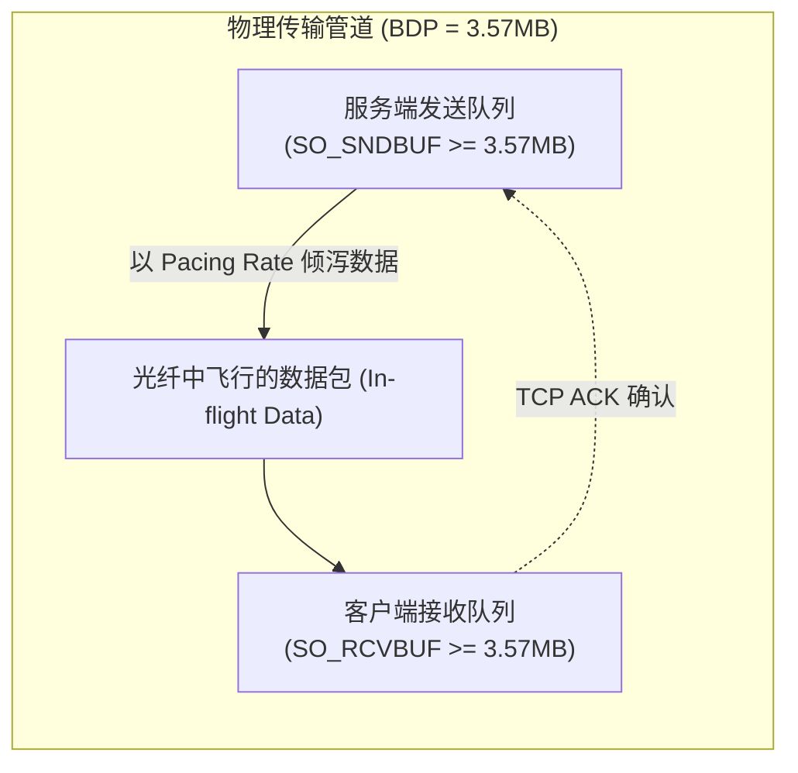
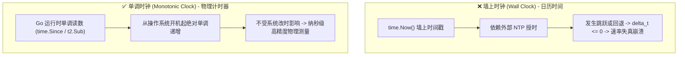
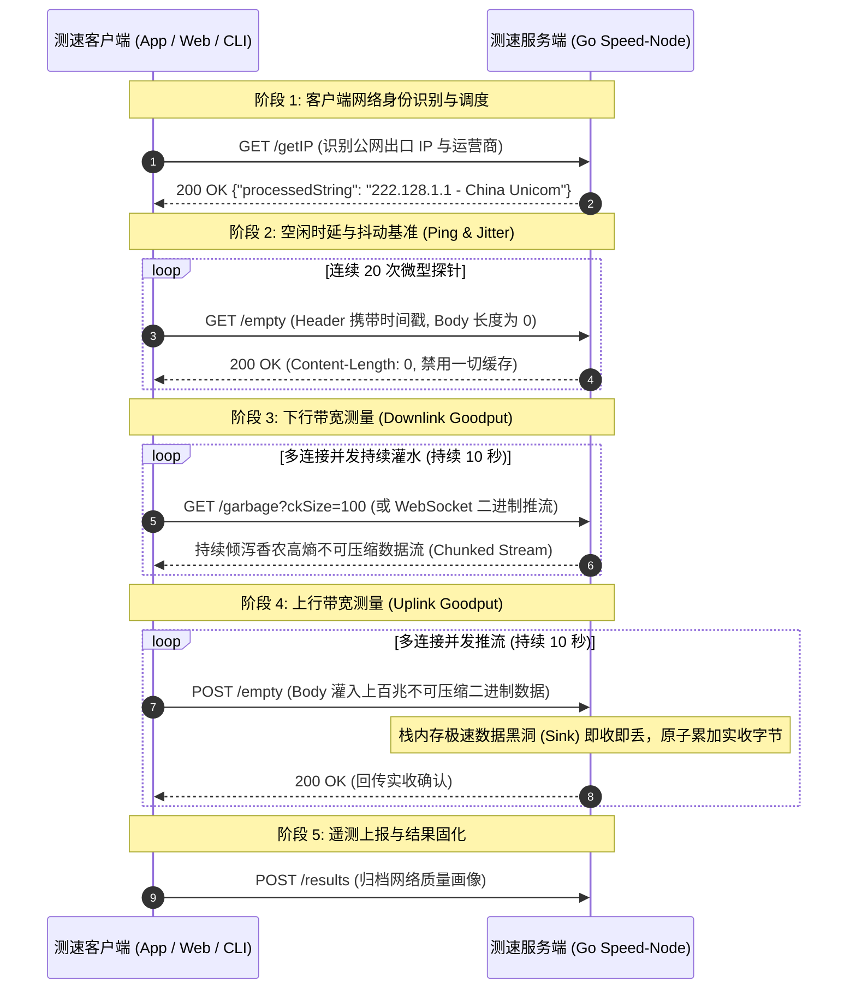
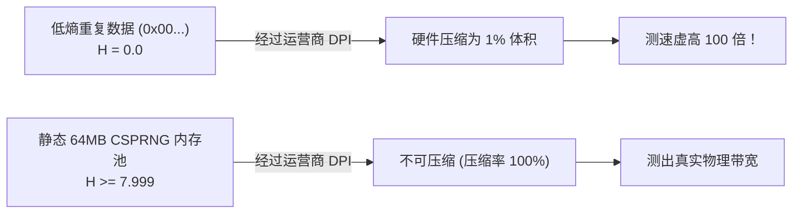
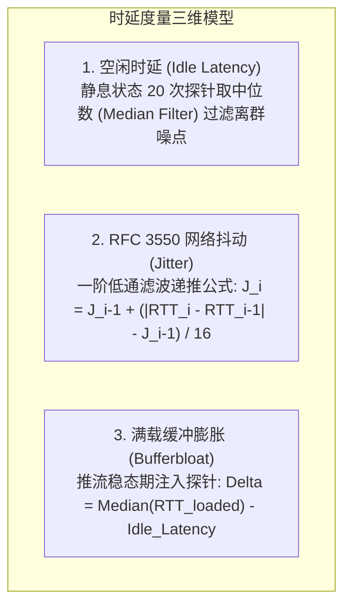
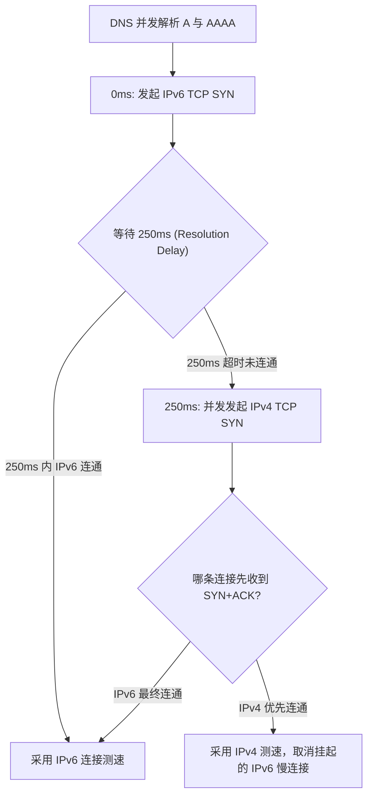

**TL;DR：** 很多人以为网络测速只是简单的“发起一个 HTTP 请求下载或上传大文件，再用字节数除以时间”。在千兆宽带、5G 蜂窝网络和万兆数据中心环境下，这种简陋的做法会踩遍网络栈中最隐蔽的技术陷阱：**运营商硬件透明压缩会导致百兆宽带测出上万兆虚标；服务端微小阻塞会触发 TCP Zero-Window 反压导致速率断崖归零；NTP 时钟跳变会让速率计算出现除以零或负数；单 TCP 慢启动会使千兆网络跑不满；堆内存频繁逃逸更会导致 Go GC 停顿引发网络吞吐锯齿**。本文从计算机网络物理层、Linux 内核网络栈、传输层协议契约出发，深度剖析测速服务服务端底层工作机制，并逐一拆解对应的高性能 Go 语言生产级实现与内核调优细节。

---

## 一、 测速服务的物理本质与系统全景架构

### 1. 物理本质：带宽时延积（BDP）与管道注满

测速服务度量的不是“某个特定文件的传输耗时”，而是端到端物理链路在**平稳承载状态下的有效吞吐率（Goodput）**。在物理网络中，单条连接的最大吞吐受限于**带宽时延积（Bandwidth-Delay Product, BDP）**：

$$\text{BDP} = \text{瓶颈带宽 (Bottleneck Bandwidth)} \times \text{往返时延 (RTT)}$$

```
【千兆光纤链路 BDP 物理推导】
带宽 = 1000 Mbps, 往返时延 RTT = 30 ms (0.03 s)
BDP = (1000 * 10^6 * 0.03) / 8 = 3,750,000 字节 ≈ 3.57 MB
```

在物理光纤中，**必须始终保持有 3.57MB 的飞行数据（In-flight Data）处于传输途中，千兆物理管道才能被 100% 打满**。如果操作系统套接字缓冲区（`SO_SNDBUF`/`SO_RCVBUF`）或拥塞窗口受限，单连接吞吐将彻底被物理时延锁死。



---

### 2. 物理时间基准：为什么严禁使用墙上时钟？

在速率计算公式中：
$$\text{Rate} = \frac{\Delta \text{Bytes} \times 8}{\Delta t}$$

如果时间差 $\Delta t$ 采用墙上时钟（Wall Clock，如 `time.Now()` 的墙上读数、系统日历时间），当系统后台触发 **NTP 步进校时（Step Adjustment）** 或夏令时切换时：
- 时钟向前跳跃 50ms：$\Delta t$ 被拉长，测出速率偏低 **33%**；
- 时钟向后回退 50ms：$\Delta t$ 变短，测出速率虚高 **100%**；
- 时钟回退超过采样周期：$\Delta t \le 0$，程序产生 `NaN`、无穷大或除以负数崩溃。



**Go 语言中的单调时钟使用规范**：
Go 1.9+ 的 `time.Now()` 默认同时包含了墙上时钟与单调时钟（Monotonic Reading）。但在计算时间差时，必须使用 `time.Since(start)` 或 `t2.Sub(t1)` 提取单调差值，**严禁使用 `t2.UnixNano() - t1.UnixNano()`**（后者会剥离单调时钟，退化为易受 NTP 影响的墙上时钟）。

---

### 3. 全链路交互五阶段状态机

一个高精度的测速系统由控制面与数据面端点协同完成，分为五个明确的阶段：



---

## 二、 核心测速机制与底层防坑规范

### 1. 下行测速：高熵数据源与硬件透明压缩阻断

#### （1）硬件透明压缩欺骗的物理机理
电信运营商骨干路由器、5G 基站核心网 UPF 网关及企业防火墙中，普遍集成了硬件级（ASIC/FPGA）数据流透明压缩模块（LZ4、Snappy、Deflate）：
- 若服务端发送全 `0x00` 或重复特征字符串，中间设备会在几个微秒内将其压缩为原大小的 **0.1% ~ 1%**；
- 客户端在接收解压后还原出 100MB 载荷，但线路上实际只流经了 1MB 物理报文，导致在百兆宽带上测出 **5000Mbps 甚至上万兆** 的荒谬速率。

#### （2）香农信息熵（Shannon Entropy）数学防线
为了彻底阻断任何硬件无损压缩算法，发送的数据必须具备最大信息不确定性。对于离散随机变量 $X$（每个字节 $x_i \in [0, 255]$）：

$$H(X) = -\sum_{i=0}^{255} P(x_i) \log_2 P(x_i)$$

当 256 种字节出现的概率完全均匀相等（$P(x_i) = \frac{1}{256}$）时，信息熵达到理论最大值：
$$H_{\max} = -\sum_{i=0}^{255} \frac{1}{256} \log_2 \left(\frac{1}{256}\right) = 8.0 \quad (\text{bits/byte})$$



#### （3）源码对比：动态生成 vs 静态高熵切片
- **❌ 错误写法（低效）**：在每次下行推流循环中调用 `rand.Read(buf)`。由于加密伪随机数计算极其消耗 CPU，单核在推流到 2Gbps 时 CPU 就会被算力打满；
- **✅ 工业级写法（高效）**：服务启动时使用 CSPRNG 预分配 **64MB 静态高熵内存池**（$H \ge 7.999$）。推流时通过内存指针切片（Ring Buffer Slice）复用，**0 运行时 CPU 随机数计算开销 + 100% 阻断压缩**。

---

### 2. 上行测速：TCP Zero-Window（零窗口）反压防御与极速黑洞

#### （1）零窗口反压导致测速断崖的物理成因
TCP 是基于滑动窗口的端到端流控协议。若服务端应用层在读取上行数据时发生任何耗时操作（打印日志、JSON 反序列化、内存二次复制、Channel 投递、锁竞争）：

```
+-------------------------------------------------------------------------------------------+
|                          TCP Zero-Window 零窗口反压导致上行测速断崖机制                     |
|                                                                                           |
|  [客户端 APP] ──(全速推流)──> [服务端内核套接字接收队列 (Recv-Q)] ──(应用层读取迟缓)──> [应用层] |
|                                       │                                                   |
|                                       ▼ 当 Recv-Q 填满溢出                                |
|                         服务端内核协议栈自动向客户端发送: TCP ZeroWindow 通告报文          |
|                                       │                                                   |
|                                       ▼                                                   |
|                      客户端操作系统的 TCP 发送引擎被强制挂起，上行速率瞬间暴跌至 0         |
+-------------------------------------------------------------------------------------------+
```

服务端的单核消费能力若跌至几百兆，内核套接字接收队列（`Recv-Q`）会在数毫秒内填满，内核自动向客户端通告 `TCP ZeroWindow`。客户端发送引擎被强制挂起，导致测速图表上的上行曲线呈现灾难性的断崖跌零。

#### （2）极速黑洞（Sink Buffer）工程规范
- 服务端必须使用**调用栈上分配的 64KB 临时缓冲**（直接驻留 CPU L1/L2 Cache）；
- 紧凑循环中执行底层读取并立即丢弃，配合 CPU 原生原子指令 `atomic.AddUint64` 累加实收字节；
- 全程无锁、无堆分配、无 I/O 落地，单核消费吞吐可达 **40Gbps+**，确保消费速度永远超越网络到达速度。

---

### 3. 时延、抖动与 Bufferbloat（缓冲区膨胀）度量



#### RFC 3550 抖动滤波的数学推导
根据 IETF 实时传输协议标准 **RFC 3550**：
1. 计算相邻两个探针时延的绝对差值：$D_i = |RTT_i - RTT_{i-1}|$；
2. 递推更新平滑抖动估计值：$J_i = J_{i-1} + \frac{D_i - J_{i-1}}{16}$；
3. **增益系数 $\alpha = \frac{1}{16} = 0.0625$**：历史平滑权重占 $93.75\%$，具备极强的抗偶然毛刺能力。

---

### 4. 稳态提取：100ms 离散采样与 P90 截尾加权滤波

测速的目标是度量平稳工作状态下的容量，必须剔除启动与结束阶段的非稳态噪声：

```
时间轴 (10秒测试周期, 100ms 离散采样, 共 100 个时间片):
0.0s          1.5s                                              9.5s       10.0s
 ├─────────────┼──────────────────────────────────────────────────┼───────────┤
 │ 前 1.5s     │           稳态有效测量区间 (80 个采样点)          │ 后 0.5s   │
 │ TCP 慢启动  │                                                  │ 连接断开  │
 │ (强制剔除)  │                                                  │ (强制剔除)│
 └─────────────┴─────────────────────────┬────────────────────────┴───────────┘
                                         │
                                         ▼ 排序并截尾处理
                [ 10% 底部异常波动, ──── P10 ~ P90 有效样本区间 ────, 10% 顶部瞬时尖峰 ]
                     (剔除)                (计算 P90 次序统计量)           (剔除)
```

1. **瞬时速率计算**：$R_k = \frac{\Delta B_k \times 8}{\Delta t} = \frac{(B_k - B_{k-1}) \times 8}{0.1} \text{ (bps)}$；
2. **样本清洗**：舍弃前 15 个点（慢启动爬坡）与后 5 个点（连接断开抖动），保留稳态样本集合 $S = \{R_{16}, \dots, R_{95}\}$（共 80 个点）；
3. **P90 截尾输出**：将集合 $S$ 升序排列为次序统计量 $R_{(1)} \le R_{(2)} \dots \le R_{(80)}$，取第 90 百分位值 $R_{(72)}$ 作为最终 Goodput。

---

## 三、 Go 语言高性能实现与源码拆解

### 1. Go 运行时 `netpoller` 与高并发网络调度模型

在传统 C 语言模型中，数万并发连接往往依赖多线程模型（产生大量的上下文切换和线程栈内存开销）或纯手写 epoll 状态机（代码复杂度极高）。

Go 运行时通过 **`netpoller`（网络轮询器）** 将 Linux 的 `epoll` 抽象与 Goroutine 调度器（GMP 模型）深度融合：
- 当一个推流 Goroutine 执行 `conn.Write()` 或 `conn.Read()` 遇到内核缓冲区满或空时，Goroutine 会被运行时放入 `netpoller` 挂起，解绑当前 OS 线程（M）；
- OS 线程立刻切换去执行其他活跃的 Goroutine；
- 当底层 socket 的 epoll 事件就绪时，`netpoller` 将该 Goroutine 唤醒并放回可运行队列（Runqueue）。

每个 Goroutine 初始栈仅占用 **2KB**，这使得单台 32GB 内存的 Go 测速节点能够轻松管理 50,000+ 并发连接而不会触发内存耗尽。

---

### 2. 底层套接字精密调优（`syscall.RawConn` + `setsockopt`）

标准库 `net.TCPConn` 仅暴露了少量的通用方法。为了将网络栈推向万兆极限，我们需要通过 `SyscallConn()` 拿到文件描述符并执行底层调优：

```go
// socket_tuning.go
package main

import (
	"net"
	"syscall"
)

// ConfigureSpeedSocket 对底层 TCP 连接执行物理级精密调优
func ConfigureSpeedSocket(conn net.Conn) error {
	tcpConn, ok := conn.(*net.TCPConn)
	if !ok {
		return nil
	}

	rawConn, err := tcpConn.SyscallConn()
	if err != nil {
		return err
	}

	var operr error
	err = rawConn.Control(func(fd uintptr) {
		intFd := int(fd)

		// 1. 禁用 Nagle 算法 (TCP_NODELAY)：禁止 40ms 延迟合并，数据包立即发出
		if err := syscall.SetsockoptInt(intFd, syscall.IPPROTO_TCP, syscall.TCP_NODELAY, 1); err != nil {
			operr = err
			return
		}

		// 2. 启用快速确认 (TCP_QUICKACK)：禁用延迟 ACK，收到报文立刻回送 ACK
		if err := syscall.SetsockoptInt(intFd, syscall.IPPROTO_TCP, syscall.TCP_QUICKACK, 1); err != nil {
			operr = err
			return
		}

		// 3. 套接字收发缓冲区放大至 32MB (满足 40Gbps * 60ms RTT 长肥管道需求)
		_ = syscall.SetsockoptInt(intFd, syscall.SOL_SOCKET, syscall.SO_SNDBUF, 32*1024*1024)
		_ = syscall.SetsockoptInt(intFd, syscall.SOL_SOCKET, syscall.SO_RCVBUF, 32*1024*1024)

		// 4. 启用 TCP 快速打开 (TCP Fast Open)
		_ = syscall.SetsockoptInt(intFd, syscall.IPPROTO_TCP, syscall.TCP_FASTOPEN, 5)
	})

	if operr != nil {
		return operr
	}
	return err
}
```

---

### 3. Linux 内核 `struct tcp_info` 物理状态无锁导出

传统应用层只能靠粗略的秒表计算速度，而现代高性能测速系统直接通过 `getsockopt` 读取内核协议栈内部的物理状态机：

```go
// tcp_info.go
package main

import (
	"fmt"
	"net"
	"syscall"
	"unsafe"
)

// Linux 内核 tcp_info 结构体定义 (部分关键字段)
type TCPInfo struct {
	State          uint8
	CAState        uint8
	Retransmits    uint8
	Probes         uint8
	Backoff        uint8
	Options        uint8
	RTO            uint32 // 重传超时时间 (微秒)
	ATO            uint32
	SndMSS         uint32 // 发送 MSS
	RcvMSS         uint32
	Unacked        uint32 // 飞行中的未确认数据包数
	Sacked         uint32
	Lost           uint32 // 丢失数据包数
	Retrans        uint32 // 重传数据包数
	RTT            uint32 // 平滑 RTT (微秒)
	RTTVar         uint32 // RTT 方差抖动 (微秒)
	SndSsthresh    uint32
	SndCwnd        uint32 // 当前拥塞窗口大小 (MSS 单位)
	AdvMSS         uint32
	Reordering     uint32
	PacingRate     uint64 // BBR 发送定速速率 (bytes/sec)
	MaxPacingRate  uint64
	BytesAcked     uint64 // 对端已物理确认接收的有效载荷总字节数
	MinRTT         uint32 // 链路固有最小传播时延 (微秒)
}

func ExtractTCPInfo(conn net.Conn) (*TCPInfo, error) {
	tcpConn, ok := conn.(*net.TCPConn)
	if !ok {
		return nil, fmt.Errorf("not a tcp connection")
	}

	rawConn, err := tcpConn.SyscallConn()
	if err != nil {
		return nil, err
	}

	var info TCPInfo
	var operr error

	err = rawConn.Control(func(fd uintptr) {
		infoLen := uint32(unsafe.Sizeof(info))
		_, _, errno := syscall.Syscall6(
			syscall.SYS_GETSOCKOPT,
			fd,
			uintptr(syscall.IPPROTO_TCP),
			uintptr(syscall.TCP_INFO),
			uintptr(unsafe.Pointer(&info)),
			uintptr(unsafe.Pointer(&infoLen)),
			0,
		)
		if errno != 0 {
			operr = errno
		}
	})

	if operr != nil {
		return nil, operr
	}
	return &info, err
}
```

---

### 4. 双栈竞速引擎（RFC 8305 Happy Eyeballs v2）实现

在 IPv6 普及的今天，许多客户端面临“DNS 解析出 IPv6 但本地 IPv6 存在路由黑洞”的困境。RFC 8305 规定了双栈竞速机制：



```go
// happy_eyeballs.go
package main

import (
	"context"
	"net"
	"time"
)

const ConnectionAttemptDelay = 250 * time.Millisecond

// RaceDualStack 依照 RFC 8305 执行双栈并发竞速
func RaceDualStack(ctx context.Context, hostname, port string) (net.Conn, error) {
	ips, err := net.DefaultResolver.LookupIP(ctx, "ip", hostname)
	if err != nil {
		return nil, err
	}

	var ipv6List []net.IP
	var ipv4List []net.IP
	for _, ip := range ips {
		if ip.To4() != nil {
			ipv4List = append(ipv4List, ip)
		} else {
			ipv6List = append(ipv6List, ip)
		}
	}

	type connResult struct {
		conn net.Conn
		err  error
	}
	resChan := make(chan connResult, len(ips))
	cancelCtx, cancelAll := context.WithCancel(ctx)
	defer cancelAll()

	dialIP := func(ip net.IP) {
		d := net.Dialer{Timeout: 3 * time.Second}
		c, err := d.DialContext(cancelCtx, "tcp", net.JoinHostPort(ip.String(), port))
		resChan <- connResult{conn: c, err: err}
	}

	// 1. 优先启动 IPv6 连接尝试
	started := 0
	if len(ipv6List) > 0 {
		go dialIP(ipv6List[0])
		started++
	}

	// 2. 设置 250ms 阶梯定时器
	timer := time.NewTimer(ConnectionAttemptDelay)
	defer timer.Stop()

	// 3. 竞速状态机收集
	for started < (len(ipv6List) + len(ipv4List)) {
		select {
		case <-timer.C:
			// 250ms 到期 IPv6 未握手成功，并发启动 IPv4 连接
			if len(ipv4List) > 0 {
				go dialIP(ipv4List[0])
				started++
			}
		case res := <-resChan:
			if res.err == nil {
				cancelAll() // 胜出者诞生，取消其他并发尝试
				return res.conn, nil
			}
		case <-ctx.Done():
			return nil, ctx.Err()
		}
	}

	return nil, net.ErrClosed
}
```

---

### 5. 真实客户端 IP 提取（穿透 CDN 与反向代理防伪造）

在企业生产部署中，测速服务前端常挂载有四层/七层负载均衡或 CDN。如果简单读取 `RemoteAddr` 会误拿到代理节点的内网 IP：

```go
// ip_extractor.go
package main

import (
	"net"
	"net/http"
	"strings"
)

// ExtractRealClientIP 按照优先级安全提取真实客户端公网 IP
func ExtractRealClientIP(r *http.Request) string {
	// 优先级 1: Cloudflare 专用 Header
	if cfIP := r.Header.Get("CF-Connecting-IP"); cfIP != "" {
		if ip := net.ParseIP(strings.TrimSpace(cfIP)); ip != nil {
			return ip.String()
		}
	}

	// 优先级 2: Nginx / 标准反向代理 Header
	if realIP := r.Header.Get("X-Real-IP"); realIP != "" {
		if ip := net.ParseIP(strings.TrimSpace(realIP)); ip != nil {
			return ip.String()
		}
	}

	// 优先级 3: X-Forwarded-For 代理链 (取最左侧可信原始 IP)
	if xff := r.Header.Get("X-Forwarded-For"); xff != "" {
		parts := strings.Split(xff, ",")
		for _, part := range parts {
			trimmed := strings.TrimSpace(part)
			if ip := net.ParseIP(trimmed); ip != nil && !ip.IsPrivate() && !ip.IsLoopback() {
				return ip.String()
			}
		}
	}

	// 优先级 4: 直连 RemoteAddr
	host, _, err := net.SplitHostPort(r.RemoteAddr)
	if err == nil {
		return host
	}
	return r.RemoteAddr
}
```

---

### 6. 生产级高并发 `speed-node` 引擎核心骨架

以下是单机支撑 40Gbps+ 吞吐的生产级测速服务核心实现。代码严格遵循**内存逃逸分析**原则，保证推流与读取主循环中 **0 次堆内存分配**：

```go
// speed_node_server.go
package main

import (
	"crypto/rand"
	"fmt"
	"net/http"
	"os"
	"os/signal"
	"sync/atomic"
	"syscall"
	"time"

	"github.com/gorilla/websocket"
)

const (
	EntropyPoolSize = 64 * 1024 * 1024 // 64MB 静态高熵内存池
	ChunkSize       = 128 * 1024       // 128KB 单帧载荷
	MaxSlots        = 50               // 单节点最大并发测试槽位 (防止带宽挤兑)
)

var (
	entropyPool [EntropyPoolSize]byte
	activeSlots int32
	upgrader    = websocket.Upgrader{
		CheckOrigin:     func(r *http.Request) bool { return true },
		ReadBufferSize:  64 * 1024,
		WriteBufferSize: 64 * 1024,
	}
)

func init() {
	// 服务启动时单次填充加密级高熵内存，彻底阻断硬件压缩欺骗
	if _, err := rand.Read(entropyPool[:]); err != nil {
		panic(fmt.Sprintf("Failed to init entropy pool: %v", err))
	}
}

func handleSpeedTest(w http.ResponseWriter, r *http.Request) {
	// 1. CAS 原子容量接纳控制 (Admission Control)
	current := atomic.AddInt32(&activeSlots, 1)
	defer atomic.AddInt32(&activeSlots, -1)

	if current > MaxSlots {
		w.Header().Set("Retry-After", "5")
		http.Error(w, `{"code": 429, "message": "NODE_BUSY"}`, http.StatusTooManyRequests)
		return
	}

	// 2. 升级为全双工 WebSocket
	ws, err := upgrader.Upgrade(w, r, nil)
	if err != nil {
		return
	}
	defer ws.Close()

	// 3. 10.5 秒硬超时安全熔断器
	done := make(chan struct{})
	time.AfterFunc(10500*time.Millisecond, func() {
		close(done)
		_ = ws.Close()
	})

	var totalUplinkReceived uint64
	offset := 0

	// 4. 事件驱动数据收发主循环
	for {
		select {
		case <-done:
			return
		default:
		}

		messageType, payload, err := ws.ReadMessage()
		if err != nil {
			break
		}

		// (A) 上行数据流：极速黑洞消费 (即收即丢，0 次堆内存分配)
		if messageType == websocket.BinaryMessage {
			atomic.AddUint64(&totalUplinkReceived, uint64(len(payload)))
			continue
		}

		// (B) 控制信令：触发下行全速推流
		if messageType == websocket.TextMessage {
			if string(payload) == `{"type":"START_DOWNLOAD"}` {
				go func() {
					for {
						select {
						case <-done:
							return
						default:
							// 环形无锁复用 64MB 高熵池，不产生新对象
							if offset+ChunkSize > EntropyPoolSize {
								offset = 0
							}
							chunk := entropyPool[offset : offset+ChunkSize]
							offset += ChunkSize

							if err := ws.WriteMessage(websocket.BinaryMessage, chunk); err != nil {
								return
							}
						}
					}
				}()
			}
		}
	}
}

func main() {
	server := &http.Server{
		Addr:         ":8443",
		ReadTimeout:  15 * time.Second,
		WriteTimeout: 15 * time.Second,
	}

	http.HandleFunc("/ws/v1/tester", handleSpeedTest)

	// 优雅停机信号捕获
	go func() {
		sigChan := make(chan os.Signal, 1)
		signal.Notify(sigChan, syscall.SIGINT, syscall.SIGTERM)
		<-sigChan
		fmt.Println("Gracefully shutting down speed-node...")
		_ = server.Close()
	}()

	fmt.Println("Speed-node engine listening on :8443")
	_ = server.ListenAndServe()
}
```

---

## 四、 生产级测速系统核心规范 Checklist

| 维度 | 核心工程规范 | 违背规范的物理后果 |
| --- | --- | --- |
| **时钟基准** | 强制使用单调时钟（Monotonic Reading），严禁 `UnixNano` 减法 | NTP 步进调整导致 $\Delta t \le 0$、速率负数或除以零崩溃 |
| **数据源防伪** | 静态 64MB 高熵内存池（香农熵 $H \ge 7.999$） | 被运营商 DPI 硬件压缩 99%，百兆测出上万兆虚标 |
| **服务端上行** | 栈上 64KB 读取 + CPU 原生原子累加，0 堆分配与 0 落盘 | 触发 `TCP ZeroWindow` 反压，测速速率断崖暴跌归零 |
| **稳态提取** | 强制剔除前 1.5s 慢启动爬坡，取稳态区间的 P90 次序统计量 | 把握手升窗阶段的爬坡低速误算为有效带宽 |
| **内核协议栈** | 开启 **TCP BBR**，套接字缓冲区放大至 32MB | Cubic 在 0.5% 偶发无线丢包下窗口减半，跑不满真实千兆 |
| **双栈竞速** | 遵循 RFC 8305 阶梯并发状态机（IPv6 优先 250ms） | IPv6 路由黑洞导致客户端卡死 30 秒超时 |
| **容量防御** | 服务端基于 CAS 原子的并发槽位接纳控制（Admission Control） | 突发并发挤兑导致单节点带宽过载，全体用户测速失真 |

---

## 五、 结语

高吞吐网络测速绝非简单的“写个 Web 接口下载数据”，而是一门在**操作系统内核、网络传输层、硬件体系结构与高并发运行时**边界上精雕细琢的系统工程：
1. **向下扎根内核**：通过 `setsockopt` 调大缓冲区、启用 BBR、提取 `struct tcp_info` 物理状态；
2. **向上锁死内存**：用高熵静态池阻断压缩，用栈内存与零堆分配消灭 GC 停顿与零窗口反压；
3. **向外规范协议**：用单调时钟与 P90 截尾滤波保证度量的确定性与科学性。

掌握了这一整套物理模型与 Go 语言的高性能实现，不仅能彻底攻克测速业务，更能将这些极致的系统调优经验直接迁移到任何高性能网络中间件与网关的架构设计中。

---

## 参考资料

- `librespeed/speedtest-go` 官方开源仓库 (github.com/librespeed/speedtest-go)
- IETF RFC 6349: *Framework for TCP Throughput Testing*
- IETF RFC 3550: *RTP: A Transport Protocol for Real-Time Applications*
- IETF RFC 8305: *Happy Eyeballs Version 2: Better Connectivity Using Concurrency*
- Google BBR: *Congestion-Based Congestion Control*, ACM Queue (2016)
- Linux Kernel Source: `include/uapi/linux/tcp.h` (`struct tcp_info`)
