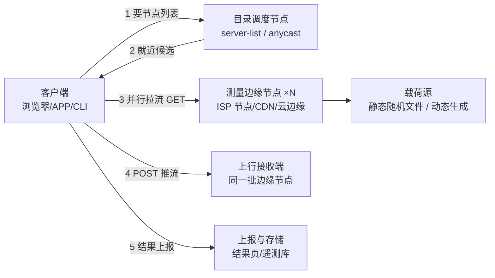

**TL;DR：** 所有测速服务——Ookla Speedtest、Fast.com、Cloudflare Speed、自托管 LibreSpeed——共享同一张架构地图：**目录调度、测量边缘、载荷源、结果上报**四类节点，加上一个做编排的客户端。下行测量的本质是"把管道灌满再算账"：并行多条流绕开单连接窗口限制，抛弃慢启动段，用滚动窗口取稳态；上行是同一套算法套在 POST 载荷上，但参数更保守。延迟必须区分空载 RTT 与加载延迟，后者才是 bufferbloat 的照妖镜。本篇只做架构层分析；中国大陆的服务端资源与成本话题见[测速服务端设计](/writing/app-speed-test-architecture-cost)专篇。

## 一、所有测速服务共享的一张节点地图

剥掉各家 UI，一次测速都是同一条流水线：

五类节点的职责与典型实现：

| 节点 | 职责 | 谁来当 |
| --- | --- | --- |
| 目录调度 | 回答"测谁"：按地理位置/负载返回候选边缘 | Ookla 的 server-list API；LibreSpeed 的 servers.json；Fast.com 与 Cloudflare 则**跳过这层**（固定源，靠 CDN/anycast 就近） |
| 测量边缘 | 真正收发测试流量 | ISP 托管的 Ookla 节点、Netflix Open Connect CDN、Cloudflare 边缘 PoP、你自己的 LibreSpeed 服务器 |
| 载荷源 | 提供下行的字节来源 | 预生成随机字节文件或动态生成；必须防缓存命中 |
| 上行接收端 | 吃掉客户端 POST 的字节流 | 通常与下行同一批边缘，复用连接管理 |
| 上报存储 | 固化结果、生成分享链接 | 各家后端 API；LibreSpeed 可完全关闭 |

这张图解释了测速圈最常见的争议——"为什么不同网站测出来差这么多"：**因为它们把"测谁"这个变量设成了不同的值**。Ookla 选的是到 ISP 接入节点（同城、运营商内网）的路径；Fast.com 测的是到 Netflix CDN 的路径；Cloudflare 测的是到它自家边缘的路径。路径不同，瓶颈不同，数字当然不同。

## 二、下行：把管道灌满的三件事

下行测量的工程问题只有一个：怎么让传输速率真正达到接入带宽，而不是停在某个偶然值。三件事缺一不可。

**第一件：并行多条流。** 单条 TCP 的吞吐受限于拥塞窗口与路径 RTT（带宽时延积的约束：一条流的在途字节数有上限）。高带宽时延积链路上单流跑不满，所以主流实现全部并发多条连接——浏览器侧用多个 fetch/XHR，命令行工具如 iperf3 用 `-P` 参数开并行流。这也是 iperf3 成为几乎所有自建测速系统底层参照的原因：它把"单流 vs 多流""TCP vs UDP"做成了显式参数，而不是隐藏的实现细节。

**第二件：处理起步段。** TCP 慢启动意味着传输前几秒速率在爬坡；如果从第一个字节开始计时，结果会系统性偏低。

**第三件：滚动窗口统计，而不是全程平均。** 这三件事合起来就是客户端的核心算法。它在多大程度上影响结果？本机做了一个可控实验：服务端先以 33.6Mbps 爬坡 1.2 秒、再以 201.3Mbps 满速，共传 3.6 秒，让三种常见估计器对**同一段字节流**各自算账：

| 估计器 | 结果(Mbps) | 相对满速误差 |
| --- | --- | --- |
| 全程平均（总字节÷总时长） | 138.6 | **-31.1%** |
| 抛弃前 1400ms 后平均 | 191.9 | -4.7% |
| 800ms 滚动窗口取最大 | 199.8 | **-0.8%** |

原始输出与重复运行见 `evidence/speedtest-service-architecture/2026-08-23-local/run.log`（两轮一致）。三个数字对应三种真实的工程选择：不做任何处理的实现会系统性低估约三成；"丢弃起步段 + 剩余段平均"是多数服务的下限配置；**滚动窗口取稳态最大值**收敛最好，也是各家客户端实际采用的形态——区别只在窗口宽度与取样间隔。这个实验同时说明了测速结果的一个隐含合同：**它报的不是"平均体验"，而是"这段连接的稳态容量估计"**。

## 三、上行：同一套算法，更保守的参数

上行的测量原理与下行对称：客户端向边缘节点 POST 一个（通常由随机字节填充的）请求体，边缘确认收到的字节数，套用同样的窗口统计。但它有三个结构性差异，导致上行测试普遍更快结束、样本更少、也更保守：

1. **载荷生成成本在客户端**。下行的大 payload 由服务端预生成（随机字节文件放磁盘/缓存即可），上行的大 payload 必须由客户端现场生成并推出去——移动设备上生成与加密几十 MB 随机数据本身就有功耗与内存代价；
2. **接入网天然非对称**。家宽与蜂窝的上行带宽普遍只有下行的几分之一，同样的窗口时长在上行覆盖的比例更小，统计方差更大；
3. **计费与滥用面**。上行端点是公开的写入接口，无上限的 POST 就是免费流量出口——[服务端设计篇](/writing/app-speed-test-architecture-cost)把它列为高价值流量出口的第一道防线；因此上行测试的时长、并发度与总字节几乎总是小于下行。

所以读到"上行只有下行的 1/N"时，先别急着怪运营商：非对称接入是常态，且上行估计的置信区间天然更宽。真正值得警惕的信号是**同一服务多次重测间上行剧烈波动**——那更像是 WiFi 干扰或终端调度问题，而不是架构问题。

## 四、延迟家族：空载、加载与抖动是三个指标

把延迟笼统写成"ping 值"会漏掉测速架构里最重要的演进：**加载延迟（loaded latency / latency under load）**。

- **空载 RTT**：管道空闲时的小包往返时间，衡量路径基础时延。实现上各家不一：ICMP ping、HTTP GET 小对象的计时、或 TCP 握手耗时；
- **加载延迟**：在上下行大流量传输进行的同时测量 RTT。若链路存在深缓冲（bufferbloat），下载跑满时延迟会从几 ms 飙到几百 ms——这正是"测速很快但视频会议卡"的元凶。Fast.com 在下载完成后附带 loaded latency 展示、Cloudflare 把延迟测量穿插在传输中，都是对这个指标的显式回应；
- **抖动（jitter）**：多次 RTT 的离散程度，实时音视频比绝对延迟更在意它。

架构上的对应做法是把测试编排成相位：先空载延迟 → 下行 → 上行 → 再测一次空载/加载延迟对照。相位顺序本身就是指标合同的声明——一个不告诉你"延迟是在什么负载状态下测的"的测速服务，它的延迟数字是不完整的。

## 五、四家代表服务的同维度对照

冻结五个维度看市面上最有代表性的四家（口径：各官方文档与开源仓库，2026-08-23 核对）：

| 维度 | Ookla Speedtest | Fast.com (Netflix) | Cloudflare Speed | LibreSpeed (FOSS) |
| --- | --- | --- | --- | --- |
| "测谁"（调度） | 目录选择：全球数千个 ISP/合作方托管节点 | 固定：Netflix 自家 CDN（Open Connect），零点击即测 | 固定：Cloudflare 边缘 anycast，就近 PoP | 自选或列表：部署者自己提供节点 |
| 边缘位置 | 运营商网络内（同城/本网路径） | 骨干 CDN 路径 | 云厂商边缘路径 | 你部署在哪就测哪 |
| 协议形态 | HTTP(S) 多连接 + 自有优化协议 | HTTPS（复用 Netflix 分发设施） | HTTPS，开源客户端请求专用下行/上传端点 | HTML5 fetch/XHR + POST |
| 特色指标 | 全家桶 + 精细结果页 | 极简一键 + 加载延迟对照 | 延迟/抖动/上下行 + 客户端开源 | 完全可自托管、可定制 |
| 适用判断 | 想知道"我的运营商给我多少" | 想知道"我看 Netflix 够不够" | 想知道"到 Cloudflare 边缘的路径质量" | 内网验收/自有链路诊断 |

两条读表提示。其一，"哪个准"是个伪问题——**每家回答的是不同的问题**：怀疑宽带缩水用 Ookla（同运营商节点）、排查流媒体卡顿用 Fast.com（真实业务路径）、评估到某云的链路用它家边缘的测速。其二，所有这些之上还有一层更底层的参照物 iperf3：它没有节点网络和 UI，却把协议变量（流数、窗口、UDP/TCP）全部暴露给你，是验证"测速服务到底测了什么"的对照组——两家服务给出矛盾数字时，iperf3 直连两端是仲裁手段。

## 六、结论：怎么读一个测速数字

下次看到任何测速结果，先问四个问题：

1. **测的是谁到谁？** 节点地图里的"目录调度"这一环决定了路径，也就决定了答案的适用范围；
2. **用了几条流、跑了多久？** 单流短测在高 BDP 链路必然偏低；
3. **统计口径是什么？** 本机实验显示全程平均能比稳态低 31%——没有窗口化的数字只是字节总量除以时间的算术；
4. **延迟是空载还是加载？** 只报空载 RTT 的服务，看不见 bufferbloat。

一句话收束：测速服务不是温度计，是一台**自带实验设计的测量仪器**——节点选择是抽样方案，并行与时长是激励强度，窗口统计算法是读数方式。理解了这三层架构，你就不会再问"哪个测速网站最准"，而是会问"它的设计能不能回答我的问题"。

## 参考资料

- 本篇实验与原始输出：`experiments/speedtest-arch/window.mjs`、`evidence/speedtest-service-architecture/2026-08-23-local/`
- iperf3 文档（并行流 `-P`、TCP/UDP 模式）：https://iperf.fr/iperf-doc.php
- LibreSpeed 开源仓库（自托管架构与端点实现）：https://github.com/librespeed/speedtest
- Cloudflare Speed Test 及其开源客户端：https://speed.cloudflare.com/ 、https://github.com/cloudflare/speedtest
- Netflix Fast.com 说明（Netflix Help Center 对测试原理的官方口径）：https://help.netflix.com/en/node/28816
- Ookla Speedtest Servers（节点网络与托管说明）：https://www.speedtest.net/servers
- 站内相关：[APP 测速服务端怎么设计：中国大陆的架构、资源与成本](/writing/app-speed-test-architecture-cost)、[Socket 背压：慢消费者如何盯住你的服务](/writing/socket-backpressure-slow-consumer)、[Nagle 与延迟 ACK](/writing/tcp-nagle-delayed-ack)
