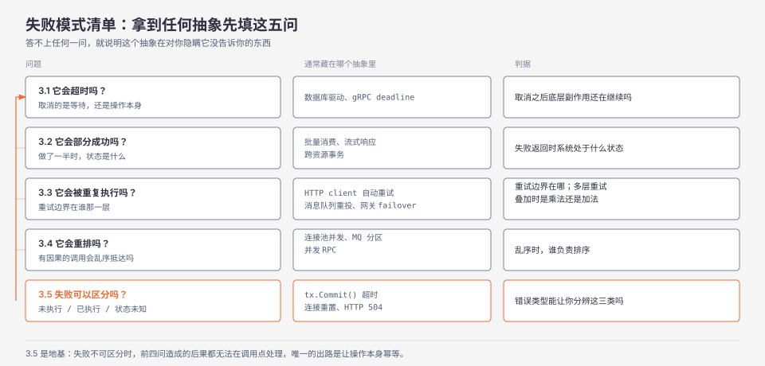

**TL;DR：** 抽象泄漏定律说的是"实现细节会漏出来"，但更致命的是抽象隐藏了**失败模式**——RPC 长得像函数调用，可函数不会超时、不会部分成功、不会因重试被执行三次、不会让两个有因果关系的调用乱序抵达。真正的区别不在"隐藏"而在"未声明的转移"：抽象把一部分失败模式在内部消化（这是收益），把另一部分推给调用者却没写进类型、签名或文档（这才是债）。拿到任何抽象，先填五问清单——会不会超时、会不会部分成功、会不会重复执行、会不会重排、失败能不能区分——答不上任何一问，就说明这个抽象在对你隐瞒它没告诉你的东西。

## 一、 一段看起来完全正确的转账代码

先看这段 Go 代码。逻辑简单：扣一个账户，加另一个账户，发一条通知，提交事务。

```go
// 示例（节选）：省略了鉴权、审计日志、参数校验与错误处理分支
func Transfer(ctx context.Context, db *sql.DB, from, to string, amount int64) error {
    tx, err := db.BeginTx(ctx, nil)
    if err != nil {
        return err
    }
    defer tx.Rollback()

    if _, err := tx.ExecContext(ctx,
        "UPDATE accounts SET balance = balance - ? WHERE id = ?", amount, from); err != nil {
        return err
    }
    if _, err := tx.ExecContext(ctx,
        "UPDATE accounts SET balance = balance + ? WHERE id = ?", amount, to); err != nil {
        return err
    }

    if err := Notify(ctx, from, amount); err != nil { // 调用外部通知服务
        return err
    }
    return tx.Commit()
}
```

它看起来是对的，而且通过了所有单元测试。现在把每一层抽象剥开，看它藏了什么。

`ctx` 超时或被取消时，`tx.ExecContext` 会返回错误。但取消的是**客户端的等待**，不是服务端已经在执行的那条 UPDATE——要真正中断，得向数据库发一个取消请求（PostgreSQL 是 `pg_cancel_backend` 一类机制）。于是这里留下一个孤儿操作：客户端以为放弃了，服务端还在跑，连接归还池子时状态也不干净。这是**超时不等于取消**。

`Notify` 失败时函数返回错误，`defer tx.Rollback()` 回滚，看起来很干净。但通知一旦发出就不可逆，回滚不了——数据库回到了原状，用户的手机已经收到了一条转账提醒。这是**部分成功**，而事务的原子性只覆盖了这段代码里的一半副作用。

`tx.Commit()` 本身也会失败。失败的时候事务到底提交了没有？如果网络在提交请求发出后断开，你无从判断服务端是提交成功、还是回滚了、还是根本没收到请求。这是**失败不可区分**，而它直接决定你能不能安全重试——在一笔转账上猜错，后果是重复的扣款。

如果这个函数被一个自动重试的框架包着（RPC 层重试、消息队列重投、网关的 failover），`Notify` 可能被执行多次。这是**重复执行**。

如果同一账户的两笔转账并发进行，`Notify` 的到达顺序可能与事务提交顺序不一致，用户先收到后一笔的提醒。这是**重排**。

五个问题，全在这段"看起来完全正确"的代码里。没有一个是实现细节泄漏——代码作者对 SQL、事务和 HTTP 的理解都没问题。五个都是**失败模式**，而且每一条都藏在一层看起来人畜无害的抽象下面。

## 二、 最强反例：隐藏失败模式正是抽象存在的意义

先处理最强的一个反对意见：所有抽象都在隐藏失败模式，这是抽象存在的意义，不是缺陷。

TCP 隐藏了丢包、乱序和重传。如果每个 socket 都要调用者自己实现重传和排序，我们写不出任何网络程序。垃圾回收隐藏了内存分配失败的可能。虚拟内存隐藏了缺页和换页。文件系统隐藏了磁盘坏块和写放大。这些隐藏都是纯粹的收益——调用者既不需要知道，也不可能处理得更好。

所以"抽象不该隐藏失败模式"是个假论点，我不打算为它辩护。真正需要区分的是两种隐藏：

- **已消化的失败模式**：抽象在内部处理，调用者既不需要知道也不需要关心。TCP 重传属于这一类——重传成功调用者无感，重传彻底失败后连接会报错，而这个错误是抽象承诺的一部分。
- **已转移但未声明的失败模式**：抽象把处理责任推给了调用者，但这个责任没有出现在类型签名、接口文档或错误类型里。`tx.Commit()` 返回 error 时事务状态未知，是这个抽象把"判断事务到底成没成"的责任推给了你，而 `error` 这个类型里没有任何信息帮你做这个判断。

问题不在隐藏，在于**未声明的转移**。抽象泄漏定律的表述是"细节会漏出来"；我要说的是更具体的一件事：**失败模式会被重新分配，而分配结果没有写进契约**。

这个重新表述有两个可观察的后果。第一，它把"抽象漏了"从一个无法操作的抱怨变成一个可以检查的清单——你可以逐个问"这个失败模式被分配到哪里了"。第二，它解释了为什么抽象问题几乎总在事故中才爆发：内部消化和未声明转移在代码里长得一模一样，都是"没报错"。


*图注：每一层抽象都把失败模式分成两堆——内部消化的一部分（左）与推给上层的一部分（右）。问题出在右侧那些没有任何类型或文档标记的条目上。*

## 三、 失败模式清单：拿到抽象要填的五个问题

既然问题是未声明的转移，那就主动去问。下面五问是我在评估任何抽象时填的清单，每一问都配它在哪个常见抽象里被藏起来。

### 3.1 它会超时吗？超时取消的是等待，还是操作本身？

这一问的关键不是"有没有超时"，而是**取消的边界在**哪。取消等待相当于"我不等了"，操作可能还在跑；取消操作意味着底层副作用也被中断。

前者留下孤儿操作：占用服务端资源，可能与随后的重试叠加，且没有任何机制通知你它还在跑。数据库驱动、gRPC 的 deadline、以及各类带 context 的客户端库都可能出现这种不对称（Go 的取消传播见[context 模式](/writing/go-context-patterns)，跨语言对照见[Go context 与 AbortSignal](/writing/go-context-vs-abortsignal)）。

判据只有一句：**取消之后，底层那个副作用还有没有在继续？** 这个问题在客户端库文档里通常找不到答案，得去查服务端是否需要一个显式的取消请求。

### 3.2 它会部分成功吗？

批量操作、多步事务、流式响应，都会产生"做了一半"的状态。消费 100 条消息到第 47 条失败，前 46 条的副作用已经生效；流式响应播到一半上游挂了，用户已经看到了半个回答。

真正的麻烦是组合：数据库事务的原子性只覆盖数据库，不覆盖事务期间发出的外部副作用。第一节那个转账函数就是典型——`defer tx.Rollback()` 让人以为有原子性，但它管不到 `Notify`。跨资源原子性需要 outbox 一类的模式，代价是把"一次调用"变成"一个状态机"（见[双写与 outbox](/writing/outbox-cdc-dual-write-atomicity) 与[2PC、Saga 与 outbox](/writing/distributed-transactions-2pc-saga)）。

判据：**失败返回时系统处于什么状态？是"要么全有要么全无"，还是"介于两者之间"？** 如果是后者，中间态对调用者可见吗？谁负责清理？

### 3.3 它会被重复执行吗？

重试、重连、failover、消息重投——任何一个都可能让副作用执行多次。危险在于**重试可能不止一处**：你的业务代码重试一次，HTTP client 自己也重试一次，网关再重试一次，三层重试叠加起来是乘法而不是加法。

判据有两个，缺一不可：**重试边界在哪里**（是这个抽象做，还是你做），以及**两者同时存在时会发生什么**。第二个问题最常被忽略：很多人以为自己只重试了一次，实际上下面的库也重试了。

### 3.4 它会重排吗？

两个有因果关系的调用，这个抽象保证它们的执行顺序吗？连接池里的多条连接并发发出请求，到达顺序不确定；消息队列通常只保证分区内有序，跨分区没有顺序承诺；并发的 RPC 更没有任何顺序保证。

重排在正常路径上无害，在需要因果的场景里是致命的——先收到"已发货"再收到"已下单"，或者先读到新值再读到旧值。

判据：**如果乱序，谁负责排序？** 如果答案是"调用者"，那这个责任在类型系统里有体现吗？

### 3.5 失败可以区分吗？

这是五问里最关键的一问，因为它决定了前四问造成的问题能不能被处理。任何失败都可以归进三类：

- **确定未执行**：安全重试。
- **确定已执行**：不能重试，需要补偿。
- **状态未知**：重试需要幂等键，否则可能重复执行。

`tx.Commit()` 在超时后属于第三类，连接被拒属于第一类。问题在于**错误类型通常不区分这三类**：你拿到的是一个 `error`，最多带一句 message 和一个超时判定。

判据：**这个抽象的错误类型能让你分辨这三类吗？** 如果不能，你唯一的出路是让操作本身幂等（完整账本见[重试会放大一切错误](/writing/idempotency-engineering)，理论边界见[恰好一次投递](/writing/exactly-once-message-delivery)）。



*图注：五问不是并列的检查项，3.5 是前四问的地基——如果失败不可区分，前四问造成的后果都无法在调用点处理，只能靠幂等兜底。*

## 四、 为什么失败模式会在调用栈里越传越模糊

还有一个机制值得单独讲，因为它解释了"为什么事故现场总是信息不够"。

失败模式在**产生它的那一层是最清晰的**，往上传递每一层都会损失一部分信息。最底层是具体的：`ECONNRESET`、重传超时、对端重置。数据库驱动把它翻译成一个"连接可能坏了"的判定，`database/sql` 据此决定要不要用另一条连接重试一次，业务层最终拿到的是一个泛化的 error，只剩一句 message 和一次 `errors.Is` 判定。


*图注：每层抽象都在做一次"简化"，而简化掉的往往正是判断"能不能重试"所必需的那部分信息。等到业务层看到错误时，可区分性已经被吃掉了。*

这个衰减不是任何人的失误——每一层的简化都是合理的，因为你不可能让业务代码理解 `ECONNRESET`。后果是：**最需要知道失败模式细节的那一层（决定要不要重试的业务层），恰好是信息最少的那一层。**

这解释了一个反复出现的工程困境：为什么"在正确的层做正确的错误处理"这么难。不是工程师不认真，是信息在传递过程中就没了。可行的补救方向只有两个，而且都不便宜：要么让底层把可区分性编码进错误类型（要求跨层约定），要么让操作本身幂等（把"能不能重试"这个问题消掉）。

## 五、 成本模型：抽象的价值与代价怎么算

把上面的机制写成一组变量，抽象就不只是"省了几行代码"了。

- `F_d`：抽象在内部**消化**的失败模式数量（这是收益）。
- `F_t`：抽象**转移**给调用者、且未在契约中声明的失败模式数量。
- `p`：调用者意识到某个被转移失败模式的概率。
- `N`：这个抽象的调用点数量。

需要主动处理的组合规模约等于 `N × F_t × (1 − p)`。

这个式子里真正危险的是那个乘数 `(1 − p)`。一个被转移但你清楚知道的失败模式，只是工作量——你知道要处理，写一次就好。一个被转移而你不知道的失败模式，是定时炸弹，而且它只在特定的故障组合下引爆，测试环境碰不到。

这也解释了为什么抽象的成本不随代码量增长，而随**调用点数量**增长：同一处未声明的转移，被 200 个调用点继承，就是 200 个潜在的处理空缺。抽象设计者做一次决定，所有调用者承担后果——这才是抽象的真正杠杆所在，收益和代价共用同一个杠杆。

顺带说清一个常见的误判：很多人用"这个抽象省了多少代码"来评估它。省下的代码是一次性的，而 `F_t × (1 − p)` 是持续付的利息。一个省下 500 行但转移了 3 个未声明失败模式的抽象，在 200 个调用点上是亏的。

## 六、 边界：什么时候不该逐项过清单

清单不是免费的，说清楚它不值得用的情形：

- **失败模式确实被完全消化时**。TCP 的重传对绝大多数应用就是黑盒，你不需要知道它重传了几次。`F_t` 为零的抽象不需要清单——判据是"如果我完全不知道它内部怎么处理失败，我会做错什么吗"，答案是"不会"就跳过。
- **失败模式可以被穷举，但失败代价极低时**。一个内部工具的只读查询，重排和重复执行都不会造成可观测后果，逐项过清单是在浪费评审时间。
- **原型阶段**。此时调用点数量 `N` 还很小，式子里那一项还没长起来；等 `N` 变大再补清单，总成本更低。

反过来，有三类场景必须逐项过：

- **副作用不可逆**（扣款、发信、删除、合规留痕）。此时"状态未知"这一类错误的代价是数据，不是延迟。
- **跨信任边界**（外部 API、第三方 webhook、用户可控输入）。你无法假设对端的失败语义与你的假设一致。
- **协议或流的中间层**（网关、代理、SSE 转发、流式编排）。这一层的失败模式既来自下游也来自上游两侧，最容易在看不见的地方产生部分成功（见[流式网关的反压](/writing/llm-04-streaming-gateway-sse-backpressure) 与[慢消费者与背压](/writing/socket-backpressure-slow-consumer)）。

还有一个诚实的局限：五问清单能降低 `(1 − p)`，不能让它归零。失败模式是开放的集合——磁盘坏、机房断电、上游改了语义——任何清单都不可能穷举。清单的价值在于把那些**常见且可枚举**的失败模式变成显式的，让你腾出注意力去应对真正没见过的那些。

## 七、 可执行的研究问题

1. **未声明转移是否是事故的主要来源。** 假设：在由第三方抽象引发的事故中，多数根因属于"已转移但未声明"而非"已消化却被误解"。做法是取本团队过去 N 次事故的复盘记录，把每次的失败模式归入三类（内部消化失败 / 已声明转移 / 未声明转移），统计分布。控制变量是事故的归因口径与复盘质量，避免把"没写清楚"误判成"没声明"。done criterion：能给出三类占比且与至少两名工程师独立复判一致。不能外推到其他团队（抽象使用习惯差异太大）。

2. **错误可区分性是否真的能被跨层保留。** 假设：在错误类型中显式编码"未执行 / 已执行 / 未知"三态，能显著降低误重试率。做法是在一个服务的客户端里引入三态错误分类，注入网络中断与超时，统计误重试次数。控制变量是注入的故障类型与注入点，观测指标是重复副作用的数量。反例：有些失败在原理上不可区分（响应丢失），三态只能退化为"未知"。不能外推到无法修改错误类型的第三方抽象。

3. ** `(1 − p)` 是否可以通过清单评审被量化地降低。** 假设：对同一个抽象，填过五问清单的团队比没填过的团队识别出更多失败模式。做法是让两组工程师独立评估同一个陌生抽象，一组有清单一组没有，比较识别出的失败模式数量与重合度。控制变量是工程师的经验水平与给到的文档范围。done criterion：两组的识别数量存在可测量差异。不能外推到样本量极小的对照（个体差异会淹没效应）。

4. **抽象替换的成本是否集中在失败模式而非 API 差异。** 假设：替换一个抽象时，大部分工作量来自补齐失败模式处理，而不是改写调用签名。做法是记录一次真实的抽象替换（如换数据库驱动、换 HTTP client），把改动按"签名适配"与"失败处理"两类分别计量。控制变量是替换范围与代码基线。反例：如果新旧抽象的失败语义高度一致，两类工作量会反转。不能外推到接口形状差异极大的替换。

## 八、 参考资料

- Joel Spolsky, The Law of Leaky Abstractions（原始表述）：https://www.joelonsoftware.com/2002/11/11/the-law-of-leaky-abstractions/
- Go `database/sql` 连接池与重试语义：https://pkg.go.dev/database/sql
- PostgreSQL 服务端取消与连接状态：https://www.postgresql.org/docs/current/protocol-flow.html
- gRPC  deadline 与取消传播：https://grpc.io/docs/guides/deadlines/
- Kubernetes 优雅终止与 SIGTERM 语义：https://kubernetes.io/docs/concepts/workloads/pods/pod-lifecycle/

> 延伸阅读：五问里最关键的是 3.5，因为失败不可区分时唯一的出路是幂等，见[重试会放大一切错误：幂等性工程的完整账本](/writing/idempotency-engineering)；跨资源原子性需要把一次调用变成状态机，见[双写、CDC 与 outbox](/writing/outbox-cdc-dual-write-atomicity)；服务关闭时这些失败模式会集中爆发，见[Go 的优雅关闭](/writing/graceful-shutdown-in-go)。
