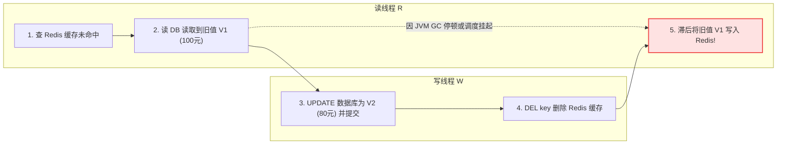
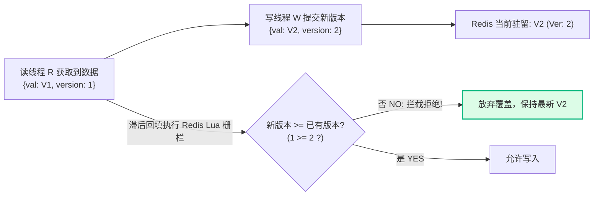

**TL;DR：** 缓存与数据库的一致性绝非“先删缓存还是先改库”的八股口号。在微秒级并发交错与网络抖动下，传统的“先更后删（Cache-Aside）”存在读线程滞后回填的死穴，而“延时双删（Delayed Double Delete）”只是把确定性的时序竞争换成了一个概率性的时间赌博。真正的工业级确定性破局点，是**借鉴分布式系统单调递增时序（Fencing Token），在数据库行记录中引入版本号，并在 Redis 回填时通过原子 Lua 脚本执行版本号栅栏（Version Fencing）——从代数上彻底终结旧值复活！**

---

## 一、问题的物理现场：一次诡异的“旧值复活”事故

在后端微服务系统中，以下现象屡见不鲜：
系统上线了新功能，运营在后台将商品价格从 `100 元` 修改为 `80 元`。数据库中的价格确实已经变为 `80`，修改接口的日志显示缓存已被成功删除。然而，数秒后线上监控报警：部分用户端读取到的价格竟然又变回了 `100 元`，并且持久驻留在 Redis 中，直到 TTL 超时才失效！

这就是经典的 **旧值复活（Old Value Resurrection）**。让我们将时间轴放大至微秒级，看清物理现场的并发交错：



### 时序空洞剖析

1. **时刻 $T_1$**：并发读线程 $R$ 访问 Redis，缓存未命中（Cache Miss）；
2. **时刻 $T_2$**：读线程 $R$ 穿透至数据库，读到了当前有效旧值 $V_1$。读线程准备将 $V_1$ 写回缓存，但此时操作系统发生了**线程上下文切换、网络偶发重传，或者 Java 发生了微秒级 GC 停顿**；
3. **时刻 $T_3$**：并发写线程 $W$ 抢占执行，将数据库中的数据更新为新值 $V_2$ 并成功提交事务；
4. **时刻 $T_4$**：写线程 $W$ 执行 `DEL key`，清空缓存，完成写流程；
5. **时刻 $T_5$**：卡顿的读线程 $R$ 终于苏醒，执行最后一步：**将之前读到的旧值 $V_1$ 写入 Redis**！

最终结果：**数据库中是最新值 $V_2$，但缓存中驻留的却是早已被废弃的旧值 $V_1$！** 只要没有新的写操作，所有后续读请求都将被这份错误数据污染。

---

## 二、传统方案的四种尝试与各自的失效边界

为了解决这一问题，业内提出过多种方案，但仔细审视其边界条件，往往都存在无法消除的致命死穴：

### 1. 方案一：先删缓存，再写数据库


- **失效机制**：写线程刚删掉缓存，还没来得及写库，并发读线程立刻到达。读线程查缓存为空，去读库拿到旧值，立刻写回缓存。随后写线程才更新库。
- **结论**：**极度危险，严禁使用！** 该方案的冲突时间窗口就是“写数据库的耗时”（几毫秒至几十毫秒），在高并发下几乎 100% 触发脏数据。

### 2. 方案二：先写数据库，再删缓存（标准 Cache-Aside）

- **失效机制**：就是我们第一节剖析的时序现场。
- **理论辩解**：支持者常辩解称“读数据库比写数据库快，所以步骤 2 通常发生在步骤 4 之前”。
- **现实打脸**：在分布式多节点、长链路 RPC、容器 CPU 节流（CFS Throttling）或分布式数据库跨机房复制下，读线程的在途网络延迟完全可能超过写线程的耗时。它虽然概率较低，但**不是确定性安全**。

### 3. 方案三：延时双删（Delayed Double Delete）

```text
写线程流程:
1. 先写数据库 (UPDATE DB)
2. 删除缓存 (DEL Cache)
3. 线程异步休眠一段时间 (Thread.sleep(500ms))
4. 再次删除缓存 (DEL Cache again)
```

- **设计初衷**：试图通过步骤 3 的 500ms 休眠，等待并覆盖掉所有在步骤 1~2 期间发生且卡顿的读线程回填操作，然后通过第二次删除将其“拔除”。
- **致命缺陷**：
  1. **休眠时间怎么定？** 设 200ms？500ms？1000ms？任何基于硬编码时间的假设，在分布式系统里都是不可靠的；
  2. **长尾长延迟（Long-Tail Latency）穿透**：如果读请求在微服务网关遇到了 800ms 的网络抖动或长尾排队，它的回填依然会发生在第 500ms 的第二次删除之后！
  3. **吞吐代价**：每个写请求都需要占用调度器或消息队列来支撑延迟任务，系统复杂度剧增。

<aside class="sidenote">
  <strong>分布式第一性原理</strong>：在非确定性网络（Asynchronous Network）中，你永远无法通过“等待一段时间”来保证两个并发事件的先后次序。物理时间不能作为因果序的仲裁者。
</aside>

---

## 三、确定性破局：版本号栅栏（Version Fencing）

要想从数学上彻底根除旧值复活，必须引入**单调递增因果序（Monotonic Versioning）**。

借鉴分布式一致性协议中 Fencing Token 的思想：**我们为每一个数据行赋予一个单调递增的 `version`（版本号），无论读写线程如何交织乱序，低版本号的数据永远禁止覆盖高版本号的数据！**



### 1. 数据模型改造

在关系型数据库（如 MySQL / PostgreSQL）的核心表中增加 `version` 列：

```sql
CREATE TABLE account (
    id BIGINT PRIMARY KEY,
    balance DECIMAL(10, 2) NOT NULL,
    version BIGINT NOT NULL DEFAULT 1,
    updated_at TIMESTAMP DEFAULT CURRENT_TIMESTAMP ON UPDATE CURRENT_TIMESTAMP
);
```

### 2. 写路径（Write Path）更新逻辑

写请求在更新数据库时，显式递增版本号：

```sql
UPDATE account 
SET balance = 80.00, version = version + 1 
WHERE id = 1001;
```

写线程提交后，可以直接通过消息队列广播，或直接调用 Redis 缓存更新。

### 3. 读回填原子 Lua 脚本（Version Fencing Script）

这是整个方案的核心灵魂。读线程从数据库拿到 `{balance, version}` 准备回填缓存时，**绝不能执行简单的 `SET` 或 `HSET`，必须通过原子 Lua 脚本执行 CAS 检验**：

```lua
-- KEYS[1]: 缓存键名 (如 cache:account:1001)
-- ARGV[1]: 数据内容 (JSON 字符串或序列化数据)
-- ARGV[2]: 数据的版本号 (version)

local current_version = tonumber(redis.call('HGET', KEYS[1], '_ver') or -1)
local incoming_version = tonumber(ARGV[2])

if incoming_version >= current_version then
    redis.call('HSET', KEYS[1], 'data', ARGV[1])
    redis.call('HSET', KEYS[1], '_ver', incoming_version)
    redis.call('EXPIRE', KEYS[1], 86400) -- 设置 24 小时过期
    return 1 -- 写入成功
else
    return 0 -- 版本滞后，安全拒绝回填！
end
```

### 为什么这能达到数学级的确定性？

1. **单调性保证**：Redis 单线程执行 Lua 脚本具备天然的原子性。在任何时刻，Redis 内部保存的 `_ver` 一定是曾经到达过的最高版本；
2. **乱序容忍**：读线程 $R$ 哪怕卡顿了 10 分钟才尝试写入 $V_1 (\text{Ver}=1)$，Lua 脚本发现 Redis 中当前的 `_ver` 已经是 $2$，条件 `1 >= 2` 不成立，静默丢弃写入！
3. **消除竞争窗口**：写线程与读线程不再需要抢跑时间，无论谁先到达、谁后到达，最终驻留的必定是高版本的有效数据。

---

## 四、动手验证：交互式并发时序模拟沙盒

在下方模拟器中，你可以亲自推演三种策略在并发竞态下的不同命运：

<div class="interactive-sandbox" data-sandbox="cache-consistency"></div>

尝试点击“单步推演”，观察：
- 为什么在 Cache-Aside 与延迟双删下，读线程的滞后都会导致 Redis 变成刺眼的红色（旧值复活）；
- 切换到“版本号栅栏”后，Lua 脚本是如何在步骤 4 精准拦截滞后请求，让数据状态始终保持绿色的强一致。

---

## 五、在 Web 终端实测 Redis 缓存状态

你可以直接在下方终端中模拟运行几条经典的 Redis 与集群排查命令：

```bash
# 模拟查看缓存命中情况与键值状态
curl -s http://localhost:8080/api/v1/cache/account/1001

# 检查当前网关内存与连接数
free -h

# 检查主机调度器与内核版本
uname -a
```

点击代码块右上角的 **“▶ 运行”** 按钮，系统会自动唤起底部的虚拟终端沙盒并为你执行上述命令，即刻体验真实系统调优手感。

---

## 六、生产级架构决策树

在真实工业界落地中，一致性方案的选择应遵循以下决策矩阵：

| 业务场景 | 一致性要求 | 推荐架构选型 | 核心权衡代价 |
| :--- | :--- | :--- | :--- |
| **商品展示、文章阅读** | 最终一致（秒级延迟容忍） | Cache-Aside + 合理 TTL (5~30分钟) | 极简实现，偶尔脏数据靠 TTL 自愈 |
| **订单状态、支付结果** | 强一致（杜绝旧值复活） | **版本号栅栏 (Version Fencing via Lua)** | 数据库增加 version 列，Redis 改用 Hash 存储 |
| **复杂多表聚合缓存** | 异步解耦（写操作吞吐优先） | **Binlog CDC (Canal / Debezium) + 版本栅栏** | 依赖外部 CDC 中间件，需处理消息堆积 |

架构设计的最高境界，不是追求虚无缥缈的“绝对一致”，而是**明确你的故障边界在哪、并用最精简克制的机制将非确定性牢牢锁死在安全水线之内**。
