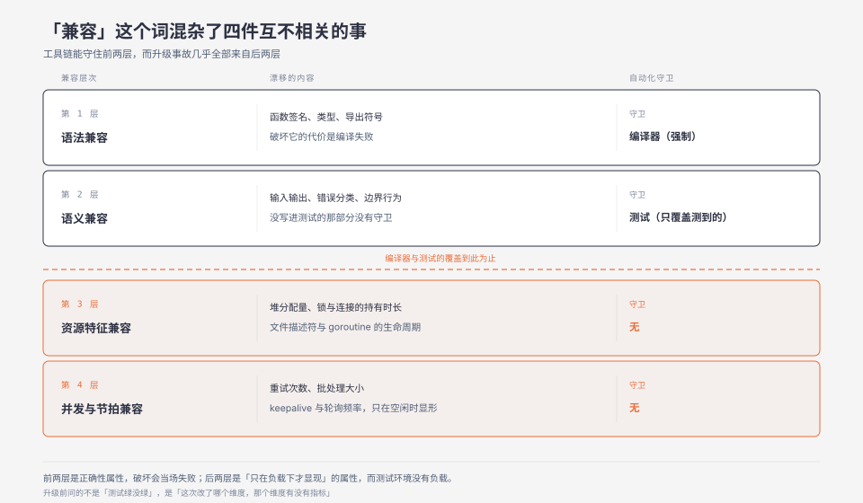
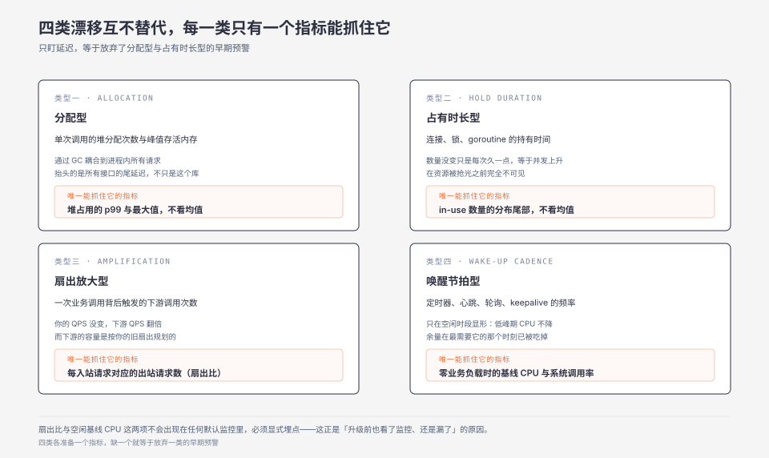

**TL;DR：** 一次依赖升级的风险，几乎不由它是否破坏 API 决定，而由它是否改变了「每个请求占用多少共享资源、占用多久」决定。SemVer 的兼容性判定对象明确是**公共 API**，规范甚至明说「更新了自己的依赖但没有改变公共 API，可以被认定是兼容的」——这恰恰是资源特征漂移最主要的入场方式。语法和语义层有类型系统与测试守卫，资源特征层没有任何自动化守卫，因为它不是正确性属性，而是「只在负载下才显现」的属性，而测试环境没有负载。判断一次升级是否安全，问的不是「编译过没过、测试绿没绿」，而是「这次升级改变了哪个资源维度，那个维度有没有对应的指标」。

## 一、编译通过、测试全绿、上线雪崩

下面这个形态是把几类公开复盘过的升级事故拼起来的复合场景，用来定位机制，不对应任何一次具体事故。

一个订单服务，把某个 HTTP 客户端库从小版本升到下一个小版本。变更记录里全是 bugfix 和内部重构，没有 API 变更，`go build` 通过，单测全绿，集成测试全绿，灰度 5% 跑了一小时，指标平稳，全量。

全量后四十分钟，p99 从 80ms 涨到 400ms，然后连接数打满，然后雪崩。

复盘发现的事情跟业务逻辑毫无关系：新版本把响应体的读取从「流式读、边读边解析」改成了「先整体读进一个 buffer，再解析」。这是一次纯粹的内部重构，公共 API 一个字没动。它带来的变化是：

- 单次请求的峰值堆内存从「与响应体大小无关」变成「正比于响应体大小」；
- 堆分配速率上升，GC 触发频率上升；
- 更重要的是，这个 buffer 的存活时间跨过了整个解析过程，于是它从年轻代晋升到了老年代。

在测试环境，响应体都是几十字节的 fixture，这个差异是零。在生产环境，大促期间响应体普遍几百 KB，且同一时刻有几千个并发请求各持有一个几百 KB 的存活 buffer——**堆占用被抬到了一个新的量级，而这个量级不属于这个服务原本的容量规划。**

注意最后一层的因果关系：出问题的不是「变慢了」，是「每个请求持有的内存量变了，于是同样的并发数需要完全不同的内存」。延迟上涨是结果，不是原因。

## 二、最强反例：SemVer 承诺的本来就不是这个，别怪它

一个很自然的反驳是：既然资源特征漂移这么危险，那 SemVer 应该把它纳入兼容性承诺；没纳入，说明 SemVer 有缺陷。

这个反驳不成立。查 [SemVer 2.0.0 规范](https://semver.org/lang/zh-CN/spec/v2.0.0.html)，版本号的三个递增条件全部以**公共 API** 为判定对象：

> 6. 修订号 Z（x.y.Z | x > 0）必须在只做了向下兼容的修正时才递增。这里的修正指的是针对不正确结果而进行的内部修改。
> 8. 主版本号 X（X.y.z | X > 0）必须在有任何不兼容的修改被加入公共 API 时递增。

而且规范 FAQ 里有一条直接命中本文的场景——「如果我更新了自己的依赖但没有改变公共 API 该怎么办？」——官方回答是：

> 由于没有影响到公共 API，这可以被认定是兼容的。

这条不是漏洞，是设计。把资源特征纳入兼容性承诺，等价于宣布「任何性能优化都是 breaking change」，因为优化的本质就是改变资源特征。那样一来 MAJOR 版本号会失去表达能力，依赖管理会退化成「每个版本都要人工评估」——正是 SemVer 要解决的依赖地狱。

所以真正的结论不是「SemVer 不够用」，而是：**我们把 SemVer 的兼容性承诺，误当成了升级安全性的全部。** 这两者之间隔着一整个没有守卫的层次。

## 三、兼容性有四个正交的层，工具链只守得住前两层

把「兼容」这个词拆开，它其实混杂了四件互不相关的事：

### 3.1 语法兼容：类型系统守着

函数签名、类型、导出符号。破坏它的代价是编译失败——**这是唯一一层有强制守卫的**。编译器不让你上线。

### 3.2 语义兼容：测试部分守着

同样的输入产生同样的输出、错误类型分类一致、边界条件（空值、超长、并发调用）行为一致。这一层靠测试覆盖，覆盖率取决于你写了多少测试，而且它守的是「你想到要测的那些行为」。

### 3.3 资源特征兼容：没有守卫

单次调用占用多少堆内存、多少文件描述符、多少 goroutine / 线程；锁持有多久；连接占用多久；系统调用的次数。

这一层之所以没有守卫，原因很具体：**它不是正确性属性，是「只在负载下才显现」的属性**。一个函数在单测里被调用一百万次，每次都独占一个空闲的运行时，它的分配量变化不会产生任何可观测差异——因为没有别的请求在跟它抢。生产环境里，这些资源全部是共享的。

于是资源特征的变化会**横向穿透到完全不相关的代码路径**：一个 JSON 库的分配量变化，会影响同一个进程里另一个接口的 p99，因为它们在抢同一块堆、同一个 GC、同一批 CPU 缓存行。这种耦合在代码里看不见，在调用图上不相邻，只能通过共享资源的指标观察到。

### 3.4 并发与节拍兼容：没有守卫，而且更隐蔽

内部重试次数、批处理大小、预取策略、后台定时器频率、内部连接池默认值、keepalive 节拍。

这一层比 3.3 更隐蔽，因为它改变的往往不是「用多少」，而是「什么时候用」。举一个能查证的默认值的例子，gRPC-Go 的 keepalive 参数（[pkg.go.dev v1.83.2](https://pkg.go.dev/google.golang.org/grpc/keepalive)）：`ClientParameters.PermitWithoutStream` 默认 `false`，即**没有活跃 RPC 时不发 keepalive**；`ServerParameters.MaxConnectionIdle`、`MaxConnectionAge`、`MaxConnectionAgeGrace` 的当前默认值是 `infinity`，`Time` 默认 2 小时，`EnforcementPolicy.MinTime` 默认 5 分钟。

这些值本身不是问题。问题是：它们决定了「一条空闲连接会静默存活多久」，而「你的服务能承受多少条静默存活的空闲连接」是一个容量问题。当一个中间层依赖改变了它自己的 keepalive 默认值，你的连接水位会在没有任何代码变更、没有任何错误日志的情况下平移——**而平移后的水位可能刚好越过你没测过的那个点。**

## 四、四类资源特征漂移，以及各自唯一能抓住它的指标

这四类的价值在于：每一类对应一个**不同的**指标。用错指标就抓不到，这就是为什么很多人升级前也看了监控、还是漏了。

### 4.1 分配型（allocation）

**漂移内容**：单次调用的堆分配次数、峰值存活内存、对象晋升行为。

**为什么危险**：它通过 GC 耦合到进程内所有请求。一次分配量的上升不是「这个库变慢了」，是「整个进程的 GC 压力上升，所有接口的尾延迟一起抬升」。

**唯一能抓住它的指标**：堆占用随时间的**分布**（不只是均值，要看 p99 和最大值），以及 GC 频率 / GC pause 的时间占比。看延迟会漏——因为延迟上涨是结果，且上涨之前往往先有一段「GC 更频繁但每次更短」的代偿期。

### 4.2 占有时长型（hold duration）

**漂移内容**：连接、锁、goroutine、文件描述符的**持有时间**，而不是数量。

**为什么危险**：它直接改有效并发。占用的数量没变、只是每次占用久了一点，在 Little's Law 下等价于并发数上升。而这类漂移在轻载下完全不可见——因为资源还没被抢光。

**唯一能抓住它的指标**：in-use 数量随时间的分布（连接池的 in-use、活跃 goroutine 数、持锁时间的直方图）。看「平均占用数」会漏，要看**分布的尾部**——饱和是从尾部开始的。

### 4.3 扇出放大型（amplification）

**漂移内容**：一次业务调用背后触发的下游调用次数。内部新增了重试、批处理被拆小、预取被关掉或打开、缓存层级变了。

**为什么危险**：它被下游的容量乘一遍。你的 QPS 没变，下游的 QPS 翻倍，而下游的容量规划是按你的旧扇出做的。

**唯一能抓住它的指标**：**每个入站请求对应的出站请求数**（扇出比）。这是一个比值指标，必须显式埋点——它不会出现在任何默认监控里。看总 QPS 会漏，因为入站 QPS 确实没变。

### 4.4 唤醒节拍型（wake-up cadence）

**漂移内容**：后台定时器、心跳、轮询、keepalive、日志刷盘的**频率**。

**为什么危险**：它只在空闲时段显形。业务高峰期大家都在忙，多几次唤醒看不出来；到了低峰期，这些固定开销成为 CPU 的主要消费者，表现为「低峰期 CPU 不降」。而空闲开销的上升会挤掉突发流量的余量——**你在最需要余量的时刻，发现余量已经被吃掉了。**

**唯一能抓住它的指标**：**零业务负载时的基线 CPU 与系统调用率**。这是一个必须在没有流量时才能测的指标，压测环境永远测不到。

## 五、怎么验：把升级当成一次受控的资源特征对比

如果风险来自资源特征，那验证手段也必须是资源特征对比，而不是「跑一遍测试看绿不绿」。最小可工作的做法：

**单一变量。** 同一份生产回放流量（或同一份压测脚本 + 同一份数据）、同一台机器、同一个构建配置，只改依赖版本这一个变量。同时升级两个依赖，出问题就无法归因。同理，不要在同一批里既升级又改配置。这一点上方法论和 [一次只改一个变量](/writing/benchmark-one-variable) 是同一套。

**看分布，不看均值。** 资源特征漂移的早期信号几乎总在尾部：堆占用的 p99、in-use 数的 p99、持锁时间的 p99。均值在饱和之前往往纹丝不动。样本量是否足够支撑你判断两个分布真的不同，参照 [p99 需要多少样本才可信](/writing/p99-sample-size-confidence)。

**按第四节四类，各准备一个指标。** 四类互不替代。只盯着延迟，等于放弃了 4.1 和 4.2 的早期预警。

**明确区分证据等级。** 本机压测跑出来的数字，只能说明「在这台机器、这份流量、这个预热程度下，两个版本的资源特征有/无差异」。它不能推出「升级后生产不会出问题」，因为生产有真实的长尾请求体、真实的并发混合、真实的碎片化堆。**本机单次结果是排除性证据——它能证伪「这个版本明显更差」，不能证实「这个版本安全」。**

有一条捷径值得单独说：如果升级的只是一个传递依赖，而你完全没有它的资源特征基线，那么先在一个只读或可降级的旁路上跑，比在核心链路上跑更合理。这不是保守，是因为**没有基线时你无法定义「变差了多少算异常」。**

## 六、边界

这个论点的成立条件要说清楚，否则会变成「永远不要升级依赖」的教条——那是个更糟的结论。

**危害正比于资源的共享程度。** 一个单体低 QPS 的内部服务，堆上有几 GB 余量、连接数远未饱和，资源特征漂移几乎不会显形。危害集中在高复用、高共享的组件上：连接池、线程池、GC 堆、CPU 缓存。所以判断优先级的方式是：**这个依赖在你的系统里是用在共享资源路径上，还是用在一次性路径上。** 编译器、代码生成器、测试工具的依赖可以随便升；HTTP 客户端、序列化库、连接池、日志库的升级值得做资源对比。

**安全补丁不适用这套权衡。** 有已知漏洞时必须升，此时没有「升不升」的选择，只有「怎么补偿」：把这次升级的资源特征对比前置到预发环境，并缩短从升级到全量的观察窗口。安全风险的确定性远高于资源风险的确定性，不要用后者拖延前者。

**这个框架不覆盖正确性风险。** 本文讨论的是「行为等价但资源特征不同」。行为不等价（语义层漂移）是另一个问题，靠测试覆盖解决，两者不要混为一谈。

## 七、可以自己动手验证的几个问题

1. **假设**：你的服务里，入站 QPS 不变的情况下，某个依赖升级后下游收到的 QPS 会变化（扇出比漂移）。**对照**：同一份回放流量，只换依赖版本。**观测**：每个入站请求对应的出站请求数。**反例**：如果两次的下游客调用数完全一致，说明该依赖不在扇出路径上。**完成判据**：能给出升级前后的扇出比数值，并说明差异是否在你的下游容量余量内。**不外推到**：下游的实际承载能力，那需要压测下游本身。

2. **假设**：依赖升级后低峰期 CPU 基线上升，挤掉突发流量的余量。**对照**：零业务负载（或固定极低负载）下，升级前后各测一次。**观测**：空闲时的 CPU 使用率与系统调用率。**反例**：如果两个版本在空闲时 CPU 完全一致，说明该依赖没有后台节拍。**完成判据**：能量化「空闲开销占单核的百分比」，并判断在满负载时这部分是否挤占了可分配给请求的 CPU。**不外推到**：真实突发流量下的表现。

3. **假设**：资源特征漂移的早期信号在分布尾部，均值会漏报。**对照**：同一次压测，同时采集均值与 p99 / 最大值。**观测**：从升级前到升级后，均值的变化幅度 vs p99 的变化幅度。**反例**：如果均值与 p99 同幅度变化，说明不是尾部漂移而是整体平移，本假设不成立。**完成判据**：能指出「在第几分钟 p99 开始偏离而均值还没动」这样的具体时刻。**不外推到**：其他类型的漂移。

4. **假设**：在共享资源路径上的依赖，其升级风险显著高于一次性路径上的依赖。**对照**：选两个依赖，一个在请求热路径上被高频复用（如序列化库），一个只在启动时用一次（如配置解析库），各自做资源特征对比。**观测**：同等升级幅度下，两者引起的资源指标变化幅度。**反例**：如果两者影响相当，说明你的系统里资源复用程度不是主要变量，本假设不成立。**完成判据**：能给出一个可复核的「共享程度 → 漂移敏感度」的排序。**不外推到**：其他服务的资源拓扑。

## 八、参考资料

- [Semantic Versioning 2.0.0（中文）](https://semver.org/lang/zh-CN/spec/v2.0.0.html) —— 规范第 6、7、8 条对版本号递增的定义，以及 FAQ「如果我更新了自己的依赖但没有改变公共 API 该怎么办？」。规范对 MUST/SHOULD 的措辞依 [RFC 2119](https://www.rfc-editor.org/rfc/rfc2119) 解读。
- [net/http 包文档（Go 官方）](https://pkg.go.dev/net/http) —— `DefaultMaxIdleConnsPerHost = 2` 常量说明。
- [gRPC-Go keepalive 包文档](https://pkg.go.dev/google.golang.org/grpc/keepalive) —— `ClientParameters` / `ServerParameters` / `EnforcementPolicy` 各字段默认值的官方说明（核对版本 v1.83.2）。

### 延伸阅读

- [默认值是一种隐藏的架构决策](/writing/hidden-defaults-architecture-decisions) —— 本文讨论的「依赖改了自己的默认值」，就是那篇文章里「继承类默认值」的一种。
- [一次只改一个变量](/writing/benchmark-one-variable) —— 第五节单一变量原则的完整方法论。
- [p99 需要多少样本才可信](/writing/p99-sample-size-confidence) —— 判断两个分布是否真的不同，而非看起来不同。
