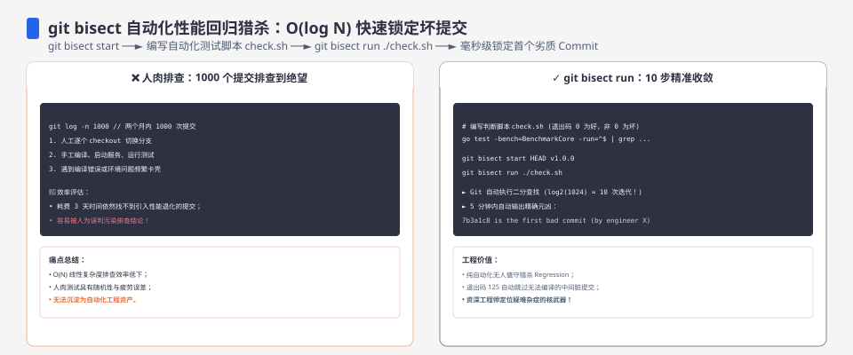
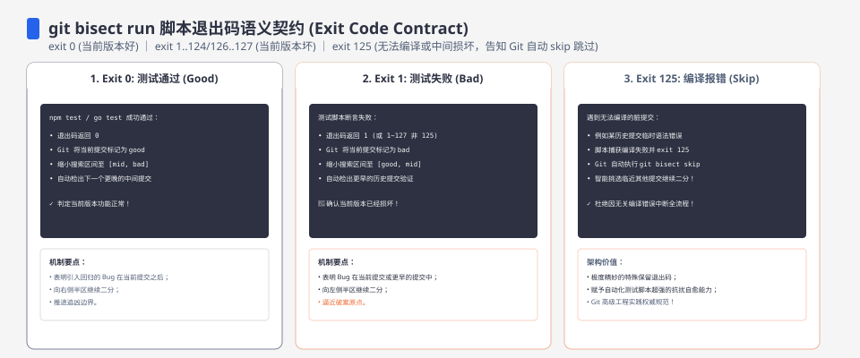

**TL;DR：** `git bisect` 的二分定位能力人人会用，但**判定脚本**才是成败关键。本机构造 21 个 commit 的仓库、在 c21 引入 `add()` 的回归，`git bisect run` 仅 **4 次测试**（约 log₂21≈5）锁定了 c21。真正值得写下来的是踩过的三个坑：① **bisect run 的 cwd 是仓库目录，不是脚本所在目录**——脚本里的相对路径 `./repo/...`、`cd ../repo` 都会叠出一层错路径，必须用 `$0` 绝对化得到 SCRIPT_DIR 再拼一切路径；② bisect run 的测试在任何 commit 上都要自洽，**不能用宿主仓库的模块系统**（本机因博客仓库根 package.json 是 `type: module`，require 语义被污染，`add` 恒为 `undefined`，改成源码 eval 判定才稳定）；③ 二分的前提是"好→坏"单调——若脚本本身不稳定（偶发失败），结果直接失真。工程结论：bisect 定位是**时间维度上的二分搜索**，判定脚本的质量决定定位精度，写脚本的时间永远花得值。


---



## 一、为什么 bisect 是时间维度的二分

回归本质上是"某个 commit 改变了行为"。如果好/坏在 commit 序列上是单调的（一旦坏，后续都坏），那问题就变成"在提交历史里二分查找分界点"。bisect 做的事：取 bad 与 good 的中点 commit 检出、跑判定脚本、根据结果把范围折半。21 个 commit → 5 次以内（实测 4 次）。

关键认识：**二分的是"提交序列"，不是"代码"**。任何能区分好/坏的脚本都可以当判定器；bisect 不关心为什么坏，只关心"这个 commit 是好是坏"。


## 二、实验构造与实测轨迹

实验仓库 `experiments/git-bisect-regression/`：21 个 commit（c1 实现 `add()`，c2–c20 逐步"重构"加注释，c21 引入回归——把 `+` 写成 `-`）。判定脚本断言 `add(2,3)===5`，退出码 0=好、非 0=坏：

```
git bisect start
git bisect bad HEAD          # c21 (坏)
git bisect good <c1>         # 好边界
git bisect run bash ../test.sh
```

实测轨迹（4 次测试）：

| 次数 | 检出的 commit | 判定 | 剩余范围 |
| :--- | :--- | :--- | :--- |
| 1 | c11 | 好 | c12..c21 |
| 2 | c16 | 好 | c17..c21 |
| 3 | c18 | 好 | c19..c21 |
| 4 | c20 | 好 | c21 |
| — | **c21** | **first bad** | 定位 |

## 三、判定脚本的三个真坑（都踩过）

**坑 1：bisect run 的 cwd 是仓库目录，不是脚本所在目录。** `git bisect run bash ../test.sh` 时，cwd 一直是 repo 目录；脚本里写 `require("./repo/calc.js")` 或 `cd "$(dirname "$0")/repo"`，前者拼出 `repo/repo/calc.js`（找不到文件），后者从 repo 出发又叠一层 `repo`（cd 失败）——第一版脚本因此把"找不到文件"当成"回归"，全部误判坏。**铁律：脚本开头把 `$0` 绝对化得到 SCRIPT_DIR，用它拼一切路径；任何 `./`、`../` 相对路径都默认可疑。**

**坑 2：模块系统会污染判定。** 修好路径后，`require('./calc.js')` 时 Node 向上查找 `package.json` 命中博客仓库根（`type: module`），把被测文件当 ESM 加载——`module.exports` 失效，`add` 恒为 `undefined`，再次全部误判坏。**解法：判定脚本不依赖运行时模块解析，直接读源码 eval 断言输出**——脚本只关心"行为对不对"，不关心"怎么加载对"。

```bash
node -e 'const fs=require("fs"); const m={exports:{}};
new Function("module","exports",fs.readFileSync(process.argv[1],"utf8"))(m,m.exports);
if(typeof m.exports.add!=="function"||m.exports.add(2,3)!==5) process.exit(1);' "$PWD/calc.js"
```

**坑 3：脚本必须处处退出码明确。** eval 里 `process.exit(1)` 是唯一"坏"信号；任何分支漏写 exit 都会导致默认 0 被判好，bisect 直接跑偏。**自查：手动在 good commit 与 bad commit 各跑一次脚本，确认双向都判对，再交 bisect run。**




## 四、工程启示：bisect 的快慢由判定成本决定

从事故排查角度，bisect 的价值三部曲：

1. **判定脚本做"快判定"**：能跑单测就不跑集成，能读文件就不开服务。本实验中 eval 单文件 <5ms/次。生产事故里"坏"的判定可能是一条 SQL 或一次 HTTP 请求——脚本同样要能独立重放。
2. **好边界要选对**：good 一定选行为确定正确的 commit（如发布版 tag），别选"当时以为自己好的"。
3. **单调性不成立时留退路**：若坏并非从某 commit 开始一直坏（随机失败、依赖外部环境），`bisect run` 会把人误导进死胡同——这种情况改用 `git bisect skip` 让 bisect 跳过不可判定的 commit，或退化为人工抽查。

工程结论：**把"定位回归"的流程制度化**——每次合入都打 tag（好边界就绪）、每个模块一个可快速判定的断言（判定脚本就绪）、事故时不让新人靠眼力翻 diff。bisect 命令本身 30 秒能学会，真正值钱的是它的前置资产：单调的好/坏可判定性。

复现：`experiments/git-bisect-regression/`（仓库 + `test.sh` + 完整 commit 历史）；轨迹见 `evidence/git-bisect-regression-hunt/2026-08-19-local/`。git 二分算法跨版本稳定；判定脚本的本机坑（模块解析、相对路径）在 CI 或他人机器上同样成立，与具体 git 版本无关。

## 五、结论：二分定位的纪律是"脚本先行"

这次实验本身的价值不只在"学会了 bisect"——四个正确 commit 之间我浪费了四轮，全部死于判定脚本的脆弱。二分搜索的前提（好/坏单调、判定确定）不会自动满足，是工程纪律把它变成现实：**每次被测对象必须先写好独立、稳定、有明确退出码的判定器**。这个习惯迁移到任何"定位类"工作（A/B 回归、编译错误、性能劣化）都成立——先造出测量杆，再谈二分。

下一步可执行：给你正在维护的模块写一条 1 秒内的回归判定脚本（单测/黑盒断言），写进 `package.json scripts` 或 CI；下次发现回归时，`git bisect start` + `git bisect run npm run regression:fast`，全程不用翻 diff。

## 参考资料

- [git-bisect 官方文档](https://git-scm.com/docs/git-bisect)
- 本仓库实验：`experiments/git-bisect-regression/`（`test.sh` + 合成 repo）；原始输出：`evidence/git-bisect-regression-hunt/`
