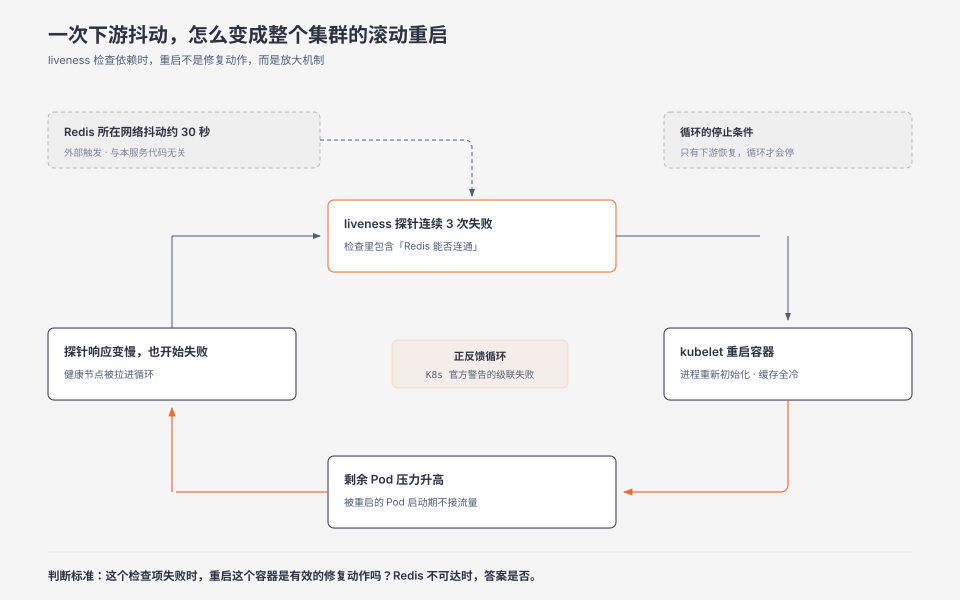
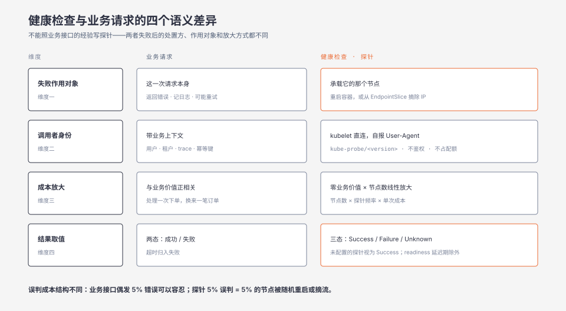
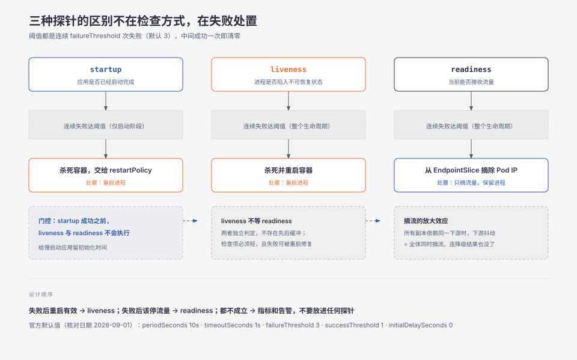

**TL;DR：** 健康检查的特殊性不在它检查什么，而在它失败之后发生了什么。业务请求失败，丢掉的是这一次请求；健康检查失败，改变的是这个节点在集群里的归属状态——被重启，或者被摘掉流量。Kubernetes 官方文档对这个差别给了明确警告：liveness 探针实现不当会导致级联失败，表现为高负载下重启容器、客户端请求失败、剩余 Pod 承受更大压力。把这个警告和另一件小事合起来看会更清楚：HTTP 探针会带上 `User-Agent: kube-probe/<kubelet 版本>`，它是系统里唯一一个主动声明自己不是业务请求的请求。**不能照业务接口的经验写健康检查，因为两者失败后的处置方、作用对象和放大方式都不同。**

## 一、一次「健康检查」把整个集群重启了

一个订单服务的 liveness 探针是这样写的：检查进程存活，同时检查它依赖的 Redis 能不能连通。理由是"Redis 挂了我还活着也没有意义"——这句话在单机时代是对的。

某个下午 Redis 所在的网络发生了约 30 秒丢包。按 Kubernetes 默认参数算，`failureThreshold` 是 3、`periodSeconds` 是 10 秒，连续三次失败正好需要 30 秒。于是所有 Pod 的 liveness 探针陆续达到阈值，kubelet 开始重启容器。

重启没有救回任何东西，因为 Redis 确实连不上。但它额外制造了三件事：容器重启后进程要重新初始化、本地缓存全部冷启动；被重启的 Pod 在启动期间不接收流量，这部分流量转移到剩余 Pod；剩余 Pod 负载升高、探针响应变慢，也开始失败，然后也被重启。

Redis 在半分钟后恢复，集群的滚动重启又持续了十几分钟。事后翻代码，没有一行业务逻辑有 bug——出问题的那一行是"检查依赖是否健康"，一个看起来绝对正确的判断。

> 场景说明：上面这个服务是复合示例，把几类公开复盘过的探针事故形态合成了一个。30 秒这个数字来自 Kubernetes 默认参数下能触发重启的量级，不是某一次可复现的实测记录。可核实的机制与默认值见第四节引用的官方文档。

## 二、最强反例：简单探针就是对的

先处理一个合理的反对意见：绝大多数健康检查就是一个返回 200 的 `/healthz`，大量服务这么跑了几年没出过事。要求每个探针都做语义分析，是把简单的事情复杂化。

这个反驳在它的成立范围内是对的。当探针只回答"这个进程还能不能处理请求"、且失败后果是"重启一个进程"时，简单探针不只是够用，它是更好的选择——它引入的失败模式最少。

真正的分界线不在检查项的多少，而在**检查项的失败后果与探针的处置动作是否匹配**。检查"进程是否死锁"配"重启"是匹配的：死锁无法自愈，重启是当时唯一能恢复服务的动作。检查"Redis 是否可达"配"重启"是不匹配的：重启既不能让 Redis 恢复，又会在 Redis 恢复之前先削弱自己的容量。同样是"加了一个依赖检查"，前者是修复机制，后者是放大机制。

所以该问的问题不是"健康检查该不该检查依赖"，而是：**这个检查项失败时，重启这个容器是不是一个有效的修复动作？** 如果答案是否，它就不该出现在 liveness 里——它可能属于 readiness，也可能根本不该进入任何探针。

## 三、健康检查与业务请求的四个语义差异

把两类请求放在同一组维度上对比，特殊性会自己浮现出来。

### 3.1 失败的作用对象是节点，不是请求

业务请求失败，作用范围就是这一次请求：返回错误、记一条日志、可能重试一次。服务的容量、归属和生命周期都不发生变化。

健康检查失败，作用范围是承载它的那个实例。liveness 失败超过阈值，kubelet 杀死并重启容器；readiness 失败，EndpointSlice 控制器把这个 Pod 的 IP 从所有匹配 Service 的 EndpointSlice 中移除。一次请求的判定结果，变成了对一台机器的处置决定。

这个差别决定了两类请求的误判成本结构完全不同。业务接口偶发 5% 错误通常可以容忍；探针 5% 误判，意味着 5% 的节点在随机时间点被重启或摘流。前者的代价分摊在请求上，后者的代价集中在实例上。

### 3.2 调用者没有业务上下文，而且它自报身份

业务请求带着用户身份、租户信息、trace 上下文和幂等键。健康检查什么都没有——它由 kubelet 直接发起，不经过业务网关，不携带任何业务语义。

Kubernetes 文档里有一个容易被忽略的细节：HTTP 探针会额外发送两个请求头，其中 `User-Agent` 默认是 `kube-probe/<kubelet 版本>`。也就是说，**探针在请求里明确声明了自己不是业务流量**。

这件事有两层含义。有用的一层是：服务可以在日志、限流和指标里把探针流量单独识别出来，别让它污染业务指标的分子与分母。需要注意的一层是：既然它自报身份，它就不该被当成业务请求来设计——不需要鉴权、不占业务限流配额、也不应该写入任何业务状态。

### 3.3 成本与业务价值脱钩，却随节点数线性放大

业务请求的开销与业务价值正相关：处理一次下单换来一笔订单。健康检查不产生任何业务价值，但它的成本是真实的，并且按 `节点数 × 探针频率 × 单次成本` 线性增长。

如果每个探针都要查一次数据库、一次缓存、一次下游服务，那么一个 200 副本的服务给下游带来的探针 QPS，可能超过它自身业务流量的 QPS。更麻烦的是这部分负载与业务负载无关——业务低峰时探针照常执行，而低峰往往正是中间件做主从切换、备份和压缩的时间窗。

### 3.4 存在第三态 Unknown，而且「缺失即成功」

这是最容易被忽略的一条。Kubernetes 文档定义的探针结果有三种：

- `Success`：诊断通过。
- `Failure`：诊断失败。对 liveness 和 startup，kubelet 杀死容器；对 readiness，标记容器为 not ready，Pod 停止接收流量。
- `Unknown`：诊断本身没能完成。文档对这一态的处置是**不采取任何行动**，kubelet 继续做后续检查。

第三态的存在意味着"探针没返回"与"探针返回失败"是两件事，处置方式也不同。业务请求通常只有成功与失败两态，超时归入失败；探针专门为"我判断不了"留了一档。

还有一个更反直觉的默认行为：**如果容器没有配置某个探针，kubelet 一律把结果当作 `Success`**，缺失等于健康。但 readiness 有一个方向相反的例外——文档写明，在 initialDelay 之前，readiness 的结果被视为 `Failure`。同样是"还没开始检查"，liveness 按成功处理，readiness 按失败处理。

## 四、Kubernetes 把「健康」拆成了三个判断

Kubernetes 提供三种探针，它们的区别不在检查方式（`exec`、`grpc`、`httpGet`、`tcpSocket` 四选一），而在**失败之后的处置动作**：

| 探针 | 回答什么问题 | 失败后的处置 | 运行时机 |
| --- | --- | --- | --- |
| startup | 应用是否已经启动完成 | 杀死容器，交给 restartPolicy | 仅启动阶段 |
| liveness | 进程是否陷入不可恢复状态 | 杀死并重启容器 | 整个生命周期 |
| readiness | 当前能否接收流量 | 从所有匹配 Service 的 EndpointSlice 摘除 Pod IP | 整个生命周期 |

官方默认值（核对日期 2026-09-01）：`periodSeconds` 10 秒、`timeoutSeconds` 1 秒、`failureThreshold` 3、`successThreshold` 1（liveness 与 startup 必须为 1）、`initialDelaySeconds` 0。

有三条合同细节容易被写错。

第一，**startup 探针会门控另外两个**。配置了 startup 探针时，liveness 与 readiness 在 startup 成功之前不会执行，这给慢启动应用留出了初始化时间。它是替代"把 `initialDelaySeconds` 调得很大"的正确做法——后者在应用已经初始化完成之后，仍然要空等同样长的时间才开始提供保护。

第二，**liveness 不等 readiness**。文档原话是 "Liveness probes do not wait for readiness probes to succeed"。两者独立判定，不存在先后依赖，不要假设 readiness 先失败会给 liveness 提供缓冲。

第三，**阈值算的是连续失败次数，不是失败率**。`failureThreshold: 3` 指连续三次失败，配合 `periodSeconds: 10` 就是连续 30 秒。它没有"最近十次里失败七次"这种滑动窗口语义，中间只要成功一次就清零。这个特性让探针在间歇性抖动下比直觉更安全，但也意味着一次足够长的连续故障必然触发处置。

另外，`tcpSocket` 探针只检查端口能否打开。文档明确写了：如果容器在连接建立后立即关闭连接，这**仍然算健康**。它证明的是内核的监听 socket 还在工作，不是应用还能正常处理请求。

## 五、按「失败后果」而不是「检查内容」写探针

把上面的合同翻译成写探针时的判断顺序。对每个候选检查项，只问两个问题：

1. **这项失败时，重启这个容器是有效的修复动作吗？** 是——死锁、协程泄漏、无法自愈的内部状态——放进 liveness。否，继续问第 2 题。
2. **这项失败时，这个实例确实应该停止接收流量吗？** 是——依赖未就绪、缓存未预热、正在执行迁移——放进 readiness。否，放进指标和告警，不要放进任何探针。

按这条顺序筛完，第二节那个"检查 Redis"的项会落到 readiness 或告警里，而不是 liveness。这不是因为检查 Redis 有错，而是因为**重启不是 Redis 不可达的有效修复动作**。

liveness 最理想的内容是"进程内部是否存在不可恢复的状态"，并且检查本身必须极轻——它跑在每个容器的整个生命周期里，任何开销都要乘以节点数。官方文档给出的对应要求是：liveness 探针必须被谨慎配置，以确保它真正指示不可恢复的应用故障，例如死锁。

readiness 可以相对重一些，因为它失败后摘掉的是流量而不是进程。但要注意它的放大效应：如果所有副本的 readiness 都依赖同一个下游，下游抖动会让所有副本同时被摘流，而它们本来还能返回降级结果。把"完全不可用"和"只能返回降级结果"区分成不同的检查项，比统一判失败更有价值。

## 六、边界：什么时候这些讨论不适用

- **单实例且没有自动重启的系统**：探针失败既不触发重启也不触发摘流，失败处置这一层基本不适用，探针退化成一个外部告警输入。
- **短生命周期的批处理任务**：进程本来就会结束，liveness 的重启语义没有意义；真正需要的是任务级状态上报，不是 HTTP 探针。
- **判定逻辑已经下沉到服务网格的架构**：摘流可能由边车或网格控制面完成，此时应用探针只负责进程级语义，不要把依赖检查重复实现一遍。
- **客户端负载均衡或无注册中心的架构**：没有 EndpointSlice 这类摘流机制，readiness 的语义要由调用方自己实现，合同由你选的框架决定，而不是由 Kubernetes 决定。

## 七、可执行的研究问题

- **对照 liveness「检查依赖」与「不检查依赖」两组，在注入下游抖动后的重启规模**。假设：检查依赖的组在 Redis 抖动 30 秒后重启的副本比例显著更高，且恢复时间更长。控制变量：抖动时长、副本数、`failureThreshold`、`periodSeconds`。观测指标：重启次数、各副本重启时刻分布、请求错误率、完全恢复耗时。反例：若抖动期间业务本就完全不可用，重启与否的用户可感差异接近零。完成标准：给出两组重启副本数的量化差异。不可外推到非 Kubernetes 的部署体系。

- **测量探针自身开销随副本数的增长曲线**。假设：当每个探针检查 N 个下游时，下游收到的探针 QPS 与副本数成正比，并在副本数超过某个值后超过业务 QPS。控制变量：副本数、探针频率、检查项数量。观测指标：下游收到的 QPS、探针 P99、业务 P99、连接数。反例：若对探针结果做了 `periodSeconds` 内的缓存复用，增长曲线会被压平。完成标准：给出探针 QPS 与业务 QPS 的比值随副本数变化的曲线。不可外推到其他编排系统的探针实现。

- **验证 `tcpSocket` 探针在应用卡死但端口仍可连接时的行为**。假设：进程陷入死锁但监听 socket 仍由内核维护时，`tcpSocket` 返回健康，无法发现该类故障。控制变量：故障注入方式（死锁、协程泄漏、主动 sleep）。观测指标：探针结果序列、进程 CPU、请求成功率。反例：若容器运行时在进程无响应时已回收 socket，探针会失败。完成标准：明确列出 `tcpSocket` 会漏检的故障模式。不可外推到 `httpGet` 与 `grpc` 探针。

- **对照「统一探针接口」与「liveness/readiness 分离」在滚动发布期间的可用性差异**。假设：分离的组在发布期间错误率显著更低，因为 readiness 可以先摘流再让 liveness 参与判定。控制变量：发布批次大小、应用启动耗时、`initialDelaySeconds`、是否配置 startup 探针。观测指标：发布期间 5xx 数、Pod 进入 Ready 的时间、发布总时长。反例：若应用启动极快且无外部依赖，两组差异可能测不出来。完成标准：给出发布期间错误率的对比数据。不可外推到非滚动发布的部署方式。

## 八、参考资料

- Kubernetes 官方文档 [Liveness, Readiness, and Startup Probes](https://kubernetes.io/docs/concepts/configuration/liveness-readiness-startup-probes/)（核对日期 2026-09-01）—— 本文第三节与第四节的一手依据：三种探针的处置语义、`periodSeconds` / `timeoutSeconds` / `failureThreshold` / `successThreshold` / `initialDelaySeconds` 默认值、`Unknown` 第三态、"未配置即 Success"、readiness 在 initialDelay 之前视为 Failure、`tcpSocket` 建连后立即关闭仍算健康、`User-Agent: kube-probe/<版本>`，以及 liveness 实现不当导致级联失败的官方警告。
- Kubernetes 官方文档 [Pod Lifecycle](https://kubernetes.io/docs/concepts/workloads/pods/pod-lifecycle/) —— 容器状态机与重启策略的上下文。

### 延伸阅读

- [生产发布 Go/No-Go 严格核对清单](/writing/service-release-checklist) —— 其中已区分 `/healthz` 只表示进程存活、`/readyz` 才有依赖准备语义，本文是这个区分的完整机制解释。
- [灰度、蓝绿与金丝雀发布](/writing/deployment-canary-blue-green) —— 摘流语义在发布场景下的另一半故事。
- [Go 的优雅关闭](/writing/graceful-shutdown-in-go) —— 被探针判定为不健康之后，进程如何体面地退出。
