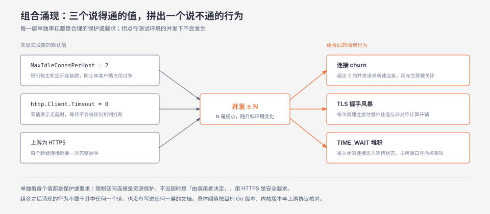
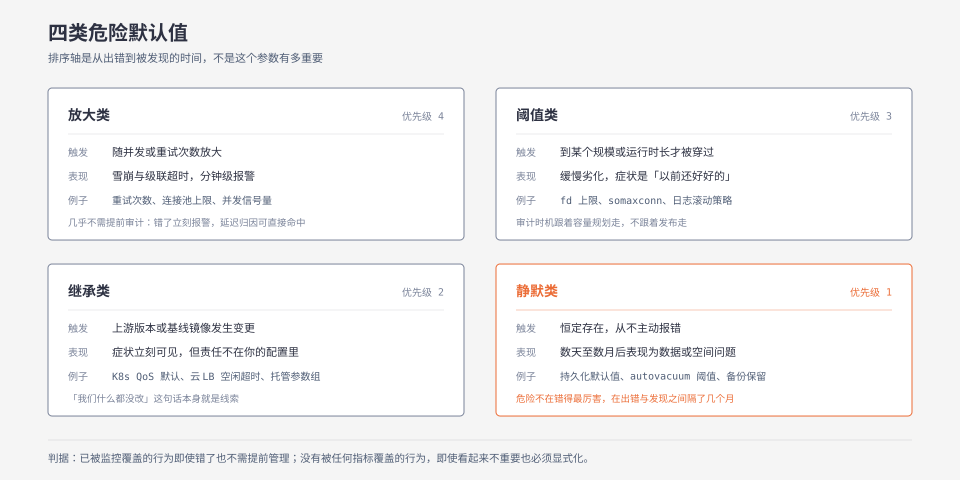
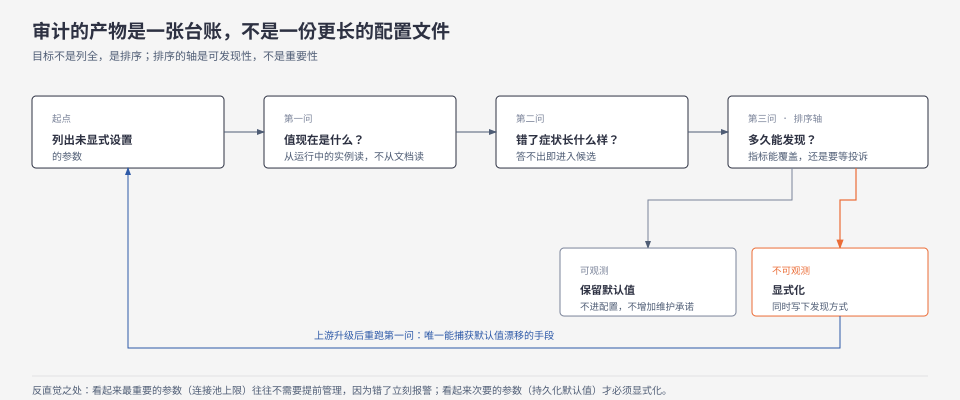

**TL;DR：** 架构决策不只发生在你做选择的地方，更多发生在你没有做选择的地方。每个未显式设置的参数都是上游替你做完的判断，它们组合起来定义了系统的失败形状，却不出现在任何设计文档或 code review 里。论点不是"把所有默认值都显式写一遍"——随手显式化常常比默认值更糟——而是按**可发现性**筛选：只显式化那些"如果它是错的，我们既没有指标也没有日志能在合理时间内发现"的参数。排序的轴是从出错到被发现的时间，不是这个参数有多重要。

## 一、 一个没人设置过的参数决定了故障的形状

上线三个月后的一天，服务开始报 `dial tcp: i/o timeout`。排查路径是标准的：CPU 正常，上游 P99 正常，GC 没有异常。最后在 goroutine 栈里看到几千个 goroutine 卡在同一个 `http.Client.Do` 上。

原因不在那几行代码里。`http.DefaultTransport` 的 `MaxIdleConnsPerHost` 是 2（Go 标准库默认值，**按你使用的 Go 版本核对**），而 `http.Client` 的 `Timeout` 零值表示没有超时。这两个值从没被人设置过，也就不在任何人的设计文档里。低并发时它们完全无害；并发涨到某个点之后，每个请求都在等一个等不到的空闲连接，而没有任何机制会打断这个等待。

故障的形状——缓慢堆积、无上限等待、最终全局超时——不是那天提交的代码决定的，是两个从来没有被讨论过的默认值决定的。

这件事的普遍形式值得单独写下来：一个系统的实际行为，等于**显式决策**与**所有未设置参数的默认值**之和。前者出现在 ADR、设计文档和 code review 里，有 owner、有评审、有变更记录；后者不出现在任何地方。而后者在数量上占绝对多数——一个普通的 Go 服务配上 PostgreSQL、Redis 和 Kubernetes，未显式设置的行为参数轻易就有几百个。

所以真正的问题不是"默认值好不好"，而是：**我们怎么把这块从没被写下来的架构变得可见**。

## 二、 最强反例：默认值通常是对的，随手显式化往往更糟

先处理一个合理的反对意见：把系统里所有默认值都显式写一遍，是不折不扣的 cargo cult，而且通常比不写更危险。

理由有三层。第一，流行组件的默认值是大量真实故障收敛出来的结果，`MaxIdleConnsPerHost = 2` 这个保守值的作用是防止单个客户端对单个主机占用过多连接；随手改成 200，等于把这层保护拆掉。第二，显式化会引入版本漂移：你把某个版本的默认值抄进配置，升级之后上游可能已经调整过这个值，而你抄的那份还钉在原地，此时系统行为和上游默认值**双向偏离**。第三，每个被写下来的参数都变成一份需要维护的承诺——它要有注释、有 owner、有变更理由，几百个这样的参数会淹没真正重要的那几个。

所以论点必须收窄到唯一站得住的形式：**不是"应该设置所有参数"，而是"应该知道它们是什么，并知道如果它是错的，我们多久能发现"**。审计的产物不是一个更大的配置文件，是一张按可发现性排序的台账；只有排在末尾的那一小撮才值得被显式写下来。

## 三、 为什么默认值能承担架构决策：三层机制

### 3.1 单个默认值无害，组合才暴露性质

默认值几乎不会单独造成问题。它们的作用是在**组合中涌现**：三个各自合理的默认值放在一起，可能产生任何一个单独看都推不出来的行为。

*图注：`MaxIdleConnsPerHost = 2` 限制的是空闲连接数，超出的请求会新建连接并在用完后被关闭；叠加"无超时"和"上游是 HTTPS"之后，结果是连接 churn 加 TLS 握手风暴，而不是任何一个值单独承诺的行为。具体阈值按目标 Go 版本、内核版本和上游协议核对。*

图中的每一层单独看都说得通：限制每主机的空闲连接数是资源保护；不设超时意味着"由调用者决定"；上游用 HTTPS 是安全要求。组合之后的涌现行为是——超出 2 个的并发请求不断创建和销毁连接，每次创建都要一次完整 TLS 握手（额外的往返与非对称计算），被关闭的连接进入 TIME_WAIT 堆积（见[连接复用与 TIME_WAIT](/writing/time-wait-connection-reuse)），客户端 CPU 因为反复握手而上升。三步里没有一步在单独审视时能推出这个结论。

这也解释了为什么默认值问题在测试环境几乎抓不到：测试环境的并发不足以穿过那个拐点，组合的涌现行为根本不会发生。

### 3.2 默认值定义的是失败的形状，不是性能数字

第二层更容易被误解。多数人把超时、重试次数、连接池上限当成"性能调优参数"，但它们的真实身份是**可用性策略**。

- **超时**决定的是：依赖变慢时，你选择快速失败（保住自己，把错误交给上游）还是无限等待（把依赖的慢变成自己的慢，再传播给自己的调用者）。
- **重试次数**决定的是：下游压力已经很大时，你往里放大多少倍负载。`n` 次重试在最坏情况下把 1 份请求变成 `n + 1` 份，而这个放大与服务变慢**正相关**——越是下游快撑不住的时候，打进去的越多（放大的完整账本见[重试会放大一切错误](/writing/idempotency-engineering)）。
- **连接池上限**决定的是：超出容量时，你选择排队（把延迟转嫁给等待者）还是快速拒绝（把错误转嫁给调用者）。`database/sql` 的 `SetMaxOpenConns(0)` 表示无限制，选的就是"永远排队"（连接池的容量与超时关系见[连接池的数学与超时](/writing/connection-pool-math-timeout)）。

这三个选择在显式配置里会被 review，因为它们是可见的策略；在默认值里不会被 review，因为它们看起来只是"没设置"。参数没变，性质变了——它从一个需要评审的架构判断，退化成一个没人看过的空缺。

### 3.3 默认值没有 owner，所以没有变更记录

第三层是组织性的，但它是前两层的放大器。一个显式配置会经过 code review，会出现在配置仓库的 diff 里，改动时会有提交信息和评审人。一个默认值什么都不经过——它不在 diff 里，因为它从来没被写下来。

后果是：当上游在某个版本调整了默认值（这类调整通常写在 release note 中间某段），你的系统行为改变了，而配置仓库、ADR、变更记录里都找不到对应条目。你唯一能观察到的现象是"某次升级之后曲线变了个样子"，而这需要有人把升级时间和指标变化主动对上——这正是[重建事故证据链](/writing/rebuild-incident-evidence-chain)里最难建立的那一环。

## 四、 四类危险的默认值：按放大性与可发现性分

既然不可能审全部，就需要一个分类来决定审哪些。我按两个维度分：**失效是否随负载放大**，以及**从出错到被发现的时间**。

*图注：横轴是失效是否随负载放大，纵轴是从出错到被发现的时间。静默类的危险不在于错得最厉害，而在于出错与发现之间隔了数天到数月，归因线索到那时已经淡了。*

**放大类（随并发放大，秒到分钟级暴露）**：重试次数、连接池上限、并发信号量、批处理大小。失效表现是雪崩和级联超时。这类几乎不需要提前审计——它错的时候服务立刻变慢，你的延迟指标在几分钟内就会报警，[延迟归因](/writing/latency-attribution)那套方法能直接定位到它。

**阈值类（不随单请求放大，但到某个规模突然失效）**：文件描述符上限、监听队列长度（如 `somaxconn`，默认值随内核版本变化，按目标内核核对）、容器 CPU/内存限制、日志滚动策略。失效表现是"以前还好好的"。这类只在负载跨量级时才会被穿过，所以审计时机应该跟着容量规划走，而不是跟着发布走。

**静默类（不立即可见，表现为数据或空间问题）**：持久化相关默认值（见[fsync 与组提交](/writing/fsync-group-commit)）、Redis 的淘汰策略（默认值随版本与发行版变化，按你的版本核对，见[Redis 持久化](/writing/redis-persistence-rdb-aof)）、PostgreSQL 的 `autovacuum` 阈值（见[膨胀与 autovacuum](/writing/postgres-bloat-autovacuum)）、备份保留周期、审计日志开关。失效表现是几周后发现数据、磁盘或性能问题，且很难归因到某个具体参数。

**继承类（值可能合理，但属于别人的系统）**：Kubernetes 未设 `requests/limits` 时 Pod 落入 BestEffort 等级（见[cgroup 与 requests/limits](/writing/k8s-requests-limits-cgroup)）、托管数据库的默认参数组、基础镜像里的内核参数、云负载均衡的默认空闲超时。失效表现是"我们什么都没改"——这句话本身就是线索：你没改，但你的供应商改了，或者你继承的基线里就带着这个决定。

四类里**静默类最危险**。不是因为它错得最厉害，而是因为它的可发现性最差：从出错到发现之间隔了几天到几个月，等到有人注意到的时候，所有的归因线索都已经凉了。

## 五、 审计方法：按可发现性排序，不按重要性

审计的目标不是列全，是**排序**。对每个未显式设置的参数问三个问题，按顺序：

1. **这个值现在是什么？** 不是"文档说是什么"，是从运行中的进程里读出来。
2. **如果它是错的，症状长什么样？**
3. **那个症状在我们的指标和日志里能看到吗？多久能看到？**

*图注：审计的产物是一张按第三问排序的台账，不是一份更长的配置文件。只有"答不出症状"或"只能等用户投诉"的参数才进入显式化候选。*

第一问有现成工具：PostgreSQL 用 `SHOW ALL`，Redis 用 `CONFIG GET *`，Linux 用 `sysctl -a` 与 `ulimit -a`，Kubernetes 用 `kubectl describe` 与 `kubectl get pod -o yaml`；Go 程序可以在启动探针里导出 `http.DefaultTransport` 的关键字段和 `runtime/debug` 的相关值。重点是**从运行中的实例读**，不是从文档读——文档描述的是上游的默认值，你的发行版、镜像和云厂商都可能改过它。

第二、三问才是审计的真正产物。把答案填进一张表，然后按第三问排序：答不上来，或者答案是"要等用户投诉"的，就是候选。

### 排序的轴是可发现性，不是重要性

这是整套方法里最反直觉、也最关键的一点。"连接池上限设小了"和"某个持久性参数关了"哪个更重要？多数人凭直觉选后者。但从可治理性看，答案相反：前者几乎不需要提前管理——它错的时候服务立刻变慢，延迟指标几分钟内报警，归因方法直接命中；后者才需要，因为它错的时候一切正常，等发现时已经晚了几个月。

换成一句可以执行的判据：**已经被监控覆盖的行为，即使错了也不需要提前管理；没有被任何指标覆盖的行为，即使看起来不重要也必须显式化。**

这个判据也解释了为什么"重要性"是错的排序轴：重要性是主观的、随人变的，而可发现性是客观的、取决于你当前的观测能力。同一个参数在这两套排序下的位置可能完全相反，而真正决定"它会不会变成一次长周期事故"的是后者。

### 显式化的三条纪律

对最终进入候选的那一小撮参数：

- 写下来的时候同时写下两件事：**为什么是这个值**，以及**怎么发现它错了**。后者通常比前者更容易被忘掉。
- 显式化的参数必须进版本控制和 review，否则你只是把一个隐形的默认值变成了一个同样隐形的配置项。
- 每次上游升级之后重跑第一问。这份快照 diff 是唯一能捕获默认值漂移的手段，因为漂移不会出现在任何 changelog 的显著位置。

## 六、 边界：什么时候这套方法不值得做

诚实地说清楚它在哪些情况下收益接近零：

- **系统压力远低于任何阈值时**。一个内部工具、峰值 QPS 两位数、数据丢了可以重跑——那么默认值出错也不会造成可观测的损失，审计的时间花在别处更划算。
- **默认值由供应商以 SLA 形式兜底时**。托管数据库的参数组、云厂商的负载均衡配置，你的动作是核对 SLA 条款，不是逐个参数比对。
- **团队连基础监控都还没建全时**。可发现性排序依赖"你有什么指标"这个前提；如果大部分行为都没有指标，那么所有参数都会落到"不可发现"那一端，排序就失去了区分度。这时先做的是补齐观测，不是审计默认值。

反过来，有两类情况收益最大：一是**负载即将跨量级**（从千 QPS 到万 QPS、从单 region 到多 region），因为阈值类默认值只在这个时刻才会被穿过；二是**失败不可逆**（扣款、发信、删除、合规留痕），因为静默类默认值的代价在这里是数据，不是延迟。

还有一个诚实的局限：这套方法能告诉你"哪些默认值错了你也不会知道"，不能告诉你"哪些默认值本来就是对的"。审计之后你对系统的了解增加了，但对系统正确性的保证没有增加。这两件事经常被混为一谈——前者是知识，后者是验证。

## 七、 可执行的研究问题

1. **可发现性排序是否真的优于重要性排序。** 假设：按可发现性排序比按重要性排序更能命中真实故障源。做法是取本团队过去 N 次线上故障，回溯每次是否由未显式设置的参数引起，统计这些参数在两种排序下的名次。控制变量是故障样本的时间范围与团队范围，避免跨团队口径不一致。done criterion：静默类参数在"可发现性排序"下的平均名次显著靠前。不能外推到故障样本少于十次的团队（统计上无意义），也不能外推到没有事后复盘记录的故障。

2. **升级导致的默认值漂移是否可被捕获。** 假设：启动时导出关键参数快照，升级前后 diff，能捕获绝大多数漂移。做法是在服务启动探针里 dump 一份关键参数进日志，每次升级后自动比对。观测指标是"快照发生变化且无人预期"的次数。反例：有些默认值的变化只在特定负载下才体现，静态快照抓不到。不能外推到那些行为依赖运行时环境（cgroup 拓扑、NUMA 布局）而非静态配置的参数。

3. **组合涌现的拐点是否可以标定。** 假设：组合产生的失效模式存在一个可测量的并发拐点，且无法从任一单个默认值推出。做法是固定其余所有参数，只把并发从 1 逐步加到饱和，记录连接 churn 速率、TLS 握手次数、TIME_WAIT 数量与 p99 的拐点位置。控制变量是并发以外的全部参数，以及预热和重复次数（见[一次只改一个变量](/writing/benchmark-one-variable)），样本量按[置信度要求](/writing/p99-sample-size-confidence)确定。done criterion：能给出每个指标拐点对应的并发数。不能外推到其他内核版本、其他硬件，或 loopback 之外的网络。

4. **显式化是否真的缩短了恢复时间。** 假设：被显式化且记录了"怎么发现它错了"的参数，其相关故障的 MTTR 更短。做法是对比显式化前后同类故障的定位耗时。反例：显式化可能制造"这个问题已经处理过了"的错觉，反而推迟真正的修复。不能外推到故障样本稀少、无法形成对照的团队。

## 八、 参考资料

以下官方文档用于核对你自己环境中的默认值，本文不转述具体数值，因为版本与发行版差异正是本文的论点之一：

- Go `net/http` Transport 默认值：https://pkg.go.dev/net/http#Transport
- Go `database/sql` 连接池设置：https://pkg.go.dev/database/sql#DB.SetMaxOpenConns
- PostgreSQL 运行时参数默认值：https://www.postgresql.org/docs/current/runtime-config.html
- PostgreSQL 自动清理参数：https://www.postgresql.org/docs/current/routine-vacuuming.html
- Redis `maxmemory-policy` 与持久化：https://redis.io/docs/latest/operate/oss_and_stack/management/config/
- Kubernetes Pod QoS 等级：https://kubernetes.io/docs/concepts/workloads/pods/pod-qos/

> 延伸阅读：默认值决定的是失败的形状，而失败往往在重试中被放大，见[重试会放大一切错误：幂等性工程的完整账本](/writing/idempotency-engineering)；发现异常只是第一步，把现象还原成证据链才是难点，见[重建事故证据链](/writing/rebuild-incident-evidence-chain)。
