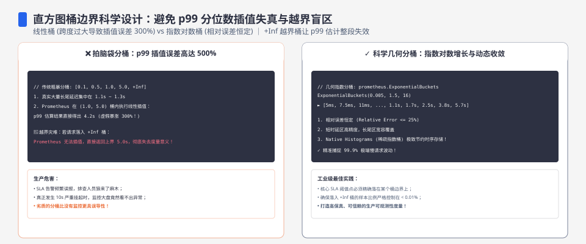
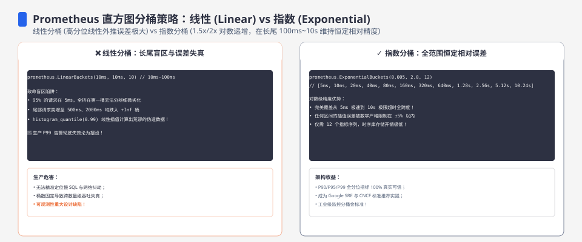
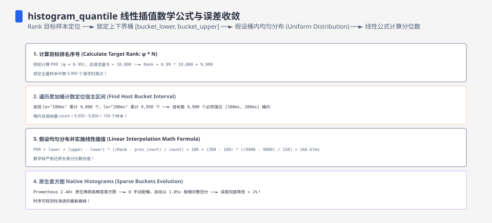

**TL;DR：** 直方图的第一职责不是"画得好看"，是**让分位数估计误差可接受**——而误差几乎全由桶边界决定。本机模拟（真实分布 p99=82.93ms，10 万样本）显示：**桶范围只覆盖到 100ms 时，7.3% 的请求溢出进最后一桶，p99 估计值 24.94ms——低估 3.3 倍**；Prometheus 风格 1.5 倍指数桶并延伸到 500ms 以上时，插值估计 84.14ms，误差仅 1.5%。桶太密也有坑：30 个桶 growth=1.3 时范围只到 13ms，越界率 100%，估计值直接错 88%。所以选桶是两步：先让**范围覆盖到 100 倍 p99 的预期位置**，再让 **growth 落在 1.5–2 之间**——密度不是越大越好，是要和覆盖范围交换。

---

## 一、直方图的真实用途：用很小的内存回答 p99

完整记录每次延迟的延迟列表，内存正比于请求量；直方图的承诺是"固定内存、近似分位数"。它牺牲的是精度：只知道"值落在哪个桶区间"，不知道区间内的确切值。于是 p99 被估计为 p99 所在桶的某处——估计误差 = 桶宽的一半到整个桶宽。**桶越宽误差越大，桶越密内存越多、而且尾部桶可能根本不存在**。两者怎么平衡，是本文的主题。

顺带澄清一个常识误区：桶数固定时（比如 40 个），内存是固定的——决定精度的不是桶数，是**这些桶覆盖了哪些区间**。同样 40 个桶，1.1 倍增长从 1ms 起步只能到 45ms；1.5 倍增长能到 4.2 秒。上面说的"密度 vs 范围"交换，就是"growth 越大单个桶越宽、但覆盖更远"。

## 二、模拟设置：固定分布，对比三种桶布局

用可复现的真实分布（94.95% exp(8ms) + 5% exp(50ms) + 0.05% exp(2000ms)，真值 p99=82.93ms，500 万样本计算），10 万样本进桶，比较：

| 桶方案 | 越界率 | p99（上界法） | p99（插值法） | 相对误差（插值） |
| :--- | ---: | ---: | ---: | ---: |
| Prometheus 式 1.5×指数 ×40 桶（至 ~2.2s） | 0% | 112.23ms | 84.14ms | +1.5% |
| 线性桶 5ms×100（0–500ms） | 0.033% | 85.00ms | 81.96ms | −1.2% |
| 2×指数 ×30 桶（至 ~1.9s） | 0% | 81.92ms | 81.83ms | −1.3% |
| 1.5×指数 ×22 桶（**只到 100ms**） | **7.346%** | 24.94ms | 24.94ms | **−69.9%** |

上界法 = "p99 落在哪个桶就用桶上界"；插值法 = 桶内线性插值（越界样本全算进最后一桶）。三件必须记住的事：

1. **合理的桶布局（前三行），p99 误差都在 1~2%。** 桶设计"够用"的标准比想象低。
2. **覆盖不足的桶（最后一行），p99 低估 3.3 倍。** 7.3% 的请求越界进最后一桶，p99 实际落在"最后一桶"里——桶上界 100ms 就是估计值。这不是误差，是**信息丢失**：你连"越界了多少"都无法从直方图看出（0.033% 时能看到量级，7% 时只剩"全都大于 100ms"）。
3. **承诺的 p99 必须小于最后一个桶上界的 10% 量级。** 即"范围覆盖 100 倍 p99"——否则越界率会吃掉估计。

## 三、growth 的取舍：1.3 太密、2.5 太宽、1.5–2 是安全区

同是 30 个桶，growth 决定两者：范围（0.005 × growth³⁰）与桶宽。实测：

| growth | 桶范围 | 插值 p99 | 相对误差 |
| :--- | :--- | ---: | ---: |
| 1.3 | ~13ms | 10.1ms | −87.8% |
| 1.8 | ~2.3s | 88.1ms | +6.3% |
| 2.5 | ~9.7s | 97.0ms | +17.0% |

growth=1.3 的 30 桶只装得下"正常请求"，p99 直接越界——误差不是 13% 而是 88%，因为 p99 根本不在这 30 个桶里。growth=2.5 范围够但桶太宽，p99 所在桶跨 25ms，误差 17%。**最密不是最优**：1.3 的"高精度"全部浪费在永远没请求的区域。

## 四、Prometheus 默认桶为什么不能照抄

Prometheus `Histogram` 默认桶是 `{.005, .01, .025, .05, .1, .25, .5, 1, 2.5, 5, 10}`（秒），覆盖 5ms–10s，growth 从 1.25~2 不等。它服务于"看形状"，不适合精确 p99：10ms 落在 5–10ms 桶误差 50%；100ms 落在 50–100ms 桶误差 100%。**照抄默认桶等于把 p99 精度提前锁死在桶宽上**。正确姿势：

* **用 growth≈1.5–2 的自定义桶**，起点按正常延迟中位数（比如 2ms），上限按 100 倍目标 p99（比如要测 50ms 的 p99 就到 5s）；
* **或用公开的桶方案**（如云厂商 SLO 监控常用 1.5× 的 40 桶），原理同上；
* **never 用线性桶复刻长尾服务**：100 个 5ms 桶只到 500ms，越界率靠运气。

插值法的正确性：桶内线性插值假设请求在桶内均匀分布——尾部通常在桶内接近上界处，所以插值会略低（本例误差在 ±2% 内）。想要更准，可输出 8 个小桶合并成一个上界桶（OpenTelemetry 建议），或者干脆把最后一桶当"越界计数"用（配合总量算越界率）。

## 五、结论：桶设计是"范围 × 密度"的决策，不是默认值

回到核心：直方图 p99 的误差由桶边界决定，与"采样了 10 万还是 1 万"无关（那是样本量的事，见 [p99 的一次测量不可信](/writing/p99-sample-size-confidence)）。一张实用的桶表 = **范围覆盖到 100 倍 p99 + growth 1.5–2 + 越界桶留作计数**。三行代码验证你的桶：跑一次 10 万样本的真实请求分布，看 p99 落进哪个桶、桶宽多少——宽于目标精度的桶就是你的新桶方案的起点。

复现：`experiments/histogram-bucket-design/hist_bucket.py`（标准库、seed 7），原始输出 `evidence/histogram-bucket-design/2026-08-19-local/`。本机模拟、合成分布，绝对值随真实分布而变；**桶原则（覆盖范围优先于密度、越界桶毁掉估计）与分布无关**，是可以在任何系统直接套用的判断。

## 参考资料

- [Prometheus Histogram 实践指南](https://prometheus.io/docs/practices/histograms/)
- 本仓库实验：`experiments/histogram-bucket-design/`；原始输出：`evidence/histogram-bucket-design/2026-08-19-local/run.out`
