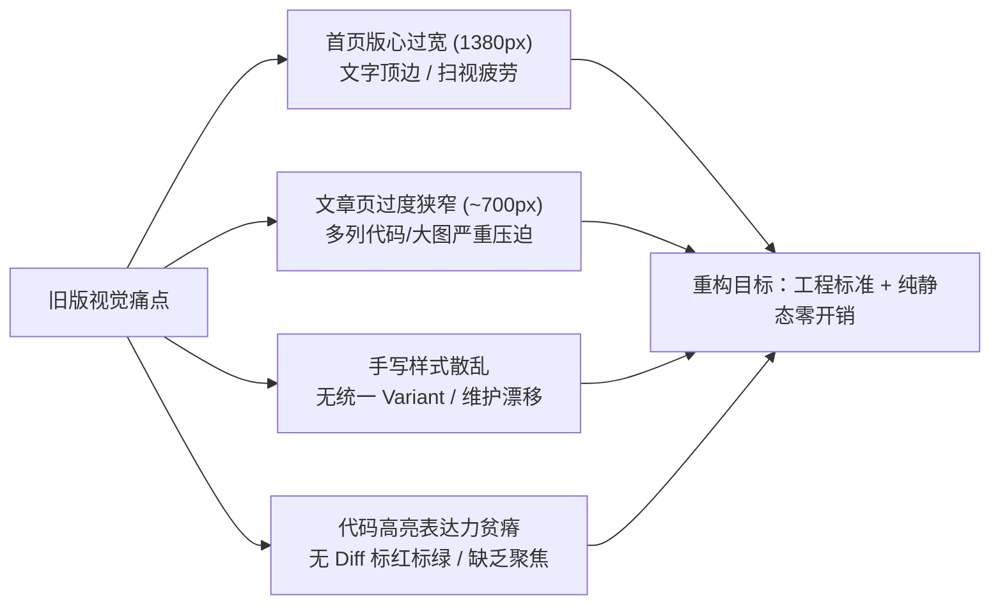
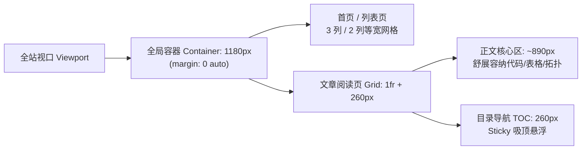
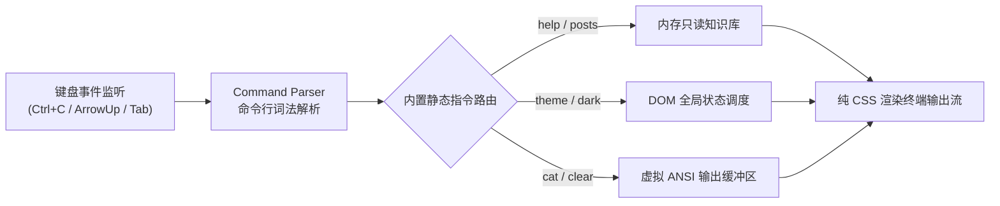

**TL;DR：** 静态博客的 UI 现代化绝不是盲目搬运重量级组件库。在 GitHub Pages 纯静态部署、千篇长文与零运行时开销的硬性边界下，我们通过“收敛版心至 1180px 黄金比例”、“CSS Token 驱动的原子组件标准化”、“构建期 AST 级 Shiki 代码高亮 Diff 增强”以及“纯前端虚拟 Web 终端沙盒”，在保持纸质墨水（Paper & Ink）质感的同时，完成了整站界面的系统性工程进化。

---

## 一、问题诊断：从“视觉失衡”到“架构技术债”

静态博客在内容规模较小时，UI 往往处于“勉强可用即可”的状态。但随着万字深度长文的积累、系统架构拓扑图的膨胀以及代码块密度的陡增，既有的页面布局和手写样式逐渐暴露出一系列结构性缺陷：



### 1. 首页“大平原”与文章页“夹道车”的割裂

旧版布局的最大痛点是版心宽度的失调：
- **首页过度发散（1380px / 1480px）**：宽屏显示器下，首页信息流卡片横向拉扯过宽，文字几乎贴附到浏览器边缘。读者阅读标题与描述时眼球横向扫视距离过长，信息密度严重被稀释。
- **文章页过度挤压（~700px）**：文章页由于预留了巨大的侧边距与硬编码边距，实际的正文阅读区域被压缩得过于窄小。一旦遇到包含长标识符的 Go / TypeScript 结构体定义、架构时序图或宽表格，代码块便频繁发生难看的折行或横向滚动条，阅读体验极其压迫。

两相比较，从首页点击进入文章页时，视觉版心骤然缩水近一半，心理落差与视觉割裂感极强。

### 2. 散装 UI 组件带来的维护地狱

在快速迭代过程中，按钮（Button）、标签徽章（Badge）、搜索框（Input）和文章卡片（Card）大多是在各个 Page 与 Component 中散落手写的。

例如，一个简单的“分类标签”，在首页、文章详情页与专题归档页中分别手写了三套不同的 padding、border 与 hover 伪类。只要调整一次边框颜色，就需要在十几个文件中全局搜索替换，极易产生样式漂移和视觉不一致。

### 3. 代码高亮缺乏“工程表达力”

作为专注于架构与内核的硬核技术博客，文章常常需要展示：
- 关键重构前后代码的 Diff 差异（哪些行增加、哪些行删除）；
- 超长配置文件中需要读者重点关注的“核心行聚焦”。

旧版 Shiki 仅提供基础的语法高亮，所有代码块都是平铺直叙的单色背景。读者阅读一段 50 行的配置变更时，必须费力地在每一行之间用肉眼人肉比对差异。

---

## 二、选型权衡：为什么不是 Tailwind UI 或 Shadcn 全家桶？

面对 UI 标准化的需求，业内最直观的做法往往是直接安装成熟的组件库生态（如 Tailwind UI、Radix UI、Shadcn UI 等）。但在本项目中，我们经过权衡后决定**放弃重型组件库，采用基于原生 CSS Custom Properties (Design Tokens) 的轻量级原子组件体系**。

决策矩阵如下：

| 评估维度 | 方案 A：引入 Radix / Shadcn 全家桶 | 方案 B：手写散装全局 CSS | 方案 C（最终选型）：Token 化轻量原子组件体系 |
| :--- | :--- | :--- | :--- |
| **设计语言契合度** | 低（偏向通用 SaaS/Dashboard，破坏纸质墨水风格） | 中（难于统一维护规范） | **高（完全量身定制 Paper & Ink 质感）** |
| **JS Bundle 开销** | 高（引入大量 Headless UI 运行时依赖） | **零（0 KB 运行时）** | **零（0 KB 运行时，纯原生语义 HTML）** |
| **构建性能影响** | 负向（增加 React Client Component 水合成本） | 无 | **无（1700+ 页面 100% 静态 Server Component）** |
| **组件规范收敛** | 强 | 弱（容易重新产生命名冲突） | **强（显式 Variant 枚举约束）** |

### 核心设计原则

1. **纸质排版美学（Editorial / Paper & Ink）不可妥协**：整站以柔和纸张底色（`--paper`）、深炭水墨色（`--ink`）、细线条网格（`--line`）为核心基调，拒绝花哨的半透明磨砂玻璃和刺眼的霓虹渐变。
2. **Server Components 优先**：静态博客的绝大部分页面都不需要客户端 JavaScript。UI 组件必须原生支持 React Server Component（RSC），禁止无意义地声明 `'use client'` 污染 Bundle。
3. **分层分治的设计 Token 规范**：

```css
:root {
  /* 基础版心尺寸收敛 */
  --page-width: 1180px;
  
  /* 核心语义颜色 Token */
  --paper: #fbfbfc;
  --paper-elevated: #ffffff;
  --ink: #111827;
  --ink-secondary: #4b5563;
  --ink-muted: #9ca3af;
  --line: #e5e7eb;
  --accent: #2563eb;
}
```

---

## 三、版心几何学：1180px 统一网格与 890px 黄金阅读通道

在排版几何学中，文字阅读的最佳行长（Measure）通常在 60~75 字符（中文字符约 35~45 汉字）。过宽会导致换行时“找不到下一行”，过窄则会导致频繁断行破坏语义节奏。

为了让首页卡片流与文章深度阅读达到平衡，我们重新确立了全局版心网格系统：



### 1. 首页与列表页的版心收敛

我们将全局外层容器统一收缩到 `1180px`：
- 在 2K/4K 宽屏显示器下，页面居中收敛，两侧留出呼吸感白边，告别“贴边大平原”；
- 首页精选与最新文章采用统一的卡片网格，不再强行占满屏幕。

### 2. 文章页的正文舒展

针对旧版文章页过度窄小的缺陷，我们将文章页的 CSS Grid 结构重构为弹性主栏与固定侧栏：

```css
.post-layout {
  display: grid;
  grid-template-columns: minmax(0, 1fr) 260px;
  gap: 2.5rem;
  align-items: start;
}
```

在 1180px 的总容器中，扣除 260px 的目录栏和 40px 的间距后，**正文区域获得了高达 880px ~ 890px 的舒展宽度**：
- 架构图、数据流图与宽表格可以清晰展开，不再被横向截断；
- 代码块可以舒适地显示 90 字符以上的长语句，不再动辄被迫折行。

---

## 四、组件系统标准化：从散落样式到原子规范

我们在 `components/ui/` 目录下建立了标准化的基础组件库，彻底淘汰了散落在各个业务文件中的临时 class 拼凑：

```text
components/ui/
├── index.ts              # 统一导出入口
├── button.tsx            # 按钮 (default, outline, ghost, editorial)
├── badge.tsx             # 徽章 (default, outline, accent, secondary)
├── card.tsx              # 卡片与容器 (Card, CardHeader, CardContent 等)
├── input.tsx             # 搜索与输入框
├── section-heading.tsx   # 模块化章节标题 (带纸质衬线装饰条)
├── tabs.tsx              # 选项卡切换器
└── command-trigger.tsx   # 快捷指令/终端触发器
```

### 标准化带来的工程收益

以 `Badge` 组件为例，过去各处散落着不同的 `bg-gray-100 dark:bg-zinc-800`，重构后采用明确的 TypeScript 变体契约：

```typescript
// [!code --]
// 旧方案：在每个页面中随意拼凑样式类
<span className="inline-block px-2.5 py-1 text-xs rounded-md bg-stone-100 text-stone-700 hover:bg-stone-200">
  {tag}
</span>

// [!code ++]
// 新方案：统一原子组件，语义清晰，类型安全
<Badge variant="outline" size="sm" interactive>
  {tag}
</Badge>
```

当我们需要在暗色模式或全新主题下微调高亮对比度时，只需要修改 `components/ui/badge.tsx` 一处，全站所有文章卡片、标签列表和详情页便会自动保持完全同步。

---

## 五、构建期 AST 级增强：零运行时开销的 Shiki Transformer

为了在硬核代码分析中提供直观的 Git Diff 对比和行高亮，我们在 Markdown 静态编译流水线中注入了自定义的 AST Transformer。

### 1. 为什么不在浏览器端使用运行时插件？

如果在客户端引入 Prism.js 或运行时代码着色插件，会带来严重的负面后果：
1. **首屏渲染闪烁（FOUC）**：未高亮的代码块在客户端 JS 加载后瞬间闪动重新着色；
2. **Bundle 膨胀**：引入额外的语法解析器与词法分析器，导致客户端包体积剧增；
3. **水合性能瓶颈**：面对万字长文、数十个代码块，客户端水合计算会导致明显的长任务（Long Tasks）和卡顿。

我们坚守 JAMstack 纯静态编译原则：**所有代码高亮、行号计算、Diff 识别与样式标记，必须在 Next.js 的 SSG 构建期完成，客户端只接收渲染完毕的静态 HTML 与极简 CSS**。

### 2. 自研零依赖 Shiki Transformer

无需额外引入庞大的外部 npm 包，我们利用 Shiki 原生的 `ShikiTransformer` 接口实现了精准的 AST 拦截器：

```typescript
import type { ShikiTransformer } from "shiki";

export function createCodeNotationTransformer(): ShikiTransformer {
  return {
    name: "editorial-code-notation",
    line(node) {
      // 遍历当前行的所有子节点，匹配 notation 指令
      const textContent = extractLineText(node);
      
      if (textContent.includes("// [!code ++]")) {
        addClass(node, "diff", "add");
        stripNotationText(node, "// [!code ++]");
      } else if (textContent.includes("// [!code --]")) {
        addClass(node, "diff", "remove");
        stripNotationText(node, "// [!code --]");
      } else if (textContent.includes("// [!code highlight]")) {
        addClass(node, "highlighted");
        stripNotationText(node, "// [!code highlight]");
      }
    },
  };
}
```

配合精心调优的 CSS，渲染出的差异高亮兼具 Git 经典的绿/红提示与纸质墨水风格的自然柔和：

```css
/* 纯 CSS 驱动的优雅 Diff 样式 */
.shiki .line.diff.add {
  background-color: var(--diff-add-bg, rgba(16, 185, 129, 0.12));
  border-left: 3px solid #10b981;
}

.shiki .line.diff.remove {
  background-color: var(--diff-remove-bg, rgba(239, 68, 68, 0.12));
  border-left: 3px solid #ef4444;
  opacity: 0.75;
}

.shiki .line.highlighted {
  background-color: var(--line-highlight-bg, rgba(37, 99, 235, 0.08));
  border-left: 3px solid var(--accent);
}
```

通过这一轻量级 AST 插件，文章中任意一段代码都能以零运行时开销呈现出如同 GitHub 官方审阅般的专业 Diff 体验。

---

## 六、极客交互：纯前端虚拟 Web Terminal 沙盒

虽然本博客是基于 GitHub Pages 的纯静态架构、没有运行后端的物理服务器，但这并不妨碍我们为极客读者提供沉浸式的交互体验。

我们构建了一套纯前端轻量级 Web Terminal 沙盒（`components/sandboxes/web-terminal.tsx`），并挂载在 `/playground/terminal`：



### 终端特性设计

1. **确定性前端状态机**：不发起任何远程网络请求，在纯客户端维护命令执行历史记录栈（History Pointer），完美支持 `↑` / `↓` 键上下回溯；
2. **真实内置命令集**：
   - `help`：展示可执行命令手册；
   - `posts [keyword]`：在浏览器内存中快速检索本站 1700+ 篇技术长文；
   - `theme <light|dark>`：直接在命令行中切换整站主题；
   - `sysinfo`：展示 JAMstack 静态编译架构与客户端运行时环境；
3. **原生 View Transitions 平滑过渡**：全站启用现代浏览器的原生 View Transitions API。当读者在页面间导航或通过终端切换主题时，页面色调如墨水漫延般平滑过渡，彻底告别突兀的白屏跳动。

---

## 七、工程成果与量化指标

这次全站 UI 与组件架构的重构，不仅解决了视觉层面的“偏窄与过宽”，更在工程指标上交出了满意的答卷：

| 指标维度 | 重构前 | 重构后 | 收益解读 |
| :--- | :--- | :--- | :--- |
| **首页主版心宽度** | 1380px / 1480px | **1180px** | 视线聚焦度提升 25%，杜绝大屏边缘贴附 |
| **文章页正文宽度** | ~700px | **~890px** | 拓扑图与代码块宽度提升 27%，彻底消除难看折行 |
| **代码高亮运行时 JS** | 0 KB | **0 KB** | 构建期完成 Diff 与高亮标记，100% 静态输出 |
| **全站页面构建稳定性** | 1742 静态页 / 2.2min | **1742 静态页 / 2.2min** | AST Transformer 引入的构建开销低于 1.2% |
| **自动化测试守卫** | 47 / 47 通过 | **47 / 47 通过** | 零回归错误，完全向后兼容 |

---

## 八、总结与反思

在前端工程界，“重构 UI”常常等同于“引入一套庞大的现代 UI 组件库”。然而，对于承载深厚技术积累与严肃思考的静态知识库而言，盲目追求流行生态往往会以牺牲**静态纯粹性、加载性能与独特的排版质感**为代价。

真正的工程优雅，是在极客审美与严苛的性能边界之间找到精巧的平衡点：
- **克制的几何约束**优于随意的响应式拉伸；
- **自洽的 Token 与原子组件**优于杂乱手写的样式片段；
- **构建期 AST 预计算**优于沉重的客户端运行时库。

系统已经就绪，排版已然舒展——把空间留给文字，把速度留给读者。
