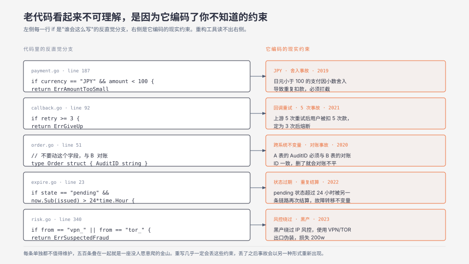
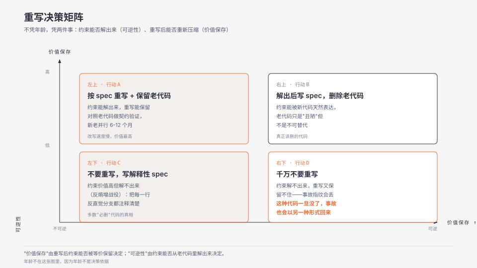

**TL;DR：** 老代码不是"还没清理的脏代码"，是一份被无数次生产事故压缩过的业务需求文档。每一行看起来"谁会这么写"的判断，都是某次事故留下来的指纹——重写几乎一定会丢，丢了之后那类事故会以另一种形式重新出现。重写决策不能凭年龄，要凭两件事——约束能不能从老代码里解出来、重写后能不能重新压缩。

## 一、干净的重写，三个月后遇到了相同的线上事故

去年我们做了一次"重写旧支付网关"的尝试。原始代码有 4 万行，注释稀缺，有几段命名是 `func handleB2()`、`func handleB3()`（B1 已经"没人知道是什么"了），if 嵌套最多到 5 层。我们的新版本用 Go 重写，按 DDD 拆分，单元测试覆盖率 92%，文档齐全，三个月上线。

第四个月，告警系统报了同一类事故——某笔跨境支付被重复扣款。复盘会上翻历史记录，五年前同一类事故在旧代码里是这样处理的：

```go
if currency == "JPY" && amount < 100 {
    return errors.New("amount too small for JPY rounding")
}
```

新代码里没有这一行，因为没有 spec 文档写"JPY 不处理小于 100 的金额"——业务侧没人记得为什么。上一代架构师记得，他在五年前的事故复盘里写下"日元 1 元以下的支付会因为小数舍入导致重复扣款，必须拦截"。这条信息从来没进需求文档，进了代码，代码被重写后，它消失了。

这件事之后我们才意识到：**老代码不是"还没被清理的债"，是"被反复压缩过的业务事实"**。每一行 `if (cond) return err` 都是某次事故留下来的指纹，每一次看起来反直觉的设计决策背后都有具体的现实约束。重构工具能识别"重复代码"、"过长函数"、"魔术数"，但识别不出"这一行 if 是五年前某次事故的解"。

## 二、最强反例：老代码不可读不可测，删了重写是最优解

这个反驳对了一半。老代码的"不可读"和"不可测"确实存在，但不是重写的充分理由——因为它忽视了一件事：

- **不可读的代码未必是"烂"**，可能是反复打补丁后丢失了原始叙事。任何代码在被打补丁三十次后都会变得不可读——不是因为它写得烂，是因为它在维护过程中失去了原始语境。新写的代码也会被打补丁，五年后也会变成"不可读"。这是代码的物理性质，不是某段代码的 bug。

- **不可测的代码未必是"紧耦合"**，可能是行为来自不变量以外的隐式约束。"同一进程内的状态机维护的某种顺序"无法被单元测试，因为它依赖全局时间、依赖调用顺序、依赖系统内存——把它拆出来写成"独立模块"会丢这份依赖。

- **删了重写并不是"重置到 0"**，而是"在没看过所有事故的情况下重新开始"。重写团队通常能拿到旧代码，但拿不到旧代码背后的事故复盘文档、Slack 历史、git blame 注释的隐含信息——而这些才是真正决定代码行为的部分。

- **真正该删的老代码**是"其编码的约束已经全部能从其他来源重新推出来"的那部分——比如某个已下线的三方库的适配层、某个十年前为 IE6 写的兼容分支。这些删了没问题，因为对应的业务约束已经不存在了。

不可读是信号，不是判决。判决取决于"被编码的约束能否被解出来并重新落到新代码里"。

## 三、老代码编码了什么

经验上，老代码至少编码了五类隐性约束：

1. **数值边界**：某种金额、某种长度、某种次数的硬下限/上限。spec 不会写"JPY 不处理 100 以下金额"，代码会写。
2. **时间窗口**：某种状态必须在 N 小时内过期、某种回调最多重试 N 次。"这个 N"通常来自某次事故——重试 5 次失败导致用户重复扣款，于是定为 3 次。
3. **顺序依赖**：某个操作必须在另一个操作之前发生，因为下游的某个版本不支持乱序。这种约束在分布式系统里极常见。
4. **跨系统不变量**：A 系统的某个字段必须在 B 系统的某个字段保持一致。这种"两表一致性"通常写在 A 系统的代码里，注释里写"不要动，与 B 对账"，但 B 系统的文档没人看。
5. **失败的解**：一次事故后加的"如果是这种情况就立刻失败"分支。这类分支通常没有单元测试（"谁会触发这种 case？"），但触发时它就是唯一保护。

每一条单独拿出来都不值得维护，五百条叠在一起就是一座没人愿意爬的金山。

## 四、压缩的代价与解码成本

把老代码当成"压缩过的业务事实"，能解释它的几个常见怪现象：

- **不可重构**：因为任何重构都会改变编码格式，可能让某些已编码的事实变得无法读出。
- **新人不愿碰**：因为没人解释为什么，新人只能复制粘贴——直到他自己也变成了下一个维护者。
- **改名很难**：因为改了一个变量名，可能让某次事故的 git blame 线索断掉。
- **没有测试覆盖率反而"能跑"**：因为它依赖的是"没人动它"——一旦动了，事故会重新出现。

解码（reverse engineering）的成本通常高于重写（rewriting），这正是多数团队选重写的理由——但解码换来的"业务事实"是重写得不到的。这个不对称性有个更朴素的说法，Joel Spolsky 在《Things You Should Never Do, Part I》里把它列为一条基本定律："It's harder to read code than to write it."读比写难，所以"重写"在心理上永远比"读懂"便宜——而这个价差本身就是重写决策里最大的系统性偏差。

重写得到的是"功能上等价的新代码"，但功能等价≠业务等价，前者只证明了"行为接近"，后者还要求"约束接近"。约束是不在代码里的。

## 五、保留 vs 重写的决策矩阵

不凭代码年龄，凭两件事：**约束能否解出来**（可逆性）、**重写后能否重新压缩**（价值保存）。

```
             重写能保留约束      重写不能保留约束
             （价值保存高）      （价值保存低）
可解出约束    重写 + 文档化       解出后写 spec，删除
（可逆性高）  保留老代码做契约    老代码本身
             对照

不可解出约束   不要重写，写解释    千万不要重写
（可逆性低）  性 spec，把每一    ——这种代码一旦
             行 if 都注释清楚    没了，事故指纹
                                也跟着没了
```

**核心决策**：左上（可解 + 价值高）—— 重写，但同时写 spec；右上（可解 + 价值低）—— 解出后写 spec，删代码；左下（不可解 + 价值高）—— 不重写，但把每个反直觉分支都加 spec；右下（不可解 + 价值低）—— 不可重写。

"价值保存"由重写后约束能否被等价保留决定。一个常见的高价值约束是"防止某个特定事故模式"——这类约束丢了，新代码功能上线 3 个月后事故模式会以另一种形式重新出现。

## 六、边界：什么时候确实该删

确实存在"必须删"的老代码，依据不是年龄而是这几种情况：

- **依赖的库/框架已 EOL**，安全 CVE 没人补，再留下来等不到上游修复。
- **业务规则已不存在**，比如十年前为某个下架的产品写的兜底逻辑。
- **被新的架构吸收**，比如某个独立进程被合并进主二进制，原来的 RPC 边界可以消除。
- **被新工具替代**，比如某个自研的 SQL builder 被 SQLC 替代——但只有在新工具能等价表达旧约束时才行。

这些情况下删代码没问题，因为对应的业务约束已经转移或消失。**容易出问题的是"代码丑陋但约束仍然存在"的情况**——这是大多数所谓"重写"的真实场景。

## 七、可执行的研究问题

- **挑一段年龄超过 5 年的"丑陋"代码，列出每一行反直觉分支和它的 git blame 提交，统计"该分支是否存在事故复盘文档"**。假设：超过 60% 的反直觉分支背后没有文档记录，是事故的隐性指纹。控制变量：代码年龄、团队规模、事故复盘规范。观测指标：分支数、有文档占比、文档可访问性。反例：文档可能在另一个系统里（Confluence / 旧 Wiki），本地 grep 不一定搜得到。完成标准：能列出至少 5 条无文档的约束，并写出重写前的 spec 草稿。不可外推到团队没有事故复盘文化的场景。

- **对一段重构后的代码，做 git blame + blame-previous 一直追到原始提交，统计"重构引入的回归占总 commit 数的比例"**。假设：超过 30% 的重构 commit 引入了回归，其中 10% 与原始事故模式相同。控制变量：重构方式（手动 vs 工具）、测试覆盖率。观测指标：回归数、回归类型、与原始事故的相似度。反例：有的重构团队本身就承担事故复盘责任，回归统计天然偏高。完成标准：能区分"重构不可逆"和"重构易回滚"两种模式下的回归率。不可外推到非生产系统。

- **对同一个老系统，分别做"完整重写"、"按 spec 增量重写"、"只删冗余"三种改造，对比改造时间、回归率、新增约束的捕获率**。假设：按 spec 增量的回归率最低、改造时间最长、约束捕获率最高。控制变量：代码量、改造团队、spec 完备度。观测指标：改造时间、回归数、6 个月内新增约束数。反例：spec 完备度本身需要调研，调研时间可能吞掉"重写更快"的成本优势。完成标准：能找到 spec 完备度低于某个阈值时"删冗余"优于"增量重写"的拐点。不可外推到 spec 完备度无法量化的组织。

- **把"代码背后的隐性约束数"作为可测量指标**：选 3 个老模块，让不同工程师独立列出"我理解的约束"，对比交集与并集比例。假设：交集占比 < 40%，说明约束分散在代码各处没人能说清。控制变量：模块大小、工程师资历。观测指标：约束清单长度、共识度。反例：隐性约束可能真的就是单人所有，团队没共识不等于约束不存在。完成标准：能区分"无人理解"和"分散理解"两种状态。不可外推到单人维护的模块。

## 八、参考资料

- Joel Spolsky, [Things You Should Never Do, Part I](https://www.joelonsoftware.com/2000/04/06/things-you-should-never-do-part-i/)（Joel on Software, 2000-04-06）—— 反对重写最著名的论证。原文的关键句是 "It's harder to read code than to write it"，以及那些"长出来的毛"每一根都对应一个在真实环境里跑了几周才暴露的 bug，对应本文第四节"解码成本高于重写成本"。
- Michael Feathers《Working Effectively with Legacy Code》（Prentice Hall, 2004）—— 把遗留代码定义为"没有测试的代码"，并给出改动前先造接缝（seam）的方法。本文第四节"没有测试覆盖率反而能跑"是这个定义的一个反例：没有测试不等于没编码事实，只是解码成本更高。
- Sandi Metz, [The Magic Tricks of Testing](https://www.rubyevents.org/talks/the-magic-tricks-of-testing)（Rails Conf, 2013-04-29）—— **是演讲不是书**。核心主张是单元测试应追求"最小充分证明集"（该测 incoming query 的返回值、incoming command 的公开副作用，不要测私有方法、不要测 outgoing query），而非覆盖率。这解释了为什么用覆盖率当重写验收标准会漏掉约束。

> 说明：第三节的五类隐性约束是工程经验归纳，不是引自某本著作，请对照你自己的代码库检验，不宜当作权威结论引用。第二节的反例与 Joel Spolsky 那篇文章的结论正面冲突，两篇都读一遍再决定站哪边。




