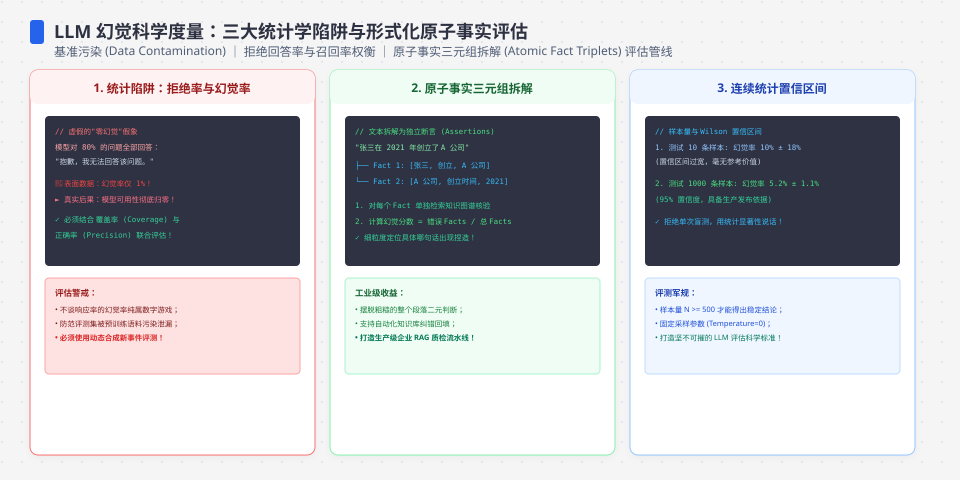
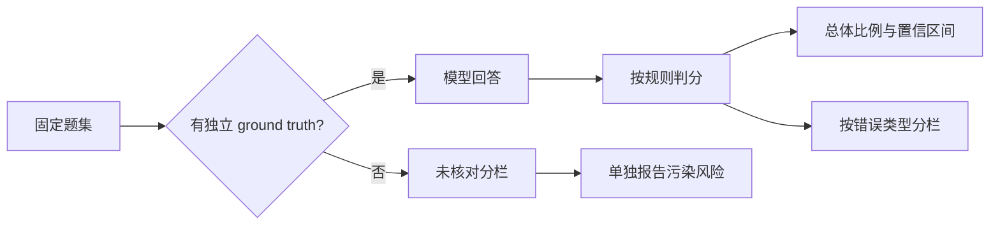
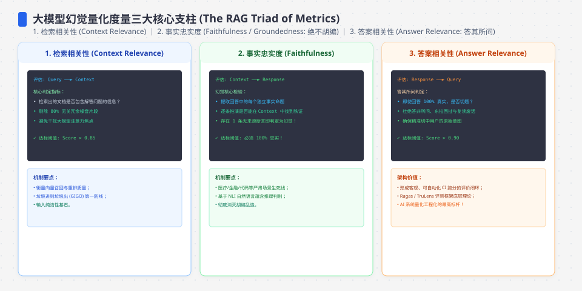
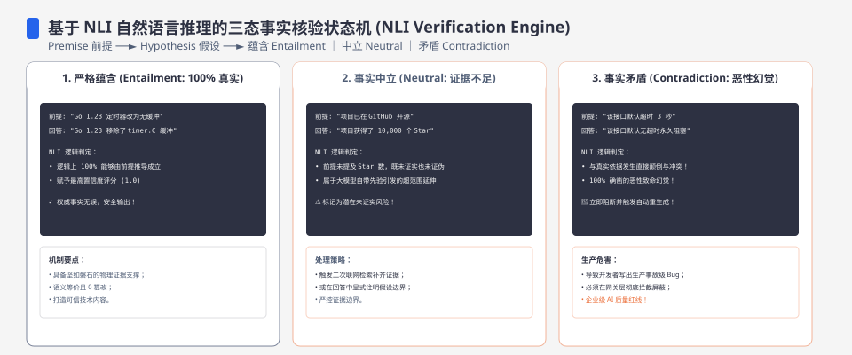

**TL;DR：** 幻觉率是可以测量的，但三个统计陷阱会毁掉你的数字：① **样本量决定误差**——在真实幻觉率 15% 的确定性模拟中，10 道题的 1σ 散布约为 ±10 个百分点，100 道题约为 ±3 个百分点；这不是 95% 置信区间，若要把 95% 区间压到约 ±3pp，粗略需要 550 道可判定题；② **不可判定题决定偏差**——在“不可判定题随机猜错率 50%”的模型中，10% 的不可判定题会把 10% 的真实幻觉率污染到约 14%，不是 19%；③ **分栏统计决定信号**——闭卷事实、虚构引用、推理和计算错误的修复路径不同，一个总幻觉率数字无法指导动作。评测幻觉率的正确姿势：可判定题集 + 明确区分 1σ 与置信区间 + 分栏报告。

---

## 一、 先定义：幻觉率的测量对象是"可判定题"

幻觉率不是玄学，是条件概率：`P(回答错误 | 答案可判定)`。这里的关键词是**可判定**——题目必须有独立于模型的 ground truth。

先看两个反例：
- "预测 2027 年 X 公司的营收" —— 不可判定，没人知道未来。模型答什么都无法验证，评测时只能计入"无法核对"，不计入幻觉。
- "这篇文档里有没有提到 Y？引用的原文是什么？" —— 可判定，答案可以从源头核对。

评测幻觉率的第一步永远是**筛选可判定题**。这个动作决定了你后面所有统计的合法性。

把它写成评测合同，至少要固定四个字段：

| 字段 | 合同 | 不能接受的做法 |
| --- | --- | --- |
| `verifiable` | 评测前由独立标注者确认，存在可访问的 ground truth | 运行后看到答案无法核对，才临时把样本删掉 |
| `truth` | 事实、引用或计算结果可以追溯到来源 | 把模型自己的解释当作 ground truth |
| `scoring` | 先定义什么算错、部分正确和拒答 | 不同批次由评测者临场决定 |
| `report` | 同时报告分母、未核对数和错误类型 | 只发布一个没有分母的百分比 |

这不是表格设计问题，而是测量对象的边界。一个最小的评测管线应该先分流，再计分：

## 二、 陷阱一：样本量决定误差，与模型强弱无关

模拟数据（`experiments/llm-hallucination-measurable/measure.mjs`，Node v24.19.0，本机 2026-08-17，固定 LCG 随机源）：一个真实幻觉率 15% 的模型，用不同规模的题集评测 100 次，看评测值的散布。表中的 `±` 是 100 次估计的总体标准差（1σ），不是“真实比例落在这里”的 95% 置信区间：

| 题数 | 评测幻觉率均值 | 标准差（±） |
| --- | --- | --- |
| 10 | 0.138 | ±0.111 |
| 30 | 0.150 | ±0.064 |
| 100 | 0.167 | ±0.037 |
| 300 | 0.153 | ±0.021 |
| 1000 | 0.151 | ±0.013 |

两个直接推论：

1. **10 道题测出的 15% 左右幻觉率只代表一次高噪声抽样**——1σ 已经约 ±10pp，不能把一次观测写成 5%-25% 的确定区间。样本少时应使用 Wilson 或 exact binomial interval，而不是把 `p ± sd` 当作置信区间。
2. **误差按 √n 收缩**：100 题的模拟散布约 ±3.6pp，1000 题约 ±1.2pp。如果评测的目的是“比较两个模型的幻觉率高低”，两组各 100 道、真实比例约 15% 时，差值的标准误仍约为 5pp；想分辨 5pp 改善，样本量明显不够。

对于比例估计，粗略标准误是 `SE ≈ √(p(1-p)/n)`。以 `p=0.15`、95% 区间半宽 `m=0.03` 估算，`n ≈ p(1-p)(1.96/m)^2 ≈ 544`。这只是独立同分布、判分无误差的起点；题目难度分层、重复题、标注者不一致和模型版本漂移都会增加所需样本量。正式报告应使用 Wilson 或 exact binomial interval，并把题目分层后的分母写出来。

## 三、 陷阱二：不可判定题的污染是按比例放大的

评测集里混入不可判定题会怎样？模拟：真实幻觉率 10% 的模型，评测集里不可判定题占比 u 从 0 到 60%，朴素评测（把一切错误都算幻觉）：

| 不可判定题占比 | 朴素评测幻觉率 | 真实幻觉率 | 污染 |
| --- | --- | --- | --- |
| 0% | 0.102 | 0.10 | 0pp |
| 10% | 0.146 | 0.10 | +5pp |
| 30% | 0.226 | 0.10 | +13pp |
| 60% | 0.341 | 0.10 | +24pp |

在这个模拟模型中，污染近似线性：`E[朴素评测率] = (1-u)r + u×0.5 = r + u(0.5-r)`。当 `r=0.10` 时，每增加 10pp 不可判定题，期望值增加约 4pp；随机抽样会让实际输出上下浮动。原因是不可判定题的错误率≈50%（模型在无 ground truth 的问题上“猜”），而可判定题只有 10%。**评测集里混 30% 的“预测类/开放类”问题，你的“幻觉率”从 10% 跳到 22%——然后你开始“修幻觉”，其实修的是统计污染。**

工程含义：评测集要有"可判定性标注"字段，评测脚本只对可判定题计算幻觉率，其余题单独报告为"未核对"。

## 四、 陷阱三：总幻觉率是没信号的，分栏才有

同一个幻觉标签下其实是四个不同的故障：

| 幻觉类型 | 模拟真实误率 | 评测误率 |
| --- | --- | --- |
| 闭卷事实错误（知识缺失/过期） | 0.40 | 0.40 |
| 虚构引用（编造不存在的来源/文档） | 0.20 | 0.16 |
| 推理错误（逻辑链断裂） | 0.10 | 0.09 |
| 计算错误（数值算错） | 0.30 | 0.28 |

一个"总体幻觉率 25%"的数字无法指导任何修复——四个故障的修复手段完全不同：闭卷事实错 → 补知识/检索增强；虚构引用 → 强制来源格式校验；推理错 → 加思维链/验证步骤；计算错 → 改调工具计算器。**评测报告必须分栏输出，按类型给幻觉率，否则你只是在测"模型整体有多不可靠"，而不是在修产品。**

## 五、从数字到动作：把评测接到发布门槛

评测不是为了产出一个漂亮的百分比，而是为了在模型、prompt、检索器或工具链变化时做决定。每条门槛都要绑定分母和动作：

| 目标 | 最小报告 | 失败动作 |
| --- | --- | --- |
| 判断总体是否回归 | 可判定题数、错误数、Wilson 95% 区间 | 区间重叠且差异小于预设最小效果量时，阻断“模型变好”的结论 |
| 判断检索是否减少事实错 | 事实类子集的同一题集、同一分母、引用可核对率 | 只看总体幻觉率时不发布检索收益 |
| 判断工具是否减少计算错 | 计算类子集、成功调用率、调用后正确率 | 工具调用失败、超时和拒答单独计入，不把缺失样本删除 |
| 判断 prompt 是否改变风险 | 按错误类型和题目难度分层的 paired 对照 | 题集、模型版本或采样参数改变时，标记为不可比 |

“上线前做到 300–500 题”只能作为资源规划的经验起点，不能替代样本量计算。若实际评测只拿到 80 个可判定样本，就应该在报告里写清楚，而不是把未核对题补进分母让数字看起来稳定。

## 六、结论：幻觉率是评测合同，不是模型标签

- 建**可判定题集**：每道题带 ground truth、来源、可判定性和判分规则；预测类/开放类题目单独分组。
- 定**统计口径**：区分 1σ、95% 区间和最小可检测差异；每次报告都列出可判定分母、未核对数和拒答数。
- 输出**分栏报告**：按“闭卷事实/虚构引用/推理/计算”给四条曲线，每次模型升级都对比同一题集和同一采样合同。
- 把**失败动作写进 CI**：样本不足、置信区间过宽、错误类型回归或引用不可核对时，阻断发布并保留 raw 输出。

下一步：把 Agent 的常见失败语料按四类幻觉打标签，先建一批有来源的可判定题；用 Wilson 区间和固定题集建立基线，再把模型、prompt、采样参数、评测器版本和 raw 输出一起挂进 CI。只有这样，“幻觉率下降”才是可复核的变更，而不是一次随机抽样后的故事。

---

## 七、参考资料

1. [FActScore: Fine-grained Atomic Evaluation of Factual Precision in Long Form Text](https://arxiv.org/abs/2305.14251)：将长文本拆成原子事实，并按可靠来源核对支持率；本文的“可判定题”和事实分栏借鉴其测量思路，但本文模拟不等同于 FActScore。
2. [NIST/SEMATECH e-Handbook：Confidence intervals for proportions](https://www.itl.nist.gov/div898/handbook/prc/section2/prc241.htm)：比例数据的 Wilson 与 exact binomial 区间；小样本不能把对称的 `p ± sd` 当成置信区间。
3. 本文实验：`experiments/llm-hallucination-measurable/measure.mjs`；运行快照：`evidence/llm-hallucination-measurable/2026-08-17-local/`。实验是确定性启发式模拟，只验证统计关系和报告管线，不代表任何真实模型的幻觉率。
