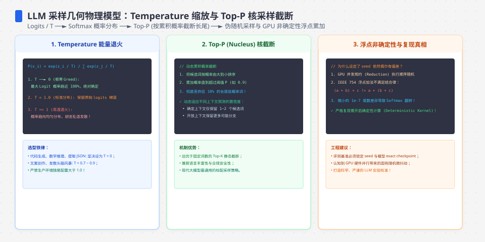
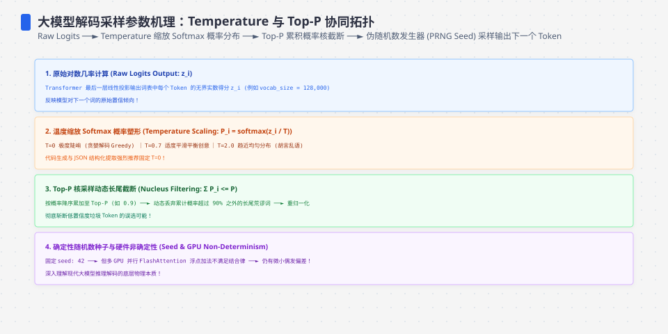
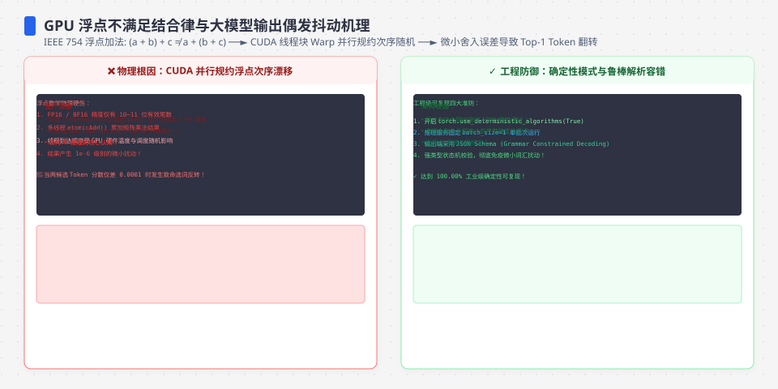

**TL;DR：** 三个参数各有不同责任：temperature 在采样前缩放 logits，top-p 从累计概率前缀裁剪候选，seed 只初始化采样器 RNG。固定 50 个 logits 的本地模拟中，T=0 走本文实现定义的 argmax，p=0.9 保留 28/50 个 token，同 seed 得到同一随机序列；这些数字只证明数学模型和本地 RNG。真实 API 即使复用 seed，也可能因为模型/权重、tokenizer、system prompt、工具 schema、硬件和服务端配置变化而不同。**可复现性是一个带版本和容忍度的工程合同，不是 seed 一列。**


---



## 一、 temperature 是 logits 的除法，不是"创造力度"

模型每步输出一个 logits 向量（词表大小的实数），softmax 把它变成概率分布，然后采样。temperature 插在中间：`logits / T`。

模拟一个 50 token 的词表、最优 token 3.2、次优 2.8（`experiments/llm-sampling-reproducibility/sampling_math.py`，workspace Python、NumPy 2.3.5，本机 2026-08-16）：

| T | P(token0) | P(token1) | P(token2) |
| --- | --- | --- | --- |
| 0.5 | 0.577 | 0.259 | 0.019 |
| 1.0 | 0.225 | 0.151 | 0.041 |
| 2.0 | 0.081 | 0.066 | 0.035 |

T 越小分布越尖锐（最优 token 概率从 22.5% 冲高到 57.7%），T 越大越平坦（三个 token 都快均分）。元信息：**T=0 时 `logits/0` 无定义，没有“极小概率”的通用 API 语义。本文脚本显式把它定义为 argmax 分支，RNG 不触发。** 因此在这份模拟里，“温度 0”和“温度 0.1”是两种路径；真实供应商如何解释边界值、是否接受该参数，必须以目标 API 文档和请求 raw 为准。即使 argmax 没有采样噪声，模型版本或 logits 本身变化仍会改变结果。




## 二、 top-p 是核采样：截掉长尾，重归一化

softmax 之后,概率分布有个长尾：少数 token 占大部分概率质量,其余几千个 token 分享残羹。top-p 的做法：把 token 按概率降序排,取累积概率刚超过 p 的最小前缀,把前缀以外的概率划零、剩余部分重归一化。

实测（同一 logits）：

| p | 保留 token 数 / 50 | token0 占比（重归一化后） |
| --- | --- | --- |
| 0.9 | 28 | 0.248 |
| 0.95 | 36 | 0.236 |
| 1.0 | 50 | 0.225 |

三点工程含义：**① top-p 是过滤器不是简单缩放器**——它先改变候选集合，再对保留概率重归一化；为了让实验归因清晰，本模拟一次只改变一个参数，不把“temperature + top-p 同时变化”的结果归因给任何一个参数；**② p=0.9 砍掉 44% 候选只属于这组 50-token logits**，真实词表的候选数量会随分布变化；**③ 重归一化把头部概率抬起来**（0.225→0.248），但它不保证语义质量或事实性。

## 三、 seed：它锁的是什么，不锁什么

seed 是伪随机数生成器的初始状态。同一分布 + 同一 seed → 同一随机序列 → 同一次采样选择：

```
seed=42 ×2 → 序列完全一致 [27, 2, 38, 17, 0, 48, 25, 27]
seed=7      → [13, 40, 27, 1, 1, 39, 0, 31]（不同）
```

但把"同 seed 同输出"当成绝对确定性是危险的。OpenAI 官方文档原文是"mostly deterministic"，并给出两个打破因素：

1. **GPU 浮点的不可结合性**：logits 是并行归约出来的,浮点加法不满足结合律,执行序微差 → logits 尾位抖动 → 两个接近的候选在 argmax 时可能翻转。这是 T>0 和 T=0 都存在的:贪心路径上被翻转的是"谁拿第一"。
2. **system_fingerprint 变化**：官方把它定义为"模型配置的指纹",内部横滚更新会改变输出分布——即使 seed 相同。**可复现性断了不是 bug,是模型在变。**

两个工程推论：同 seed 同参数的两次调用只能在服务端仍使用等价配置时作为复现线索；跨天、跨发布的测试不能只依赖 seed。还要锁定**输入快照、system prompt、工具 schema、模型版本、tokenizer、采样参数、fingerprint（若供应商提供）和允许的差异容忍度**。




## 四、 可复现测试要锁定输入与执行环境

| 记录项 | 为什么影响结果 | 最低保存内容 |
| --- | --- | --- |
| 模型与服务版本 | 权重、路由或 tokenizer 变化会改变 logits | model id、revision、区域/服务版本 |
| 输入上下文 | 一个空格、系统提示或工具 schema 都会改变分布 | 完整 messages、工具定义、结构化输出约束 |
| 采样参数 | 改变概率分布或候选集合 | temperature、top-p/top-k、seed、max tokens |
| 执行 fingerprint | 服务端更新可能不随 model id 变化 | system fingerprint、请求时间、响应 headers（若有） |
| 验收规则 | 文本不一定需要字面相同 | exact match、结构化字段、数值误差或语义评测阈值 |

因此应把测试分成三层：本脚本的数学回归测试可以要求 exact match；供应商 API 测试应保存 request/response 与版本元数据，并允许文档声明的差异；生产质量评测还要测事实性、工具副作用和人工/规则校准，不能把 seed 相等当成质量保证。

## 五、 结论：seed 只锁一段随机数，不锁整个模型

- T 是分布形状,top-p 是候选集,seed 是 RNG 种子——三个独立维度。为了让实验可归因，一次只改变一个采样参数；真实服务是否建议同时配置或限制某个参数，以目标 provider 文档为准。
- 结构化输出场景可以在目标 API 支持时选择贪心/低温度解码并叠加 schema 约束，但 schema 只保证形状，不能保证字段语义、权限或副作用安全；T=0 也不自动等于跨版本确定。
- 要复现测试,记录 `temperature + top_p + seed + model + system_fingerprint` 五元组,而不是只记 seed。
- 给定同一组 logits，采样参数的数学变换与模型无关；但 logits 如何产生、token 如何切分和服务端如何执行都属于模型系统合同，不能由本地向量模拟代替。

下一步：给 Agent 的每次调用保存完整复现记录，而不是只落一个“采样五元组”。下次“上次一样的输入怎么输出不一样”的排查，先比较输入、工具 schema、模型版本和 fingerprint，再判断是允许漂移还是合同被破坏。

## 参考资料

1. OpenAI Cookbook：How to make your completions outputs consistent with the new seed parameter（seed、mostly deterministic 与 system fingerprint，2026-08-16 核对）：https://cookbook.openai.com/examples/reproducible_outputs_with_the_seed_parameter
2. Microsoft Learn：Azure OpenAI 参数说明（temperature、top_p 与核采样边界）：https://learn.microsoft.com/en-us/azure/ai-services/openai/reference
3. 纯数学模拟：`experiments/llm-sampling-reproducibility/sampling_math.py`；本机原始输出与环境快照：`evidence/llm-sampling-reproducibility/2026-08-16-local/`。
