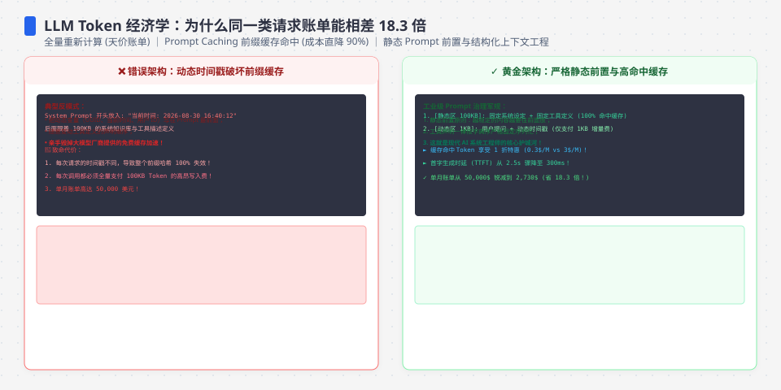
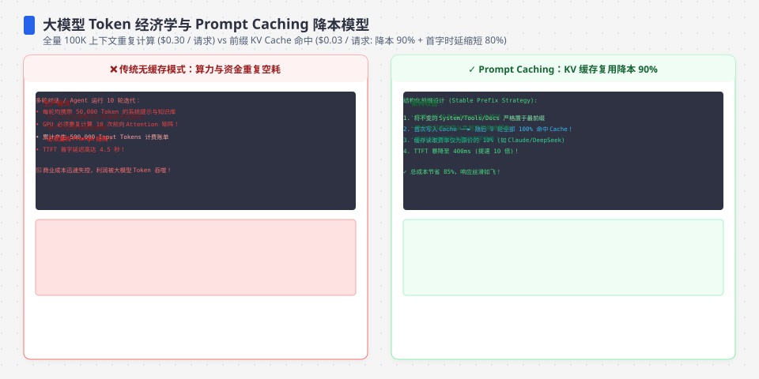
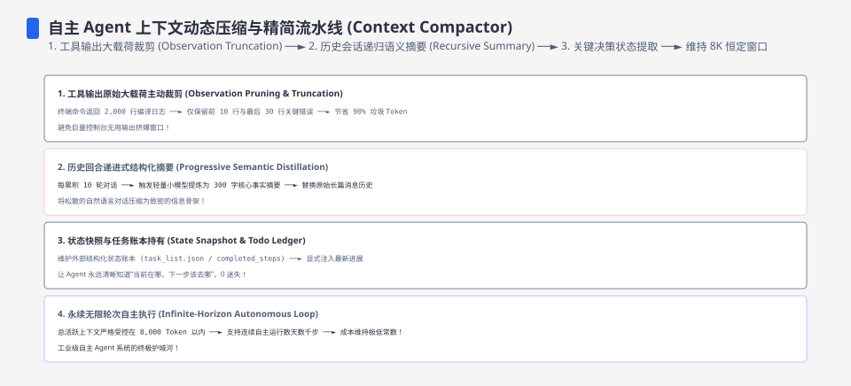

**TL;DR：** token 是 LLM 计费和上下文窗口的基本单位，不是字符也不是词。本实验固定 `o200k_base`，五个样本得到中文 47 字→32 token、英文 137 字符→29 token、代码 197 字符→52 token；这些是样本，不是语言的固定换算率。2026-08-16 核对的 GPT-4.1 价格快照是输入/缓存命中/输出 **$2.00/$0.50/$8.00 每百万 token**。在每天 1 万次、每次输出 300 token 的客服模型中，40 token 裸 prompt 月成本为 **$744**；系统提示 + 2K 文档且 90% 稳定前缀命中时为 **$1,427**；总输入增至 21,540 token 后为 **$4,936**；同一脚本的完全不缓存对照为 **$13,644**，相对裸 prompt 是 **18.3 倍**。缓存命中 token 不是免费 token，必须按缓存价单独计费。

---

## 一、 token 不是字符：先实测，再谈钱

所有关于 LLM 账单的讨论都从一个反直觉的事实开始：**计费单位既不是字符也不是单词**。模型服务会用与模型绑定的 tokenizer 把文本切成 token id，具体编码、词表和计费口径要按目标模型核对。本实验固定 OpenAI 官方 `tiktoken` 的 `o200k_base`，不把这个编码名称外推到所有模型。

我用 OpenAI 官方开源的 tiktoken 分词器（`o200k_base`）在本机实测五类文本，`experiments/llm-token-economics/measure.mjs` 可复现：

| 文本类型 | 字符数 | token 数 | 字符/token |
| :--- | ---: | ---: | ---: |
| 中文一句话（47 字） | 47 | 32 | 1.5 |
| 英文一句话（137 字符） | 137 | 29 | 4.7 |
| TypeScript 代码（19 行） | 197 | 52 | 3.8 |
| JSON 对象（99 字符） | 99 | 38 | 2.6 |
| 中英混排（64 字符） | 64 | 37 | 1.7 |

再做一次精确测量：一段 141 字的中文段落切成 100 个 token。这个样本可以帮助估算输入规模，但不能推出“中文永远 1 字 = 1 token”，也不能把 100 万 token 直接换算成某本小说的可用容量；模型上下文还受消息格式、工具定义、输出预留和语义信息密度影响。

在相同 tokenizer、版本和输入字节下，编码是确定的：同一文本调用 3 次，token 数都是 32、id 序列完全一致。这保证了**给定编码下的 token 计算可以离线复现**；它不保证不同模型或未来 tokenizer 仍然得到同一个数量。

## 二、 价格快照：输入、输出与缓存为什么要分开计量

2026-08-16 核对的官方价格快照，单位：美元/百万 token；价格会变，本文成本模型只使用 GPT-4.1 这一行，其他行用于说明不同供应商的缓存价差：

| 模型 | 输入 | cached 输入 | 输出 | 上下文/备注 |
| --- | --- | --- | --- | --- |
| GPT-4.1（OpenAI） | $2.00 | $0.50（75% off） | $8.00 | 1,047,576 context window |
| Claude Sonnet 4.6（Anthropic） | $3.00 | $0.30（10%） | $15.00 | 另有 5m/1h cache write 价格 |
| Claude Opus 4.6（Anthropic） | $5.00 | $0.50（10%） | $25.00 | 另有 5m/1h cache write 价格 |
| Claude Haiku 4.5（Anthropic） | $1.00 | $0.10（10%） | $5.00 | 模型/平台需单独核对 |

两个结构性问题，比具体数字更重要：

**输出常常更贵有计算上的原因，但价格仍是供应商的定价决策。** 输入通常可以批量完成预填充（prefill），输出则按自回归步骤逐 token 生成，并持续使用 KV cache；在未启用 speculative decoding 等优化的简化模型里，生成 1000 个 token 约对应 1000 个解码步骤。它解释了输出侧的成本与延迟压力，但不能从物理过程直接推出任何供应商的固定倍率。

**缓存的语义是"读折扣"，不是"免费"。** 缓存写、缓存读的价格、TTL、最小可缓存长度和失效条件都由供应商与模型决定；本次 OpenAI 快照中的 cached input 为普通输入的 1/4。设计含义是：**稳定前缀（系统提示、工具定义、文档上下文）可以被设计成可缓存，但最终成本必须用实际命中率、TTL 和账单字段核对。**

## 三、 成本账本：同一条业务请求，prompt 结构决定账单数量级

数字必须绑定假设。我用 2026-08-16 核对的 GPT-4.1 价格快照（输入 $2/M、输出 $8/M、缓存命中 $0.5/M）建了一个客服 Agent 的成本模型（`experiments/llm-token-economics/cost-model.mjs`，可复现）：

> 场景：客服 Agent，30 天 × 每天 1 万次请求，每次输出固定 300 token，输入分五种结构。

| prompt 结构 | 输入总量/次 | 未缓存/次 | 缓存/次 | 缓存命中 | 月成本 |
| :--- | ---: | ---: | ---: | ---: | ---: |
| 裸调用（40 token） | 40 | 40 | 0 | 0% | $744 |
| 加 1500 token 系统提示，不缓存 | 1,540 | 1,540 | 0 | 0% | $1,644 |
| 系统提示 + 2K RAG 文档，不缓存 | 3,540 | 3,540 | 0 | 0% | $2,844 |
| 同上，启用缓存（90% 命中） | 3,540 | 390 | 3,150 | 90% | $1,427 |
| 系统提示 + 20K 文档，启用缓存 | 21,540 | 2,190 | 19,350 | 90% | $4,936 |

三个直接结论：

1. **输入 token 体量是本场景的主要变量**：在脚本的“全部按普通输入计费”对照中，输入从 40 增到 20,000 token/次，月账单从 $744 到 $12,720，约 17.1 倍；这组对照使用的是精确 20K 输入，不是表格中“1,500 系统提示 + 20K 文档”的 21,540 token，也不能与其 $13,644 的完全不缓存成本混用。
2. **缓存让同样结构省约 50%**：系统提示 + 2K 文档从 $2,844 降到 $1,427；计算把 390 个未缓存 token 按 $2/M、3,150 个缓存命中 token 按 $0.5/M 计费。
3. **RAG 文档体积仍是隐藏成本**：在 90% 稳定前缀命中下，2K 文档到 20K 文档使月账单从 $1,427 增至 $4,936，约 3.5 倍；每增加 1K 稳定且 90% 命中的 token，按当前请求量约增加 $195/月，若完全不缓存则约增加 $600/月。

输出侧同样放大：输入恒 2K 时，输出 100 → 1000 token/次，$1,440 → $3,600（2.5 倍）。生成型任务（写文章、总结）的账单几乎由输出长度决定。

## 四、 窗口不是内存：满了之后发生什么

上下文窗口 1M token 听上去很大，但它不是可直接换算成“能装几本书”的内存容量；你的 Agent 每轮对话仍可能重新消费历史：

- **很多 API 请求模型没有服务端会话态**：每轮请求都可能要把历史上下文重新发一遍（除非命中缓存或使用供应商状态能力）。一轮 10 次工具调用的 agent 走完，输入 token 可能接近各轮输入之和，而不是自动复用。
- **满了没有统一的"溢出"语义**：超窗可能被拒绝，具体错误码和字段由供应商决定。工程上的三种应对——**截断**（丢最早历史）、**压缩**（摘要替代原文，信息可能丢失）、**外挂检索**（只带相关片段进窗口，依赖检索质量）——本质都是在"遗忘程度"和"成本"之间选点。
- **缓存 TTL 让结构失效**：供应商会为缓存设置 TTL、最小长度和失效策略；如果 agent 每轮间隔超过目标 TTL，命中率可能下降，账单回到更高的输入价。具体时间和分段规则要按当前供应商文档与账单字段核对——**缓存的敌人不是冷启动，而是未测量的慢会话**。

## 五、结论：输入 token 体量必须用真实 prompt 重算

- 在本文固定请求量、输出长度和 GPT-4.1 价格快照的模型中，输入 token 体量是主要变量：21,540 token 的 20K 文档场景是 $4,936/月；完全不缓存时则是 $13,644/月，缓存语义会改变结论的分母。
- 缓存的正确姿势是**把稳定前缀放前面并标记可缓存**，同时监控缓存命中率——它是 prompt 结构健康度的仪表盘。
- 中文、英文、代码和 JSON 的 token 密度都会随文本而变；本文样本不能给出一个跨语言百分比。预算规划应对真实 prompt 逐条 tokenize，不能按字数直接换算。

下一步可执行的事：用与目标模型匹配的 tokenizer 给现有 prompt 做一次离线审计，算出"系统提示 + 文档上下文"占输入的百分比；如果稳定前缀占比高，再以真实 TTL、命中率和账单字段评估缓存。算完账再比较 embedding 检索是否真的减少了输入 token，而不是只把成本移到检索服务。

## 参考资料

1. OpenAI GPT-4.1 官方模型页（输入、cached input、输出与 1,047,576 context window，核对日期 2026-08-16）：https://developers.openai.com/api/docs/models/gpt-4.1
2. Anthropic Claude API 官方定价页（base input、cache write、cache hit/read 与 output，核对日期 2026-08-16）：https://platform.claude.com/docs/en/about-claude/pricing
3. OpenAI tiktoken 官方仓库与 o200k_base 实验：`experiments/llm-token-economics/measure.mjs`；本机原始输出应与该脚本一并保存。
4. 成本模型入口：`experiments/llm-token-economics/cost-model.mjs`；模型假设是 30 天、每天 10,000 请求、每次输出 300 token，稳定前缀按命中率拆成普通输入与缓存命中输入。
5. 本机复现记录：`evidence/llm-token-economics/2026-08-16-local/`，包括环境、tokenizer 原始输出与成本模型原始输出；价格会随供应商调整，正文数字绑定到本次核对日期。
