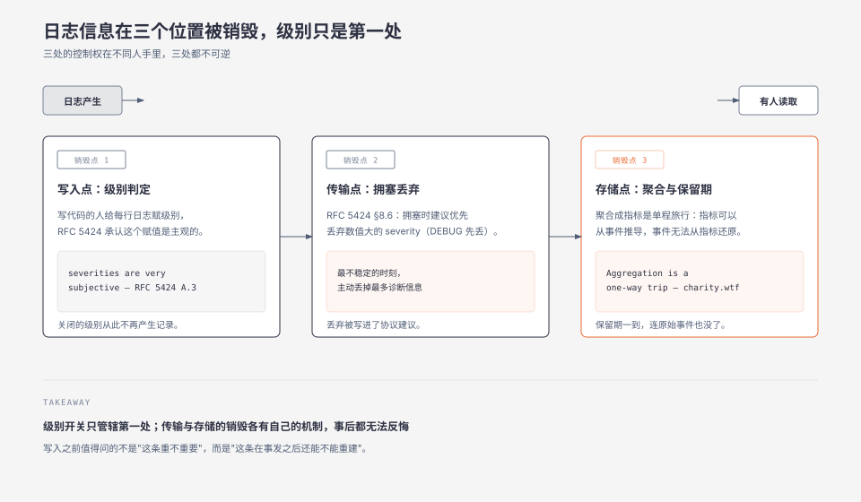
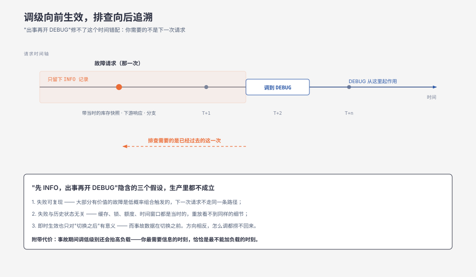
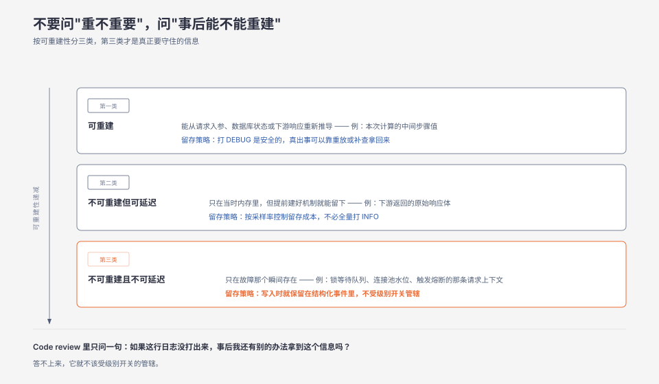

**TL;DR：** 日志级别不是日志的属性，是在**写入时刻**做出的一次不可逆决定。RFC 5424 把 severity 的赋值权明确交给 originator，也就是写这行代码的人；同一份规范的附录 A.3 又承认："Because severities are very subjective, a relay or collector should not assume that all originators have the same definition of severity."决定权在信息量最少的一端，代价却落在信息需求最迫切的一端。而"出事之后调到 DEBUG"修不了这个错配——**它只能改变未来请求的行为，而你需要的是已经过去的那一个请求的细节**。真正可控的不是级别，是写入之前先问一句：这条信息在事发之后还能不能重建。

## 一、调到 DEBUG 之后，什么也没捞回来

一笔支付在周三下午失败了，用户投诉，客服转过来一个订单号。值班的人第一反应是把日志级别从 INFO 调到 DEBUG，等下一次复现。

问题是：下一次请求不是那一次请求。它不带那次的库存快照、不带那次的下游响应、不带那次的链路分支。如果那个失败是由某个特定组合触发的——特定商户、特定金额区间、恰好撞上一次缓存过期——那么新开的 DEBUG 会老老实实记录一堆成功请求，然后在一周后因为磁盘占用被调回 INFO。

真正被销毁的不是"日志不够详细"，而是**那一个已经过去的请求的完整状态**。级别调整是向前生效的开关，事故排查是向后追溯的动作，两者的时间方向相反。

> 场景说明：上面这个支付场景是复合示例，把多起"开了 DEBUG 还是查不出来"的排查经历合成了一个。它用来定位机制，不对应任何一次具体事故，文中也不含实测数字。

## 二、最强反例：全量打 DEBUG 不现实，分级是必要的

先处理一个合理的反对意见：既然 DEBUG 有信息价值，那就全量开 DEBUG，全都存下来。省掉分级这件事本身，也就没有销毁。

这条路在规模面前走不通。RFC 5424 的 severity 分级之所以存在，正是因为**信息的产生速率远大于它的消费速率**。一份全量 DEBUG 日志在业务高峰时的体量，通常是 INFO 的一个到两个数量级以上，而其中真正被读取的比例极低——绝大多数 DEBUG 行从写出到过期，没有任何人、任何查询碰过它。

所以分级本身不是问题。问题在于**决定在哪一刻做出、由谁做出、以及做出之后能不能反悔**。答案是：在写入时刻、由写代码的人做出、并且不能反悔。这三件事叠在一起，才让一个本来合理的成本控制手段变成了单向的信息销毁。

## 三、销毁发生在三个位置，级别只是第一个

把一次日志从"产生"到"被读到"拆成时间轴，会发现信息在三个不同位置被丢弃，而且三处的控制权在不同人手里。

### 3.1 写入点：级别由 originator 赋值，而标准承认它是主观的

RFC 5424 §6.2.1 定义了八个 severity 等级（0 Emergency 到 7 Debug），并规定"Severity values MUST be in the range of 0 to 7 inclusive"——数值范围是强制的。但同一段紧接着声明，这些 Facility 与 Severity 的名称和描述"are not normative but often used… for purely informational purposes"。**数值是规范，语义不是。**

语义归谁？附录 A.3 说得很直接："All implementations should try to assign the most appropriate severity to their message"，并且"messages designed to enable debugging or testing of software should be assigned Severity 7"。赋值权在产生消息的实现，也就是写这行日志的人。

而同一段还留了一句真正的警告："Because severities are very subjective, a relay or collector should not assume that all originators have the same definition of severity."

这句话值得单独停一下。**标准自己承认 severity 是主观的，并且要求下游不要假定一致性。**换句话说，跨服务统一按级别过滤，从规范层面就缺乏语义基础——A 服务的 ERROR 和 B 服务的 ERROR 不保证是同一个严重程度。

### 3.2 传输点：拥塞时优先丢弃低 severity

RFC 5424 §8.6 的建议是：在拥塞情况下，"it is RECOMMENDED that the originator or relay drop messages of lower severity in favor of higher severity messages"。

这条让销毁被协议化了。注意它丢弃的是**数值大**的 severity（数值越小越严重），也就是 Debug 和 Informational 先被丢。于是出现一个讽刺的组合：系统最不稳定的时刻，正是它主动丢弃最多诊断信息的时刻。而系统最不稳定，恰恰是你最需要那些信息的时刻。

### 3.3 存储点：聚合是一次单程旅行

到存储层，销毁变成了聚合与保留期。Charity Majors 在《Live Your Best Life With Structured Events》里对这一步的表述最干脆：

> "Aggregation is a one-way trip. You can always, always derive your pretty metrics and dashboards and aggregates from structured events, and you can never go in reverse. Same for traces, same for logs."

她在同一篇里还给出了支持这条判断的成本论据：给事件加维度"is effectively free"，因为无论加多少维度，它仍然是"one write plus a few more bits"；而指标每加一个 tag 都会线性推高写放大。所以从成本角度看，先丢后补是不划算的——丢的时候省下的钱，远少于事后补不回来的代价。



### 3.4 一个容易被忽略的中间层：级别关闭时，参数照样求值

还有一个机制层的细节，会让"用级别省开销"这个直觉落空。以 Go 标准库的 `log/slog` 为例，`Debug` 与内部 `log` 的写法是：

```go
func (l *Logger) Debug(msg string, args ...any) {
	l.log(context.Background(), LevelDebug, msg, args...)
}

func (l *Logger) log(ctx context.Context, level Level, msg string, args ...any) {
	if ctx == nil {
		ctx = context.Background()
	}
	if !l.Enabled(ctx, level) {
		return
	}
	// 之后才构造 Record、Add args、调用 Handler.Handle
}
```

关键在于 `args ...any` 是 `...any`，它在 `Debug` 的**调用点**就已经完成求值，而 `!l.Enabled` 的提前返回发生在 `log` 内部。也就是说，写 `logger.Debug("dump", "payload", serialize(bigStruct))` 时，即使 DEBUG 级别处于关闭状态，`serialize(bigStruct)` 也已经被执行了。级别开关省掉的是 Record 构造和 Handler 调用，不是参数构造。

所以"关掉 DEBUG 就没有开销"这个假设在 slog 这类 API 上并不成立：**你付了构造成本，却没拿到信息。**要真正跳过昂贵参数，得在调用前自己判断：

```go
if logger.Enabled(ctx, slog.LevelDebug) {
	logger.DebugContext(ctx, "dump", "payload", serialize(bigStruct))
}
```

这个细节本身不构成灾难，但它暴露了一个更普遍的模式：级别过滤发生的时机比你以为的更靠后，而它的成本比你以为的更高。

## 四、为什么「先 INFO，出事开 DEBUG」是时间错配

把上面几节合起来看，"先打 INFO，出事再开 DEBUG"这个策略的问题就清楚了。它假设三件事：

1. 失败是可复现的——同一个请求再来一次，会走同一条路径。
2. 失败与历史状态无关——重放一次就能看到同样的细节。
3. 级别切换是即时的——改完立刻对当前流量生效。

这三件事在生产里都不成立。大部分有价值的线上故障，要么是低概率组合触发（第 1 条失效），要么依赖当时的缓存、锁、额度或时间窗口状态（第 2 条失效），而级别切换即便即时生效，也只对切换之后的请求有意义（第 3 条本身成立，但方向错了——**即时生效改变的是未来，事故数据在過去**）。



更进一步，动态调级还有一个副作用容易被忽略：在事故期间把级别调低，会显著抬高系统负载、拉长 GC 或 flush 时间，而事故期间的系统往往已经处于饱和边缘。也就是说，**你最需要信息的时刻，恰恰是最不能加负载的时刻。**

## 五、按「可重建性」而不是「重要性」分级

既然级别是主观且不可逆的，换一个分级轴会更有效：不要问"这条日志重不重要"，问"**这条信息在事发之后还能不能重建**"。

按这个轴可以分出三类：

- **可重建**：能从请求入参、数据库状态或下游响应重新推导出来的信息。这类信息打 DEBUG 是安全的，因为真出事时可以通过重放或补查拿回来。例如"本次计算的中间步骤值"。
- **不可重建但可延迟**：只在当时存在于进程内存里的信息，但如果提前建好了机制就能留下来。例如下游返回的原始响应体——可以通过采样留存，不必全量打 INFO。
- **不可重建且不可延迟**：只在故障那个瞬间存在、事后无论如何都拿不到的信息。例如失败时的锁等待队列、当时的连接池水位、触发熔断的那条请求的完整上下文。**这类信息必须在写入时就保留**，因为级别关掉的那一刻它就永久消失了。

第三类才是真正需要认真对待的。对它的处理不是"记得打 WARN"，而是把它从"日志级别"这个机制里拿出来——它应该是一直写的结构化事件的一部分，或者是由采样策略控制留存率的数据，而不是由某个人在写代码时随口给定的级别。

判断方法也很直接：在 code review 里看到一条新的日志行，只问一句——**如果这行日志没打出来，事后我还有别的办法拿到这个信息吗？** 如果没有，它就不该受级别开关的管辖。



## 六、边界：什么时候这些讨论不重要

- **可完整重放的系统**：如果请求可以幂等重放、且外部依赖状态可回溯，那么"不可重建"这一类会大幅缩小，级别过滤的代价随之降低。
- **纯单机命令行工具与离线批处理**：日志的读者就是写它的人，且可以随手重跑，主观性带来的跨服务不一致问题不存在。
- **有强制留存要求的合规日志**：保留期与完整性由法规决定，级别不参与销毁决策，此时级别只影响可读性。
- **体量极小、DEBUG 全量也无所谓的服务**：分级省下的成本本来就不构成决策因素，讨论不可逆性的收益有限。

## 七、可执行的研究问题

- **验证动态调级对「已发生请求」的不可回溯性**。假设：在一次注入故障中，仅依赖 INFO 日志与事后开 DEBUG，无法还原失败请求的完整上下文；而在故障前就启用 DEBUG 的对照组可以。控制变量：故障类型（可复现 / 依赖历史状态）、调级延迟、采样率。观测指标：可还原字段比例、定位耗时、新增日志量。反例：若故障完全可复现且与历史状态无关，两组差异会消失。完成标准：给出"可还原字段比例"的量化对比。不可外推到可幂等重放的系统。

- **测量 Go `log/slog` 在级别关闭时构造参数的实际开销**。假设：`logger.Debug("m", "k", expensive())` 在 DEBUG 关闭时仍会执行 `expensive()`，其 CPU 与分配量与开启时相近，只有 Record 与 Handler 部分被省掉。控制变量：级别开关、参数构造成本、是否用 `Enabled` 前置判断、Handler 类型。观测指标：ns/op、B/op、allocs/op、GC 次数。反例：若参数构造极廉价，差异会淹没在噪声里。完成标准：给出开启/关闭两组的 ns/op 与 allocs/op 对比。不可外推到其他语言的日志库——它们的求值时机可能不同。

- **统计同一 severity 在不同服务间的语义一致性**。假设：把各服务标记为 ERROR 的日志按"是否触发值班响应"分类，会发现同一级别在不同服务间对应的实际严重程度差异显著。控制变量：服务、时间段、值班规则。观测指标：各服务 ERROR 日志中真正需要人工介入的比例、分布区间。反例：若团队已有严格的日志级别规范并做了 review，差异可能不显著。完成标准：给出各服务该比例的区间与极差。不可外推到没有统一值班流程的团队。

- **对照「按重要性分级」与「按可重建性分级」在事故复盘中的信息完整度**。假设：按可重建性设计的日志方案，在复盘时能还原的关键字段比例更高。控制变量：故障注入方式、日志预算、采样率。观测指标：可还原关键字段数、复盘耗时、日志存储成本。反例：若故障注入恰好只涉及可重建信息，两组差异不明显。完成标准：给出两种方案在相同存储预算下的信息完整度对比。不可外推到日志量不受成本约束的场景。

## 八、参考资料

- [RFC 5424: The Syslog Protocol](https://www.rfc-editor.org/rfc/rfc5424) —— §6.2.1 的 Table 2 定义 severity 0–7（数值范围 "MUST be in the range of 0 to 7 inclusive"，但名称与描述 "are not normative but often used… for purely informational purposes"）；附录 A.3 给出 severity 由实现自行赋值、调试类消息应归为 7，以及"severities are very subjective, a relay or collector should not assume that all originators have the same definition of severity"；§8.6 建议拥塞时优先丢弃低 severity 消息。
- Charity Majors, [Live Your Best Life With Structured Events](https://charity.wtf/2022/08/15/live-your-best-life-with-structured-events/)（charity.wtf, 2022-08-15）—— "Aggregation is a one-way trip… and you can never go in reverse. Same for traces, same for logs."，以及"adding more dimensions to your event is effectively free"的成本论据。
- [Go 标准库 `log/slog` 源码](https://github.com/golang/go/blob/master/src/log/slog/logger.go) —— 第三节 3.4 的依据：`Debug` 调用 `log`，而 `log` 内的 `if !l.Enabled(ctx, level) { return }` 位于参数求值之后，因此级别关闭时 `args` 已在调用点完成求值。核对日期 2026-09-01。
- [OpenTelemetry Sampling](https://opentelemetry.io/docs/concepts/sampling/) —— 用采样率而不是日志级别来控制留存成本，是第五节"不可重建但可延迟"那一类的可选实现路径。

### 延伸阅读

- [监控与取证是两个系统，不是一个](/writing/monitoring-vs-forensics) —— 取证数据的完整性要求与监控的成本模型冲突，本文讨论的销毁正发生在这个冲突里。
- [测一下，改一下：监控自己也是一种负载](/writing/observer-effect-monitoring-as-load) —— 第四节末"事故期间加观测会加重负载"的完整论证。

> 说明：本文的核心论点是机制性论证，不依赖任何一手的实测数字。第七节的四个问题都是待验证假设，不是已跑出的结论，不要当作性能基线引用。
