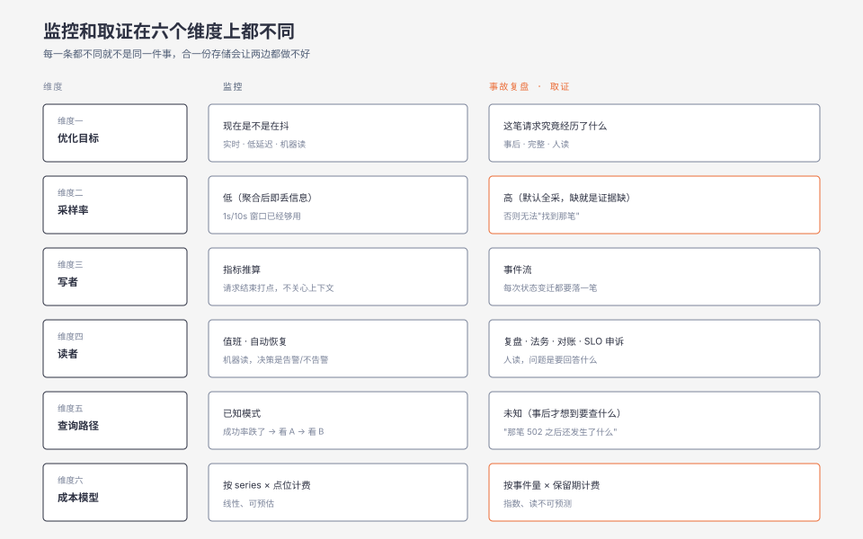
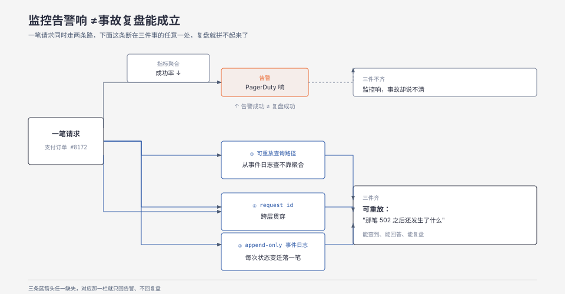

**TL;DR：** 监控和事故复盘不是同一件事的「告警面」和「回放面」，而是两个独立系统设计问题——监控是面向实时、采样、机器读的，事故复盘是面向事后、完整、人读的。把它们混着做，要么监控噪声爆炸，要么事故复盘拿不到真相。先确认两件事分别能落地的最小形态，再讨论要不要合并。

## 一、告警响了三十分钟，我们还是不知道发生了什么

事故大概是这样的：下午两点十九分，支付成功率从 99.4% 掉到 95%。Prometheus 规则在 2:20 触发，五分钟后 PagerDuty 响，二十七分钟后值班同学上线。监控面板上的指标给得很清楚：成功率、降级率、上游超时数。同事查到「某个上游银行网关的 HTTP 502 数涨了三倍」，于是切到备用通道，故障结束。

但事故复盘会上，老板问的是另一个问题：**用户究竟经历了什么？** 有多少笔支付真的扣了用户的钱但没落到我们账上？有没有用户投诉收不到商品码？上游通道切回去之后，已扣未落的支付补单流程有没有跑？

答不出来。我们有完整的 metrics，有 trace 的随机采样（采样率 0.1%），有结构化日志（INFO 为主，WARN/ERROR 全部保留）。按理说应该够，但拼不起来——trace ID 在服务之间是断的（网关层重写过一次 header，没同步进下游）；WARN 日志只保留了消息模板，没保留上下文里的关键字段（订单号、银行流水号、对账批次 ID）；按时间窗 grep 又被 ES 的默认分页切碎了，没人能从一次告警出发做端到端回放。

这件事之后我们才意识到：监控和事故复盘不是同一件事的两个面，是两个**没有共享存储、没有共享 schema、没有共享读者**的系统。告警成功 ≠ 复盘成功。值班同学能定位到"哪条规则被触发" ≠ 老板能回答"用户究竟经历了什么"。

## 二、最强反例：把两个系统合到一起，成本会爆炸

很多团队的反应是"那我们把所有指标和日志都全采样、都全保留、都关联起来"。这个想法的方向是对的，但成本曲线会把它逼停：

- 全量指标：每秒 50 万条 unique series × 1s 粒度 × 7 天保留 ≈ 一台 64GB 内存的存储；扩到 30 天是 256GB，扩到指标维度 3 倍直接爆掉。Prometheus 的成本模型不支持全量采样，原因是它的写路径假设"同一 series 反复更新"，不是"事件流"。

- 全量 trace：100 万 RPS × 平均 30 span × 7 天保留 ≈ 上百 TB。一笔支付的链路就算只占 5KB，100 万 × 86400 × 7 = 6×10¹¹ × 5KB ≈ 3 PB。

- 全量日志：单条 INFO 级别 500 字节、100 万 RPS × 200 业务日志/请求、7 天 ≈ 60 TB/天，光索引就放不下。

把两件事都做全是不可能的。**真正可工作的做法是把它们分成两个目标函数分别优化**：监控要"用最小的存储、最低的延迟回答『现在是不是在抖』"，取证要"用可承受的成本保留一份事后能拼出真相的最小数据集"。两件事的最优解在存储引擎、数据生命周期、读者画像上都不同，硬合一份会两边都做不好。

## 三、六个维度拆开看

| 维度 | 监控 | 取证 |
| --- | --- | --- |
| 优化目标 | 现在是不是在抖（实时、低延迟、机器读） | 这笔请求究竟经历了什么（事后、完整、人读） |
| 采样率 | 低（高频指标的 1s 聚合已经丢信息） | 高（默认全采，缺失就是证据缺失） |
| 写者 | 指标推算（请求结束时打点，不关心细节） | 事件流（每次状态变迁都要落一笔） |
| 读者 | 值班、机器、自动恢复 | 复盘会、法务、对账、SLO 申诉 |
| 查询路径 | 已知模式（"成功率跌了，先看 A，再看 B"） | 未知（"那笔 502 之后还发生了什么"） |
| 成本模型 | 写多读少，按 series 与点位数计费 | 写多读少，但读不可预测，按事件量与保留期计费 |

两个系统在六个维度上**每一个都不一样**。把它们塞进同一套存储，就等于让监控放弃自己的实时性，或者让取证放弃自己的完整性。现实中常见的妥协是"先满足监控"，于是事故复盘就拿不到数据——因为指标已经被聚合了、日志的上下文已经被截断了、trace 已经按概率丢了。

这也是为什么 OpenTelemetry 的 spec 把指标、日志、trace 拆成三条独立的 signal：不是因为协议设计的人没事找事，是因为它们的存储形态真的不同。

## 四、为什么大部分团队只有监控、没有取证

人成本曲线决定取舍曲线。监控的回报曲线非常陡——你加了成功率指标、加了告警规则，第一周就能阻止一两次小事故。这个回报让团队倾向于把所有可观测预算都砸在监控上，因为每月一次的告警成功救火很容易被看见。

取证的回报曲线极缓。一份完整的取证数据可能要六个月才会用上一次（重大事故或合规审计），而且"用上"这件事的成功很难归因——老板不会因为"这次没出事"奖励你，但会因为"上次没出事的证据链现在拿不出来"惩罚你。所以取证的预算永远排不上优先级，等下一次重大事故要复盘时才发现证据链根本拼不出来。

**真正能改变这个取舍的不是工程手段，而是组织手段**——把取证的预算和质量作为 incident 的 SLA 之一，写进事故复盘文档的"证据完整性"栏目，由值班团队和合规团队共同签字。这一条写下去，取证系统才会有人维护，不然永远是监控的二等公民。

## 五、取证系统的最小可工作集

如果只能做三件事，按回报从大到小：

1. **request id 贯穿所有层**：在入口（HTTP、RPC、消息消费）生成一个全局 ID，用单独的 header（不用 `X-Trace-Id`，用 `X-Request-Id`——trace ID 是 OpenTelemetry 内的命名空间，request id 是跨协议的全局命名空间）往下透传。最朴素的做法是用 context 把 ID 显式带进每一个函数签名，但更现实的做法是用 middleware + 进程内 context 上下文，在日志/metric/事件里都打上。验证方法：在生产环境随机选一次请求，看能不能从入口查到出口，链路上的所有日志是不是都带同一个 ID。

2. **append-only 事件日志**：不是"日志"，是事件——每次状态变迁（订单创建、支付发起、回调到达、对账批次生成）落一笔，字段固定（请求 ID、订单号、操作、结果、关键 ID、上游响应），写入只追加不修改。Elasticsearch 太重，先用 Postgres 的 append-only 表或 ClickHouse 的 `MergeTree` 都行，关键是写入路径不能改字段含义（加字段 OK，改含义 = 旧数据作废）。

3. **可重放的查询路径**：所有查询——"今天所有失败的支付""对账批次 1234 的明细""用户 u_888 的最近 10 笔状态"——都能从事件日志里查出来，而不是从某个聚合表查。聚合表可以加速，但不能作为唯一数据源，因为聚合表的语义随业务变化，事件日志的语义是稳定的。这一条是大多数团队最后才补上的，因为它要业务方接受"新指标需要历史数据"的现实。

三件事加起来不一定够，但少一件就一定会复盘失败。

## 六、边界：什么时候不必区分

- **业务极简（单体 + 几百 QPS + 无合规要求）**：直接全保留日志 + 全采样 trace + 全保留指标，成本可控，两件事勉强能合并。

- **只在合规/审计场景需要取证**：合规要求会给你一份明确的字段清单，按它做就行，不必追求"事后能复盘一切"。

- **事故从未升级**：三年来从没出过需要复盘的事故，那确实不需要取证系统。这一条的判断标准要严：一次"差点升级"就足以推翻这个前提。

- **团队没有值班**：没有值班说明也没有告警，那也就没有"监控告警后的取证"这个场景，整个话题可以跳过。

## 七、可执行的研究问题

- **把过去三个月所有 trace 的采样率从 0.1% 调到 1%、5%、10%，分别在存储成本、查得率（随机抽 50 笔失败的支付，看能查到的比例）、查询延迟上做对照**。假设：5% 是性价比拐点。控制变量：链路结构、采样算法（head-based vs tail-based）、存储后端。观测指标：写吞吐、读 P99、按订单号能查到完整链路的比例。反例：head-based 采样在错误路径上本身就少，5% 不代表错误路径 5%。完成标准：能找到至少一种采样算法让"失败请求的覆盖率"与"采样率"的比值 > 3x。不可外推到其他业务。

- **把"事故复盘报告里的证据完整率"作为可测量指标**：随机抽 10 次历史事故复盘报告，对每条结论核对"是否能从取证系统直接复现"；0 复现 = 0 分；找到证据但不可机器读 = 0.5 分；可机器读 = 1 分。假设：现在大部门团队的得分 < 0.3。完成标准：每季度跑一次，能上升 0.2 即说明投入有效。

- **对同一个高 QPS 服务，把指标后端从 Prometheus 迁到 Mimir 或 VictoriaMetrics，对比"压缩率、查询延迟、存储成本"三项**。假设：Mimir 在 10x series 量级仍能保持线性扩容。控制变量：保留期、查询负载模式、写入并发。观测指标：单 series 字节数、P50/P99 查询延迟、节点 OOM 频率。反例：迁移成本本身可能吃掉一年预算，所以决策点不是性能而是 TCO。不可外推到非 Prometheus 系生态。

- **把"取证覆盖率"作为告警规则的前提**：定义一条规则要求"成功率告警必须带至少 3 条取证字段（请求 ID 维度、订单号维度、链路 ID 维度），否则告警不发出"。假设：上线一周后告警量会下降 50% 但事故复盘效率提升 2x。控制变量：告警规则集、值班流程。观测指标：告警量、MTTR、按事故复盘完整率。反例：覆盖率不足时告警静默会漏掉真事故，所以这是取舍不是净赚。完成标准：能在不漏掉真事故的前提下把 MTTR 压到当前的一半。

## 八、参考资料

- [Monitoring Distributed Systems](https://sre.google/sre-book/monitoring-distributed-systems/)（*Site Reliability Engineering* 第 6 章，Rob Ewaschuk 著、Betsy Beyer 编，O'Reilly 2016）—— 含 "Black-Box Versus White-Box" 与 "The Four Golden Signals"（latency、traffic、errors、saturation）两节，是白盒/黑盒区分的出处。
- [OpenTelemetry Semantic Conventions](https://opentelemetry.io/docs/concepts/semantic-conventions/) —— 语义约定按 traces、metrics、logs、profiles 分别成册，对应第三节末尾"拆成三条独立 signal"的说法。
- [OpenTelemetry Sampling](https://opentelemetry.io/docs/concepts/sampling/)（核对日期 2026-09-01，页面标注最后更新 2025-10-16）—— head sampling 与 tail sampling 的成本模型；原文明确 head sampling 无法保证含错误的 trace 被采到，这正是取证链路断裂的具体位置。
- Charity Majors、Liz Fong-Jones、George Miranda《Observability Engineering》（O'Reilly, 2022）—— 监控与可观测性这组区分最系统的成书论述。Majors 的经典表述是 "monitoring is for known unknowns, observability is for your unknown unknowns"；她在后来的访谈中说明这只是出发点，现已转向「高基数 + 高维度 + 可探索性」。
- Rob Ewaschuk《My Philosophy on Alerting》—— 症状告警优先于原因告警。该文自述其观点构成了 SRE 书第 6 章的基础（该章作者即 Ewaschuk 本人，可互为印证）；文档本身未标注年份、无官方固定链接，常被引用的「2016」无法证实，故不标年份。

> 说明：第三节的六维对比与第四节的成本曲线是机制性论证，不依赖外部实测数据；第五节的最小可工作集是设计建议，未在本环境实测，不要当作已验证的方案引用。

