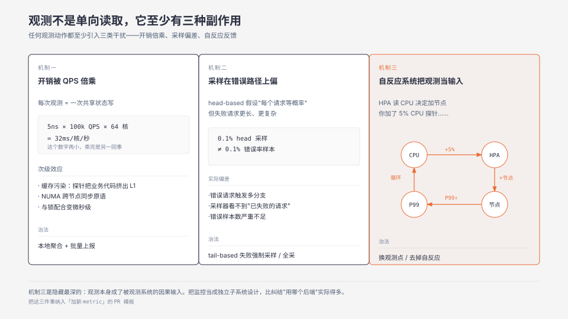
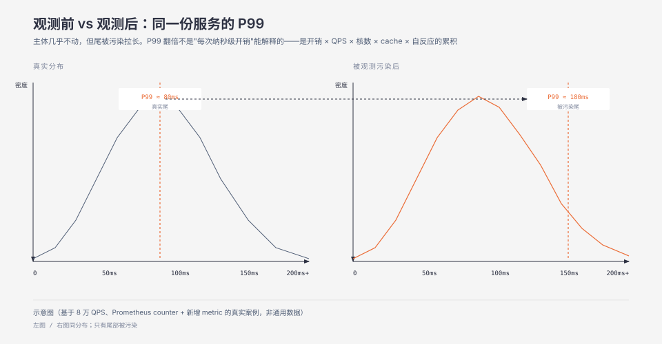

**TL;DR：** 测量不改变行为只发生在低 QPS + 无自反应组件的系统里。任何一次观测都至少引入三类副作用——开销被 QPS 倍乘、采样在错误路径上偏、自反应组件把观测值当成决策输入。把观测当成可计量的负载，给它一个独立的容量预算，比纠结"用 Prometheus 还是用 OTel"实际得多。

## 一、一个明显「无害」的 metric 把 P99 翻了一倍

网关服务的 P99 延迟从 80ms 涨到了 180ms，但 CPU、内存、QPS 都没变。监控面板只多了一条曲线——我们新加的"上游通道切换次数"，按通道名分维度，所以代码写成了 `counterVec.WithLabelValues(channel).Inc()`，每次切换调一次。

按直觉这行不该慢。Go 客户端里 `counter.Inc()` 的实现就是一行 `atomic.AddUint64(&c.valInt, 1)`，作用在计数器自己的字段上，没有锁、也没有 map 查找；源码注释还专门说明，因为 `Inc` 常出现在极热的执行路径上，计数器用 float64 + uint64 两个字段分别追踪，"以便以最优性能完成原子递增"。纳秒级、8 万 QPS、单核几十微秒——看上去根本不值一提。

但火焰图拉出来，这一行占了 4%。**慢的不是 `Inc()`，是它前面的 `WithLabelValues(channel)`**：`MetricVec` 每次调用都要做一次 map 查找，遇到没见过的标签值组合还要 `MakeLabelPairs` 分配内存。Go 客户端文档自己也提示了这件事——"Keeping the Counter for later use is possible (and should be considered if performance is critical)"。而 `Inc()` 本身也不是零成本：所有核都在对同一个 `uint64` 做原子加，同一条 cache line 在核间来回搬运，相邻的计数器还可能 false sharing。8 万次/秒摊到 64 核上争抢同一条 line，等出来的延迟堆到 P99 上就翻了倍。

改法分两步：各通道的 Counter 在启动时取出来缓存，去掉热路径上的 map 查找；热通道再改成 per-P 本地计数、聚合后批量累加，消掉跨核争抢。P99 回到 80ms。

**观测本身参与了被观测对象的性能特征**——但注意慢的是哪一部分：不是"原子递增"这个动作，而是你顺手写上去的取标签路径和共享写入点。观测端的人通常不会意识到，直到 P99 涨上来。

> 场景说明：上面这个网关是复合示例，把多次线上排查的共同形态合成了一个故事。80ms/180ms、4%、8 万 QPS、64 核都是**量级示意**，不是某一次可复现的实测记录，不要当作 Prometheus 客户端的性能基线引用。可复现的机制部分见下面的源码级说明。

## 二、最强反例：观测开销小到可以忽略

这个反驳对低负载场景确实成立。一台开发机、一条冷门路径、一个内部工具——你想加多少 metric 都行，连 1% 都吃不掉。问题在于：

- **生产负载不是恒定的。** 同样的 metric 在 1k QPS 时吃 0.01%，在 100k QPS 时吃 1%，在 1M QPS 时吃 10%。开销随负载线性增长，但预算通常按开发机的开销估。
- **开销模型不是线性的。** 原子操作在单核上是纳秒级，但到了 NUMA 跨节点是百纳秒级，到了带锁的共享结构是微秒级。"每次 5ns"和"每秒 5ns × QPS × 核数"是完全不同的两个数字。
- **缓存污染被忽视。** 探针代码本身不大，但每秒钟被调用几百万次——它会污染 L1/L2，把被观测代码挤出 cache。最坏情况下，被观测对象的延迟不是因为探针"加了工作"，而是它"被踢出了 cache"。
- **自反应系统把它当成输入。** 这是最隐蔽的一类——比如某个弹性扩缩容控制器在读 CPU 使用率来决定要不要加节点，你加了一个 5% 的 CPU 探针，控制器读到的数涨了 5%，它加了节点，节点间 RPC 多了，P99 又涨了——这是一个观测本身改变被观测值的循环。

把"开销可以忽略"作为不设容量预算的理由，等于在赌生产永远不会跑到你没测过的负载。生产永远会跑到你没测过的负载。

## 三、观测改变行为的三个机制

观测不是单向的"读"操作，它是带副作用的"读 + 写"——写的是被观测系统的行为。

**机制一：开销被 QPS 倍乘 + 跨核放大。** 任何观测动作（一次递增、一次 trace span 创建、一次日志落盘）都至少是一次共享状态写入或一次内存分配。把它的延迟乘以 QPS 乘以并发核数，才是它在生产里的真实开销。"5ns × 100k QPS × 64 核"等于"每核每秒被观测代码挤掉 32ms"——这个数字再小，乘上一切就回不去。

**机制二：采样在错误路径上偏。** 概率采样假设"每个请求被采到的概率相同"，但失败请求通常更长、更复杂、更可能触发多分支。把 0.1% head-based 采样应用到所有请求，你得到的不是"错误率 0.1%"而是"几乎全是成功请求的 0.1%"——错误样本数会按 P99 延迟放大方式严重不足。OpenTelemetry 文档把 head sampling 的限制写得很直白：它不做基于整条 trace 内容的决策，因此"无法保证含错误的 trace 一定被采到"，这类需求只能靠 tail sampling。要么改成 tail-based（失败请求强制采样），要么改成全采+接受存储代价。这条机制直接决定 trace 数据的诊断价值。

同一类偏差还有一个更极端的版本，而且早就有了名字：**coordinated omission**——系统卡住的那一刻，压测器或客户端也跟着一起卡住，于是那段最糟的时间根本没发出请求、也就没产生样本，测出来的 P99 反而比系统健康时更"好看"。Gil Tene 在 QCon SF 2012 的《How Not to Measure Latency》里系统讲过这一点，并指出这个问题在主流压测工具里至今普遍存在。它揭示的比"采样漏掉坏请求"更糟一层：**观测不只会漏掉坏样本，它还会让"漏掉"这件事本身不可见**。

**机制三：自反应系统把观测值当输入。** 这是最隐蔽的一类。带自适应行为的系统（HPA 控制器、自动限流器、基于 CPU 的负载均衡、Circuit Breaker 的滑动窗口）把指标当决策依据。你给指标加 5% 开销，决策就偏移 5%，决策偏移会反过来改变被观测对象的负载——一个正反馈或负反馈闭环就此闭合。能不能稳，取决于闭环增益是否小于 1。这条机制决定了**观测在生产里必须当成一个独立的子系统来设计**，不是"装上去就好"。

## 四、可控观测的边界

观测和干扰的边界由两个东西决定：被观测系统是否带反馈，以及观测动作的延迟是否落在被观测系统的关键路径上。

- **不在关键路径上的观测**（异步落盘的 INFO 日志、异步刷新的 dashboard 指标、周期性的 process exporter）：可以无脑加，开销在时延上不可见。

- **在关键路径上但被观测系统无反馈**（单次请求的 OTel span、终态 metric）：要算延迟预算，最好压到 P99 的 1% 以下，否则要把指标异步聚合、批量上报。

- **在关键路径上且被观测系统有反馈**（带 HPA 的服务、有限流器的网关、有 circuit breaker 的 RPC 客户端）：观测必须做扰动测试，故意把指标开销拉高看决策是否稳定。如果决策不稳，要么换观测点（比如从 CPU 换到 RPS），要么去掉自反应行为。

## 五、给观测做容量预算

监控值得有一个独立的容量预算，按下面三步分配：

1. **测一遍观测的延迟贡献**。火焰图拉一次，看指标递增、span 创建、日志落盘各占多少 P99。
2. **把观测总开销压到被观测系统 P99 的 5% 以内**。超了就拆——本地聚合后批量上报、采样降级、改用 exporter 而不是 SDK 内嵌。
3. **给观测做扰动测试**。故意把指标开销乘 2 看自反应系统是否漂移，漂移了就改观测点。

把这三步写进"加新指标"的 PR 模板，比"我们仔细评估了开销"有用得多。

## 六、边界

- **离线分析、批处理、Cron 任务**：不在关键路径上，开销观察意义不大，加多少 metric 都行。
- **故障注入工具**：就是要改变行为，开销是设计目标不是问题。
- **带混沌工程的系统**：已经被设计成能承受观测带来的扰动，按 chaos 工程的标准走。
- **一次性的灰度验证**：加完后压测、删除，不进生产路径。这一类不算生产观测成本。
- **纯开发环境的 debug metric**：和生产脱钩，无所谓。

## 七、可执行的研究问题

- **对线上同一个服务，分别用「无 metric」「聚合上报 metric」「实时上报 metric」三种方式测 P99 延迟，画出 P99 × QPS 曲线**。假设：实时上报在 100k QPS 之上与无 metric 的差距 > 5ms。控制变量：QPS、metric 数量、metric 类型（counter/histogram）。观测指标：P50、P99、cache miss、跨核同步原语计数。反例：聚合上报延迟是引入的新成本，等价于把 P99 推到 batch 窗口。完成标准：能找到至少一个 metric 形态的延迟贡献在 P99 5% 以下。不可外推到其他业务。

- **把 tail-based 采样与 head-based 采样在错误路径上的样本覆盖率做对照**：固定错误率 0.5%，在 head-based 0.1% 采样和 tail-based 100% 采样下，分别统计"每 1000 次错误请求中能被采到并保留完整 trace 的数量"。假设：head-based 在错误路径上得到的样本数 = 0.1% × QPS × 错误率，tail-based = 100% × 错误请求。控制变量：错误率、链路长度。观测指标：可诊断率、存储开销。反例：tail-based 需要先把 trace 完整采集再判断是否保留，等价于把存储开销前置。完成标准：能在可接受的存储代价下让错误样本覆盖率 > 80%。不可外推到对延迟极敏感的场景。

- **给一个带 HPA 的服务注入"+5% CPU 探针"，观察节点数变化和 P99 变化，画出时间序列**。假设：HPA 会增加 1-2 个节点，新节点上的 RPC 握手会导致 P99 在 30 分钟内上升 10%，但 30 分钟后稳定。控制变量：HPA 步长、扩容阈值。观测指标：节点数、P99、跨节点 RPC 数。反例：HPA 行为与集群调度器深度耦合，单服务级注入测得的结果可能与服务网格级不同。完成标准：能在 30 分钟内观察到稳态增益并据此选定观测点。

- **用 chaos engineering 工具给观测系统本身注入故障，看被观测系统的告警是否会"误以为系统挂了"**。假设：观测系统挂掉时，被观测系统的告警应触发"观测挂了"的元告警，不应触发"业务挂了"误报。控制变量：观测系统故障模式（延迟、丢包、完全挂）。观测指标：业务告警的误报率、漏报率、MTTR。反例：观测系统挂掉本身就是业务影响（业务不知道自己挂了）。完成标准：能在元告警体系下把业务告警的误报率压到 < 5%。不可外推到没有冗余观测系统的小团队。

## 八、参考资料

- Gil Tene, [How Not to Measure Latency](https://qconsf.com/sf2012/presentation/How+not+to+measure+latency)（QCon San Francisco 2012；[幻灯片 PDF](https://qconsf.com/sf2012/dl/qcon-sanfran-2012/slides/GilTene_HowNotToMeasureLatency.pdf)）—— coordinated omission 的原始提出，对应机制二最后一段。
- OpenTelemetry 文档 [Sampling](https://opentelemetry.io/docs/concepts/sampling/)（核对日期 2026-09-01，页面标注最后更新 2025-10-16）—— head sampling 与 tail sampling 的官方定义与取舍，对应机制二。
- Kubernetes 文档 [Horizontal Pod Autoscaling](https://kubernetes.io/docs/tasks/run-application/horizontal-pod-autoscale/) —— 机制三里「把指标当决策输入」的自反应闭环，最典型的实现及其控制周期。
- Brendan Gregg《Systems Performance》—— 性能观测方法学中对 observer effect（perturbation）的处理框架，对应机制一。
- [prometheus/client_golang `counter.go`](https://github.com/prometheus/client_golang/blob/master/prometheus/counter.go) —— 第一节机制的源码依据：`Inc()` 即 `atomic.AddUint64(&c.valInt, 1)`（无锁、无 map 查找），`WithLabelValues()` 走 `MetricVec` 的 map 查找，文档明确建议"若性能关键应缓存取到的 Counter"。核对日期 2026-09-01。

> 说明：本文的三个机制是机制性论证，不依赖任何一手的实测数字。第五节的三步预算与第七节的研究问题都是**待验证的假设**，不是已跑出的结论，不要当作现成的性能基线引用。

