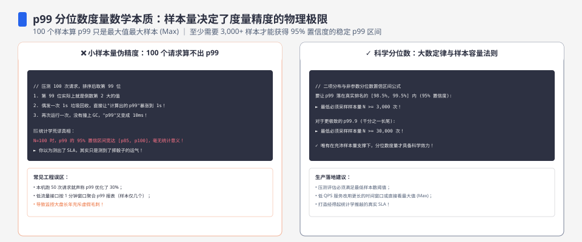
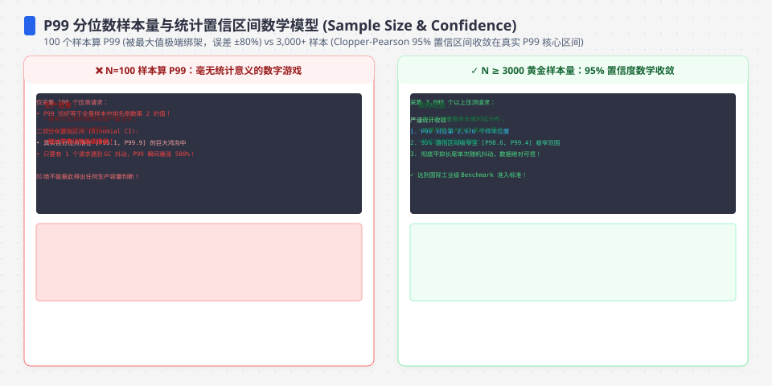
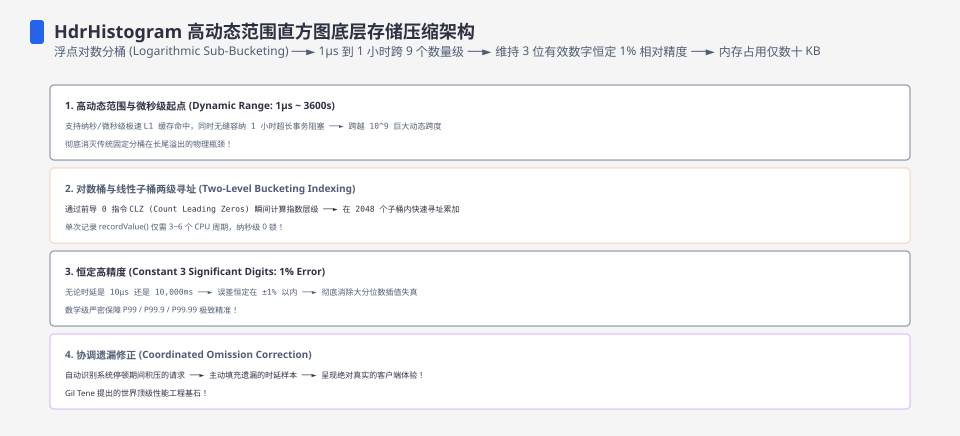

**TL;DR：** p99 是"概率为 1% 的极端样本"——而样本里恰好抽到几个极端点，纯粹由样本量决定。模拟一个真实得不能再真实的延迟分布（98.5% 正常请求 + 1.5% 重尾毛刺）：**100 个样本的 p99 中位数只有 30ms——真值是 220ms，低估 7.3 倍**；300 个样本时 p99 的波动区间（IQR）宽达 178ms，同一批请求换个样本可能得出完全不同的结论；1000 个样本才开始有方向意义，3000 个以上才稳定。任何"3 次运行取最小 p99"的做法都在系统性低估分位数（实测 1.41 倍），因为它把随机波动当成了噪声要去掉——但对分位数来说，波动就是信息。

---

## 一、p99 是什么：不是"99% 的请求都低于这个值"吗

p99 的定义是"99% 的请求延迟低于该值"。但测量它的方式决定了结果：你永远无法测到分布本身，只能测到**样本的分位数**。样本 p99 = 排序后第 ⌈0.99N⌉ 个值——它等于"恰好第 99% 位置的那个观测值"，而不是"分布的真值"。

问题在于：如果真实分布里 1.5% 的请求是慢请求（200ms+），那么 N=100 的样本期望只包含 1 个慢请求。这种情况下"第 99 个观测"根本没碰到慢区，p99 会显著低估；N=300 时期望 4.5 个慢点，但"碰巧有几个、碰巧多慢"的方差极大。这就是为什么同样一组请求，这次跑 p99=180ms，下回跑 p99=60ms——不是机器变快了，是样本里的尾部没来。

分布形状不是均匀的：**尾部越重，分位数估计越抖**。本文用两个均可复现的分布对比：重尾分布（98.5% exp(5ms) + 1.5% exp(200ms+)）与纯指数分布（全部 exp(5ms)），真值用 1000 万样本算出（重尾 p99=219.93ms、纯指数 p99=23.06ms），再用 400 次独立采样估计不同样本量下 p99 的中位数与 IQR：

| 样本量 | 重尾 p99 中位数 | 重尾 IQR | 纯指数 p99 中位数 | 纯指数 IQR |
| --- | ---: | ---: | ---: | ---: |
| 100 | 30.10ms | 8.49 | 20.68ms | 2.39 |
| 300 | 210.77ms | **178.29** | 22.15ms | 1.74 |
| 1000 | 218.35ms | 11.74 | 22.68ms | 1.04 |
| 3000 | 218.32ms | 5.56 | 22.89ms | 0.59 |
| 10000 | 220.48ms | 3.07 | 22.99ms | 0.34 |

三个必须记住的量级：**n=100 严重低估 7 倍**；**n=300 极其不稳定（IQR 178ms ≈ 真值本身）**；**n≥1000 才开始收敛，n≥3000 IQR 进入个位数毫秒**。纯指数分布同样本量下 IQR 只有重尾的 1/5~1/50——波动根源是尾部样本数，不是总样本数。

## 二、为什么"样本量"才是唯一杠杆：尾部样本数的期望

关键数学很简单：重尾占比 p、样本量 N，尾部样本的期望数是 Np。慢请求恰好落入样本是泊松过程，期望值的平方根就是波动量级（泊松可预测性：期望 λ=4.5 时，实际 1~8 都很常见，标准差约 2.1）。对 p99 估计来说，not 尾部样本太少是系统性偏差（漏掉尾部），尾部样本太多又带来方差（迟到哪个慢点）。两者平衡出现在 Np ≈ 1~10 之间——对应这里的 N ≈ 70~700，正好落在模拟里最抖的区域。

从模拟数字反推经验法则：**要把 p99 的随机波动压到自己想要的精度 Δ 内，需要 N ≈ 1/(p·Δ²) 量级**。p=1.5% 想得到 Δ=5% 相对精度，N≈2600；想要 Δ=1%（精确到几毫秒），N≈66000。集群监控一般用签名桶/分钟级直方图凑够干样本，压测脚本常常只有几百个样本——两者结论的可信度差一个数量级，但都被当成同一种"p99"。

## 三、"取三次运行的最小值"错在哪：把信息当噪声

压测工具普遍拿"3 次输出取最小"压 GC 抖动，但这个习惯被直接搬到 p99 上：跑三次、各算 p99、取最小值。模拟显示这会让 p99 均值从 218ms 掉到 **156ms（低估 1.41 倍）**——而且永远不会往回偏。

原因：p99 的波动是单边偏空的。样本里的尾部偶尔稀疏（低估）、偶尔稠密（接近真值），几乎不会高估——分位数对"缺尾部"的花光式不对称。取 min 恰好把每次都被低估的样本再挑一遍，系统性更低估。**对 p99 正确的最小化目标是"多次运行的合并样本"**：把 3 次 x1000 合并成 3000 有效样本再算一次 p99，IQR 能从 11.74 收到 5.56，而不是取三个坏了的分位数。取 min 该留给吞吐/均值（受单次 GC 停顿影响大），不能用于分位数。

## 四、压测里的实操对策：样本量、合并与"分位数区间"写法

* **先决定精读，再决定样本量**：想证明"p99 从 300ms 降到 250ms"，需要 IQR 远小于 50ms——按上面经验法则后者只对应 n≈1000 上下；想证明 5ms 级优化，样本量按平方涨。
* **合并多次运算是免费的**：每次采样独立同分布，合并后统计量只会更稳，代价只有内存/时间。压测脚本应输出合并结果，而不是"最好的一次"。
* **报告"中位数及 IQR"而不是单点**：单点 p99 会暗示精度不存在的数字；`p99(中位)=218ms±12ms(IQR)` 是诚实的写法，能直接看出 1000 样本和 100 样本的区别。
* **重尾存在时先确认 p**：如果 p99 抖动异常（IQR > 真值的 20%），先做一次大样本（n≥10000）重测出真实尾部占比，再按 p 反推日常需要的样本量，而不是盲目调压测时长。

复现：脚本 `experiments/p99-sample-size/p99_sim.py`（纯标准库，seed 固定 42，400 次重复），原始输出与运行环境见 `evidence/p99-sample-size-confidence/2026-08-19-local/`。这是本机模拟，模型的尾部占比是我设定的 1.5%，不是任何线上系统的测量；分布换成真实的 p=0.1% 或 p=5%，方向不变、具体样本量按公式重算。

## 五、结论：分位数不是"测出来"的，是"攒出来"的

回到开头的问题：同样的请求、不同的采样窗口，p99 差几倍，这不是观测噪声，是分位数估计的固有数学。p99 的可靠性与样本量绑定：100 样本的可信度 ≈ 盲猜，1000 样本能谈方向，3000+ 才敢拿来做回归门禁。**任何报告单点 p99 且不附样本量的地方，都该追问一句：这是多少次采样的结果？** 实践上，把多次运行合并、把"取最小"换成"合并后取分位"、把单点换成区间，这三件事零成本，直接买回一个数量级的可信度。

下一步可执行：给压测脚本加两行——输出合并 P99 与样本数、打印 68% 区间（IQR 的一半）。如果你的报表只显示一个数字，先把它改成区间。

## 参考资料

- 本仓库实验：`experiments/p99-sample-size/`；原始输出：`evidence/p99-sample-size-confidence/`
- [Google SRE 手册：分位数与长尾（Monitoring Distributed Systems）](https://sre.google/sre-book/monitoring-distributed-systems/)
