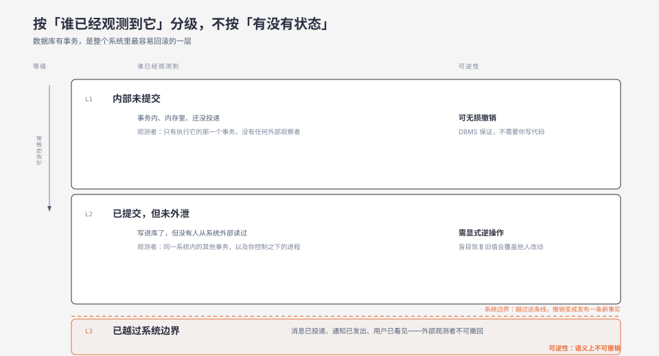
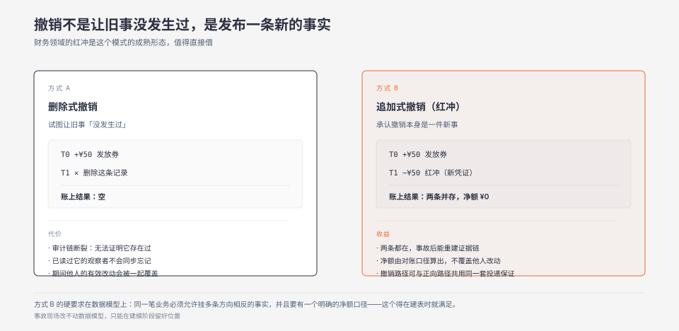

**TL;DR：** 回滚的难度不由「有没有状态」决定，而由「副作用被谁观测到了」决定。数据库有事务，是整个系统里最容易回滚的一层；真正不可逆的是已经越过系统边界的那部分——消息已投递、通知已发出、对账单已出具、用户已经看见。这一级的不可逆性是信息论限制，不是技术限制：你无法让一个已经接收到信息的观察者忘记它。因此它的「撤销」在语义上等价于**发布一条新事实**，必须走和正向流程同等的可靠性保证，而不是交给一个 best-effort 脚本。发布前的可执行判断是：列出本次变更会产生的所有已外泄副作用，逐条问「如果这批要撤销，谁来发那第二条事实」。

## 一、数据库回滚成功了，最后还是赔了钱

下面这个形态是把几类公开复盘过的发券事故拼起来的复合场景，用来定位机制，不对应任何一次具体事故。

一个优惠券服务上线 v2，逻辑错误，给符合条件的用户重复发券。值班同学在三十分钟内做了这些事：

- 停掉 v2，切回 v1；
- DBA 用事务把 v2 写入的券记录回滚了；
- 缓存里的券数据失效重建。

按「回滚成功」的通常定义，这次回滚做得相当干净。但接下来的四十八小时里发生的事情，没有一件跟数据库有关：

- 三十万条 App 推送已经发出去了，收不回来；
- 十二万条短信已经发出去了，收不回来；
- **一部分用户已经用那张券下单了**。券被回滚了，但订单是在券还有效的时候创建的——现在订单的优惠金额没有对应的券支撑；
- 整点对账文件已经在事故发生后推给财务系统了，那份文件里包含这些券；
- 下游风控因为「某用户短时间内大量领券」触发了规则，把一批正常用户标记为风险。风控系统不知道你的券回滚了。

最后的处理成本，绝大部分不是回滚数据库，是处理这五件事。

这个场景里有个反直觉的次序值得单独说：**数据库是整个系统里最容易回滚的一层，恰恰因为它有事务。** 事务给了你一个明确的、由 DBMS 保证的撤销机制。而那些没有任何机制保证的部分——推送、短信、对账文件、用户已经看到的东西——全部在系统边界之外。

## 二、最强反例：这不是分布式事务问题，补偿也解决不了

一个很自然的反驳是：这问题早就有解了，用 Saga，给每个步骤配一个补偿事务。

这个反驳值得认真对待，因为 Saga 确实是处理它的正确工具之一。但它解决的是**状态**的一半，不是**可见性**的一半。

看 Saga 原始论文的摘要（Hector Garcia-Molina、Kenneth Salem，《Sagas》，SIGMOD '87，pp. 249–259）：

> The database management system guarantees that either all the transactions in a saga are successfully completed or compensating transactions are run to **amend** a partial execution.

注意动词是 **amend**（修正），不是 undo（撤销）。论文在同一段里进一步说得很清楚：补偿事务从语义上撤销该步骤，但**不必然把数据库恢复到该步骤开始时的状态**，它把世界恢复到一个「可接受的近似」。

这个措辞是精确的，而且是本文论点的核心：

- 补偿事务能让账户余额回到原值，但流水里多了两条记录——一笔支付和一笔退款。银行、用户、对账系统都看见了这两条。
- 补偿事务能取消订单释放库存，但用户已经截图了「下单成功」页面。

**补偿能恢复状态，不能恢复「别人已经知道这件事发生过」这个事实。** 而且补偿本身也是一个已提交的事务，它自己也是一条新的、会被观测到的事实。

所以分类维度不是「有没有状态」，而是**副作用的可见性**。这两者经常被混为一谈，于是我们设计了一套只覆盖前者的机制，然后惊讶于后者带来的成本。

## 三、副作用的三个可见性等级

把「这个操作产生的后果」按**谁已经观测到它**来分级，会得到三个性质完全不同的等级：

### L1：内部未提交

事务还没提交、对象还在内存里、消息还没投递。

**可逆性**：可无损撤销。DBMS 帮你做，不需要你写任何代码。这是唯一一个「撤销」在字面上成立的等级。

### L2：已提交，但未外泄

写进库了，但还没有任何**你控制之外的观察者**读到它。

**可逆性**：可撤销，但需要显式的逆操作，而且逆操作的设计难度被严重低估——因为在它提交之后、你撤销之前，可能有别的事务改过同一份数据。这就是为什么 Saga 论文强调补偿「不必然恢复到开始时的状态」：盲目地把一个计数器改回旧值，会覆盖掉这期间别人做的有效工作。逆操作必须是**语义上**相反的，不能是**数值上**相反的。

### L3：已越过系统边界

消息已投递到第三方队列，通知已发出，对账文件已出具，用户已经在界面上看见。

**可逆性**：不可撤销。这不是技术限制，是信息论限制——**你无法让一个已经接收到信息的观察者忘记它。**

这一条推论出本文最实用的结论：

> **L3 的「撤销」在语义上等价于「发布一条新事实」。**

既然它是一条新事实，它就必须走和正向流程同等的可靠性保证：要持久化、要重试、要幂等、要有投递确认、要有失败告警。而现实中最常被违反的恰恰是这一条——**正向发券是事务性的、有重试、有监控；反向撤券是运营同学跑的一次性脚本，失败了靠人眼看日志。**

两边可靠性不对称，是回滚事故里最稳定、最可预测的成因。

## 四、这个分类决定了哪些设计是必要的

如果按可见性分级而不是按「有没有状态」分级，会推出四件平时容易被当成过度设计的事。

### 4.1 副作用要分级登记，而不是一视同仁

不是所有外部调用都同等危险。判断依据只有一句话：**这条副作用产生的那一刻，有没有一个你控制之外的观察者获得了信息。**

- **可召回**：数据库写入、内部缓存、还在你自己队列里没投递出去的消息、还没 flush 的日志缓冲区。
- **不可召回**：短信、推送、邮件；已投递到第三方队列的消息；已出具的对账单与报表；用户可见的状态变更；物理世界动作（发货、打印、出票）。

这份清单的价值不在于文档，在于它决定了下一节的那件事。

### 4.2 把不可逆副作用推到流程末端，且放在提交之后

Transactional outbox 的价值通常被讲成「保证至少一次投递」。但它更重要的另一半价值是：**它把副作用的可见时刻，从「执行时」推迟到了「提交之后的可控时刻」。**

这个推迟给了你一个窗口——一个在副作用外泄之前你还能反悔的窗口。**这个窗口的长度，就是你的实际回滚窗口。**

一个没有 outbox 的服务，在事务里直接 `Notify()` 外部系统，它的实际回滚窗口是零：副作用在事务提交之前就已经出去了，事务回滚对它没有任何影响。关于双写原子性的完整讨论见 [Outbox 与 CDC：双写原子性](/writing/outbox-cdc-dual-write-atomicity)。

### 4.3 给不可逆副作用准备追加式撤销，不是删除式撤销

- **删除式撤销**：把这行删掉、把这个值改回去。它破坏审计链，而且无法表达「已经有人读过它」这个事实。
- **追加式撤销**：新增一条方向相反的事实，两条都在账上，净额为零。

财务领域的**红冲 / 冲正**是这个模式的成熟形态，值得直接借鉴——它的设计前提就是「撤销是一件新事，而不是让旧事没发生过」。红冲凭证与原凭证并存，两者都不能删，净额通过对账口径计算出来。

这个模式对数据模型有一个硬要求：**同一笔业务上必须允许挂多条方向相反的事实，并且要有一个明确的净额计算口径。** 这个要求应该在数据建模阶段就满足，事故现场改不动。

### 4.4 L3 的可观测半径要可控，但别指望灰度能改变性质

灰度降低的是数量，不改变性质——灰度里的那 3 万用户也已经观测到了，他们的副作用同样是 L3。

但数量在 L3 上的价值是具体的、可计算的：把「要给 300 万人发解释短信」变成「给 3 万人发」。这个差异往往决定了一次事故是「处理一下」还是「上新闻」。所以灰度的价值不在「避免 L3」，在**把 L3 的处置成本压到可承受的量级**。

## 五、一个发布前就能做的判断

把上面这些收拢成一个可执行的动作：

> 发布前，列出本次变更会产生的所有 L3 副作用。对每一条问：**如果这批要撤销，谁来发那第二条事实？它走的路径和正向路径一样可靠吗？**

答不上来的那几条，就是这次发布真正的回滚风险。

这个风险在发布之前就已经存在，只是发布之后才显形。而且它通常不在代码评审的射程内——因为「谁会看到什么」这件事的证据，不在 diff 里。评审能看到 `notifyService.send(...)` 这一行，看不到「这条短信发出去之后，如果撤回来要走另一条完全不同可靠性保证的路径，而那条路径不存在」。

## 六、边界

**L3 集合为空的系统，这个框架不提供额外信息。** 纯内部系统、只读服务、无外部副作用的离线批处理，它们没有越过系统边界的副作用，回滚就真的是一个数据库问题。用这个框架去审查它们只会增加无谓的流程。

**这个框架不替代幂等与去重设计。** 幂等处理的是「同一件事可能被执行多次」，发生在副作用产生之前；本文讨论的是「已经发生且已被观测」，发生在之后。两者是不同阶段的问题，经常需要同时存在——[幂等工程](/writing/idempotency-engineering) 与 [恰好一次投递](/writing/exactly-once-message-delivery) 讨论的是前半段。

**有些 L3 副作用是不该被消除的。** 监管要求的留痕、审计日志、财务凭证，它们的不可撤销性是设计目标而不是缺陷。此时正确的目标不是「能撤销」，而是「撤销过程本身可审计」——即第三条事实也要留痕。

**补偿顺序是业务依赖，不是栈式回退。** Saga 论文里按逆序执行补偿是合理的默认，因为后一步往往依赖前一步，但相互独立的补偿可以并行，有些补偿还需要等待现实状态变化。不要在事故现场才发现顺序是错的。

## 七、可以自己动手验证的几个问题

1. **假设**：你的服务里，反向撤销路径的可靠性显著低于正向路径。**对照**：任选一条会产生 L3 副作用的业务流程，分别列出正向与反向的投递机制、重试策略、失败告警、持久化方式。**观测**：两者在「持久化 / 重试 / 幂等 / 告警」四项上的差异项数。**反例**：如果四项完全对称，说明该流程已经处理了本文指出的问题，本假设不成立。**完成判据**：能给出一张四项对照表，并指出至少一项不对称。**不外推到**：其他流程，可靠性是逐个流程设计的属性。

2. **假设**：没有 outbox 的服务，其实际回滚窗口为零（副作用在事务提交前已外泄）。**对照**：找一个在事务内直接调用外部系统的代码路径，与外部系统侧记录的接收时间、与数据库事务的提交时间做对比。**观测**：外部系统收到副作用的时间戳，早于还是晚于本地事务提交时间戳。**反例**：如果外部调用实际发生在提交之后（例如已经用了某种延迟投递机制），本假设不成立。**完成判据**：能给出两个时间戳的先后关系及其时间差量级。**不外推到**：时钟精度不足以分辨的场景——这种情况下先解决时钟对齐，参照 [分布式系统中的时钟偏移](/writing/clock-skew-distributed-systems)。

3. **假设**：追加式撤销（红冲）比删除式撤销在事故后重建证据链时更省事。**对照**：同一类业务错误，一次用删除纠正，一次用红冲纠正，事后分别做一次完整对账。**观测**：能否在不依赖备份的情况下，回答「事故期间到底发生了什么」。**反例**：如果删除路径有完整的审计日志能重建，两种方式差异不大，本假设不成立。**完成判据**：能说明两种方式各自需要哪些额外数据源才能完成对账。**不外推到**：有合规留痕要求的场景，那里删除本身就不合法。

4. **假设**：L3 副作用的处置成本近似正比于受影响人数，因此灰度对 L3 的价值是压缩数量而非避免。**对照**：同一次事故，统计「识别受影响用户集合」与「逐个处置」两个阶段的耗时占比。**观测**：处置阶段耗时是否随人数近似线性增长。**反例**：如果处置是一次性的批量动作（例如全量发一条更正通知），成本与人数无关，本假设不成立。**完成判据**：能给出两个阶段各自的耗时，并说明规模翻十倍时哪个阶段先成为瓶颈。**不外推到**：涉及人工客服或法律流程的场景，那里的成本曲线不是线性的。

## 八、参考资料

- H. Garcia-Molina, K. Salem, [Sagas](https://www.cs.cornell.edu/andru/cs711/2002fa/reading/sagas.pdf), SIGMOD '87, pp. 249–259 —— 摘要原文使用 **amend** 而非 undo，并明确补偿「不必然把数据库恢复到步骤开始时的状态」。
- [Saga 模式（Chris Richardson, microservices.io）](https://microservices.io/patterns/data/saga.html) —— 微服务语境下 saga 与补偿事务的定义。

### 延伸阅读

- [分布式事务：2PC 与 Saga](/writing/distributed-transactions-2pc-saga) —— 补偿机制的完整权衡。
- [Outbox 与 CDC：双写原子性](/writing/outbox-cdc-dual-write-atomicity) —— 4.2 节延迟外泄的实现基础。
- [幂等工程](/writing/idempotency-engineering) —— 处理「可能被重复执行」，发生在副作用产生之前。
- [依赖升级的风险不在 breaking change](/writing/dependency-upgrade-resource-signature) —— 另一类「发布后才显形、发布前就存在」的风险。
