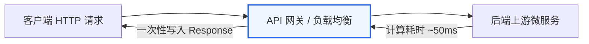
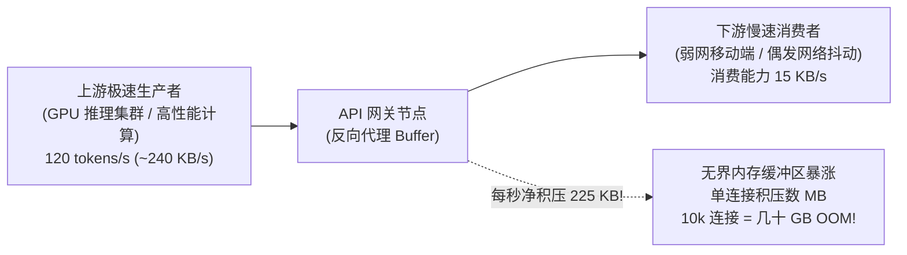
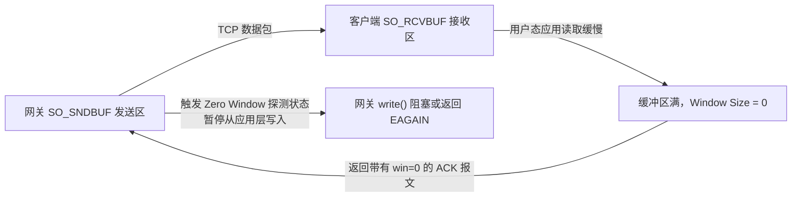
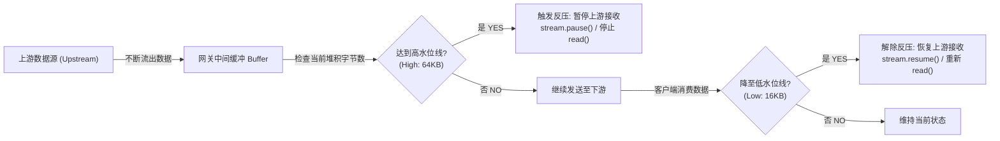

**TL;DR：** 传统的 API 网关（如标准配置的 Nginx、Kong 或基于内存队列反向代理的服务）几乎都基于“短平快”（50ms 内请求-响应完毕并释放连接）的假设构建。然而，随着基于 **Server-Sent Events (SSE)** 的流式长连接爆发，会话动辄持续 30 到 120 秒。**当极速生产数据的后端服务遭遇网络抖动的弱网客户端时，两者几十倍的速率错配会在网关内存中形成巨大的在途数据堰塞湖。如果没有全链路反压（Backpressure）机制，并发长连接将呈线性吞噬内存，直接引发 Linux OOM Killer 强杀网关进程！**

---

## 一、熟悉入口：从“短平快”到数十秒流式长连接

对于后端工程师而言，过去十几年我们习惯的微服务架构绝大部分遵循经典的 Request-Response 模式：



在短连接模型中：
- 客户端发出请求，上游几毫秒至几十毫秒返回全部数据；
- 网关接收到完整响应后，单次 `write()` 即可刷入 TCP 缓冲区；
- 连接迅速复用或归还连接池，单连接在网关内存中驻留的时间极短，几乎不占用内存。

### 流式长连接（SSE / Chunked Transfer）的颠覆

然而在现代长文本推理、实时遥测数据监控或音视频转录服务中，通信模型变成了 **Server-Sent Events（SSE）流式持续推流**：

```text
HTTP/1.1 200 OK
Content-Type: text/event-stream
Cache-Control: no-cache
Connection: keep-alive
Transfer-Encoding: chunked

data: {"token": "在"}
data: {"token": "复杂"}
data: {"token": "系统"}
... (以每秒 100 个 Chunk 的速率，持续推流 60 秒) ...
```

连接建立后，信道将在长达数十秒甚至数分钟内保持打开状态。这彻底瓦解了网关的传统并发模型：**连接不再只是一个瞬间的调用，而是一根持续通水数分钟的水管**。

---

## 二、速率错配现场：慢速消费者的“内存堰塞湖”

流式网关面临的最致命问题，不是并发量有多大，而是**两端速率的不对称**：



### 真实生产算账：为什么瞬间 OOM？

假设一个典型的线上场景：
1. **上游生成速度**：高性能集群以 **120 tokens/s**（约 240 KB/s）极速推送数据；
2. **下游消费速度**：某批在地铁弱网或海外长延迟网络下的移动端客户端，由于 TCP 拥塞控制降速，每秒只能接收 **15 KB/s**；
3. **速率差（Mismatched Rate）**：网关每秒净积压 $240 - 15 = 225\text{ KB}$ 数据！

一个典型的万字分析生成任务持续 30 秒：
- **单条连接的在途数据积压**：$225\text{ KB/s} \times 30\text{s} \approx 6.75\text{ MB}$！
- 若此时网关维持着 **5,000 路慢速并发流**：

$$\text{在途总积压内存} = 5,000 \times 6.75\text{ MB} \approx 33.75\text{ GB！}$$

如果网关代码没有反压机制，只是一味地在回调函数里 `dataQueue.push(chunk)`，这 33GB 的在途数据会直接把网关宿主机的物理内存吞噬殆尽，触发 Linux 内核的 `oom-killer`，整台网关轰然倒下！

<aside class="sidenote">
  <strong>内核机制警示</strong>：许多初级网关开发以为只要上游限流就能防止 OOM，却忽略了即使 QPS 极低，长生命周期慢连接持续累积的在途字节流（Bytes in Flight）依然会轻易击穿容器的 Memory Limit。
</aside>

---

## 三、传输层防线：从 Linux Socket 缓冲区到 TCP Zero Window

解决速率错配的物理根基，不在应用层，而在操作系统网络协议栈的经典智慧：**TCP 滑动窗口（Sliding Window）与流量控制（Flow Control）**。



### 1. 内核套接字缓冲区：SO_RCVBUF 与 SO_SNDBUF

在 Linux 内核中，每个 TCP 连接都分配有接收缓冲区和发送缓冲区，由内核参数 `tcp_wmem` 动态调节：

```text
/proc/sys/net/ipv4/tcp_wmem:
min: 4096 (4KB)    default: 16384 (16KB)    max: 4194304 (4MB)
```

1. 当客户端 App 处理过慢时，数据堆积在客户端内核的 `SO_RCVBUF` 中；
2. 客户端内核在发送给网关的 TCP ACK 确认包中，将首部的 `Window Size` 字段缩减；
3. 当接收缓冲区完全被填满时，客户端向网关发送 **Window Size = 0（Zero Window）** 报文。

### 2. Zero Window 探测与 EAGAIN

当网关内核收到 `win=0` 时：
- 网关协议栈停止向网络发送数据，启动持续探测定时器（Zero Window Probe）；
- 上游流入的数据迅速把网关内核的 `SO_SNDBUF` 填满；
- 此时网关的用户态进程调用 `write()` 或 `send()` 时，如果是非阻塞 Socket，系统调用将直接返回 `-1`，并置 `errno = EAGAIN` 或 `EWOULDBLOCK`！

这就是**操作系统层面对速率错配发出的物理警报**。

---

## 四、应用层反压链路：高低水位线（Watermark）架构设计

如果网关在收到 `EAGAIN` 时依然把上游数据丢进内存队列，那么内核的流控机制就彻底白费了。现代工业级网关（如 Envoy、Netty、Node.js Streams）的核心解法，是**在网关内部建立高低水位线（High/Low Watermark）反压控制回路**：



### 1. 高水位线（High Watermark）

设定一个合理的单连接缓冲区安全阈值（例如 **64KB**）：
- 当发往下游的数据由于网络缓慢在待发队列中堆积超过 64KB 时；
- 网关**主动暂停读取（Pause）上游连接的数据流**；
- 暂停上游读取后，网关与上游之间的 TCP 缓冲区也随之填满，反压信号沿着 TCP 链条**逆流而上，一路传导回上游 GPU 推理服务**，迫使上游暂停该流的解码步进！

### 2. 低水位线（Low Watermark）与滞后环（Hysteresis）

当下游客户端网络恢复并消费完部分数据，待发缓冲区排空并降至 **低水位线（如 16KB）** 时：
- 网关触发 `drain` 事件，**重新唤醒（Resume）上游连接的读取**；
- 之所以要设置高低两个水位差（64KB vs 16KB），而不是单一固定值，是为了**提供滞后缓冲区（Hysteresis Loop），防止网关在边界阈值附近发生高频的抖动暂停与唤醒（Throttling Oscillation）**。

通过高低水位线反压设计：
**单条流式长连接的内存开销被严格锁定在 $O(1)$ 常数级（最大 64KB）！**
无论会话持续几分钟、无论下游有多慢，集群总内存在 10,000 并发下始终稳定在 $64\text{KB} \times 10,000 \approx 640\text{MB}$，系统永远不会发生内存失控崩溃。

---

## 五、动手验证：交互式反压模拟沙盒

你可以在下方交互式体验速率错配下的缓冲区真实演变：

<div class="interactive-sandbox" data-sandbox="sse-backpressure"></div>

通过调节上方的**上游生产速率**、**下游弱网带宽**以及**反压策略开关**，你可以直观观测到：
- 为什么在“无反压”模式下，单连接积压量会随时间不断爬升，直至集群内存告警击穿；
- 开启“水位线反压”后，网关如何通过流控信号动态将缓冲区约束在绿色的安全区间内。

---

## 六、在虚拟终端实测 Linux TCP 缓冲区参数

通过我们内置的虚拟内核终端，你可以在浏览器中直接查看宿主机网络栈的内核缓冲区默认值与配置：

```bash
# 查看宿主机 TCP 发送缓冲区最小/默认/最大字节配额
cat /proc/sys/net/ipv4/tcp_wmem

# 检查当前服务器系统内存占用与可用容量
free -h

# 查看网络连接数与 TCP 套接字状态
uname -a
```

点击代码块右上角的 **“▶ 运行”**，即可在弹出的终端沙盒中模拟执行这些网络命令，感受真实后端调优的命令行触感。

---

## 七、总结与后端避坑清单

在处理大模型流式长连接（SSE）、海量物联网遥测与 WebSocket 高并发接入时，请记住以下三条架构底线：

| 陷阱与盲区 | 致命后果 | 最佳生产实践 |
| :--- | :--- | :--- |
| **盲目使用无界内存队列** | 遇慢速客户端内存无序膨胀，被 OOM Killer 强杀 | 强制设置高低水位线，单流内存使用量收敛至 $O(1)$ |
| **单一水位线阈值** | 在临界值反复触发 pause/resume 导致 CPU 震荡 | 采用双水位差（如 64KB / 16KB）构建滞后平滑窗口 |
| **反压信号在中间件中断** | 网关暂停读上游，但上游框架继续猛推数据 | 全链路支持 HTTP/2 `WINDOW_UPDATE`，将反压传导至源头 |

高并发系统的尊严，不仅体现在每秒能处理多少吞吐，更体现在**当上下游发生速率坍塌时，系统依然能够优雅有界地呼吸与自我保护**。
