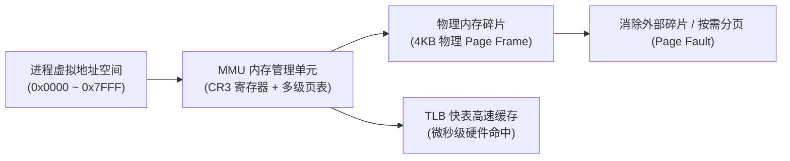
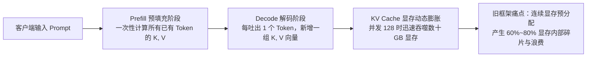
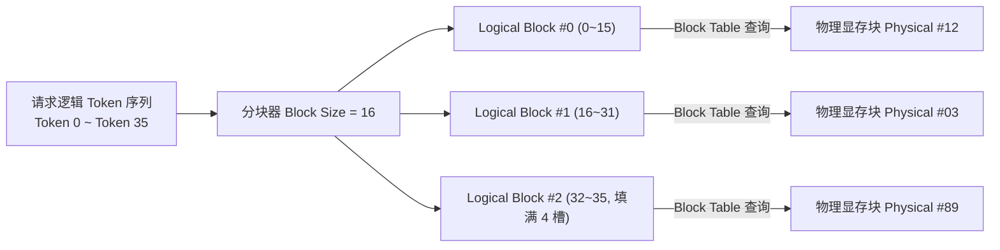
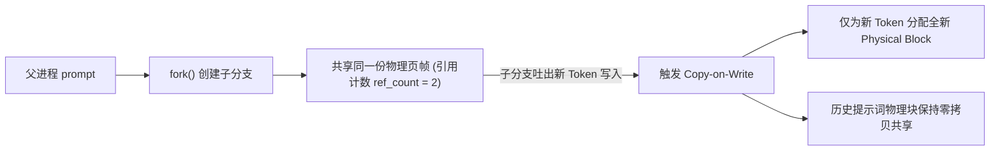

**TL;DR：** 许多后端工程师在接触高并发 AI 推理服务时，常被“KV Cache 暴涨”、“动态显存 OOM”等术语所困扰，甚至误以为这是某种深奥的深度学习数学难题。然而，剖析 vLLM 的核心支柱 **PagedAttention**（SOSP 2023）后就会发现：**它根本不是高深的模型算法，而是将计算机科学中已有 50 年历史的经典操作系统虚拟内存分页机制（Paging）、页表映射（Page Table）与写时复制（Copy-on-Write），在现代 GPU 显存管理上的精准复刻与工程重生。**

---

## 一、后端工程师的熟悉入口：Linux 为什么需要虚拟内存？

在深入现代推理引擎之前，先让我们重温每一个后端工程师在排查 OOM Killer、调优 JVM 堆外内存或排查内存泄漏时都极为熟悉的经典命题：**操作系统如何解决内存碎片与保护问题？**



### 1. 物理内存连续分配的死局

在早期的分段式内存管理中，操作系统必须为每个程序分配一块**连续的物理内存**。这种机制很快遭遇了两个无法逾越的瓶颈：
1. **外部碎片（External Fragmentation）**：随着进程频繁申请和释放不同大小的连续内存块，物理内存被切得支离破碎。虽然可用内存总量足够，但找不到一块足够大的连续区间，导致新进程分配失败。
2. **预分配浪费（Pre-allocation Waste）**：由于程序运行期间可能增长，系统不得不按照“预估的最大上限”去预分配连续内存，而绝大多数内存其实处于空闲闲置状态。

<aside class="sidenote">
  <strong>经典操作系统注记</strong>：Linux 内核通过伙伴系统（Buddy System）管理以 2 的幂次为单位的物理页帧，再通过 Slab/Slub 分配器高效管理小对象，但这一切得以成立的前提都是 MMU 的虚拟地址分页转换。
</aside>

### 2. 分页（Paging）与多级页表救赎

现代 x86-64 架构通过分页机制终结了这个死局：
- **逻辑连续，物理离散**：操作系统将虚拟地址空间切分为固定大小的 **页（Page，通常为 4KB）**，物理内存切分为相同大小的 **页帧（Page Frame）**。
- **动态映射与按需缺页（Demand Paging）**：进程逻辑上以为自己拥有一个连续平坦的内存地址，但 CPU 的内存管理单元（MMU）通过保存在 `CR3` 寄存器中的四级页表（PGD -> P4D -> PUD -> PMD -> PTE），把离散的物理页拼装成逻辑连续的空间。

如果一个页尚未载入物理内存，CPU 触发一次硬件级 **缺页异常（Page Fault, #PF）**，操作系统在中断服务例程中分配物理页并更新 PTE，整个过程对应用程序完全透明！

---

## 二、大模型推理的困境：KV Cache 为什么把显存吃崩？

回到现代大模型服务端。很多做传统后端开发的同学会直觉地认为：“一个 70B 的大模型，FP16 权重占 140GB 显存，两张 80GB 的 H100 显卡刚刚塞下，为什么并发一跑起来就会频频发生 CUDA OOM？”

答案就在于**自回归生成（Autoregressive Generation）的副产物：KV Cache**。



### 1. 为什么不能像算矩阵一样即算即丢？

在标准的 Transformer 注意力机制中：

$$\text{Attention}(Q, K, V) = \text{softmax}\left(\frac{QK^T}{\sqrt{d_k}}\right)V$$

当模型在生成第 101 个字时，它必须计算当前字的 Query 向量与**前 100 个字的所有 Key 向量的内积**。如果把前 100 个字的 Key 和 Value 向量随手丢弃，那么每生成一个新 Token，都需要将之前所有 Token 的前向传播重算一遍，时间复杂度将退化至 $O(N^2)$。

因此，推理服务必须把历史所有 Token 的 $K$ 和 $V$ 向量永久驻留在 GPU 显存中，这就是 **KV Cache**。

### 2. 传统推理框架的“连续显存分配”罪状

在 vLLM 问世之前（如早期的 HuggingFace Transformers、FasterTransformer），GPU 显存中存放 Tensor 的数据结构要求**必须是连续的物理内存（Contiguous Memory）**。

这就让推理引擎陷入了与早期操作系统一模一样的绝境：
- **最大长度预分配（Over-allocation）**：系统不知道用户提问到底会聊 50 个字还是 2048 个字。为了防止后续张量扩容导致昂贵的重新分配与数据搬移，引擎只能按模型支持的最大上下文长度（如 `max_seq_len = 4096`）为每个请求预留连续显存。
- **内部碎片堆积如山**：若用户只生成了 100 个字就结语断连，为该请求预留的剩余 3996 个 Token 的显存空间全部打水漂。
- **外部碎片无法整合**：随着高并发请求不同时机的结束，GPU 显存中散落着大量小块空闲内存，却无法拼凑出一个能容纳大请求的连续 Tensor。

统计表明：**传统推理框架中，高达 60% ~ 80% 的 GPU 显存完全被内存碎片和闲置预留白白浪费！** 导致单张卡所能容纳的并发批次（Batch Size）低得可怜。

---

## 三、PagedAttention 的系统级破局：在显存中实现 MMU

加州大学伯克利分校团队提出的 **PagedAttention**，本质上就是**在用户态推理引擎中实现了一个专属于 GPU 显存的虚拟内存管理器**：

```text
传统连续显存分配:
[Token 1, 2, 3 ... 2048 预留槽位]  <-- 必须要求连续物理内存，浪费严重！

PagedAttention 方案:
逻辑 Token 序列: [0~15] -> [16~31] -> [32~47] -> [48~63]
                      |          |          |          |
              Block Table (逻辑块 -> 物理块映射页表)
                      |          |          |          |
                      v          v          v          v
物理显存 Block:     [Block 7]  [Block 2]  [Block 19] [Block 4]  (散落在显存任意角落)
```

### 1. 块（Block）与块表（Block Table）

PagedAttention 将连续的 KV 向量切分成固定大小的 **物理块（Physical Blocks）**，通常每个 Block 容纳固定数量的 Token（例如 16 或 32 个 Token）：

- **逻辑块（Logical Block）**：对模型推理逻辑而言，KV 序列依然是按顺序排布的连续 Token。
- **物理块（Physical Block）**：实际存储在 GPU 显存池（Memory Pool）中的真实显存切片，在物理地址上完全可以不连续。
- **块表（Block Table）**：就如同 Linux 进程的页表一样，记录了当前请求各个逻辑块对应的物理显存块指针以及当前块内已填充的有效槽位（Slot）数量。



### 2. 算子重构：非连续内存上的自注意力计算

在传统 CUDA 核心中，Attention 计算默认输入指针是连续数组。PagedAttention 重新编写了定制的 GPU Kernel：
在计算 Query 与历史 Key 向量的内积时，CUDA 线程块不再按照连续步长遍历内存，而是**每隔一个 Block Size 读取一次 Block Table，获取下一个物理块的地址跳转指针**。

由于整个跳转调度被平铺在 GPU 的高并发线程束（Warp）内，访存重叠被极其高效地隐藏，计算效率几乎与物理连续内存毫无差别，而**显存碎片率瞬间压低到了惊人的 4% 以下**！

---

## 四、写时复制（CoW）：从 Linux fork() 到 Parallel Sampling

如果说分块映射只是解决了碎片化问题，那么 PagedAttention 在**复杂分支采样（如 Beam Search、多候选采样或 Agent 树状推理）**中对 Linux 经典哲学的使用，则堪称系统级艺术。

### 1. 经典 Linux fork() 的 Copy-on-Write 回顾

在 Linux 中，父进程调用 `fork()` 创建子进程时，内核并不会把父进程的全部物理内存物理复制一份（那将极度缓慢），而是**仅仅复制父进程的页表项**，并将所有共享物理页的权限标记为只读（`Read-Only`）：
- 当父子进程都只是读取数据时，共享同一份物理内存帧；
- 只有当某一方尝试写入某个页时，CPU 硬件触发写保护中断，操作系统此时才分配一个新的物理页帧，将原内容拷贝过去，并将页表项重新指向新页。



### 2. PagedAttention 中的写时复制

在智能体复杂推理或并行采样中，常常需要为同一个 Prompt（例如长达 4000 Token 的系统设定或长代码上下文）同时生成 4 个不同的候选回答。

- **传统做法**：需要把这 4000 Token 的 KV Cache 复制 4 份，瞬间吃掉 4 倍显存。
- **PagedAttention 做法**：
  1. 为 4 个生成分支分别建立独立的 Block Table；
  2. 但所有分支的 Block Table **全部指向同一批物理块**，并将这些物理块的引用计数（`ref_count`）设为 4；
  3. 当不同分支各自吐出不同的新 Token 时，仅在各自最后一个未填满的 Block 或新申请的 Block 上做独立分配，前面的所有共享前缀完全实现**零拷贝复用（Zero-Copy Sharing）**！

---

## 五、换入换出（Swap）：内存不够时的分级存储降级

任何一个维护过后端高可用系统的工程师都知道：再好的内存池，也有并发洪峰打满的那一刻。当系统遭遇极端突发并发、GPU 显存物理块耗尽时，推理引擎应该直接崩溃抛出 OOM 吗？

当然不。PagedAttention 再次借鉴了操作系统的虚拟内存交换区（Swap Space）机制：

<aside class="sidenote">
  <strong>内核对齐</strong>：在 Linux 中，当物理内存承压且达到水线（kswapd watermark）时，匿名页会被换出到磁盘 Swap 分区；而在 vLLM 中，显存承压时的换出目标是服务器的大容量 Host CPU 内存（通常有几百 GB 至数 TB）。
</aside>

1. **抢占与优先级调度**：当显存没有空闲 Block 分配时，调度器暂停低优先级请求的解码；
2. **块级换出（Swap-out）**：通过高速 PCIe 总线，将挂起请求对应的部分 Physical Block 批量拷贝到 Host CPU 的内存池中；
3. **块级换入（Swap-in）**：待高优先级请求解码完成、释放显存后，调度器再将换出的 Block 重新载入 GPU 显存恢复执行。

整个过程不需要重跑 Prefill 计算，也不丢失上下文状态，真正具备了后端工业级系统的韧性（Resilience）。

---

## 六、动手体验：交互式 PagedAttention 显存模拟沙盒

为了让这种底层内存映射更加直观，你可以在下方直接试玩本站内置的交互式模拟器：

<div class="interactive-sandbox" data-sandbox="paged-attention"></div>

通过调节模拟器中的 Block Size 和并发请求数量，你可以亲眼看到：
- 逻辑 Token 序列是如何被切割并映射到离散物理显存块上的；
- 随着 Token 的逐步生成，块表（Block Table）是如何被动态扩容和追加物理块的；
- 为什么在分支采样时，写时复制（CoW）能够瞬间节省下数百兆的重复显存开销。

---

## 七、在 Web 终端实测系统状态

借助我们在本站集成的纯前端虚拟内核终端，你可以在浏览器中直接运行几条经典的系统命令，查看典型的生产集群内存状态与配置参数：

```bash
# 查看宿主机内核版本与调度器架构
uname -a

# 检查当前节点物理内存与可用容量
free -h

# 查看生产环境大页内存与内核参数配置
cat /etc/sysctl.d/99-k8s.conf
```

点击代码块右上角的 **“▶ 运行”** 按钮，系统会自动唤起底部的虚拟终端沙盒并为你执行上述命令，即刻验证真实的后端排障手感。

---

## 八、总结：后端的经典底座，从未过时

当我们跳出喧嚣的 AI 概念，以扎实的后端和系统工程视角重新审视这些技术时，会发现一幅清晰的架构图景：

| 系统要素 | 经典 Linux 操作系统 | PagedAttention 显存管理 |
| :--- | :--- | :--- |
| **管理主体** | CPU 物理内存与虚拟地址空间 | GPU 高速显存与逻辑 Token 序列 |
| **基础分配单位** | 4KB 物理页帧（Page Frame） | 16/32 Token 物理块（Block） |
| **地址映射结构** | MMU 硬件与多级页表（PGD/PMD/PTE） | 推理引擎用户态块表（Block Table） |
| **内存共享机制** | `fork()` 进程的写时复制（CoW） | Beam Search / 分支采样的 Block 引用计数与 CoW |
| **过载保护策略** | Swap 分区换入换出 | GPU 显存与 CPU 内存之间的分级 Swap |

计算机科学中的核心难题从未改变：**空间与时间的权衡、局部性原理、碎片化的消解与并发隔离。** 

作为后端开发工程师，不需要畏惧看似日新月异的技术浪潮。只要把操作系统的内存模型、网络协议栈与高并发调优的核心功底打得足够扎实，无论未来技术范式如何更迭，你都能在第一时间内看穿它的底层本质，并在工程世界里游刃有余。
