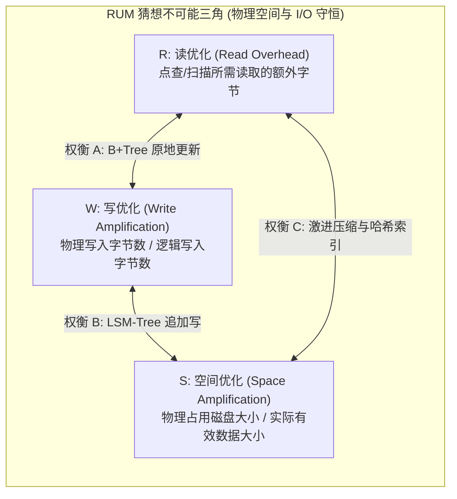
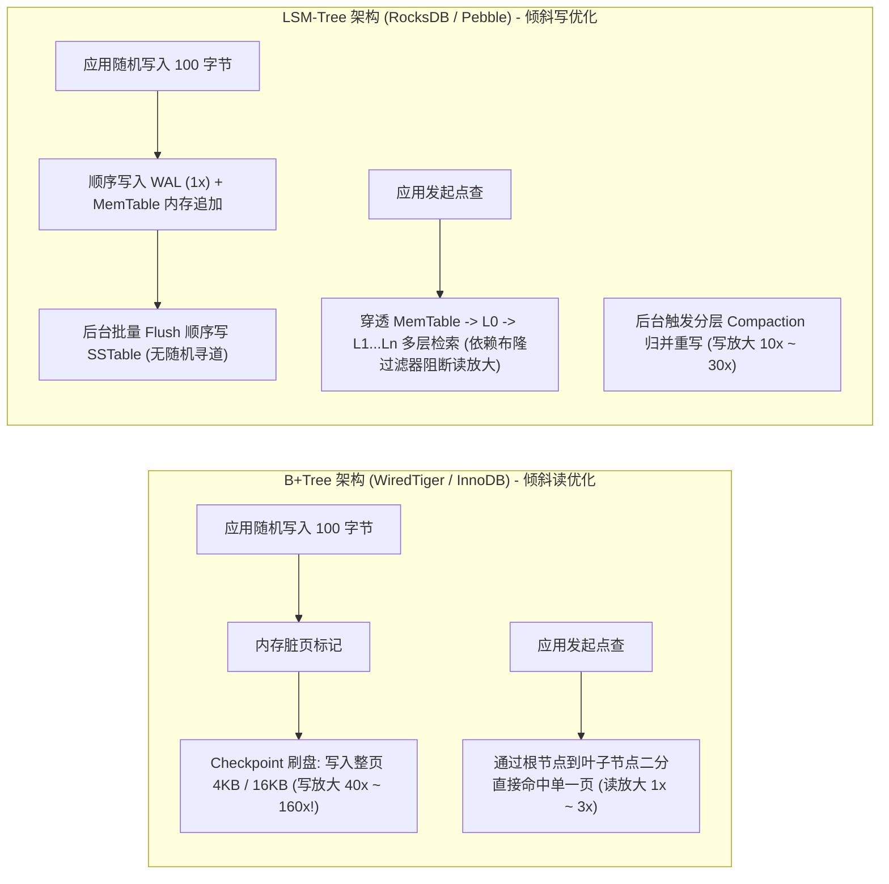
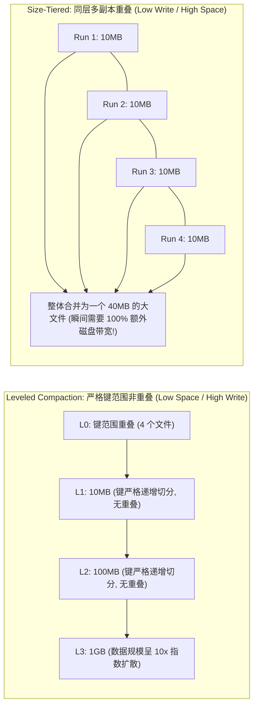
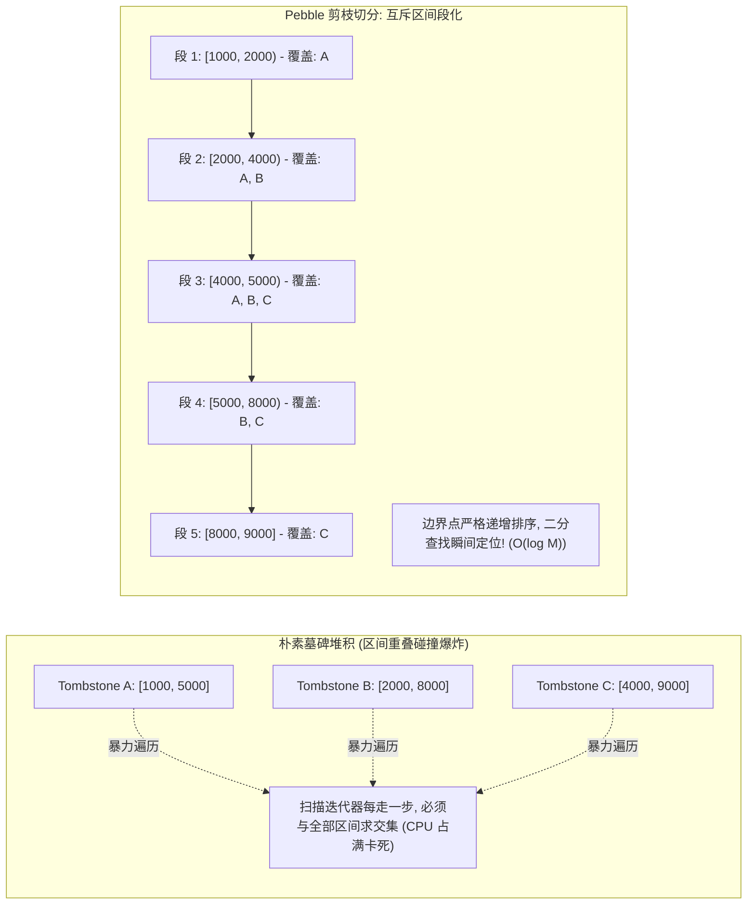

**TL;DR：** 在分布式存储与数据库内核的世界里，“天下没有免费的午餐”绝非一句修辞，而是一条被数学严格约束的物理定律。2016 年，哈佛大学 Manos Athanassoulis 等人在 EDBT 国际顶级数据工程会议上正式确立了著名的 **RUM 猜想（RUM Conjecture）**：在任意存储系统中，**读开销（Read Overhead, R）**、**写放大（Write Amplification, W）**与**空间/内存放大（Space/Memory Amplification, U/S）**构成了一个无法同时兼顾的“不可能三角”——优化其中任意两个指标，必然以恶化第三个指标为硬性代价。传统基于 B+Tree 页面原地更新（In-Place Update）的引擎（如 MySQL InnoDB、MongoDB WiredTiger）将读延迟压榨至极致，却在 SSD 固态闪存上付出了高达 30~60 倍的写放大代价；而基于 LSM-Tree 追加写（Out-of-Place Append）的引擎（如 RocksDB、CockroachDB 的 Pebble）将顺序写吞吐拉满，却不得不引入多层压实（Compaction）与布隆过滤器（Bloom Filter）来对抗灾难性的读放大和空间膨胀。本文从物理硬件与信息论数学推导出发，全面解构 RUM 猜想在现代生产级存储内核中的取舍谱系与破局算法。

---

## 一、 RUM 猜想：存储系统的不可能三角

现代应用对存储引擎的要求日益严苛：既要高并发随机写，又要毫秒级点查与范围扫描，还要尽量节省昂贵的 NVMe 闪存容量。然而，RUM 猜想给这种“既要又要还要”的幻想划定了物理铁底。



### 1. 三大指标的形式化定义

在存储引擎中，衡量物理效率的核心指标定义如下：

1. **写放大（Write Amplification, WA）**：
   $$\text{WA} = \frac{\text{写入底层物理介质（SSD/NAND）的总字节数}}{\text{应用程序发起的逻辑写入总字节数}}$$
   如果应用程序写入了 1KB 数据，但因为页写入、WAL 预写日志与后台 Compaction 导致向底层介质实际写入了 30KB，则 $\text{WA} = 30$。高 WA 会直接腰斩闪存写入带宽，并急剧消耗 SSD 的物理擦写寿命（P/E Cycles）。

2. **读放大（Read Amplification, RA）**：
   $$\text{RA} = \frac{\text{从底层物理介质读取的总字节数}}{\text{返回给应用程序的有效数据字节数}}$$
   当读取一个 100 字节的 Key 时，如果由于未命中缓存而必须从磁盘读取一个完整的 4KB 页面，且需要跨多个文件版本检索，$\text{RA}$ 将达到数十甚至上百倍。

3. **空间放大（Space Amplification, SA）**：
   $$\text{SA} = \frac{\text{磁盘文件实际占用的物理存储空间}}{\text{最新未被删除有效数据的纯逻辑大小}}$$
   如果数据库有效数据为 100GB，但由于旧版本快照、被覆写的数据尚未物理回收、碎片与未填满的页面，实际占用了 220GB 磁盘，则 $\text{SA} = 2.2$。

### 2. Athanassoulis 2016 数学权衡公式

Athanassoulis 等人在论文 *Designing Access Methods: The RUM Conjecture* 中证明：对于任意确定性的外部存储访问方法，三个维度的优化存在硬性边界：

$$\mathcal{R} \times \mathcal{W} \times \mathcal{S} \ge \mathcal{C}$$

- **若强制 $\mathcal{W} \to 1$（极致写优化）**：数据必须以追加（Append-Only）方式盲写落盘，不做原地合并；这直接导致数据存在历史旧副本，多版本交错分布在磁盘各处，$\mathcal{R}$ 和 $\mathcal{S}$ 必然飙升（典型的未经压实的日志系统）；
- **若强制 $\mathcal{R} \to 1$（极致读优化）**：数据必须严格有序连续存放，一次 I/O 即可定位目标；这要求每次写入或更新时，必须在磁盘中找到确切位置并重新排布相邻数据，导致 $\mathcal{W}$ 爆炸（经典的有序 Flat File 数组）；
- **若强制 $\mathcal{S} \to 1$（极致空间优化）**：必须实时消除一切冗余历史版本与空洞碎片；这要求每次更新或删除都要立即重写数据块并执行强压缩，再次将 $\mathcal{W}$ 推向极限。

---

## 二、 B+Tree vs LSM-Tree：两大流派的物理对决

为了直观理解 RUM 在真实系统中的具象化分歧，我们对比以 **WiredTiger（B+Tree 原地更新）** 与 **RocksDB（LSM-Tree 追加写）** 为代表的两大核心架构：



### 1. WiredTiger / B+Tree 的优势与痛点

- **读优势（Low $\mathcal{R}$）**：B+Tree 的叶子节点保存了全局有序的所有记录。一次点查在树高为 3~4 时，最多经过 3 次页面检索（且非叶子页通常常驻内存），物理点查的 $\text{RA}$ 接近理论下限。
- **写惩罚（High $\mathcal{W}$）**：闪存必须以页面（Page, 通常 4KB/16KB）为最小读写单位。无论你仅仅修改了 8 字节的自增 ID 还是 20 字节的状态字段，WiredTiger 在 Checkpoint 刷盘时都必须将整个 **4KB/16KB 脏页完整刷入磁盘**。
  $$\text{WA}_{\text{B-Tree}} \approx \frac{\text{Page Size}}{\text{Average Update Size}} = \frac{4096}{100} \approx 40.96$$
  此外，B+Tree 的页面分裂（Page Split）会导致物理页面平均填充率只有 **67% 左右**，带来了约 **1.5x 的空间放大**。

### 2. RocksDB / LSM-Tree 的反向突破

1996 年，Patrick O'Neil 提出 Log-Structured Merge-Tree（LSM-Tree）。其核心假设是：**顺序 I/O 速度远超随机 I/O**。
- **写优势（Low $\mathcal{W}$ 在写入瞬时）**：写入时，数据只追加到内存中的 MemTable（跳表 SkipList）与磁盘上的 WAL。由于完全避免了磁盘页面的随机覆写，写入延迟极低，吸纳突发流量能力极强。
- **后台代价（Deferred Tax）**：数据先写入 L0 层，再逐步向下 Compaction。随着层级加深，同一个 Key 会在后台被多次读取并重写落盘。在 RocksDB 经典的 Leveled Compaction 中，全局 $\text{WA}$ 依然可达 **15~30**，并非真正的“零写放大”。

---

## 三、 Compaction 拓扑动力学：Leveled vs Size-Tiered

在 LSM-Tree 存储引擎内部，压实（Compaction）算法决定了整个引擎在 RUM 三角上的坐标定位。现代工业界主要演化出两大核心流派：

| 压实拓扑模型 | 代表引擎/配置 | 核心压实逻辑 | 写放大 (WA) | 空间放大 (SA) | 点查读放大 (RA) |
| :--- | :--- | :--- | :--- | :--- | :--- |
| **Size-Tiered (STCS)** | Cassandra, RocksDB Universal | 每一层包含大小相近的若干个 SSTable，等文件攒满后再做整体合并 | **低 (4 ~ 8x)** | **极高 (2.0 ~ 2.5x)**<br/>需保留 50% 磁盘冗余 | **高**<br/>每一层需检索多个文件 |
| **Leveled Compaction (LCS)** | RocksDB 默认, Pebble | L1~Ln 每层大小呈指数放大（如 10x），每层内 Key 范围严格绝不重叠 | **高 (15 ~ 35x)** | **极低 (1.11x)**<br/>几乎无过期冗余 | **极低**<br/>每层最多命中 1 个 SSTable |



### 1. Leveled 压实的写放大极限推导

在 Leveled 模式下，假设层级放大因子为 $T$（通常 $T = 10$），层数为 $L$：
- 当一个 SSTable 从 $L_i$ 层压实到 $L_{i+1}$ 层时，由于 $L_{i+1}$ 层的容量是 $L_i$ 的 $T$ 倍，其 Key 覆盖范围平均与 $L_{i+1}$ 层的 **$T$ 个 SSTable** 发生重叠；
- 因此，每次合并需要读取并重写这 $T$ 个文件；
- 数据从最顶层沉降到最底层，总写入放大理论值为：
  $$\text{WA}_{\text{Leveled}} \approx T \times (L - 1)$$
  若 $T = 10$，层数 $L = 4$，写放大直接逼近 **30 倍**！这就是为什么在重度随机写入负载下，NVMe SSD 经常被 RocksDB 的 Compaction 进程完全吃满 I/O 带宽。

### 2. Pebble 对 RocksDB 的工程超越

CockroachDB 在初期深度依赖 RocksDB，但在大规模高吞吐生产集群中饱受 Cgo 跨语言调用开销与 Compaction 尾延迟抖动的折磨。为此，Cockroach 团队用纯 Go 从零构建了 **Pebble** 存储引擎，并在 Compaction 机制上做出了重大的工程改进：
- **细粒度子压实（Sub-compaction 切分）**：打破单一 SSTable 必须整体参与 Compaction 的限制，基于 Key 范围边界动态切分并发任务，彻底消除了大文件合并造成的“写停顿（Write Stall）”；
- **分段范围墓碑（Fragmented Range Tombstones）**：重构了范围删除的底层存储，避免旧版本墓碑数据在下沉过程中引起多层级连带阻塞。

---

## 四、 布隆过滤器的假阳性率与空间位分配推导

在 LSM-Tree 中，为了对抗多层检索带来的致命**读放大（Read Amplification）**，**布隆过滤器（Bloom Filter）**是不可或缺的防线。

如果一个点查请求访问了一个根本不存在的 Key：
- 没有布隆过滤器：引擎必须逐层（L0, L1, ..., Ln）解压并二分查找每个 SSTable 的元数据与数据块，物理读取次数高达数十次；
- 拥有布隆过滤器：直接在内存中以 $O(1)$ 判定“该 Key 一定不存在”，直接阻断 99% 的无效磁盘 I/O。

### 1. 假阳性率（False Positive Probability）数学推导

设布隆过滤器的位数组长度为 $m$，哈希函数个数为 $k$，插入的 Key 总数为 $n$。

在插入 $n$ 个元素后，某个特定位依然为 0 的概率为：

$$p_0 = \left( 1 - \frac{1}{m} \right)^{kn} \approx e^{-\frac{kn}{m}}$$

当查询一个不存在的元素时，所有 $k$ 个哈希位都刚好被置为 1（即触发误报，假阳性）的概率 $P_{\text{err}}$ 为：

$$P_{\text{err}} = (1 - p_0)^k \approx \left( 1 - e^{-\frac{kn}{m}} \right)^k$$

为了使 $P_{\text{err}}$ 最小，对 $k$ 求一阶导数并令其等于 0，可得**最优哈希函数个数**：

$$k_{\text{opt}} = \frac{m}{n} \ln 2 \approx 0.693 \times \frac{m}{n}$$

将 $k_{\text{opt}}$ 带回原式，可得最优假阳性概率方程：

$$P_{\text{err}} = 2^{-k_{\text{opt}}} = \left( \frac{1}{2} \right)^{\frac{m}{n} \ln 2} \approx 0.6185^{\frac{m}{n}}$$

### 2. 空间与读放大的工业界黄金分配

| 每 Key 分配位数 ($m/n$) | 最佳哈希数 ($k_{\text{opt}}$) | 理论假阳性率 ($P_{\text{err}}$) | 额外内存开销 (1 亿个 Key) | 生产推荐场景 |
| :--- | :--- | :--- | :--- | :--- |
| **8 bits** | 6 | **2.15%** | 95.3 MB | 内存紧张的边缘设备 |
| **10 bits (默认)** | 7 | **0.82% (< 1%)** | 119.2 MB | **RocksDB / Pebble 默认黄金比例** |
| **14 bits** | 10 | **0.11%** | 166.9 MB | 读极其敏感，追求 P99.99 的交易系统 |

这体现了 RUM 猜想在内存微观层面的严格生效：**想要把穿透磁盘的概率压制到 1% 以下，就必须硬性付出每 Key 10 个比特（1.25 字节）的常驻内存放大代价**。

---

## 五、 Range Tombstones 墓碑坍塌陷阱与治理

在 LSM-Tree 中，删除操作并不直接抹去磁盘上的数据，而是写入一条**墓碑记录（Tombstone）**。

### 1. 范围删除（DeleteRange）的读放大灾难

假设业务执行了一次范围删除：`DeleteRange("user_1000", "user_9000")`。
- 如果简单将这个墓碑写入 MemTable 并 Flush 到 SSTable；
- 当客户端随后发起前缀扫描 `Iterate("user_0000", "user_9999")` 时；
- 迭代器必须不断对比当前 Key 是否落在某个 Range Tombstone 的区间内；
- 如果历史上有大量范围删除，不同层级堆积了数千个范围墓碑区间，迭代器每步进一个 Key，都需要在这数千个区间上做区间相交判定（Interval Overlap Check），**原本 $O(\log N)$ 的扫描性能瞬间退化为 $O(N \times K)$，延迟从微秒级恶化为数秒！**



### 2. Pebble 互斥区间切分算法（Fragmented Range Keys）

Pebble 的核心突破是将任意重叠的复杂墓碑集合，在内存中通过扫描线算法（Sweep-line Algorithm）预先切分为**互斥且边界严格单调递增的非重叠段（Non-overlapping Fragments）**：
1. 提取所有墓碑区间的 `StartKey` 与 `EndKey`，去重并排序；
2. 相邻两点构成一个独立的基本区间；
3. 每个基本区间内挂载覆盖它的所有墓碑属性的位图；
4. 扫描迭代器只需在全局有序的基本区间数组上做二分查找，复杂度立即压回严格的 **$O(\log M)$**。

---

## 六、 生产级 C++20 存储拓扑仿真与 RUM 成本推导器

为了在实际架构设计中量化评估业务特征在 B+Tree 与 LSM-Tree 间的成本平衡，以下给出一个基于现代 C++20 标准的 RUM 指标量化推导器。它能够根据负载读写比、Key-Value 尺寸与层级参数，精确计算出真实写放大、磁盘吞吐开销与布隆过滤器内存预算：

```cpp
#include <iostream>
#include <cmath>
#include <cstdint>
#include <iomanip>

struct StorageWorkload {
    double read_ratio;        // 读操作比例 (如 0.8 表示 80% 读)
    double write_ratio;       // 写操作比例 (如 0.2 表示 20% 写)
    size_t key_size_bytes;    // 键大小 (字节)
    size_t val_size_bytes;    // 值大小 (字节)
    uint64_t total_ops_per_sec; // 每秒吞吐要求 (QPS)
};

class RumCostAnalyzer {
public:
    // 计算 B+Tree 原地更新模式下的物理指标
    static void evaluate_btree(const StorageWorkload& w, size_t page_size = 4096) {
        size_t record_size = w.key_size_bytes + w.val_size_bytes;
        // B+Tree 写放大：平均每次写入脏页需要写满整个 page
        double write_amp = static_cast<double>(page_size) / record_size;
        // 空间放大：因页面分裂与碎片，典型填充率约 67%
        double space_amp = 1.0 / 0.67;
        // 读放大：假设树高 3 且根节点常驻内存，平均命中 1~2 次物理页 I/O
        double read_amp = 1.2;

        double write_iops = w.total_ops_per_sec * w.write_ratio;
        double physical_write_mb = (write_iops * page_size) / (1024.0 * 1024.0);

        std::cout << "========== [B+Tree 架构评测 (WiredTiger/InnoDB)] ==========" << std::endl;
        std::cout << "理论写放大 (WA)        : " << std::fixed << std::setprecision(2) << write_amp << " x" << std::endl;
        std::cout << "理论空间放大 (SA)      : " << space_amp << " x (平均填充率 67%)" << std::endl;
        std::cout << "理论读放大 (RA)        : " << read_amp << " 次页读取" << std::endl;
        std::cout << "物理闪存写入吞吐       : " << physical_write_mb << " MB/s" << std::endl;
        std::cout << "适用场景分析           : 强读低写（读比例 > 85%），避免 SSD 极速写穿" << std::endl;
    }

    // 计算 LSM-Tree (Leveled 模式) 下的物理指标
    static void evaluate_lsm_leveled(const StorageWorkload& w, int levels = 4, int size_multiplier = 10, int bits_per_key = 10) {
        size_t record_size = w.key_size_bytes + w.val_size_bytes;
        // Leveled Compaction 写放大：每一层乘上放大因子
        double write_amp = 1.0 /* WAL */ + (levels - 1) * size_multiplier * 0.75 /* 平均重叠度校正 */;
        // Leveled 空间放大非常优异，几乎无过期文件，约 1.11x
        double space_amp = 1.11;
        
        // 计算布隆过滤器假阳性率
        double fp_rate = std::pow(0.6185, bits_per_key);
        // 读放大：点查平均穿透层数 + 假阳性穿透率
        double read_amp = 1.0 + (levels * fp_rate);

        double write_iops = w.total_ops_per_sec * w.write_ratio;
        double physical_write_mb = (write_iops * record_size * write_amp) / (1024.0 * 1024.0);

        std::cout << "\n========== [LSM-Tree 架构评测 (RocksDB/Pebble Leveled)] ==========" << std::endl;
        std::cout << "理论写放大 (WA)        : " << write_amp << " x" << std::endl;
        std::cout << "理论空间放大 (SA)      : " << space_amp << " x (紧凑归并)" << std::endl;
        std::cout << "布隆过滤器假阳性率     : " << (fp_rate * 100.0) << " % (分配 " << bits_per_key << " bits/key)" << std::endl;
        std::cout << "物理点查读放大 (RA)    : " << read_amp << " 次 SSTable 寻道" << std::endl;
        std::cout << "物理闪存写入吞吐       : " << physical_write_mb << " MB/s" << std::endl;
        std::cout << "适用场景分析           : 写入密集型（写比例 > 25%）与大容量存储优化" << std::endl;
    }
};

int main() {
    std::cout << ">>> 启动 RUM 存储猜想工程成本推导引擎 <<<" << std::endl;

    // 典型在线交易/日志负载：20% 写，80% 读，Key=16B，Value=128B，50,000 QPS
    StorageWorkload workload{
        .read_ratio = 0.80,
        .write_ratio = 0.20,
        .key_size_bytes = 16,
        .val_size_bytes = 128,
        .total_ops_per_sec = 50000
    };

    RumCostAnalyzer::evaluate_btree(workload, 4096);
    RumCostAnalyzer::evaluate_lsm_leveled(workload, 4, 10, 10);

    return 0;
}
```

---

## 七、 总结与下篇预告

RUM 猜想向我们揭示了存储内核演进的终极本质：**没有任何一种数据结构是全能的**。
- **B+Tree** 用昂贵的写入放大换取了极低且稳定的读放大；
- **LSM-Tree** 用延后的压实税与布隆过滤器的内存开销换取了极限的追加写吞吐；
- 存储内核工程师的核心职责，绝不是盲目崇拜某种“高性能”组件，而是**精确度量系统的读写比、Key-Value 大小与生命周期，在 RUM 三角中精确定位最佳平衡点**。

然而，软件层面的努力终究有其天花板。不论我们如何优化压实算法，现代 NAND 闪存物理结构中的“擦除块（Block）”与“写入页（Page）”不对称特性，依然在底层驱动着二次写入放大与严重的 P99 尾延迟抖动。

下一篇，我们将直接穿透到物理芯片级，深入解构 **《SSD 物理闪存与 ZNS 存储：FTL 闪存转换层、GC 写入放大与 ZNS 绕过内部 GC 消除 P99 抖动》**，探索存储从“软件迁就硬件”走向“软硬协同设计（Hardware-Software Co-Design）”的前沿革命。
