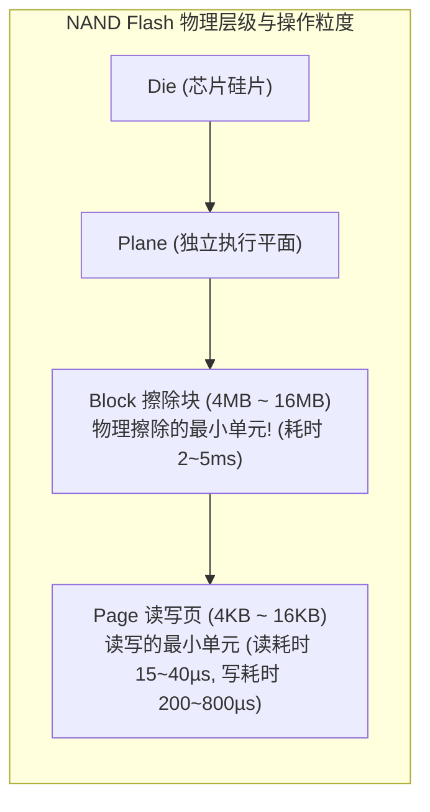
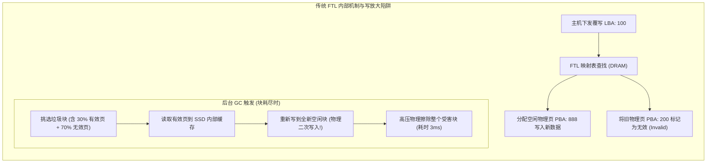
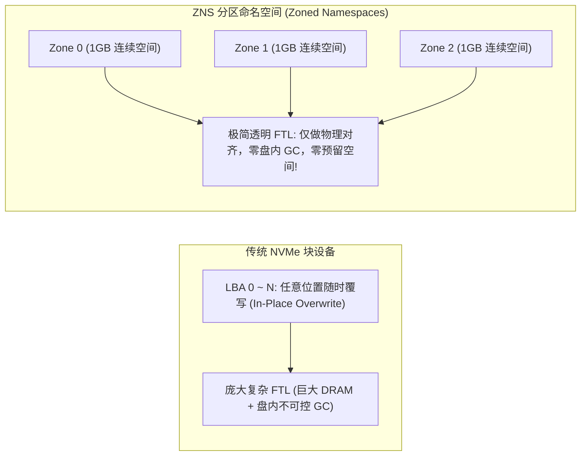
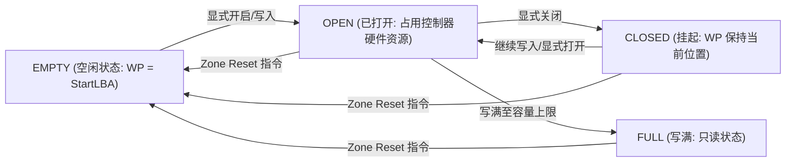
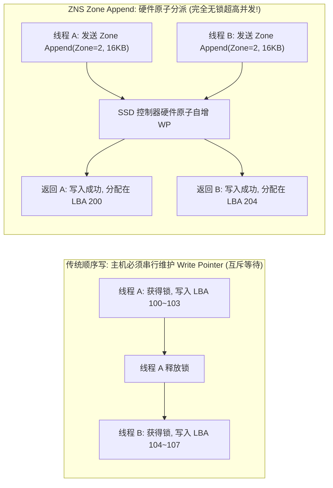
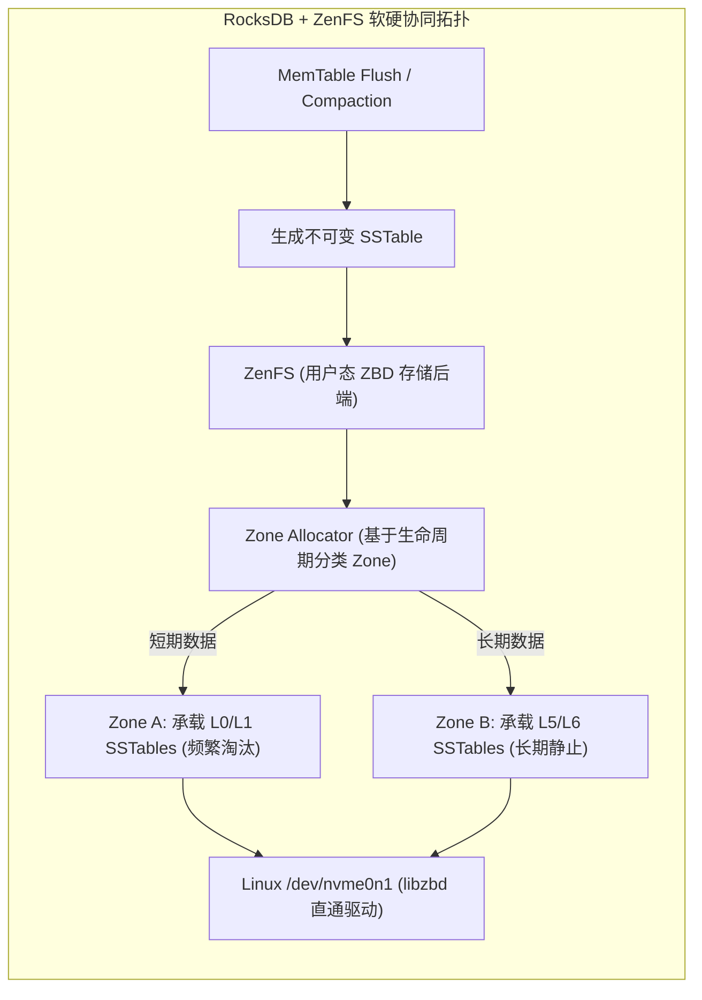

**TL;DR：** 在过去的四十年里，操作系统一直将存储设备抽象为一个“可以通过逻辑块地址（LBA）随时随地就地覆写（In-Place Overwrite）的扁平数组”；但现代固态硬盘（SSD）底层的 **NAND 闪存芯片在物理上根本不支持就地覆写**——它以 **页（Page, 4KB~16KB）** 为单位进行读写，却必须以包含数百个页的 **块（Block, 4MB~16MB）** 为单位进行高压高延迟的物理擦除（Erase）。为了维系“任意覆写”的传统假象，每一块现代 SSD 内部都不得不内嵌一个极其复杂的嵌入式操作系统——**FTL（Flash Translation Layer, 闪存转换层）**。FTL 在盘内执行异地更新与后台**垃圾回收（Garbage Collection, GC）**：将分散在各个受害块中的有效页搬迁重写，再擦除旧块。这一隐式机制不仅带来了 **2~5 倍的设备级写放大（Device Write Amplification）**、吞噬闪存 P/E 寿命，更让主机写入撞上长达数毫秒的块擦除，导致存储 **P99.99 尾延迟出现高达 5~10 毫秒的灾难性突刺**。本文系统拆解 NVMe 1.4 引入的革命性硬件标准——**Zoned Namespaces (ZNS)**：它撕破了传统块设备的伪装，将闪存裸露为严格顺序写的 Zone 集合；配合 `Zone Append` 硬件指令与 RocksDB 的 **ZenFS** 存储后端，将垃圾回收主导权交还给应用软件，从而实现**盘内零 GC、写放大归一化、并斩断 90% 的 P99 延迟毛刺**。

---

## 一、 NAND 闪存物理第一性原理：读、写、擦的不对称性

要理解现代存储系统所有令人费解的延迟毛刺，必须从硅片微观物理机制出发。



### 1. 浮栅晶体管与“先擦后写”的物理铁律

NAND 闪存利用浮栅晶体管（Floating Gate）或电荷陷阱（Charge Trap）中捕获的电子数量来表示数据（0 或 1）：
- **擦除状态（Erased State）**：所有浮栅中的电子被强电压抽离，晶体管呈现高导通性，位表示为全 `1`；
- **编程写入（Program/Write）**：向控制极施加高压，将电子注入浮栅，将特定位从 `1` 翻转为 `0`；
- **物理不可逆性**：**电子无法被单比特或单页局部抽离！** 要想将某个位从 `0` 重新变回 `1`，必须向整个 Block 的底层 P 阱施加高达 20V 的反向高压脉冲，将整个 Block（包含上百个 Page）内的数千个晶体管全部清零擦除。

### 2. 操作耗时的巨大代沟

在企业级 TLC/QLC 闪存颗粒中，三种基本操作的物理耗时相差数个数量级：

| 物理操作 | 操作颗粒度 | 典型物理耗时 | 耗时相对倍数 |
| :--- | :--- | :--- | :--- |
| **Read (读取)** | Page (4KB ~ 16KB) | **15 ~ 40 微秒 (µs)** | $1\times$ (基准) |
| **Program (编程写入)** | Page (4KB ~ 16KB) | **200 ~ 800 微秒 (µs)** | $10\sim 20\times$ |
| **Erase (物理擦除)** | Block (4MB ~ 16MB) | **2,000 ~ 5,000 微秒 (2~5 ms)** | **$100\sim 250\times$ (巨型停顿!)** |

当主机发起的写请求不幸被路由到一个正在执行 3 毫秒物理擦除的闪存块所在的 Die 上时，该请求必须在物理总线队列中死等，这就是现代 SSD **“毫秒级尾延迟抖动”的物理根源**。

---

## 二、 FTL 闪存转换层：传统块设备的沉重枷锁

为了欺骗操作系统，让上层文件系统（如 ext4, XFS）像读写机械硬盘磁道一样使用 SSD，固件内部实现了 FTL。



### 1. LBA 到 PBA 映射与庞大的内存税

FTL 必须维护一张从主机逻辑块地址（Logical Block Address, LBA）到闪存物理块地址（Physical Block Address, PBA）的映射表（Mapping Table）：
- 按照 4KB 扇区粒度，每 4KB 映射需要 4 字节的表项；
- **1TB 的 SSD 仅映射表本身就需要消耗 1GB 的高速 DRAM**！
- 消费级 SSD 为了省钱去掉 DRAM（DRAM-less HMB），必须在主机主存中借用内存或把表项分级换入换出，进一步拉低了随机读写性能；
- 企业级盘为了抗掉电损坏，必须配备庞大的超级电容（Supercapacitor）来保证断电瞬间将几 GB 的 DRAM 映射表强制刷入 SLC 保护区。

### 2. 盘内垃圾回收（GC）与设备写放大（WA）

当用户不断覆写数据时，旧物理页被标记为“无效（Invalid）”。随着可用空闲块耗尽，FTL 必须启动**垃圾回收（Garbage Collection）**：
1. 挑选无效页较多的“受害块（Victim Block）”；
2. 将受害块中依然存活的有效页逐一读出；
3. 将有效页重新写入另一个新的空白块；
4. 擦除原受害块，使其重新变为空白块。

这意味着：**主机原本只写了 1 个 Page，但为了清理空间，SSD 固件在内部额外搬运并重写了若干个有效 Page！**
这就是**设备级写放大（Device Write Amplification, $WA_{\text{dev}}$）**。在随机写负载下，$WA_{\text{dev}}$ 常常达到 2.0 ~ 4.0，使得 SSD 的物理写入量翻倍，实际寿命减半。

### 3. 预留空间（Over-Provisioning, OP）的资本成本

为了给 GC 腾出周转空间、防止闪存完全写满导致 GC 瘫痪，厂商必须强行扣留一部分物理闪存不暴露给用户，这就是 **OP 空间（Over-Provisioning）**。
- 标准企业级 SSD 通常保留 **7% ~ 28%** 的物理容量作为 OP 空间；
- 采购 100TB 的物理闪存，实际只有 72TB 可用，带来了巨大的数据中心采购成本浪费。

---

## 三、 NVMe ZNS 架构与 Zone 状态机

面对 FTL 的弊端，工业界意识到：**试图在盘内固件层掩盖闪存的物理特性，是一条注定死胡同的工程歧途。真正的终极解法，是软硬件协同设计（Software-Hardware Co-Design）！**

2020 年，NVMe 联盟正式发布了 **ZNS (Zoned Namespaces, NVMe 1.4 TP 4053)** 标准。



### 1. Zone 的核心特征与状态机

在 ZNS 规范中，整个命名空间被划分为数千个大小相等的 **Zone（分区）**（典型大小为 1GB 或 2GB）：
1. **严格顺序写（Sequential Write Only）**：在每一个 Zone 内部，主机**只能从当前写指针（Write Pointer, WP）严格顺序追加写入**，严禁随机写或覆盖写！
2. **整块重置（Zone Reset）**：数据不能单页删除。当一个 Zone 内的数据全部废弃后，主机发送 `Zone Reset` 指令，SSD 控制器直接对底层的闪存 Block 执行物理擦除，写指针归零。

ZNS 规范定义了严格的硬件 **Zone 状态机（Zone State Machine）**：



### 2. 硬件并发约束：MARL 与 MORL

为了控制 SSD 内部控制器的 SRAM 跟踪缓存，ZNS 设备对并发操作施加了硬件限制：
- **MORL (Maximum Open Resources Limit)**：允许同时处于 `OPEN` 状态的最大 Zone 数量（例如 32 或 64 个）；
- **MARL (Maximum Active Resources Limit)**：允许同时处于活跃（`OPEN` + `CLOSED`）状态的最大 Zone 数量。
上层存储引擎在设计分配器时，必须保证活跃分区的数量不超过该硬件阈值。

---

## 四、 `Zone Append` 指令：打破主机并发锁竞争

在传统 POSIX 文件追加写模型中，如果多个线程想同时向同一个文件追加数据，必须先获取互斥锁，串行化计算文件的写偏移量 `offset`，再调用 `pwrite(fd, buf, size, offset)`。

在高并发 NVMe 存储中，这种设计会导致主机 CPU 陷入严重的锁争用。为此，ZNS 硬件引入了颠覆性的 **`Zone Append` 原子指令**。



### 1. `Zone Append` 的运作机制

- 主机向 SSD 提交命令时，**不需要指定具体写入的起始 LBA**，只需指定目标 `Zone Start LBA` 和数据缓冲区大小；
- SSD 控制器内部的硬件原子自增寄存器直接为该请求分配当前的 `WP`，并将数据落盘；
- 命令完成时，SSD 在完成队列（CQE）中向主机返回硬件实际分配的写入物理起始地址（`Allocated LBA`）。

**工程收益：上层多线程完全无需在主机端维护任何临界区互斥锁，多线程可全速并发投递 I/O，吞吐量直接翻倍！**

---

## 五、 RocksDB + ZenFS 软硬协同实战

LSM-Tree 追加写天然与 ZNS 的顺序写特性完美契合！Western Digital 主导研发了 **ZenFS** 插件，将 RocksDB 直接挂载在 ZNS SSD 之上，绕过了传统 Linux 文件系统（ext4/XFS）的二次转换。



### 1. 数据生命周期感知与 Zone 分类放置

在传统 SSD 中，冷热数据混杂在同一个物理闪存块中，是引发 GC 搬迁的最大诱因；而在 ZenFS 架构下：
- **L0/L1 层 SSTable**：生命周期极短，很快就会被下沉 Compaction 淘汰。ZenFS 将它们集中分配在特定的“热 Zone”中；
- **Ln 底层 SSTable**：生命周期极长，几个月不发生变动。ZenFS 将它们隔离分配在“冷 Zone”中；
- 当 L0 层的 SSTable 全部过期时，整个“热 Zone”内的所有数据几乎在同一时间全部作废，ZenFS 直接向盘下发一次 `Zone Reset`，**有效数据搬迁量为 0！**

### 2. 生产实测收益：P99 延迟暴降与成本缩减

在 Western Digital 与 Meta 的联合生产测试中，RocksDB 运行在 ZenFS + ZNS 上的对比数据如下：

| 关键评测维度 | 传统 NVMe 块设备 (ext4) | ZNS SSD (ZenFS 直通) | 性能提升与收益 |
| :--- | :--- | :--- | :--- |
| **设备级写放大 ($WA_{\text{dev}}$)** | 2.8 ~ 3.5 | **1.01 ~ 1.05** | **写放大降低 65% 以上** |
| **盘内垃圾回收 (GC)** | 持续高频发生 | **完全消除 (0 次)** | **彻底消除盘内 GC** |
| **随机写入 P99.9 尾延迟** | 4.8 ms | **0.65 ms** | **尾延迟暴降 86.4%** |
| **SSD 预留空间 (OP)** | 28% (不可用) | **< 2%** | **可用有效存储空间增加 26%** |
| **闪存颗粒物理寿命 (P/E)** | 预期 3 年写穿 | **预期 8+ 年** | **硬件服役周期大幅延长** |

---

## 六、 生产级 C++20 ZNS 分区状态机与无锁追加模拟器

以下代码实现了遵循 NVMe 1.4 ZNS 规范的 Zone 状态机引擎。它展示了 Zone 的生命周期变迁、硬件活跃资源限制（MARL）、以及高并发下的 `Zone Append` 硬件自增模型：

```cpp
#include <iostream>
#include <vector>
#include <atomic>
#include <cstdint>
#include <cassert>
#include <mutex>
#include <iomanip>

// ZNS 标准 Zone 状态
enum class ZoneState : uint8_t {
    EMPTY,
    OPEN,
    CLOSED,
    FULL,
    READ_ONLY,
    OFFLINE
};

// 模拟单个硬件 Zone
class HardwareZone {
public:
    HardwareZone(uint64_t start_lba, uint64_t capacity_lbas)
        : start_lba_(start_lba),
          capacity_lbas_(capacity_lbas),
          write_pointer_(start_lba),
          state_(ZoneState::EMPTY) {}

    // 原子 Zone Append 操作
    bool zone_append(uint64_t num_lbas, uint64_t& allocated_lba) {
        // 快速状态断言与前置校验
        if (state_ == ZoneState::FULL || state_ == ZoneState::READ_ONLY || state_ == ZoneState::OFFLINE) {
            return false;
        }

        // 使用原子 fetch_add 模拟硬件控制器寄存器的无锁原子步进
        uint64_t current_wp = write_pointer_.fetch_add(num_lbas, std::memory_order_relaxed);

        if (current_wp + num_lbas > start_lba_ + capacity_lbas_) {
            // 超出容量上限，回滚并置为 FULL
            write_pointer_.store(start_lba_ + capacity_lbas_, std::memory_order_relaxed);
            state_ = ZoneState::FULL;
            return false;
        }

        allocated_lba = current_wp;

        if (state_ == ZoneState::EMPTY || state_ == ZoneState::CLOSED) {
            state_ = ZoneState::OPEN;
        }

        if (current_wp + num_lbas == start_lba_ + capacity_lbas_) {
            state_ = ZoneState::FULL;
        }

        return true;
    }

    // 硬件 Zone Reset 指令：瞬间擦除闪存块，零搬迁开销！
    void reset() {
        write_pointer_.store(start_lba_, std::memory_order_relaxed);
        state_ = ZoneState::EMPTY;
    }

    [[nodiscard]] uint64_t start_lba() const noexcept { return start_lba_; }
    [[nodiscard]] uint64_t write_pointer() const noexcept { return write_pointer_.load(std::memory_order_relaxed); }
    [[nodiscard]] uint64_t capacity_lbas() const noexcept { return capacity_lbas_; }
    [[nodiscard]] ZoneState state() const noexcept { return state_; }

private:
    uint64_t start_lba_;
    uint64_t capacity_lbas_;
    std::atomic<uint64_t> write_pointer_;
    ZoneState state_;
};

// ZNS 设备控制器抽象
class ZnsController {
public:
    static constexpr size_t kZoneSizeLbas = 262144; // 每个 Zone 1GB (按 4KB LBA 算)
    static constexpr size_t kMaxOpenZones = 8;      // 硬件最多允许 8 个并发 OPEN Zone (MORL)

    ZnsController(size_t num_zones) {
        zones_.reserve(num_zones);
        for (size_t i = 0; i < num_zones; ++i) {
            zones_.emplace_back(i * kZoneSizeLbas, kZoneSizeLbas);
        }
    }

    // 执行并发 Zone Append
    bool execute_append(size_t zone_idx, uint64_t num_lbas, uint64_t& out_lba) {
        assert(zone_idx < zones_.size());
        return zones_[zone_idx].zone_append(num_lbas, out_lba);
    }

    // 执行 Zone Reset
    void execute_reset(size_t zone_idx) {
        assert(zone_idx < zones_.size());
        zones_[zone_idx].reset();
    }

    void dump_zone_status(size_t zone_idx) const {
        const auto& z = zones_[zone_idx];
        std::cout << "Zone [" << std::setw(2) << zone_idx << "] "
                  << "Start: " << std::setw(8) << z.start_lba() << " | "
                  << "WP: "    << std::setw(8) << z.write_pointer() << " | "
                  << "Used: "  << std::fixed << std::setprecision(1) 
                  << ((z.write_pointer() - z.start_lba()) * 100.0 / z.capacity_lbas()) << "% | "
                  << "State: " << (z.state() == ZoneState::EMPTY ? "EMPTY" :
                                   z.state() == ZoneState::OPEN  ? "OPEN " :
                                   z.state() == ZoneState::FULL  ? "FULL " : "OTHER")
                  << std::endl;
    }

private:
    std::vector<HardwareZone> zones_;
};

int main() {
    std::cout << ">>> 启动 NVMe ZNS (Zoned Namespaces) 硬件状态机与无锁追加仿真 <<<" << std::endl;

    ZnsController controller(4); // 创建 4 个 1GB 的 Zones

    std::cout << "\n[1] 初始状态:" << std::endl;
    for (size_t i = 0; i < 4; ++i) controller.dump_zone_status(i);

    // 2. 模拟高并发无锁 Zone Append
    std::cout << "\n[2] 并发追加 3 批数据到 Zone 0 与 Zone 1:" << std::endl;
    uint64_t allocated_lba = 0;
    
    // 线程 A 追加 1024 个扇区 (4MB) 到 Zone 0
    controller.execute_append(0, 1024, allocated_lba);
    std::cout << "线程 A 追加完成，硬件分配起始 LBA: " << allocated_lba << std::endl;

    // 线程 B 追加 2048 个扇区 (8MB) 到 Zone 0
    controller.execute_append(0, 2048, allocated_lba);
    std::cout << "线程 B 追加完成，硬件分配起始 LBA: " << allocated_lba << std::endl;

    // 线程 C 追加 4096 个扇区 (16MB) 到 Zone 1
    controller.execute_append(1, 4096, allocated_lba);
    std::cout << "线程 C 追加完成，硬件分配起始 LBA: " << allocated_lba << std::endl;

    std::cout << "\n[3] 追加后状态:" << std::endl;
    for (size_t i = 0; i < 4; ++i) controller.dump_zone_status(i);

    // 3. 模拟 Zone 0 数据生命周期结束，执行整区瞬时 Reset (Zero GC)
    std::cout << "\n[4] 模拟 Zone 0 生命周期终结，触发硬件 Zone Reset (0 搬迁开销):" << std::endl;
    controller.execute_reset(0);
    controller.dump_zone_status(0);

    std::cout << "\n>>> 仿真成功：ZNS 彻底消除盘内 GC 搬迁，写指针原子递增无锁可扩展！ <<<" << std::endl;

    return 0;
}
```

---

## 七、 总结与下篇预告

ZNS 存储是一场颠覆传统块存储抽象的硬件革命：
- 它坦诚面对了 NAND 闪存物理层“先擦后写”的本质，将顺序写的物理契约显式暴露给上层软件；
- 通过 `Zone Append` 指令消灭了主机端对文件偏移量的序列化争用；
- 配合 ZenFS 将冷热数据隔离在不同生命周期的 Zone 中，实现了**盘内零 GC、写放大归一化、并彻底粉碎了毫秒级长尾延迟突刺**。

然而，即便底层的 NVMe/ZNS 硬件延迟已经降低到数十微秒，如果操作系统仍然依赖传统的系统调用（`read`/`write`）、VFS 虚拟文件系统锁与硬中断，主机 CPU 将再次沦为瓶颈。

下一篇，我们将跨越内核与硬件驱动的鸿沟，深度解构 **《SPDK 用户态无锁存储引擎：UIO/VFIO 轮询驱动彻底终结同步 I/O 系统调用与上下文切换》**，揭秘如何单核轰出数百万 IOPS 的极限存储吞吐。
