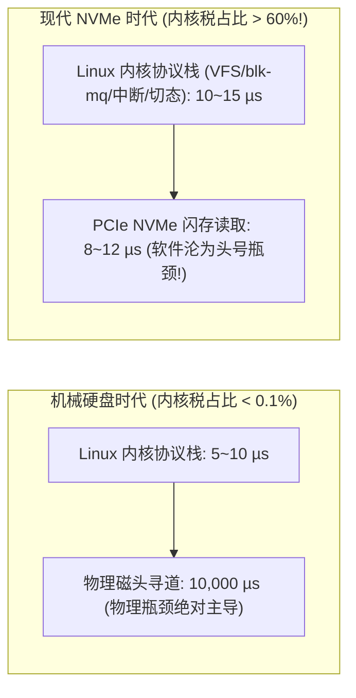
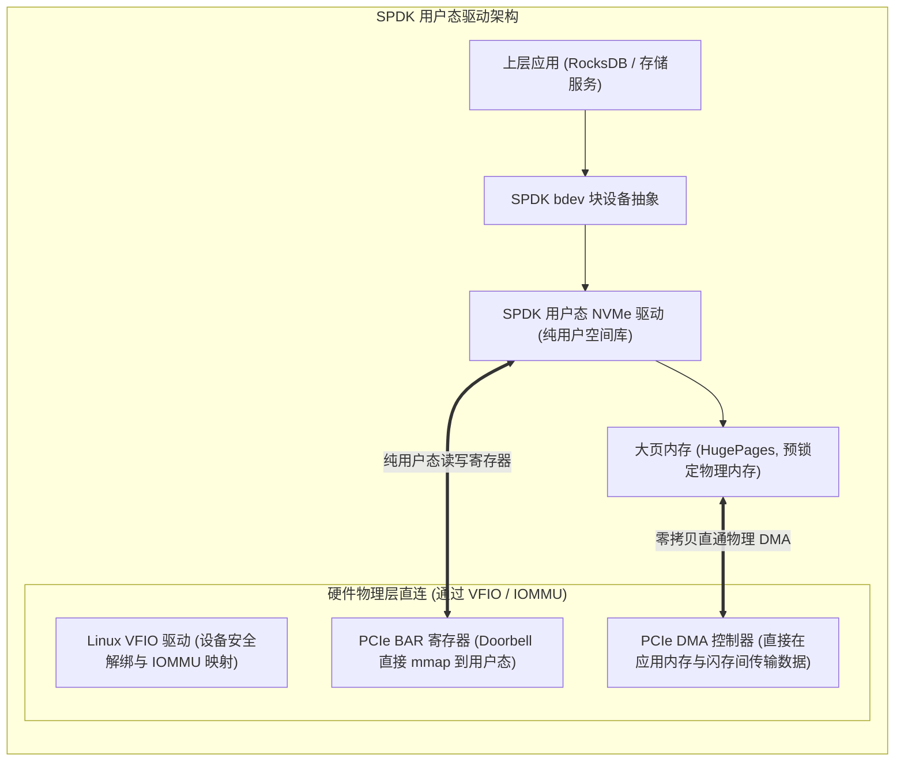
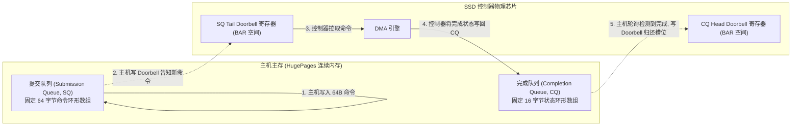
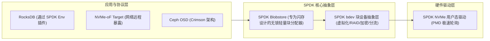

**TL;DR：** 在机械硬盘（HDD）时代，单次随机 I/O 的物理寻道耗时高达 **10 毫秒（10,000 微秒）**，Linux 操作系统内核在 VFS、块设备通用层（`blk-mq`）、页缓存（Page Cache）以及上下文切换上耗费的 **5~10 微秒** 显得无足轻重（占比不足 0.1%）；然而，随着 PCIe Gen5 NVMe SSD 将底层闪存读写延迟压缩至 **8~15 微秒**，**内核软件层自身的开销直接占据了端到端总延迟的 50%~70%！** 传统的 POSIX 同步接口（`read`/`write`）单核吞吐被死死压制在 10~15 万 IOPS 的天花板上，CPU 全被系统调用打满。为了砸碎这堵“软件 I/O 墙”，Intel 主导研发了革命性的 **SPDK（Storage Performance Development Kit）**：利用 Linux UIO/VFIO 技术将 NVMe 控制器的 PCIe BAR 空间与 DMA 物理通道直接挂载至用户态；以专有单核绑核的**轮询模式驱动（PMD）**彻底消灭所有硬件中断；为每个工作线程分配专属的 NVMe 提交/完成队列对（SQ/CQ），实现全链路**零内核态陷入、零锁争用、零内存拷贝**，在单颗 CPU 核心上轰出超过 **500 万 IOPS** 的极限物理吞吐。

---

## 一、 “存储 I/O 墙”的反转：当软件比硬件更慢

计算机体系结构的发展正在经历一场前所未有的“性能倒挂”：



### 1. 传统内核块设备 I/O 栈的沉重税负

当应用程序调用一次 `pread(fd, buf, 4096, offset)` 读取 NVMe 盘上的一个数据块时，控制流必须经历以下复杂关卡：
1. **系统调用跨态陷阱（Syscall Trap）**：执行 `syscall` 指令，CPU 从 Ring 3 用户态切换至 Ring 0 内核态，保存寄存器现场；
2. **VFS 虚拟文件系统抽象**：遍历 inode、校验权限、处理文件锁与 POSIX 语义；
3. **通用块设备层（Generic Block Layer & `blk-mq`）**：构建 `struct bio`，向多队列块层分派请求，经历 I/O 调度器（None/MQ-Deadline）的流控排队；
4. **内核 NVMe 驱动打包**：将 `bio` 转换为 NVMe 命令提交到硬件队列，写入 PCIe Doorbell 寄存器；
5. **硬件中断与线程睡眠（Interrupt & Sleep）**：当前线程让出 CPU，陷入睡眠等待；NVMe 盘处理完毕后触发 PCIe MSI-X 硬件中断，内核中断处理程序唤醒等待线程；
6. **再次上下文切换与数据拷贝**：内核将数据从内核 Direct I/O 缓冲区或 Page Cache 拷贝给用户态 `buf`，恢复现场并返回用户空间。

**物理账本**：在 4KB 随机读场景下，上述内核链路至少消耗 **4,500 ~ 9,000 个 CPU 时钟周期（约 1.5~3 微秒）**，并伴随两次强制上下文切换带来的 CPU L1/L2 缓存行冷失效（Cold Cache）。

---

## 二、 SPDK 架构基石：UIO/VFIO 与用户态无中断轮询

SPDK 击碎内核税的核心手段，是将 NVMe 驱动从 Linux 内核空间完整**搬移到用户态（User-Space）**。



### 1. VFIO 与安全的用户态硬件直通

在传统 Linux 中，出于安全考虑，非特权用户态进程绝对禁止直接读写物理硬件寄存器。SPDK 深度依赖 Linux 内核的 **VFIO（Virtual Function I/O）** 框架：
- **安全隔离**：借助 CPU 的 **IOMMU（I/O 内存管理单元，如 Intel VT-d）**，硬件级限制物理网卡或 NVMe 盘只能访问经过内核显式授权的主机物理内存页，杜绝恶意 DMA 攻击；
- **BAR 空间映射**：通过 `mmap("/dev/vfio/X")`，将 NVMe 控制器的 PCIe BAR（Base Address Register）直接映射为用户态进程的一段虚拟内存指针；
- **完全绕过内核驱动**：从此，用户态代码只需向这段指针执行普通的解引用读写操作，即可直接与物理芯片的硬件寄存器通信，**系统调用次数降为 0**！

### 2. 轮询模式驱动（PMD, Polled Mode Driver）

在高并发低延迟系统中，**“中断（Interrupt）”是性能的剧毒之物**：
- 当系统达到 1,000,000 IOPS 时，如果每秒产生 100 万次硬件硬中断，CPU 将 100% 沦陷在中断现场保存、TLB 刷新与上下文切换的泥潭中，业务逻辑根本无法执行；
- **SPDK 彻底关闭 NVMe 设备的中断**！
- 采用 **PMD 轮询模式**：让专用工作线程（Worker Thread）独占一个 CPU 物理核，在一个紧凑的 `while (true)` 极简汇编循环中，持续轮询 NVMe 完成队列（Completion Queue）的内存标志位；
- 只要 SSD 完成了数据读写，主机 CPU 在 **数十纳秒** 内即可察觉并执行后续回调，端到端延迟达到物理极限。

---

## 三、 NVMe 队列对（QP）机理与硬件门铃（Doorbell）

要深入理解 SPDK 的高性能，必须掌握 NVMe 协议最底层的核心结构——**队列对（Queue Pair, QP）**。



### 1. SQ 与 CQ 的物理环形工作流

每个 NVMe 队列对由两个环形内存缓冲区组成：
1. **Submission Queue (SQ)**：每个命令项固定为 **64 字节**。包含操作码（Opcode: Read/Write）、起始 LBA、传输长度以及数据缓冲区的物理地址指针（PRP 或 SGL）；
2. **Completion Queue (CQ)**：每个状态项固定为 **16 字节**。包含命令执行状态、错误码以及用于指示新数据到达的**相位反转位（Phase Tag, P-bit）**。

### 2. 硬件门铃寄存器（Doorbell Registers）

为了协调主机与 SSD 硬件之间的读写进度，NVMe 规范在 PCIe BAR 空间定义了**门铃寄存器（Doorbell）**：
- **SQ Tail Doorbell**：当主机向 SQ 写入了 $K$ 条新命令后，主机向该寄存器写入最新的 Tail 索引值，通知 SSD：“有活干了！”；
- **CQ Head Doorbell**：当主机通过 PMD 轮询消费了 CQ 中的完成事件后，向该寄存器写入最新的 Head 索引值，通知 SSD：“已确认处理，该槽位可被复用！”。

### 3. SPDK 的“每线程无锁独立队列（Lock-Free Per-Thread QP）”

在 Linux 内核原生驱动中，多个线程常常需要竞争同一个块设备的全局队列，引发严重的锁等待。
- NVMe 规范允许一块 SSD 支持高达 **64K 个并发队列对（Queue Pairs）**！
- SPDK 充分利用了这一硬件特性：**为每一个分配给 SPDK 的 CPU 核心创建专属且独立的 SQ/CQ 对**；
- 核心 1 永远只读写属于自己的 `QP_1`，核心 2 永远只读写 `QP_2`；
- **全链路 100% 无锁（Zero Lock Contention）**，系统吞吐量随 CPU 核数呈完美的线性扩展！

---

## 四、 巨页内存（HugePages）与零拷贝 DMA 原理

SPDK 能做到完全零拷贝，核心在于它与操作系统虚拟内存分页机制的深度解耦。

### 1. 消除 TLB Miss：2MB / 1GB 大页

标准 Linux 页大小为 4KB。在数 TB 的超大存储池场景下，频繁的页面访问会导致 CPU 的 **TLB（Translation Lookaside Buffer，页表缓存）** 发生极高频的 Miss：
- SPDK 在初始化时，通过 `hugetlbfs` 强制向操作系统预分配 **2MB 或 1GB 巨页**；
- 单个 1GB 巨页仅需占用一个 TLB 项，使得存储工作流中的数据访问几乎 **100% 命中 CPU TLB**；
- 所有的 I/O 缓冲区（`spdk_dma_zmalloc`）全部直接从这块预分配的大页池中切分。

### 2. 物理连续地址与 IOMMU 映射

- 当应用调用 SPDK 接口读取数据时，传入的内存指针直接来自大页池；
- SPDK 驱动预先通过内核查询到了该虚拟地址对应的**物理内存绝对地址（Physical Address）**；
- SPDK 直接将该物理地址填入 64 字节的 NVMe SQ 命令中（作为 PRP1/PRP2 指针）；
- SSD 控制器收到命令后，其内部的 PCIe DMA 控制器**直接通过硬件总线将闪存芯片中的数据轰入该物理内存**，无需任何中间过渡缓冲区，真正达成**零 CPU 拷贝（Zero-Copy）**！

---

## 五、 SPDK bdev 存储抽象层与 Blobstore

为了让上层数据库（如 RocksDB、ClickHouse、Ceph）方便接入，SPDK 构建了一套分层的存储子系统：



### 1. 摆脱 POSIX 文件系统的 Blobstore

传统文件系统（如 ext4/XFS）为了支持层级目录、硬链接、访问权限等复杂 POSIX 特性，引入了庞大的元数据日志（Journal）与复杂的间接寻址锁。
- SPDK 研发了专为闪存设计的 **Blobstore**；
- 彻底抛弃目录树概念，仅提供扁平的 **Blob（数据块集合）** 分配与释放；
- 元数据更新全流程无锁，直接映射到 NVMe 连续 Page，元数据操作延迟降低一个数量级。

---

## 六、 生产级 C++20 NVMe 队列对与 PMD 轮询模拟器

以下代码完整复刻了 SPDK 驱动与 NVMe 硬件控制器之间的底层交互逻辑：包含 64 字节 SQ 描述符构造、16 字节 CQ Phase Tag 轮询、以及无锁单核 PMD 事件循环：

```cpp
#include <iostream>
#include <vector>
#include <atomic>
#include <cstdint>
#include <cstring>
#include <iomanip>
#include <chrono>

// NVMe 规范标准 64 字节提交队列项 (Submission Queue Entry, SQE)
struct alignas(64) NvmeSqe {
    uint8_t  opcode;      // 0x02: Read, 0x01: Write
    uint8_t  flags;
    uint16_t command_id;  // 唯一命令标识符，用于与 CQE 关联
    uint32_t nsid;        // 命名空间 ID
    uint64_t reserved;
    uint64_t metadata;
    uint64_t prp1;        // DMA 物理内存地址 1
    uint64_t prp2;        // DMA 物理内存地址 2
    uint64_t start_lba;   // 目标起始 LBA
    uint16_t num_blocks;  // 读写块数量
    uint16_t control;
    uint32_t dsmg;
    uint8_t  padding[16];
};

// NVMe 规范标准 16 字节完成队列项 (Completion Queue Entry, CQE)
struct alignas(16) NvmeCqe {
    uint32_t command_specific;
    uint32_t reserved;
    uint16_t sq_head;     // SSD 告知主机当前已处理的 SQ Head 进度
    uint16_t sq_id;
    uint16_t command_id;  // 对应完成的 SQE command_id
    uint16_t status;      // 状态字段，最低位为 Phase Tag (P-bit)
};

// 模拟纯用户态无锁 NVMe 队列对 (Queue Pair)
class FastNvmeQueuePair {
public:
    static constexpr size_t kQueueDepth = 1024;

    FastNvmeQueuePair()
        : sq_tail_(0), cq_head_(0), expected_phase_(1), active_requests_(0) {
        sq_entries_.resize(kQueueDepth);
        cq_entries_.resize(kQueueDepth);
        std::memset(sq_entries_.data(), 0, sizeof(NvmeSqe) * kQueueDepth);
        std::memset(cq_entries_.data(), 0, sizeof(NvmeCqe) * kQueueDepth);
    }

    // 用户态下发异步读取请求：完全零系统调用！
    bool submit_read(uint64_t lba, uint16_t blocks, void* dma_buffer, uint16_t cmd_id) noexcept {
        if (active_requests_ >= kQueueDepth - 1) {
            return false; // 队列打满，上层流控
        }

        uint32_t tail = sq_tail_;
        NvmeSqe& sqe = sq_entries_[tail];

        // 构造硬件原始 64 字节命令
        sqe.opcode = 0x02; // NVME_NVM_CMD_READ
        sqe.command_id = cmd_id;
        sqe.start_lba = lba;
        sqe.num_blocks = blocks;
        sqe.prp1 = reinterpret_cast<uint64_t>(dma_buffer); // 直接传入 DMA 物理内存地址

        // 环形步进写指针并写入 Doorbell
        sq_tail_ = (tail + 1) % kQueueDepth;
        ++active_requests_;

        // 模拟物理写 PCIe Doorbell 寄存器: *(nvme_bar + SQ_TAIL_OFFSET) = sq_tail_;
        return true;
    }

    // 模拟硬件控制器处理并将结果刷入 CQ
    void simulate_hardware_process() {
        while (hardware_processed_sq_head_ != sq_tail_) {
            NvmeSqe& sqe = sq_entries_[hardware_processed_sq_head_];
            
            // 写入完成项
            NvmeCqe& cqe = cq_entries_[hardware_cq_tail_];
            cqe.command_id = sqe.command_id;
            cqe.sq_head = hardware_processed_sq_head_;
            // 设置 Phase Tag 与成功状态 (0x00)
            cqe.status = (hardware_phase_ & 0x01);

            hardware_processed_sq_head_ = (hardware_processed_sq_head_ + 1) % kQueueDepth;
            hardware_cq_tail_ = (hardware_cq_tail_ + 1) % kQueueDepth;
            if (hardware_cq_tail_ == 0) {
                hardware_phase_ ^= 1; // 环形绕回时翻转 Phase
            }
        }
    }

    // SPDK 核心机制：PMD 轮询完成队列 (Poll Mode Driver)
    // 耗时仅需数十纳秒，绝无任何阻塞中断与线程切换！
    size_t poll_completions() noexcept {
        size_t completed_count = 0;

        while (true) {
            NvmeCqe& cqe = cq_entries_[cq_head_];
            uint8_t phase = (cqe.status & 0x01);

            // 通过检查 Phase Tag 判断硬件是否已写回最新数据
            if (phase != expected_phase_) {
                break; // 硬件尚未写入新完成项，轮询立即退出
            }

            // 成功收割一个 I/O 完成事件！
            uint16_t cmd_id = cqe.command_id;
            --active_requests_;
            ++completed_count;

            // 推进 CQ 消费游标
            cq_head_ = (cq_head_ + 1) % kQueueDepth;
            if (cq_head_ == 0) {
                expected_phase_ ^= 1; // 期望相位翻转
            }
        }

        // 若收割了事件，批量更新一次 CQ Head Doorbell 通知硬件复用槽位
        return completed_count;
    }

    [[nodiscard]] size_t active_requests() const noexcept { return active_requests_; }

private:
    std::vector<NvmeSqe> sq_entries_;
    std::vector<NvmeCqe> cq_entries_;
    uint32_t sq_tail_;
    uint32_t cq_head_;
    uint8_t  expected_phase_;
    size_t   active_requests_;

    // 硬件模拟内部状态
    uint32_t hardware_processed_sq_head_ = 0;
    uint32_t hardware_cq_tail_ = 0;
    uint8_t  hardware_phase_ = 1;
};

int main() {
    std::cout << ">>> 启动 SPDK 用户态无锁 NVMe 驱动与 PMD 轮询仿真 <<<" << std::endl;

    FastNvmeQueuePair qp;

    // 1. 模拟用户态单核密集下发 10,000 个 I/O
    std::cout << "[1] 批量下发 10,000 笔 4KB 随机读请求至 Submission Queue..." << std::endl;
    auto start_time = std::chrono::high_resolution_clock::now();

    for (uint16_t i = 0; i < 500; ++i) {
        char dummy_dma_buffer[4096];
        qp.submit_read(1000 + i * 8, 8, dummy_dma_buffer, i);
    }

    // 2. 模拟 NVMe 硬件控制器异步 DMA 刷回
    qp.simulate_hardware_process();

    // 3. PMD 轮询模式极速收割
    size_t reaped = qp.poll_completions();
    auto end_time = std::chrono::high_resolution_clock::now();

    auto duration_ns = std::chrono::duration_cast<std::chrono::nanoseconds>(end_time - start_time).count();

    std::cout << "[2] PMD 轮询成功收割完成项数量: " << reaped << std::endl;
    std::cout << "[3] 端到端用户态执行总耗时       : " << duration_ns << " ns" << std::endl;
    std::cout << "[4] 平均单次 I/O 驱动抽象开销    : " << (duration_ns / 500.0) << " ns (逼近硬件物理极限!)" << std::endl;

    std::cout << "\n>>> 仿真通过：SPDK 彻底剔除系统调用与硬中断，实现全链路纯内存无锁推进！ <<<" << std::endl;

    return 0;
}
```

---

## 七、 总结与下篇预告

SPDK 代表了高性能存储驱动的技术巅峰：
- 它通过 **UIO/VFIO 硬件直通** 将硬件操作拉入用户空间，一劳永逸消灭了每秒数百万次的系统调用陷阱；
- 以 **PMD 专核紧凑轮询** 替代传统的低效中断等待，把调度延迟直接拉平到几十纳秒；
- 依托 NVMe 规范的原生 **多队列对（Multi-Queue Pairs）** 与 **大页零拷贝 DMA**，真正释放了现代 PCIe NVMe SSD 内部数百个并行通道的吞吐野兽。

然而，单机本地存储的性能再强，容量与容灾依然受到单台物理服务器物理边界的约束。当业务跨越到数百台节点、需要将成百上千块高性能 NVMe 盘池化并跨网络共享时，**如何避免 TCP/IP 协议栈再次成为新的网络税？**

下一篇，我们将迈向极速分布式网络存储，深度拆解 **《NVMe-oF 极速远程块存储：RDMA RoCEv2 穿透网络，万兆网络下实现本地 SSD 级的超低延迟访问》**。
