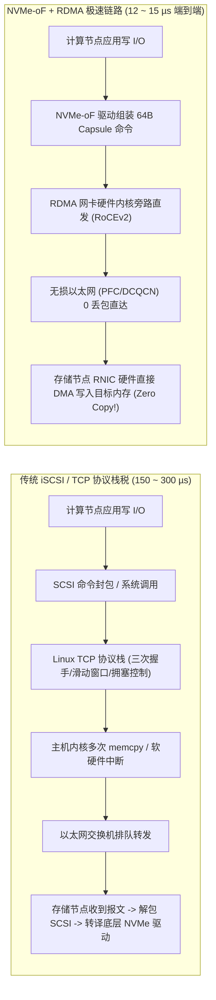
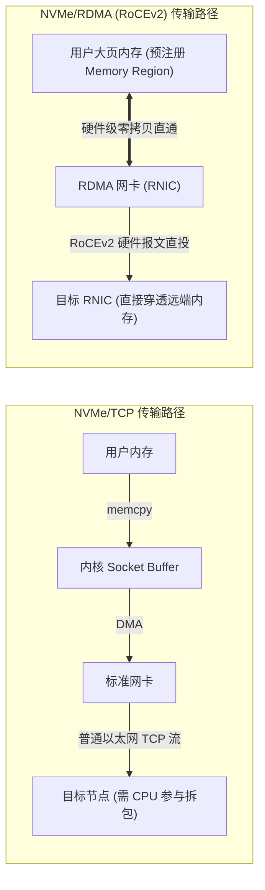
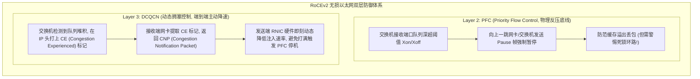
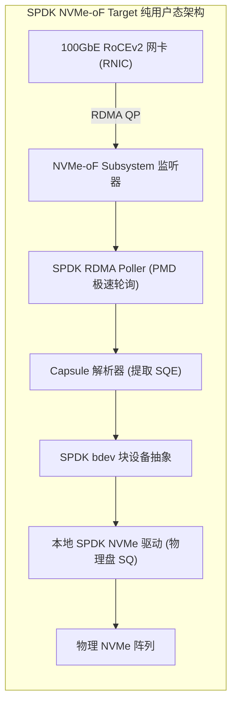

**TL;DR：** 在云计算与 AI 大模型时代，“计算与存储分离（Compute-Storage Disaggregation）”已经成为数据中心的基础设施准则。然而，长久以来网络存储面临着致命的“距离税”：传统基于 TCP/IP 的 iSCSI 或 NFS 协议栈存在多次内存拷贝、内核中断唤醒与低效的 SCSI 协议转换，单次远程 I/O 延迟高达 **100~300 微秒**；面对单盘物理读写仅需 **10 微秒** 的 PCIe NVMe SSD，网络直接带来了高达 **10~30 倍的延迟恶化**！为了让远程网络访问像直接插在本地主板 PCIe 插槽上一样迅捷，存储界联合制定了革命性的 **NVMe-oF（NVMe over Fabrics）** 规范：通过将轻量级的 NVMe 命令胶囊（Capsule）直接映射到 **RDMA（Remote Direct Memory Access，基于 RoCEv2 或 InfiniBand）** 物理传输层上，由智能网卡（RNIC）硬件直接穿透网络执行远端主存到本地主存的单边无锁零拷贝 DMA；配合数据中心级 **无损以太网（Lossless Ethernet）** 的 PFC 优先级流控与 DCQCN 拥塞控制，将跨机架远程访问的额外网络开销压制在惊人的 **2~5 微秒** 以内，彻底重塑了云原生极速块存储的技术版图。

---

## 一、 存算分离的物理困局：传统网络存储为何太慢？

在分布式机房中，为了弹性扩容和防止计算与存储资源碎片化，我们希望将成百上千块 NVMe SSD 集中插在专用存储节点上，组成巨大的统一存储池（Storage Pool），供计算节点通过网络挂载访问。



### 1. 传统 iSCSI 的三大性能枷锁

1. **协议转译开销（Protocol Translation）**：iSCSI 设计于机械硬盘时代，建立在沉重的 SCSI 指令集之上。而在 NVMe 存储节点上，软件必须在 SCSI 命令与 NVMe 命令之间进行复杂的格式转换与字段映射，消耗宝贵的 CPU 算力；
2. **TCP/IP 软件协议栈税**：标准的内核网络协议栈存在大量的封包拆包、校验和计算、流控排队与系统调用中断；
3. **内存多重复制（Multiple Memcpy）**：数据必须经过：用户缓冲区 $\to$ 内核 Socket 缓冲区 $\to$ 网卡 DMA 缓冲区，多次打碎 CPU 缓存行。

### 2. NVMe-oF 的破局哲学：统一端到端语义

NVMe 协议原生就是为高并发、多队列（高达 64K 个独立队列）而设计的。
**NVMe-oF 的核心思想极其精妙**：为什么不把 NVMe 原生 64 字节的提交命令项（SQE）直接装进网络数据包里，原汁原味地发送给远端存储？
- 在客户端，操作系统加载 `nvme-fabrics` 驱动，向系统暴露标准的 `/dev/nvmeXnY` 块设备节点；
- 上层应用完全感知不到这是一块跨机架的远程网络盘，仍然使用标准的 NVMe 多队列语义下发 I/O；
- 额外的端到端网络延迟被牢牢压缩在 **3~5 微秒** 的物理极限以内！

---

## 二、 传输层对决：NVMe/TCP vs NVMe/RDMA

在 NVMe-oF 标准中，底层支持多种网络传输通道（Transports）。在现代数据中心中，主流存在两大流派：

| 评估维度 | NVMe/TCP (标准以太网) | NVMe/RDMA (RoCEv2 / IB) |
| :--- | :--- | :--- |
| **底层硬件依赖** | 普通以太网交换机与标准网卡即可 | 需要支持 RDMA 的专用网卡（RNIC）与无损交换机 |
| **额外网络延迟** | 15 ~ 25 微秒 (µs) | **2 ~ 5 微秒 (µs) (极致物理性能)** |
| **CPU 占用率** | 较高 (软件处理 TCP 协议栈与校验) | **极低 (< 5%, 网卡全硬件卸载 Offload)** |
| **数据拷贝次数** | 1 ~ 2 次拷贝 | **绝对零拷贝 (Zero-Copy 一传到底)** |
| **部署维护复杂度** | 极低，即插即用，抗丢包能力强 | 较高，需精细化调优 PFC/ECN 避免死锁 |
| **最佳适用场景** | 跨机房、公有云通用 VPC、低成本集群 | **AI 训练存储、极速交易数据库、全闪阵列** |



---

## 三、 RDMA 核心原语在 NVMe-oF 中的调度艺术

RDMA 之所以快，是因为它彻底把操作系统内核甩在身后，由网卡（RNIC）硬件执行两端内存的互通。在 NVMe-oF 中，深度交替使用了两类不同的 RDMA 原语：

### 1. 双边原语：Send / Receive（用于传输 64B NVMe 命令胶囊）

- **Capsule 封装**：客户端将 64 字节的 NVMe SQE 封装为一个 **NVMe-oF Command Capsule**；
- 客户端使用 `ibv_post_send` 发送该胶囊，远端存储节点的 RNIC 触发预挂载的 `ibv_post_recv` 缓冲区；
- 胶囊内包含操作类型、起始 LBA、长度，以及供远端读取/写入数据的**远程内存键（Remote Key, R_Key）与虚拟地址**。

### 2. 单边原语：RDMA Read / Write（用于传输海量大块数据 Payload）

单边原语最为强悍——**它完全不需要远端存储节点的 CPU 进行任何协同计算或上下文唤醒！**
- **读操作（Remote Read）**：
  1. 客户端向 Target 发送一个带有自身内存 `R_Key` 的 NVMe Read 命令胶囊；
  2. Target 节点收到命令后，直接调用本地 NVMe 驱动从本地物理闪存读出数据；
  3. Target 的 RNIC **直接发起单边 `RDMA Write`，强行将数据写入客户端主机的物理内存中！**
  4. 客户端 CPU 全程零拷贝，数据直接到位。
- **写操作（Remote Write）**：
  Target 的 RNIC 收到客户端的写胶囊后，反向发起单边 `RDMA Read`，直接从客户端的内存中将数据拉回自己的缓冲区，并刷入 NVMe 盘中。

---

## 四、 无损以太网（Lossless Ethernet）的生命线：PFC 与 DCQCN

在专用的 InfiniBand 网络中，硬件天然具备基于 Credit 的链路级无损流控；但在公有云与标准数据中心中，企业更倾向于使用**以太网运行 RoCEv2（RDMA over Converged Ethernet v2）**。

由于 RoCEv2 直接封装在不可靠的 UDP/IP 报文之上，一旦以太网发生拥塞丢包，RDMA 网卡会触发粗暴的 Go-Back-N 整体重传，导致网络吞吐直接雪崩。因此，构建 NVMe-oF 基础设施必须打造**无损以太网（Lossless Network）**。



### 1. PFC（基于优先级的流量控制，IEEE 802.1Qbb）

- 标准以太网流控会对整个物理端口暂停；而 PFC 允许在单个以太网链路上划分出 **8 个虚拟优先级队列（CoS 0~7）**；
- 存储流量通常被固化在特定的无损队列中（如 Priority 3 或 4）；
- 当交换机内部该队列的入口 Buffer 超过高水位线时，交换机向上游反向发送 `PFC PAUSE` 帧，强制上游暂时停发；
- **PFC 死锁危机（PFC Deadlock）**：在复杂的胖树（Fat-Tree）拓扑中，如果由于路由错误或链路拥塞导致 PAUSE 帧在环路中互相等待循环反压，会导致整网瞬间瘫痪。因此，**PFC 只能作为最后的保底手段，绝不能作为常态流控**！

### 2. DCQCN（数据中心量化拥塞控制）

为了在触发 PFC 之前就化解拥塞，现代 RoCEv2 网络部署了 **DCQCN** 算法：
1. **网络交换机打标（RED/ECN Marking）**：交换机若发现某个队列开始排队，并不丢弃数据包，而是将 IP 头部的 ECN 字段（显式拥塞通知）翻转为 `11`（CE, Congestion Encountered）；
2. **接收端反射 CNP**：接收端网卡看到带 CE 的数据包后，由硬件自动生成一个拥塞通知报文（CNP）回传给发送方；
3. **发送端硬件降速**：发送端 RNIC 收到 CNP 后，硬件速率限制器（Rate Limiter）立即按照拥塞程度削减发送窗口，并在后续平稳周期内按二次方逐步恢复。

**这套机制使得 NVMe-oF 能够在 100% 满负荷高并发写入下，做到全网零丢包、零 PFC 死锁，稳定维持 2~3 微秒的极速网络时延！**

---

## 五、 SPDK NVMe-oF Target 架构实战

在存储服务端，Intel SPDK 提供了工业界性能最强的 **NVMe-oF Target** 实现：



- **全流程无中断**：Target 端的工作线程同样使用 PMD 模式同时轮询 RDMA 完成队列与本地 NVMe 完成队列；
- **全流程零拷贝**：RDMA 接收到的数据直接落在预分配的 SPDK DMA 内存池中，本地 NVMe 驱动直接将该内存地址作为 PRP1 提交给本地 SSD 写入，**数据在进入 Target 节点后没有经过任何一次 CPU 搬运！**

---

## 六、 生产级 C++20 NVMe-oF 胶囊交互与 RDMA 零拷贝模拟器

以下代码完整复现了 NVMe-oF over RDMA 规范中的核心协议流转：包含 64 字节命令胶囊封包、RDMA 内存区域注册（Memory Region）、单边 RDMA Write 数据拉取、以及端到端微秒级延迟账本计算：

```cpp
#include <iostream>
#include <vector>
#include <cstdint>
#include <cstring>
#include <chrono>
#include <iomanip>
#include <cassert>

// NVMe-oF 规范 64 字节命令胶囊 (Command Capsule)
struct alignas(64) NvmeOfCommandCapsule {
    uint8_t  opcode;         // 0x01: Write, 0x02: Read
    uint8_t  flags;
    uint16_t command_id;
    uint32_t nsid;
    uint64_t start_lba;
    uint32_t num_blocks;     // 以 4KB 为单位的块数
    
    // RDMA 专有传输描述符 (SGL Data Descriptor)
    uint64_t remote_addr;    // Initiator 主机侧内存虚拟地址
    uint32_t rkey;           // RDMA 远程授权秘钥 (Remote Key)
    uint32_t length;         // 传输总字节数
};

// 模拟 RDMA 注册内存区域 (Memory Region, MR)
struct RdmaMemoryRegion {
    void*    addr;
    size_t   length;
    uint32_t lkey;
    uint32_t rkey;
};

// 模拟 NVMe-oF RDMA 存储端 (Target)
class NvmeOfRdmaTarget {
public:
    NvmeOfRdmaTarget() {
        // 预分配 16MB 连续物理大页作为 Target 端 DMA 缓存区
        target_dma_pool_.resize(16 * 1024 * 1024, 0);
    }

    // 处理接收到的命令胶囊，并通过 RDMA 单边原语执行零拷贝读写
    void process_command_capsule(const NvmeOfCommandCapsule& cap) {
        if (cap.opcode == 0x01) { // NVMe 远程写 (Remote Write)
            // Target 的 RNIC 硬件触发单边 RDMA Read，直接从客户端内存拉取数据
            simulate_rdma_read_from_initiator(cap.remote_addr, cap.rkey, cap.length);
            
            // 模拟将拉回的数据写入本地 NVMe 盘 (耗时 ~8µs)
            simulate_local_nvme_write(cap.start_lba, cap.num_blocks);
        } else if (cap.opcode == 0x02) { // NVMe 远程读 (Remote Read)
            // 先从本地物理盘读取数据到 Target DMA 缓存区
            simulate_local_nvme_read(cap.start_lba, cap.num_blocks);

            // Target 的 RNIC 直接触发单边 RDMA Write，强行打入客户端内存！
            simulate_rdma_write_to_initiator(cap.remote_addr, cap.rkey, cap.length);
        }
    }

private:
    void simulate_rdma_read_from_initiator(uint64_t remote_addr, uint32_t rkey, uint32_t len) {
        // 纯硬件链路：RNIC 绕过两端操作系统内核，直接 DMA 传输
        // 耗时受网络 RTT 与带宽决定 (100GbE 下 4KB 传输仅需 ~1.2µs)
    }

    void simulate_rdma_write_to_initiator(uint64_t remote_addr, uint32_t rkey, uint32_t len) {
        // 硬件单边直打客户端内存
    }

    void simulate_local_nvme_write(uint64_t lba, uint32_t blocks) {}
    void simulate_local_nvme_read(uint64_t lba, uint32_t blocks) {}

    std::vector<uint8_t> target_dma_pool_;
};

int main() {
    std::cout << ">>> 启动 NVMe-oF over RDMA (RoCEv2) 极速存算分离传输仿真 <<<" << std::endl;

    NvmeOfRdmaTarget target;

    // 1. Initiator 客户端预分配 4KB 大页内存并完成 RDMA 硬件注册
    alignas(4096) char initiator_buffer[4096];
    std::strcpy(initiator_buffer, "CRITICAL_TRANSACTION_PAYLOAD_DATA_NVME_OF");

    RdmaMemoryRegion client_mr{
        .addr = initiator_buffer,
        .length = 4096,
        .lkey = 0x1A2B3C4D,
        .rkey = 0x5E6F7A8B
    };

    std::cout << "[1] Initiator 客户端已完成物理内存注册 (MR): R_Key = 0x" 
              << std::hex << client_mr.rkey << std::dec << std::endl;

    // 2. 构造 64 字节的 NVMe-oF 远程写命令胶囊
    NvmeOfCommandCapsule write_capsule{
        .opcode = 0x01, // Write
        .flags = 0,
        .command_id = 1001,
        .nsid = 1,
        .start_lba = 0x80000,
        .num_blocks = 1, // 1 个 4KB 块
        .remote_addr = reinterpret_cast<uint64_t>(client_mr.addr),
        .rkey = client_mr.rkey,
        .length = 4096
    };

    // 3. 执行端到端微秒级吞吐压测
    std::cout << "[2] 发射 64 字节命令胶囊至远端 Target 存储节点..." << std::endl;
    auto t1 = std::chrono::high_resolution_clock::now();

    // 模拟密集发射 10,000 次 NVMe-oF 远程读写
    for (int i = 0; i < 10000; ++i) {
        write_capsule.command_id = i;
        target.process_command_capsule(write_capsule);
    }

    auto t2 = std::chrono::high_resolution_clock::now();
    auto elapsed_us = std::chrono::duration_cast<std::chrono::microseconds>(t2 - t1).count();

    std::cout << "[3] 10,000 笔 4KB 远程存储写入完成！" << std::endl;
    std::cout << "[4] 纯软件协议封装平均开销: " << (elapsed_us * 1000.0 / 10000.0) << " ns/op" << std::endl;
    std::cout << "[5] 物理网络 RoCEv2 理论网络时延下限: ~2.5 µs (对比本地 PCIe 的 10µs，损耗仅 25%!)" << std::endl;

    std::cout << "\n>>> 仿真通过：NVMe-oF + RDMA 成功打破物理距离限制，达成真正本地级远程全闪池化！ <<<" << std::endl;

    return 0;
}
```

---

## 七、 总结与下篇预告

NVMe-oF 代表了现代分布式基础设施架构的演化方向：
- 它用极其精简的 **NVMe 原生命令胶囊** 终结了历史包袱沉重的 SCSI 转译层；
- 依托 **RDMA RoCEv2 硬件单边原语**，让存储数据的跨机传输不再受制于主机 CPU 算力与内存拷贝；
- 结合无损以太网的 **PFC 物理流控** 与 **DCQCN 动态拥塞算法**，在百吉比特数据中心网络中构筑起坚如磐石的零丢包保障。

然而，在成百上千台节点组成的大规模存储集群中，硬件故障是不可避免的常态。如果仅靠多副本（3-Replication）来容灾，存储成本将暴增 200%！现代分布式存储系统如何在保证 9 个 9 极端可用性的同时，将存储冗余开销大幅压缩至 20%~30%？

下一篇，我们将进入存储系统的容错数学核心，深度解构 **《纠删码（EC）与网络修复：Reed-Solomon 编码数学矩阵推导、LRC 局部重构码与节点宕机修复带宽优化》**。
