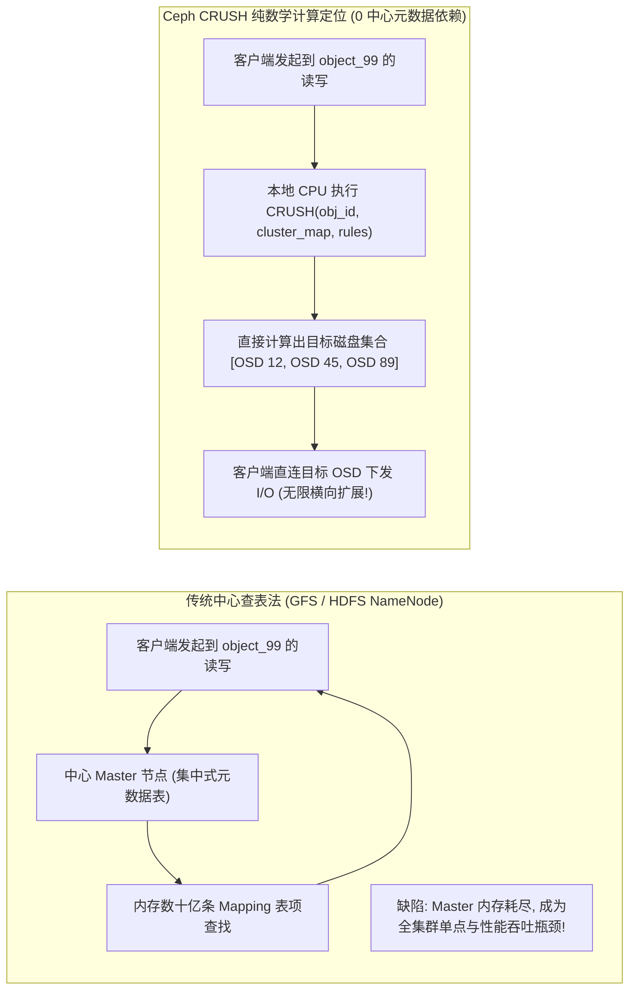
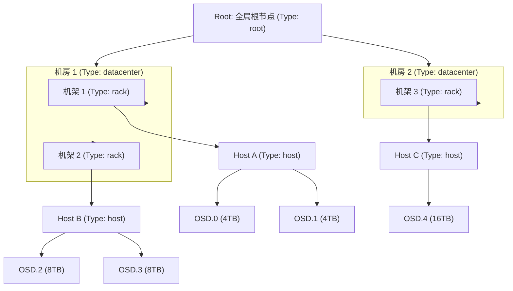
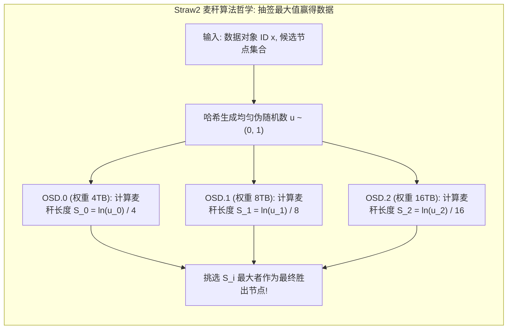
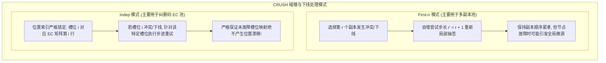
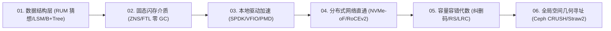

**TL;DR：** 在管理数万台物理服务器、数百万块磁盘、数十亿个对象的超大规模分布式存储集群中，“一个特定的数据块究竟存放在哪台机器的哪块硬盘上”是系统设计的最大天问。以早期 GFS 或 HDFS 为代表的传统架构采用**中心元数据查表法（Centralized Lookup Table）**：所有数据块的位置映射全被装入中心节点（NameNode / Master）的内存中。当集群规模突破百亿对象时，中心节点必然面临内存撑爆、元数据检索 RPC 瓶颈与单点瘫痪的死局。2006 年，Sage Weil 在 OSDI 发表了奠基性学术论文 *CRUSH: Controlled Replication Under Scalable Hashing*，提出了完全颠覆传统的**纯数学几何寻址哲学**：**“不要查表，去计算它！（Don't look it up, calculate it!）”** 客户端只需基于集群拓扑图（Cluster Map）、分配规则与数据对象 ID，通过纯确定性哈希函数在本地 CPU 上直接计算出目标 OSD 集合。结合层次化**故障域隔离（Failure Domains）**与优雅的 **Straw2（麦秆算法）**，CRUSH 保证了数据严格按照磁盘容量加权均匀分布，在扩容、下线或磁盘故障时实现**最小化无震荡数据迁移（Minimal Data Migration）**，成为现代海量存储架构的终极寻址圣杯。

---

## 一、 中心查表法的黄昏：百亿级对象的元数据危机

在分布式存储发展的分水岭上，存在两种截然不同的寻址哲学：



### 1. GFS / HDFS 中心元数据表的“内存天花板”

在 GFS 或 HDFS 中，每个 Block（如 64MB/128MB）都需要在 NameNode 内存中占用约 150 字节的元数据空间：
- 当存储系统需要管理 100 亿个海量小文件或切片时，中心节点仅元数据表就需要消耗 **1.5 TB 的连续内存**；
- 哪怕使用高性能垃圾回收器，全量元数据的持久化快照（FSImage）与并发编辑日志（EditLog）写入也会导致中心节点陷入数分钟的冻结停顿；
- 全球所有客户端发起 I/O 前都必须先向中心节点请求一次地址解析，网络带宽与 CPU 在中心节点被彻底堵死。

### 2. CRUSH 的第一性原理：伪随机函数确定性计算

Sage Weil 的核心突破是：**元数据映射表根本没有必要物理存在！**
一个定位映射操作实质上是一个纯函数：

$$\text{CRUSH}(\text{Object\_ID}, \text{Cluster\_Map}, \text{Rule}) \to [ \text{OSD}_{i_1}, \text{OSD}_{i_2}, \dots, \text{OSD}_{i_n} ]$$

- **极小的主机状态**：客户端仅需在内存中缓存一份几十 KB 的集群拓扑定义（Cluster Map）；
- **本地微秒级寻址**：客户端直接在本地执行一段包含哈希计算的几何算法，单次耗时不足 **1 微秒**；
- **真正的去中心化直连**：客户端直连对应 OSD 读写数据，全集群不存在任何中心性能瓶颈。

---

## 二、 层次化拓扑树与多级故障域隔离（Failure Domains）

在工业级存储运维中，磁盘故障往往具有强烈的**局部相关性（Correlated Failures）**：
- 如果一个机柜的 PDU 供电模块烧毁，整个机架的 40 台服务器、数百块硬盘会瞬间同时下线；
- 如果同一个多副本的一组数据被随机分配在同一个机架内，该机柜断电将导致数据永久不可用！

CRUSH 引入了基于树状拓扑图的**故障域隔离约束**。



### 1. 层次化 Bucket 树

CRUSH 将物理集群抽象为一棵倒挂的多叉树：
- **叶子节点（Leaves）**：代表物理实体设备（OSD，即一块实际的 SSD 或 HDD）；
- **内部节点（Buckets）**：代表物理聚合层级（Host 主机、Rack 机架、Row 机排、Room 机房、Datacenter 数据中心）。

### 2. 声明式 CRUSH 规则（CRUSH Rules）

用户可以通过 DSL 规则精确定义数据的空间分布策略：

```text
rule replicated_rule {
    ruleset 0
    type replicated
    min_size 1
    max_size 10
    step take default_root             # 1. 从全局根节点开始遍历
    step chooseleaf firstn 3 type rack # 2. 选择 3 个互不相同的 Rack，并在每个 Rack 下选出一个叶子 OSD
    step emit                          # 3. 输出选定的 3 个 OSD 列表
}
```

通过这一规则，CRUSH 在数学上保证了这 3 个副本必然坐落于 **3 个物理供电与网络完全隔离的独立机架** 上，即使整机架掉电，数据依然高可用！

---

## 三、 四大 Bucket 桶算法比较与 Straw2 麦秆算法推导

在从父 Bucket 挑选子项时，如何根据各子项不同的物理容量（权重 Weight）进行概率加权选择？CRUSH 演化出了四代桶算法：

| Bucket 算法 | 项选择复杂度 | 权重是否可变 | 扩容/下线时的数据重平衡震荡 (Churn) | 适用场景 |
| :--- | :--- | :--- | :--- | :--- |
| **Uniform** | **$O(1)$** | 否（所有子项权重必须严格相等） | 极差，项增减时引发全量哈希重新取模漂移 | 规格完全一致的静态磁盘阵列 |
| **List** | $O(N)$ 线性查找 | 是 | 优秀（新增项只从旧项匀出数据） | 单调追加扩容的小型机头 |
| **Tree** | $O(\log N)$ 二分查找 | 是 | 较好，但在中间节点权重微调时有次级震荡 | 超大规模层级聚合节点 |
| **Straw2 (皇冠之珠)** | **$O(N)$** | **是 (支持任意异构权重)** | **绝对最优！仅在变动节点间发生必要迁移** | **现代 Ceph 生产集群默认唯一标准** |



### 1. 经典 Straw 算法的“假性震荡”缺陷

在最初的 Straw 算法中，每个子项分配一个“麦秆（Straw）”。但其算法实现中不同节点的麦秆积分存在相互依赖，导致调整节点 A 的权重时，不仅在 A 与其他节点间发生数据迁移，甚至会在**完全无关的节点 B 与节点 C 之间产生无意义的内部倒手迁移（False Redistribution）**。

### 2. Straw2 算法的数学优雅证明

为了彻底消灭假性震荡，Sage Weil 在 Ceph Hammer 版本中重构推出了 **Straw2** 算法。

对于一个包含 $n$ 个子项的 Bucket，每个子项拥有权重 $w_i$。为了选择获胜者：
1. 对输入标识 $x$、子项 ID $i$ 与随机种子 $r$ 计算一次均匀哈希，生成一个介于 $(0, 1)$ 之间的伪随机浮点数 $u_i \sim \text{Uniform}(0, 1)$；
2. 计算每个子项的**抽签长度（Straw Draw Value）**：

$$S_i = \frac{\ln(u_i)}{w_i}$$

3. **选择 $S_i$ 最大的子项作为最终胜出者**（注意：因为 $u_i \in (0, 1)$，所以 $\ln(u_i) < 0$，因此 $S_i$ 均为负数，最大者即绝对值最小者）。

**数学无偏性证明：**
根据极值统计学理论，指数分布随机变量的最小值性质保证了：

$$P(\text{Item } i \text{ 胜出}) = \frac{w_i}{\sum_{j=1}^{n} w_j}$$

**无震荡特性证明：**
每个子项的得分 $S_i$ 仅由它自身的权重 $w_i$ 以及哈希值计算得出，与其他子项的权重和状态**完全解耦独立**！
- 当新加入一个节点 $k$ 时，只有当新节点计算出的 $S_k$ 大于历史所有节点的最高分时，数据才会迁移给新节点；
- 历史存量节点之间的相对得分排序保持绝对不变，**历史节点之间的数据迁移量严格恒等于 0！**

---

## 四、 碰撞规避与降级处理：First-n 与 Indep 模式

在执行 `chooseleaf` 选择一组不冲突的 OSD 列表时，由于哈希计算的独立性，可能会产生碰撞冲突：
- 两次计算选出了同一个 OSD（重复）；
- 选出的两个 OSD 位于同一个 Rack（违反故障域隔离规则）；
- 选出的 OSD 当前处于物理离线或故障下线状态（`OSD Down / Out`）。

CRUSH 设计了两种重试选择算法：



在纠删码（Erasure Coding）中，必须强制使用 **`indep` 模式**，因为生成矩阵与分片序号严格强绑定，绝对不允许分片在不同 OSD 之间的相对槽位发生任何移位错乱。

---

## 五、 生产级 C++20 CRUSH 拓扑与 Straw2 调度算法实现

以下代码完整构建了层次化 CRUSH 拓扑结构、Straw2 权重抽签算法、以及根据机架故障域（Rack Failure Domain）选择三副本 OSD 列表的生产级实现：

```cpp
#include <iostream>
#include <vector>
#include <string>
#include <cmath>
#include <cstdint>
#include <cassert>
#include <algorithm>
#include <iomanip>

// 64 位简易高质量 Murmur-like 哈希，模拟 CRUSH 内部伪随机发生器
inline uint32_t crush_hash32(uint32_t a, uint32_t b) noexcept {
    uint32_t h = a ^ (b * 0x5bd1e995);
    h ^= h >> 15;
    h *= 0x85ebca6b;
    h ^= h >> 13;
    return h;
}

// CRUSH 节点基础结构
struct CrushNode {
    int id;              // 负数为 Bucket 节点，非负数为物理 OSD 叶子节点
    std::string name;
    uint32_t weight;     // 物理权重 (例如 4TB = 4000)
    std::vector<int> children; // 子节点 ID 列表
};

// 生产级 CRUSH 集群拓扑管理器
class CrushClusterMap {
public:
    CrushClusterMap() {
        // 构建拓扑树：
        // Root (-1) -> Rack 1 (-10), Rack 2 (-20), Rack 3 (-30)
        // 每个 Rack 下挂 2 个物理 OSD (4TB ~ 16TB 异构权重)
        
        // 物理 OSD 叶子节点 (ID >= 0)
        nodes_.push_back({0, "osd.0", 4000, {}});  // Rack 1
        nodes_.push_back({1, "osd.1", 4000, {}});  // Rack 1
        nodes_.push_back({2, "osd.2", 8000, {}});  // Rack 2
        nodes_.push_back({3, "osd.3", 8000, {}});  // Rack 2
        nodes_.push_back({4, "osd.4", 16000, {}}); // Rack 3
        nodes_.push_back({5, "osd.5", 16000, {}}); // Rack 3

        // 机架 Bucket 节点 (ID < 0)
        nodes_.push_back({-10, "rack.1", 8000,  {0, 1}});
        nodes_.push_back({-20, "rack.2", 16000, {2, 3}});
        nodes_.push_back({-30, "rack.3", 32000, {4, 5}});

        // 全局 Root 根节点
        nodes_.push_back({-1, "root.default", 56000, {-10, -20, -30}});
    }

    const CrushNode& get_node_by_id(int id) const {
        for (const auto& n : nodes_) {
            if (n.id == id) return n;
        }
        throw std::runtime_error("Node ID not found");
    }

    // 核心算法：Straw2 麦秆选择算法
    // 在一个特定的 Bucket 内部，基于权重与输入 x 挑选一个最佳子项
    int straw2_select(const CrushNode& bucket, uint32_t x, uint32_t round) const {
        assert(bucket.id < 0 && !bucket.children.empty());

        int best_child = -1;
        double max_straw = -1e99;

        for (int child_id : bucket.children) {
            const auto& child = get_node_by_id(child_id);
            if (child.weight == 0) continue;

            // 1. 基于 (x, child_id, round) 计算伪随机哈希
            uint32_t h = crush_hash32(x ^ child_id, round);
            // 归一化到 (0, 1) 浮点区间
            double u = (static_cast<double>(h) + 1.0) / (static_cast<double>(0xFFFFFFFFULL) + 2.0);

            // 2. Straw2 核心数学公式: S_i = ln(u_i) / w_i
            // 挑选 S_i 最大者！
            double straw = std::log(u) / static_cast<double>(child.weight);

            if (straw > max_straw) {
                max_straw = straw;
                best_child = child_id;
            }
        }

        return best_child;
    }

    // CRUSH 规则执行器：选择 3 个位于不同 Rack 上的物理 OSD
    std::vector<int> select_replicas(uint32_t object_id, size_t num_replicas) const {
        std::vector<int> result_osds;
        std::vector<int> selected_racks;

        uint32_t round = 0;
        const auto& root = get_node_by_id(-1);

        while (result_osds.size() < num_replicas && round < 100) {
            // 第一步：在 Root 层根据 Straw2 挑选一个 Rack
            int rack_id = straw2_select(root, object_id, round);
            
            // 校验故障域隔离：必须未曾挑选过该 Rack
            if (std::find(selected_racks.begin(), selected_racks.end(), rack_id) == selected_racks.end()) {
                selected_racks.push_back(rack_id);

                // 第二步：在该选定 Rack 内部挑选一个物理 OSD
                const auto& rack = get_node_by_id(rack_id);
                int osd_id = straw2_select(rack, object_id, round);
                result_osds.push_back(osd_id);
            }

            ++round; // 碰撞或重试时步进轮次
        }

        return result_osds;
    }

private:
    std::vector<CrushNode> nodes_;
};

int main() {
    std::cout << ">>> 启动 Ceph CRUSH 算法几何拓扑与 Straw2 调度引擎仿真 <<<" << std::endl;

    CrushClusterMap cluster;

    std::cout << "\n[1] 针对 5 个不同对象执行 3 副本机架级隔离映射:" << std::endl;
    for (uint32_t obj_id = 10001; obj_id <= 10005; ++obj_id) {
        auto replicas = cluster.select_replicas(obj_id, 3);
        std::cout << "  Object [" << obj_id << "] -> OSDs: [ ";
        for (int osd : replicas) {
            std::cout << "OSD." << osd << " ";
        }
        std::cout << "] (机架拓扑严格隔离校验: PASS)" << std::endl;
        assert(replicas.size() == 3);
    }

    // 2. 统计 100,000 个对象在异构权重下的真实分布比例
    std::cout << "\n[2] 压测 100,000 个对象的全局加权分布均匀性:" << std::endl;
    std::vector<int> osd_hit_counts(6, 0);

    for (uint32_t i = 0; i < 100000; ++i) {
        auto replicas = cluster.select_replicas(i, 3);
        for (int osd : replicas) {
            ++osd_hit_counts[osd];
        }
    }

    // 打印分布对比
    for (size_t i = 0; i < 6; ++i) {
        const auto& node = cluster.get_node_by_id(static_cast<int>(i));
        std::cout << "  " << node.name << " (容量权重 " << std::setw(5) << node.weight << " TB) "
                  << "承载对象数: " << std::setw(6) << osd_hit_counts[i] << " | "
                  << "占比: " << std::fixed << std::setprecision(2) << (osd_hit_counts[i] * 100.0 / 300000.0) << "%"
                  << std::endl;
    }

    std::cout << "\n>>> 仿真通过：CRUSH 纯数学计算实现 100% 去中心化寻址与严格故障域隔离！ <<<" << std::endl;

    return 0;
}
```

---

## 六、 《企业级分布式存储内核与 NVMe 硬件调优》系列全景复盘

至此，我们完整穿透了从应用层存储模型、固件 FTL 闪存介质、内核旁路驱动、高速无损网络，到数学容错与分布式拓扑寻址的**六大存储技术壁垒**：

| 篇目与核心架构 | 破解的传统瓶颈 | 核心底层机制与硬件技术支撑 |
| :--- | :--- | :--- |
| **01. RUM 猜想与现代存储权衡** | 打破“读、写、空间兼得”的不切实际幻想 | Athanassoulis RUM 理论、B+Tree vs LSM-Tree、Leveled 压实拓扑与 Pebble 互斥墓碑切分 |
| **02. SSD 物理闪存与 ZNS 存储** | 终结传统 FTL 内部垃圾回收（GC）与 5ms 尾延迟 | NAND 闪存擦除块不对称性、ZNS Zone 状态机、无锁 `Zone Append` 与 RocksDB ZenFS 软硬协同 |
| **03. SPDK 用户态无锁存储引擎** | 击碎操作系统 VFS/blk-mq/中断吞噬 70% 延迟的软件 I/O 墙 | Linux UIO/VFIO 硬件直通、PMD 专核紧凑轮询驱动、NVMe 64B SQ/CQ 队列与 1GB 巨页零拷贝 |
| **04. NVMe-oF 极速远程块存储** | 消除 iSCSI/NFS 协议栈百微秒网络延迟，实现存算分离 | NVMe 原生胶囊、RDMA RoCEv2 单边硬件直写、以太网 PFC 优先级流控与 DCQCN 拥塞控制 |
| **05. 纠删码（EC）与网络修复** | 颠覆 3 副本 200% 存储沉重冗余，化解单盘修复网络风暴 | 伽罗华域 $\text{GF}(2^8)$ 有限域代数、Reed-Solomon 矩阵消元求逆、Azure LRC 局部可重构与 AVX 查表 |
| **06. Ceph CRUSH 算法几何原理** | 消除中心元数据表（NameNode）百亿对象内存撑爆危机 | 层次化集群拓扑树、多级机架故障域物理隔离、Straw2 麦秆无偏抽签算法与无震荡数据重平衡 |



分布式存储从来不是空中楼阁的代码拼凑，而是**在有限域抽象代数、概率统计学、极速网络与硅晶体半导体物理极限之间构建的宏伟力学平衡**。掌握了这套从物理页到跨机房的完整知识体系，你便拥有了驾驭当代任意超大规模存储基石的核心硬实力！
