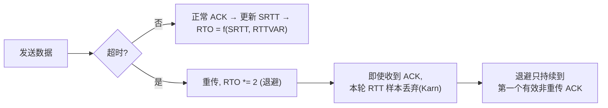
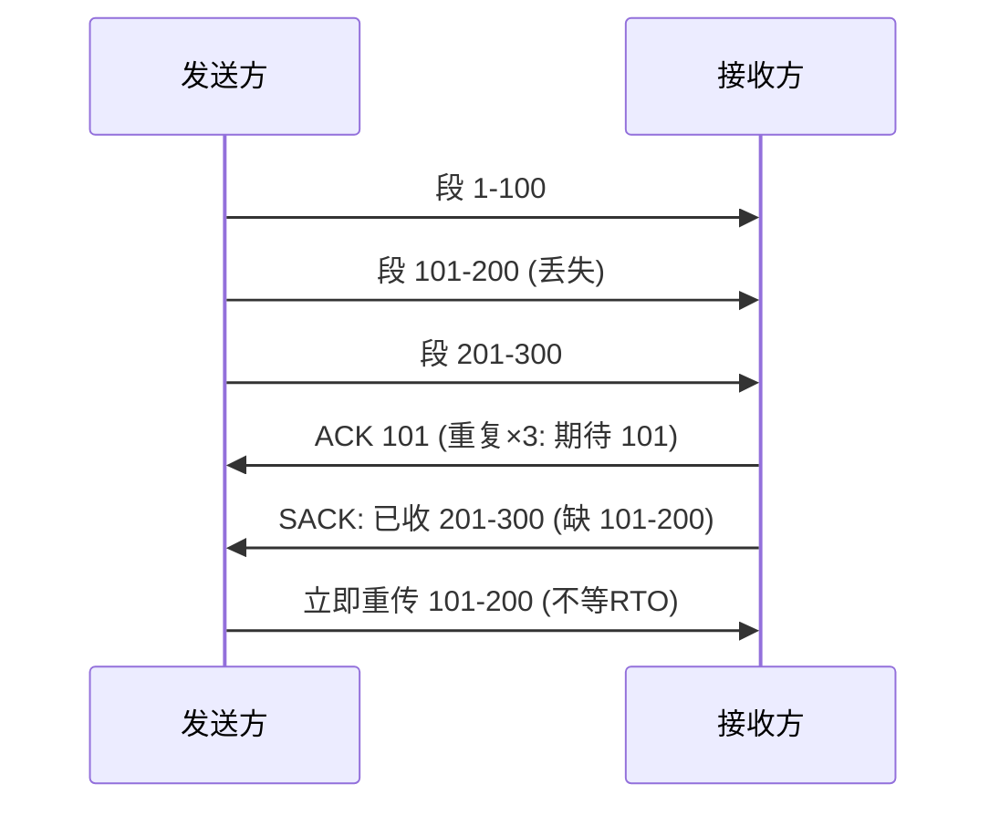

**TL;DR：** 丢一个包，TCP 无法立即知道是"丢了"还是"只是慢"。它唯一确凿的证据链是**按时重传**——但重传又带来一个新问题：**重传二义性**——收到确认时，你分不清它确认的是第一次发送还是重传的那次（RTT 算错了，RTO 就永远不准）。为解决这个自指难题，TCP 用了三条规则：**Karn 算法**（重传样本不参与 RTO 计算，且强制 RTO 翻倍）、**快速重传**（收到 3 个重复 ACK 就不等超时）、**SACK**（告诉对端"到底哪几段丢了"）。本文把这三板斧拆开，用 `tc netem` 注入可控丢包，看 RTO 退避的时间线。

## 一、重传二义性：TCP 为自己设计的死循环

网络延迟天然抖动：一个包可能 10ms 回来，也可能 200ms。TCP 维护一个 **RTO（Retransmission Timeout）**，超时未确认就重传。RTO 依赖 **SRTT（平滑 RTT）**，SRTT 依赖每次收 ACK 的 RTT 采样——**问题出在这里**：

假设回合：2ms 发一份数据，100ms ACK 回来（RTT=98ms，正常）→ RTO 算成 120ms。但你等 120ms 没到，120ms 时重传了。结果那份数据 130ms 才回到（其实第一次发的那份还在路上，是 ACK 迟到）。你收到 ACK：**它确认的是哪一份？** 如果是第一次发的，那 RTT=128ms（合法）；如果是重传的，RTT=30ms。**你根本分不清楚**——这就是重传二义性（retransmission ambiguity）。

如果把 30ms 当真，SRTT 被压低 → RTO 被算小 → 更容易误判超时 → 更早重传 → **把正常不丢的网络搞成重传病毒**。这就是为什么 TCP 必须"不敢快"。

## 二、Karn 算法：一条"忘掉"的规则

**Karn 算法**的直觉只有一条：**当任何一次重传发生时，这一轮的 RTT 采样作废，绝不进入 SRTT 计算**——因为无法区分是哪份的 ACK。同时，重传后 RTO 直接**退避翻倍**：



两条规则的配合非常精妙：**退避（RTO 翻倍）防止拥塞加重**，**丢弃样本防止 RTO 被虚假的低值误导**。它俩在逻辑上互补，缺一个，另一个就崩——这是 TCP 里少有的"互锁"设计。代价是**慢**：连丢几次，RTO 指数退避，链路实际发生长时间静默——所以 TCP 真正的恢复等不起 RTO，靠第三节的快速重传。

## 三、快速重传与 SACK：不等超时的两条捷径

RTO 退避是"保底"，TCP 还想**更快恢复**。两个机制：

**1. 快速重传（RFC 5681）**：收到 3 个**重复 ACK**（序号一样），说明对端在"等你缺的那一段"。既然 3 个重复 ACK 都来了，说明链路通了，只是某段丢了——**不等 RTO，立刻重传**。这比 RTO（通常几百 ms）快得多。

**2. SACK（RFC 2018，选择性确认）**：普通 ACK 只能确认"连续前缀"，丢了一段就只知道"到 100 为止"。SACK 让接收端说"**我收到了 100–200 和 300–400，中间缺 200–300**"——发送方精确知道丢哪段，只重发那一段，而不是退回到 200 整段重发（Go-Back-N 的浪费）。



三个机制的分工总结：

| 机制 | 触发条件 | 作用 |
| :--- | :--- | :--- |
| RTO 重传 + Karn 退避 | 超时无 ACK | 兜底，指数退避防拥塞 |
| 快速重传 | 连续 3 个重复 ACK | 不等超时，提前重发 |
| SACK | 对端开启（默认） | 精确定位丢失段，避免整段重传 |

## 四、实测：tc netem 注入丢包看退避

在 Linux 上给本地回环设备加 5% 丢包，跑一个大文件传输，抓包看时间线：

```bash
# 给 lo 注入 5% 丢包
sudo tc qdisc add dev lo root netem loss 5%
# 收一个大文件
curl -s -o /dev/null http://localhost:8080/bigfile
# 抓包（另一终端）
sudo tcpdump -i lo tcp port 8080 -n -ttt

# 清理
sudo tc qdisc del dev lo root
```

tcpdump 输出的关键信号：

```
 0.000000  客户端→服务端   PSH 后续数据
 8.462312  客户端→服务端   TCP DUP ACK 1-5 (快速重传触发)
  8.462320  客户端→服务端   TCP Retransmission  ← 快速重传(由 DUP ACK 触发)
```

观察点：

1. **DUP ACK 出现 → 快速重传**比 RTO（几百 ms 量级）快一个数量级。对照组实验：把丢包率设为 2% 且模拟不支持 SACK 的对端（`sysctl net.ipv4.tcp_sack=0`），观察"拖尾重传"明显变长——因为发送方只能回退整段重发。
2. 抓包里的 `Retransmission` 前面的时间差 ≈ 你观察 RTO 退避：丢了 1 个包，后一份的等待往往明显比前一份多一倍，**那正是 Karn 的 RTO 翻倍**。
3. 全链路：`network = 丢包 5%` → RTO 退避有没有丢能直接看到最后；一段时间后网络恢复 → 曲线回拉。

**诚实注明**：这个实验在 lo 上是"伪网络"（没有真实传播延迟），RTO 的量级会被内核参数（`initial_rto`，默认 1s 起）主导。看趋势、看分工，别把数字本身当真。

## 五、RTO 参数：TCP 为什么不喜欢太快

从上面就能推出 TCP 的"性格"：**它宁可信过得慢，也不信猜得快**。核心证据：

- 初始 RTO 在 Linux 上默认 1 秒（`TCP_INIT_RTO`）——比局域网的真实 RTT（不足 1ms）大几个数量级，就是给"看起来太快"的判断留容错，宁可慢不冒进。
- RTO 的下限有固化下限（RFC 6298 建议 1s，Linux 后来允许调低到 100ms 量级）。
- 退避倍数 = 2（RFC 6298 规定的 RTO backoff）。

这个"慢"是设计正确的：**把 RTO 调小 10 倍，重传触发提前，但重传二义性惹的祸（RTT 估错、拥塞没恢复就重传）会成比例放大。** 生产里看到"快重传 + SACK 都触发了还慢"，通常不是 RTO 参数的问题，而是**重传被拥塞控制踩了刹车**（因为重传把 cwnd 减半）——见[TCP 拥塞控制](/writing/tcp-congestion-control-bbr)。把两者放一起才是 TCP 丢包后的完整响应：**先减 cwnd 再重传，重传按退避时间算**。

## 结论

TCP 丢包后的完整动作是"三件套"：**超时重传（保底）+ 快速重传（提前）+ SACK（精准）**，外加 Karn 的两条互锁规则（重传样本作废、RTO 翻倍）。RTO"不敢快"不是因为工程师保守，而是**重传二义性让"快"的代价高于"慢"**——RTO 是 TCP 里最被低估的组件，它等于这整个协议的试错成本。

下一步：把 netem 实验跑一遍，在 tcpdump 里同时数一数 `DUP ACK`、`Retransmit`、`SACK` 三类帧——你会发现 TCP 的重传不是"碰运气重发"，是一台按账本决策的机器。然后把丢包率从 5% 提到 20%，看快速重传如何被 DEFER 在恢复窗口里消耗。

## 参考资料

1. RFC 6298：Computing TCP's Retransmission Timer—— http://www.rfc-editor.org/rfc/rfc6298
2. RFC 5681：TCP 拥塞控制（含快速重传）—— https://www.rfc-editor.org/rfc/rfc5681
3. RFC 2018：TCP SACK—— https://www.rfc-editor.org/rfc/rfc2018
4. Linux 内核：tcp_timers.c 与 tcp_input（重传与 ACK 处理）—— https://github.com/torvalds/linux/blob/master/net/ipv4/tcp_input.c
5. Colasoft / Wireshark 的 RTO 可视化说明—— https://osqa-ask.wireshark.org/
6. tc-netem 手册（丢包注入）—— http://man7.org/linux/man-pages/man8/tc-netem.8.html

> 延伸阅读：重传不是孤岛，它和拥塞窗口减半绑在一起，见[TCP 拥塞控制：从慢启动到 BBR](/writing/tcp-congestion-control-bbr)；丢包后的"快"与"慢"在 QUIC 里被用户态重写了一遍，见[QUIC 不是 TCP 2.0](/writing/quic-http3-connection-migration)；接收方一堵，重传也会被窗口归零放大，见[Socket 背压](/writing/socket-backpressure-slow-consumer)。