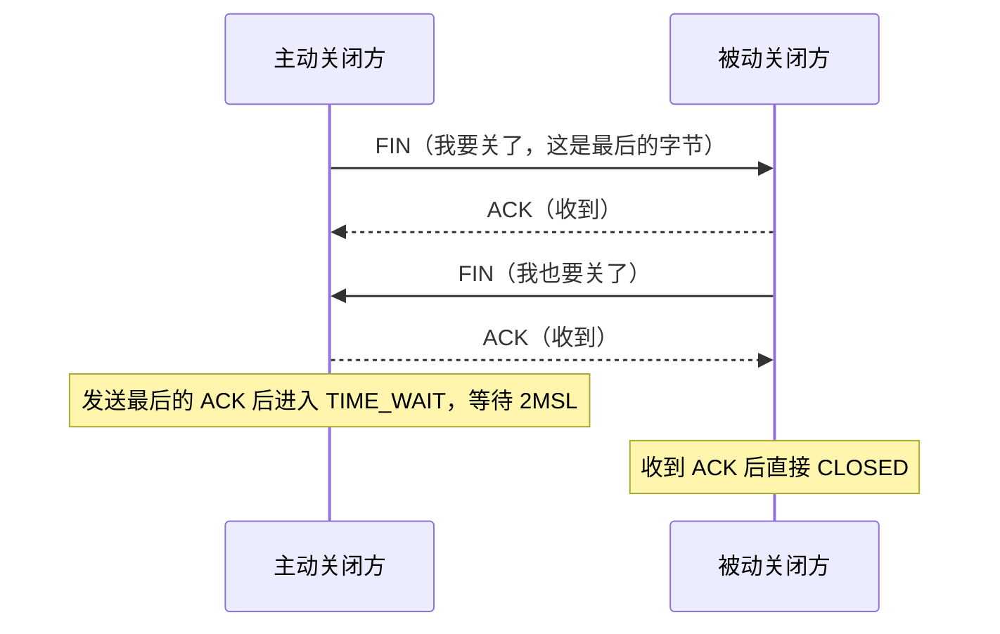
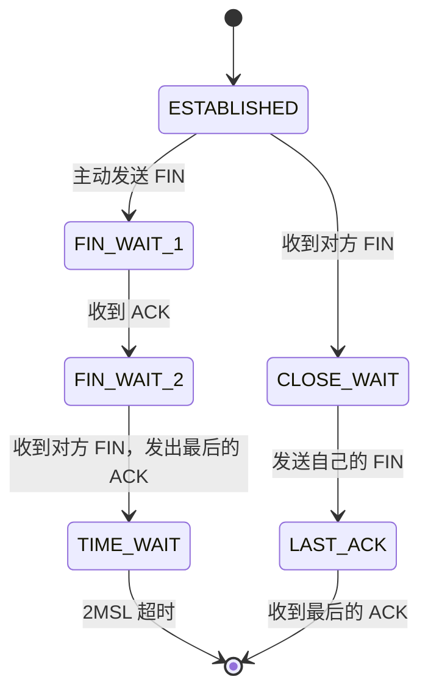

**TL;DR：** TIME_WAIT 不是可以随便调小的"状态残留"，它是一台主机代表整条连接对另一台主机的承诺：在 2MSL 内，这台主机会对这条连接上的迟到报文负责。删掉或缩短它，换来的不是性能，是三类事故——旧连接的重传段污染新连接、最后的 ACK 无人重发、对称释放被打破。Linux 的 `tcp_tw_reuse` 只对出站连接生效且依赖时间戳，`tcp_tw_recycle` 因破坏 NAT 下的 PAWS 已于 4.12 移除。真正常见的"连接复用失败"，解法不是调内核，是把短连接变长连接。

## 一、事故现场：短连接风暴里的两类报错

一次例行发布后，一个内部服务开始周期性报错：调用下游的 HTTP 客户端在高峰时段大量返回 `connect: Cannot assign requested address`，夹着少量 `connect: Connection refused`。报错集中在发布窗口后出现，业务侧的第一反应是"下游挂了"，但下游的监控一切正常。

`ss` 的第一眼就给出了方向：

```bash
$ ss -tan state time-wait | wc -l
184203
$ ss -s
TCP:   1882 established, 184203 time-wait, 0 close-wait, 0 fin-wait-1
```

将近 18 万个 TIME_WAIT，established 只有不到两千。这个比例已经说明问题不在下游的可用性，而在连接的生命周期本身。再看错误的时间分布：高峰时段的连接创建速率超过了某个临界值，之后周期性恢复——这是典型的"资源耗尽后恢复"曲线，耗尽的东西是本地端口。

两类报错的指向不同：

| 报错 | 谁在拒绝 | 原因 |
| :--- | :--- | :--- |
| `EADDRNOTAVAIL`（Cannot assign requested address） | 客户端自己 | 出站连接找不到可用本地端口，本地端口在 TIME_WAIT 里被占用 |
| `ECONNREFUSED`（Connection refused） | 服务端 | 新 SYN 撞上服务端同四元组的 TIME_WAIT 连接，被 RST 掉 |

两条线索指向同一个词：**TIME_WAIT**。理解它，得从 TCP 关闭那一刻的状态机开始。

## 二、TIME_WAIT 从哪来：主动关闭方的宿命

一次正常的四次挥手长这样：



注意一个不对称：**四次挥手里只有发送最后一个 ACK 的一方进入 TIME_WAIT**。谁主动关闭，谁就承担 TIME_WAIT——这是 TCP 状态机里写死的规则（主动关闭方在 `FIN_WAIT_2 → TIME_WAIT`，被动方在 `LAST_ACK → CLOSED`）：



2MSL 是"两个最大报文段生存期"（Maximum Segment Lifetime）：一个报文段在网络上最多能存活多久。RFC 793 定义 MSL = 2 分钟，并规定 TIME_WAIT 应持续 2MSL（4 分钟）；Linux 没有遵守这个比例——它把 MSL 定义为 2 分钟（`TCP_MSL`），但 TIME_WAIT 的时长是固定 60 秒（`TCP_TIMEWAIT_LEN`），且这个值是内核编译期常量，没有运行时参数可以改。这就是后面所有对策的约束条件。

TIME_WAIT 期间，这条四元组（源 IP、源端口、目的 IP、目的端口）在内核里被"冻结"：**同一四元组的新连接在这 60 秒内不允许建立**——除非有明确证据证明新连接比旧连接新（第五节讲的时间戳机制）。

## 三、TIME_WAIT 在保护谁：三个具体的险情

说"TIME_WAIT 防止旧报文干扰新连接"是对的，但太抽象。具体到报文层面，它保护三件事。

**险情一：迟到的重复段污染新连接。**

假设没有 TIME_WAIT：连接 A 关闭后，四元组立刻被复用建立连接 B。连接 A 的一个段在网络里多绕了一圈，60 秒后才到达——连接 B 的接收方把它当作连接 B 的数据收下。如果序号恰好落在连接 B 的窗口内，数据就错了；序号不在窗口内，则触发一个莫名其妙的 ACK/重传循环，双方都不知道这段数据是哪来的。

现代内核的 ISN 随机化（初始序号随机递增）降低了序号重叠的概率，但没有消除它：ISN 只差一个随机数，报文迟到几秒 + 连接大量快速建立时，重叠窗口依然存在。TIME_WAIT 的 60 秒窗口就是为了覆盖"最坏情况下的网络生存期"，让迟到段必然撞上一个已关闭的连接（被丢弃），而不是撞上一个活着的连接。

**险情二：最后的 ACK 丢了，谁负责重发。**

主动关闭方发出的最后一个 ACK 如果丢失，被动关闭方会一直停在 LAST_ACK，周期性重传自己的 FIN。这时候：

- 如果主动方还在 TIME_WAIT：收到重传的 FIN，重新发送 ACK——被动方正常进入 CLOSED；
- 如果主动方已经把 socket 销毁：重传的 FIN 到达一个不存在的连接，内核回一个 RST——被动方以为对方在报错，把"正常关闭"误判成异常。

TIME_WAIT 是主动关闭方为"对方可能没收到我的最后一句"预留的兜底：**它让"关闭"这个动作变成可靠握手，而不是发完就消失**。

**险情三：双向的承诺，不能单方面作废。**

把上面两个险情放在一起看：TIME_WAIT 保护的其实是**两个方向**。旧连接的残留报文，要等足够久才能保证已经消失在网络里（险情一）；对方的重传请求，要等足够久才能保证对方已经收到我的确认（险情二）。2MSL 取的是两者的较大值，并且留了一倍余量。任何"关掉 TIME_WAIT 提高性能"的方案，都是在同时放弃这两层保护。

## 四、为什么不能缩短：三个常见的错误直觉

**直觉一："改个参数把 TIME_WAIT 缩短到 5 秒。"** 做不到。Linux 的 60 秒是编译期常量，没有任何 sysctl 能改 TIME_WAIT 时长本身。能间接影响它的只有 `net.ipv4.tcp_max_tw_buckets`（默认 262144）：当系统里的 TIME_WAIT socket 数超过这个值，内核会开始强制销毁最老的 TIME_WAIT——注意，这是"保护失效"的应急开关，不是性能调优：一旦开始强制销毁，险情一和险情二重新变得可能，只是概率低到多数人注意不到。把它调大只是推迟失效点。

**直觉二："有 tcp_tw_recycle，直接复用。"** 这条路径已经不存在了。`tcp_tw_recycle` 在 Linux 4.12 被移除，原因是它按源 IP 记忆时间戳并据此提前销毁 TIME_WAIT，在 NAT 后面会误伤正常流量：NAT 出口后面所有客户端共享一个公网 IP，各自的时间戳基准不同，后来者的 SYN 可能因为"时间戳比记忆值旧"而被直接丢弃——表现为"一部分用户连不上，另一部分正常"，且极难排查。移除它是对"拿保护换性能"的一次盖棺定论。

**直觉三："SO_REUSEADDR 能修复 TIME_WAIT。"** 它只解决"绑定"这一步：服务端重启时，允许新监听 socket 绑定到还有 TIME_WAIT 残留的端口（否则 `bind()` 直接 `EADDRINUSE`）。它不解决"新 SYN 撞上 TIME_WAIT 被 RST"的问题——那需要时间戳的参与，见下一节。

## 五、tcp_tw_reuse：唯一活着的内核对策，以及它的边界

`net.ipv4.tcp_tw_reuse`（默认 0）是现在唯一合法的"复用 TIME_WAIT"开关，但它的生效范围窄到很多人用错：

**它只对出站连接生效。** 客户端在挑选本地端口建立新连接时，如果 28,000 多个端口都被 TIME_WAIT 占着，允许"复用端口号"，条件是：开启 `tcp_timestamps`，且新连接的时间戳严格大于旧连接的最后时间戳——用时间戳证明"这条新连接比旧连接新"，旧连接的迟到报文不可能被误收。它**不适用于入站**：服务端收到与新连接四元组重合的 SYN，该 RST 还是 RST，`tcp_tw_reuse` 帮不上忙。

所以前面的两类报错，它只能救 `EADDRNOTAVAIL` 那一半，救不了 `ECONNREFUSED`。而且它依赖时间戳单调递增：如果对端重启导致时间戳回退，或两边时间戳基准不同步，复用判断可能出错——代价还是险情一。

## 六、真正的解法：别让连接在 TIME_WAIT 里过冬

内核参数都是止血。TIME_WAIT 问题的根源是**连接创建速率超过了端口预算**。预算算法很简单：

**每个本地 IP 的可用端口数（默认约 28,000）÷ TIME_WAIT 时长（60 秒）≈ 每秒约 470 个新连接的上限**

```bash
$ cat /proc/sys/net/ipv4/ip_local_port_range
32768	60999   # 共 28232 个端口
```

超过这个速率，无论怎么调内核，TIME_WAIT 都会增长、端口都会耗尽——因为 TIME_WAIT 是 60 秒的常量，端口池是固定的，唯一可变量就是连接创建速率。所以正确顺序是先算账，再动手：

1. **把短连接变成长连接。** HTTP keep-alive、连接池、HTTP/2 多路复用，把"每秒 500 次握手"变成"每秒 500 个请求复用 50 条连接"。TIME_WAIT 的账是"每连接一次"，请求量不直接进账。这是唯一治本的方向，也解释了为什么所有现代 RPC 框架默认都在维护连接池。
2. **救 `EADDRNOTAVAIL` 那一半**：客户端开 `tcp_tw_reuse=1` + `tcp_timestamps=1`（时间戳本身默认就是开的），或者给客户端 socket 设 `SO_REUSEADDR` 允许复用本地端口。
3. **救 `ECONNREFUSED` 那一半**：让主动关闭发生在客户端这一侧。谁先发 FIN，谁进 TIME_WAIT；客户端持有连接池、端口可复用，TIME_WAIT 落在客户端没有代价；服务端作为被动关闭方直接 CLOSED，四元组立刻可用，重连的 SYN 不再撞 RST。反过来"服务端主动挂电话"是最差姿势：四元组被服务端冻结 60 秒，客户端快速重连必撞 RST。
4. **确认 tcp_max_tw_buckets 没到警戒线**：`ss -s` 里 time-wait 数量长期接近 262144 说明预算已经失守，光调这个参数只是把失效点往后推。

回到事故：那个内部服务的修复没有动任何内核参数——调用方改成连接池复用，发布窗口的短连接风暴消失，TIME_WAIT 数量从 18 万掉到几百。`EADDRNOTAVAIL` 和 `ECONNREFUSED` 一起消失，因为问题从来不是"内核不肯复用"，而是"连接建立速率根本不该那么高"。

## 结论：TIME_WAIT 是连接复用前必须支付的协议保护成本

TIME_WAIT 保护的是 TCP 关闭协议的可靠性，不是可以被"调优"掉的性能残留：迟到段污染（险情一）、ACK 兜底（险情二）、双向承诺（险情三），三者都依赖 2MSL 的等待。Linux 给它的 60 秒没有运行时旋钮，唯一的间接开关是 `tcp_max_tw_buckets`，而它是失效兜底不是调优。

`tcp_tw_reuse` 只对出站生效、依赖时间戳；`tcp_tw_recycle` 已经不存在。看到 TIME_WAIT 堆积，先算连接创建速率与端口预算的账，然后把连接改成长连接——这比任何 sysctl 都有效。

下一步可做的事：

```bash
$ ss -s                                    # 看 TIME_WAIT 总量与端口预算对比
$ ss -tan state time-wait | awk '{print $4}' | sort | uniq -c | sort -rn | head
                                           # 找出 TIME_WAIT 集中在哪个本地端口（哪条业务路径）
$ cat /proc/sys/net/ipv4/ip_local_port_range   # 算出端口预算
```

## 参考资料

1. RFC 793：Transmission Control Protocol（MSL 定义与 TIME_WAIT 状态）—— https://www.rfc-editor.org/rfc/rfc793
2. Linux 内核文档：ip-sysctl（tcp_tw_reuse、tcp_max_tw_buckets、ip_local_port_range）—— https://docs.kernel.org/networking/ip-sysctl.html
3. Linux 内核文档：ip-sysctl（tcp_tw_recycle 自 4.12 起从内核移除）—— https://docs.kernel.org/networking/ip-sysctl.html
4. RFC 7323：TCP Extensions for High Performance（时间戳与 PAWS）—— https://www.rfc-editor.org/rfc/rfc7323
5. BSD Sockets 手册：SO_REUSEADDR 与 TIME_WAIT —— https://man7.org/linux/man-pages/man7/socket.7.html

> 延伸阅读：TIME_WAIT 管的是连接的生命周期，带宽与拥塞是另一笔账——见[TCP 拥塞控制：从慢启动到 BBR，带宽为什么忽高忽低](/writing/tcp-congestion-control-bbr)；连接建立与释放的开销，在 HTTPS 里还有 TLS 握手那几毫秒——见[TLS 握手全流程：HTTPS 那几毫秒里发生了什么](/writing/tls-handshake-deep-dive)。
