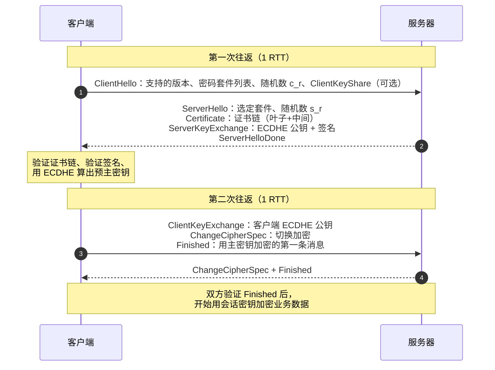

**TL;DR：** HTTPS 的全部内容可以压缩成一次"谈条件"：客户端和服务端用非对称加密交换一个对称密钥，之后所有数据用这个对称密钥加密传输。TLS 1.2 谈一次要两个 RTT，TLS 1.3 把它压到一个 RTT（并顺手废掉了所有不支持前向保密的套件）。握手里最贵的不是数学计算，而是证书链验证与往返延迟。理解握手 = 理解为什么"连接复用"是性能关键、为什么证书过期是生产事故第一名、以及 `openssl s_client` 如何三秒定位问题。

## 一、 没有 TLS 的网络是什么样

TCP 只保证"字节流到达"，不保证"到达的内容是原装的"。一个明文 HTTP 请求在公网上要经过十几台路由器和运营商网关，任何一个环节都可以：

- **窃听**：看到你的 Cookie、密码、请求体（被动，不可检测）。
- **篡改**：改掉响应里的下载链接，注入广告或恶意脚本（主动，校验和也拦不住——TCP 校验和防的是线路噪声，不是恶意改写）。
- **冒充**：让客户端以为自己是银行，收下账号密码（DNS 劫持、伪造证书场景）。

三个威胁对应 TLS 的三个能力：**机密性**（加密）、**完整性**（MAC/AEAD 认证）、**真实性**（证书链）。只加密不认证等于裸奔——任何中间人都能直接换掉你的公钥。

为什么不全用非对称加密？RSA 加密 2048 位数据比对称加密（AES）慢三个数量级，而且非对称加密有长度上限（RSA-2048 最多加密 256 字节，正好一个密钥的大小）。所以 TLS 的架构是：**用非对称交换密钥，用对称加密传数据**。

## 二、 TLS 1.2 的完整握手：两个来回谈成合同

以最常见的 TLS 1.2 + ECDHE_RSA + AES-GCM 为例，一次全新握手长这样：



拆开每一步：

1. **ClientHello**：客户端宣告"我会 TLS 1.2 及以下，支持这些密码套件"。这里有个 16 字节的随机数 `c_r`，后面参与密钥派生，防重放。
2. **ServerHello**：服务器选一个套件。随后是重头戏——**证书**。证书里装的是服务器的**公钥**，服务器私钥从不离手。
3. **ServerKeyExchange**：服务器生成一对 ECDHE 临时密钥，把**临时公钥** 发给客户端，并用自己证书里的私钥对这段内容签名。
4. **客户端验证**：这是握手最重的计算点，三件事：① 验证证书链是否受信；② 验证签名（证明"说话的人持有证书私钥"）；③ 用临时公钥与自己的临时私钥做 ECDH，算出预主密钥（pre-master secret）。
5. **密钥派生**：预主密钥 + 两个随机数，过 PRF（伪随机函数）派生出一堆会话密钥：加密密钥、MAC 密钥、IV。
6. **Finished**：第一条用新密钥加密的消息是握手摘要的 MAC——对方解不开就说明密钥不一致，握手失败。

### 2.1 ECDHE 为什么是必需品：前向保密

TLS 1.2 时代的主流密钥交换有两种：RSA 交换（客户端拿服务器公钥加密预主密钥）和 ECDHE（双方各自生成临时密钥对，用 ECDH 协商）。它们的区别在**前向保密（Forward Secrecy）**：

- RSA 交换：预主密钥被服务器私钥加密传输。**如果服务器私钥日后泄露**，攻击者可以回放当年录下的所有流量，逐个解密。2013 年 Snowden 曝光的 NSA 大规模记录解密依赖的就是这类套件。
- ECDHE：预主密钥由双方**临时** 密钥协商得出，临时私钥用完即焚，根本不存在"可泄露的私钥"。私钥泄露只能冒充身份，解不开历史流量。

所以现代基线是"RSA 证书（身份）+ ECDHE 交换（密钥）"，这也是 `ECDHE_RSA` 套件名的含义。TLS 1.3 更进一步：直接**删除** 了所有 RSA 交换套件，只留 DHE/ECDHE——前向保密从选项变成唯一选项。

### 2.2 证书链：谁给谁背书

客户端凭什么信任那张证书？不是凭"证书是真的"，而是凭**信任链**：

```text
根证书（预装在系统/浏览器里，自签名，信任锚）
   └─ 签发 → 中间 CA 证书（可有多级）
        └─ 签发 → 服务器叶子证书（含域名与公钥）
```

验证过程是自下而上：叶子证书的签名用"签发者（中间 CA）的公钥"验；中间 CA 证书的签名用"根证书的公钥"验；根证书在系统信任存储里，是链的终点。任何一级签名对不上、过期、或者域名不匹配（`CN`/`SAN`），验证立即失败。

生产事故里证书问题的比例高得惊人，且几乎总是这三类：

- **证书过期**：Let's Encrypt 证书 90 天有效期，忘了续期 = 全站挂。这是"周五下午 5 点"事故第一名。
- **链不完整**：只发了叶子证书没发中间 CA，客户端爬到根时断链。多数浏览器会尝试补全，但 `curl`、Go、Java 等严格实现直接失败——这就是"浏览器能开、curl 报 `unable to get local issuer certificate`"的经典场景。
- **域名不匹配**：证书签发给了 `example.com`，访问的是 `www.example.com`。泛域名证书只覆盖单层子域，`*.example.com` 不覆盖 `a.b.example.com`。

## 三、 TLS 1.3：把两个 RTT 砍成一个

TLS 1.3（2018，RFC 8446）改的不是加密强度，而是**把协商提前到第一个包**：

```text
客户端 → 服务器：ClientHello（内含支持的密钥共享，把 ECDHE 的客户端临时公钥直接带上）
服务器 → 客户端：ServerHello（选定密钥共享 + 加密握手消息 + Finished）
客户端 → 服务器：Finished（加密）
```

服务器收到 ClientHello 时，手上已经有"客户端公钥 + 自己的临时私钥"，**直接就能算出会话密钥**，把证书和 Finished 一起加密发回。服务器其实只发了一个消息来回，整个握手压到一个 RTT——比 TLS 1.2 少了一半。

它怎么敢提前带密钥共享？因为密钥共享（key share）只是一对**临时** 公钥，不涉及身份：猜错了大不了多一个 HelloRetryRequest 重来，没有安全损失。真正需要"先验证再谈"的身份证书，依然在服务器发出的第一条加密消息里——所以安全强度没降，只是把"谈条件"和"给身份"解耦了。

TLS 1.3 还干掉了几个历史包袱：全部 RSA 交换、全部 CBC 模式套件（统一 AEAD）、压缩（CRIME 攻击的根源）、重协商（明文注入的根源）。这就是 1.3 配置短到只剩三行（`TLS_AES_128_GCM_SHA256` 等）的原因——不是选项变少了，是"不安全的选择"被删光了。

### 3.1 0-RTT：快但危险

会话恢复（session resumption）是 1.3 的另一项性能武器：服务器签发一张加密的 **session ticket**（内含会话密钥），客户端下次连接直接出示，双方跳过握手直接进入加密通信，耗时 **0 RTT**。

但 0-RTT 数据有**重放风险**：被录下来的第一批请求可以原样重发。对于"加购物车"这种幂等操作没影响；对"转账"就是灾难。所以 0-RTT 的正确用法是只承载幂等请求——这也是 RFC 8446 建议"只在确实需要时用 0-RTT，且只用于可容忍重放的请求"的原因。多数现代实现默认关闭 0-RTT，或者只在连接建立后的 `early data` 里放 GET。

## 四、 握手之后：记录层与密钥更新

握手产出的会话密钥接下来保护的是**记录层**：每条应用数据被切成分片，用 AEAD（如 AES-256-GCM）加密并附带认证标签，接收方解密并验标签。AEAD 同时保证机密性（看不懂）与完整性（改不了）——这就是 TLS 1.2 时代"加密 + 独立 MAC"两件套被 1.3 合并成一套的原因。

1.3 还有一个 1.2 没有的机制：**密钥更新**。加密密钥可以随时基于旧的密钥树派生新一轮，历史记录即使密钥泄露也不会被反解——前向保密从"交换阶段"延伸到"传输阶段"。

## 五、 工程视角：握手的成本在哪里

**1. 最贵的不是计算，是往返。** 一次 TLS 1.2 握手是两个 RTT + 本地计算（ECDHE 纳秒级、证书验签毫秒级）。对 200ms RTT 的跨洋连接，光握手就要 400ms——比任何优化都贵。所以：

- **连接池必须开**。HTTP/1.1 的 keep-alive 与 HTTP/2 的连接复用，本质都是让"一次握手服务多次请求"。Go 的 `http.Transport` 默认复用连接，但 `DisableKeepAlives` 一开性能直接腰斩。
- **会话复用** 让第二次握手只花 0 个 RTT（1.2 的 session ticket 是 1 个 RTT 的 abbreviated handshake）。开启 TLS 会话缓存（`ssl_session_cache`）对 TLS 1.2 时代的连接建立延迟帮助巨大。
- **HTTP/3 的 QUIC 握手** 复用了 TLS 1.3 的密钥协商，把"TCP 握手 + TLS 握手"的两段 RTT 合并成一段，是 5G/弱网场景延迟下降的最大功臣。

**2. 排障只需一条命令。** 握手失败 90% 是证书问题，`openssl s_client` 三秒定位：

```bash
$ openssl s_client -connect example.com:443 -servername example.com \
    -showcerts 2>/dev/null | head -30
```

`Verify return code: 0 (ok)` 是绿灯；`20 (unable to get local issuer certificate)` 是链不完整；`10 (certificate has expired)` 是过期；`62 (hostname mismatch)` 是域名不匹配。`-tls1_3` 与 `-tls1_2` 参数可以强制协议版本，区分"服务端只支持旧协议"与"中间设备篡改"（一些老旧防火墙会拒绝不认识版本的 ClientHello——这是 TLS 1.3 上线时"部分用户打不开"的常见原因）。

**3. mTLS：客户端也要证明自己。** 双向 TLS 只是把验证方向反转：服务器请求客户端证书，客户端出示自己的证书链。K8s 里 service mesh 的 sidecar 之间、Kafka 的 SASL_SSL、gRPC 的 TLS 认证都是 mTLS 的日常形态。代价是证书轮换变成双向的运维负担，这也是现代 mesh 把"证书签发/轮换"自动化的原因。

一句话总结：TLS 是"非对称换密钥、对称传数据、证书验身份、AEAD 保完整"的流水线。新连接的延迟大头是 RTT 而不是计算，所以性能优化的头号抓手永远是连接复用；而可靠性优化的头号抓手永远是证书生命周期管理——两者都比改密码套件重要得多[^1]。

[^1]: 延伸阅读：RFC 8446（TLS 1.3）的开头部分比任何二手资料都清晰；《Bulletproof TLS and PKI》是证书体系最完整的参考；`ssl_session_cache` 与 `session_ticket` 的 nginx 配置文档能直接对应到本文的会话复用部分。
