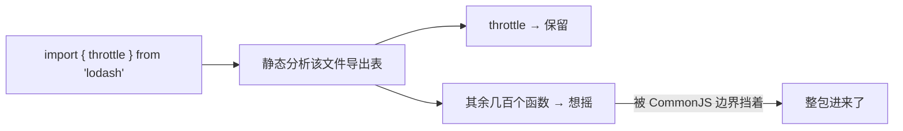

**TL;DR：** Tree Shaking（摇树）的物理前提是**静态可分析的 ES 模块**：打包器在打包时能列出每个文件的导出/导入，从而剪掉没被引用的 export。它有四个天生的盲区：**① 从 CommonJS（`module.exports`）拿进来的模块抖不动**，因为它的导出是运行时算出来的；**② 即便 ESM，写了副作用（`import './x.css'`）的模块不能凭空判定为可摇**；**③ 动态 `import()` 拼接路径会破坏静态分析**，让分块全量预建；**④ `sideEffects: false` 一旦声明错，会把"有副作用的模块"当成可摇删掉**。本文把这四个账逐一拆开，并给你一个能本机快速验证的对比实验。

## 一、原理：摇树器到底在看什么

构建工具（webpack / rollup / esbuild）在编译期对每个模块做三件事：解析 ES 模块的导出表、收集"被引用的 export 名"、把没用到的函数按 DCE 剪掉。



问题在于 `lodash` 是 CommonJS：`module.exports = {}` 是一串运行时代码，打包器既拿不准它导出什么、也不敢确定哪些能安全删——**从 CJS 文件 import 出去，就永远全量进包**。这就是 `import { throttle } from 'lodash'` 莫名引入几百 KB 的原因。

## 二、四个账

1. **从 CJS 拿进来（`import { x } from 'cjs-lib'`）**：CJS 模块只能全量进。对策是改成文件级路径 `import throttle from 'lodash-es/throttle'`（ESM 逐文件导入）——单单这一个动作就能把体积从几百 KB 降到个位数 KB。

2. **`sideEffects` 边界**：你的包在 `package.json` 声明 `"sideEffects": false`（或 `["*.css"]`），等于告诉打包器"没引用的模块可以删"。**声明了 `false` 才表示纯净**；`true` 或缺失，打包器会保守地全保留，摇树等于没开。而第三方库常缺这个字段——这是摇树失效最常见的根因。

3. **动态 `import()` 路径拼接**：`import('./views/' + name + '.js')` 在打包期无法解析，构建器只能把整块目录都预生成，摇树无从谈起。想优化，把动态路径写成**字面量**（webpack / Rollup 只会对静态串生成独立分块）。

4. **副作用被误删**：反之，`"sideEffects": false` 是打包器对你的承诺——若库在模块顶层偷偷干过事（打日志、写 window、垫 polyfill），它会被真删，bug 就从构建期混进你的应用。别为了脚本指标随便给库声明 false。

## 三、本机一分钟把账跑出来

```bash
mkdir shake-demo && cd shake-demo && npm init -y && npm i lodash lodash-es
# main.js
import { throttle } from 'lodash'
console.log(throttle)
# 构建并看产物体积
npx vite build && du -sh dist/assets/*.js
# 改成: import throttle from 'lodash-es/throttle'
# 再构建看体积: 前者含整个 lodash,后者只剩一个函数
```

本机十几秒就能看到：**CJS 整包 vs 单函数，体积可能差 50–100 倍**。把这一比当成方向，不必记住精确数字（各版本不同）。

## 四、正确的调优顺序

真正有效的不是"多上怪招"，而是把 import 边界整理干净：

1. 先自查各自建包的 `sideEffects` 声明；
2. 把带运行时导出的大 CJS 库逐个替换成 ESM 版本（`lodash`→`lodash-es`、`moment`→`dayjs` 之类）；
3. 把拼接式动态 `import()` 改成字面量分块。

## 五、诚实标注

上面"大 50–100 倍"是我某台机器上 lodash 全量 vs 单函数的实测量级，数值才不同版本、大小变化都在变化；**请当方向、别抄精确数**。

## 结论
摇树的前提是**静态的 ESM 边界**：CJS 导入、副作用声明缺失、动态路径拼接——三者任意一个就能让摇树失效。省体积的办法不是调打包器，而是**让每一条 import 都落在可静态分析的边界上**。摇树的极限，就是你的 import 口径。

下一步：选一个你最熟的大库（moment 的对比最明显），写 `import { x } from 'moment'` vs `import dayjs from 'dayjs'` 两个 build，拿 `stats.json` 看分包大小——"不管摇树多聪明，也摇不掉你 import 的边界"这句话你就信了。

## 参考资料
1. Webpack 官方指南：Tree Shaking—— https://webpack.js.org/guides/tree-shaking/
2. Webpack：`sideEffects` 字段—— https://webpack.js.org/guides/tree-shaking/#mark-the-file-as-side-effect-free
3. MDN：ES Modules—— https://developer.mozilla.org/en-US/docs/Web/JavaScript/Guide/Modules
4. Rollup 官方文档：静态分析与 tree-shaking 边界—— https://rollupjs.org/guide/en/

> 延伸阅读：模块系统为什么会卡在 CJS/ESM 的裂缝上，见[前端框架为什么这么乱](/writing/frontend-framework-history)；ESM 与渲染器的关系见[前端框架真正差在哪](/writing/frontend-framework-taxonomy)；JS 引擎如何解释与执行你 import 的代码，见[V8 加减法：一个 JS 引擎的五种包装](/writing/js-ecosystem-layers)。