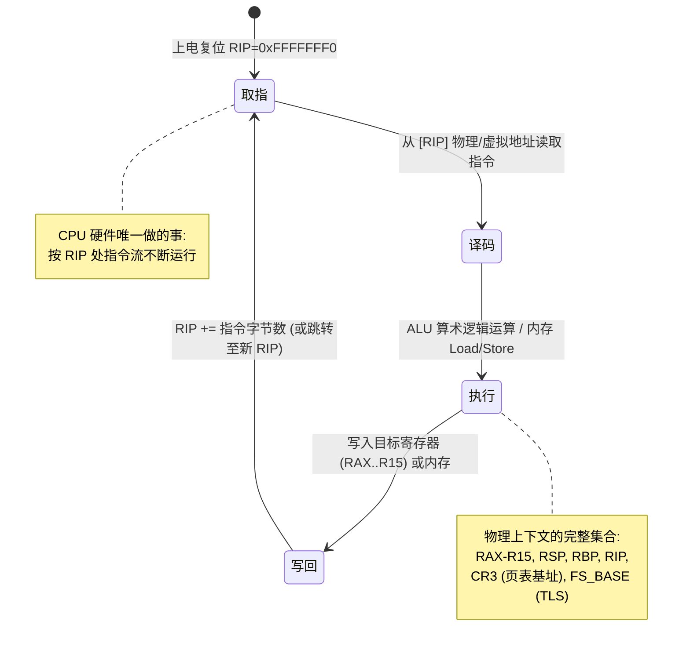
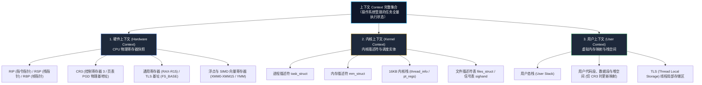
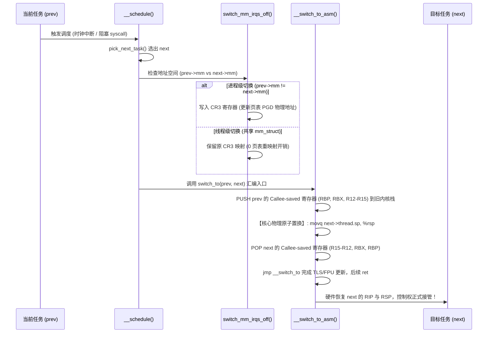
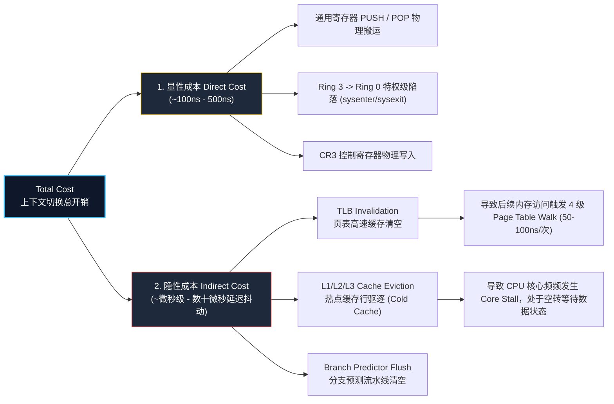
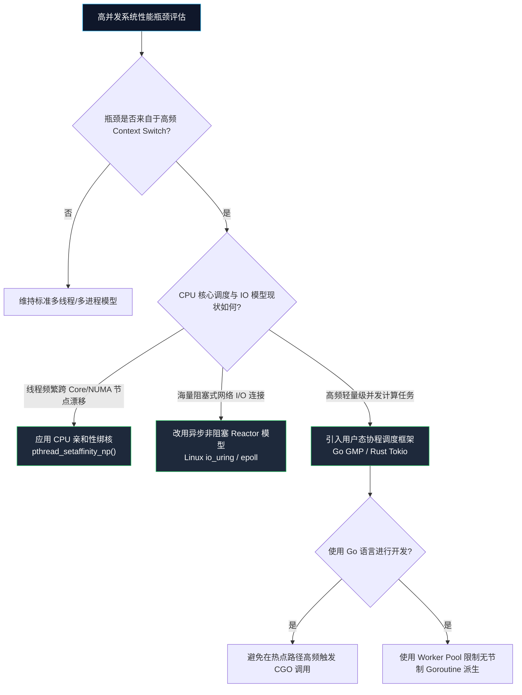

**TL;DR**：上下文切换的物理本质是 **CPU 寄存器快照的搬运与虚拟地址映射关系的替换**。从操作系统视角的进程切换（最高开销，切换 CR3 与刷新 TLB），到线程切换（共享地址空间，仅切换寄存器与内核栈），再到用户态 Goroutine 协程切换（2KB 动态栈、仅保存 8 个非易失寄存器、0 系统调用开销），每一次技术演进都是对硬件开销与调度精细度的极致重构。


> **图 1 说明**：上下文切换的完整演进图景。左侧为 CPU 硬件寄存器状态机与电路逻辑，中间为内存页表及栈指针置换波浪，右侧为 Go 语言在用户态实现的轻量级 Goroutine 协程调度栈。

---

> **适用读者**：本文假设读者具备基本的 C/Go 语言基础、系统编程经验及 x86-64 汇编概念。无论是追求极限吞吐的高并发服务端工程师，还是希望彻底打通计算机体系结构与内核边界的技术专家，都能从本文中获得清晰、系统的图景。

---

## 一、 核心本质：CPU 物理状态机与三层模型

在现代计算机体系中，CPU 本质上只是一个**无状态的指令执行引擎**。在物理电路上，操作系统所抽象出的“进程”或“线程”实体并不存在。CPU 仅仅是在时钟信号驱动下，不断重复“取指-译码-执行-写回”的流水线循环。

### 1.1 CPU 物理指令循环状态机



**物理本质**：所谓“进程 A 正在运行”，在晶体管与电子信号视角下，不过是 **CPU 通用寄存器 (RAX-R15)、栈指针 (RSP)、程序计数器 (RIP) 以及控制寄存器 (CR3) 中，恰好填充着属于进程 A 的数据数值**。

当操作系统决定暂停进程 A 换进程 B 执行时，必须把当前 CPU 内部的所有寄存器数值保存到内存中，并从内存中读取进程 B 此前保存的数值填充回 CPU 寄存器。这个**物理状态快照的备份与覆写过程**，就是上下文切换。

### 1.2 上下文的三层结构全景图

在 Linux 操作系统设计中，一个完整任务的上下文被细分为三层嵌套结构：



各层开销与保存位置详解：
1. **硬件上下文 (Hardware Context)**：
   - **保存位置**：`task_struct.thread`（x86-64）或 CPU 硬件寄存器堆。
   - **内容**：包含 16 个通用寄存器、`RIP`、`RSP`、`CR3`、`FS_BASE` 及扩展 FPU/AVX 寄存器。FPU/AVX 寄存器容量巨大（可达数 KB），Linux 采用 **Lazy FP Save** 或 **XSAVE/XRSTOR** 优化策略，仅在任务真正使用浮点指令时才进行上下文保存。
2. **内核上下文 (Kernel Context)**：
   - **保存位置**：内核专有内存区。
   - **内容**：包含描述进程元数据的 `task_struct`、管理页表的 `mm_struct`、已打开文件句柄表 `files_struct`，以及为每个任务分配的独立 **16KB 内核栈**。
3. **用户上下文 (User Context)**：
   - **保存位置**：用户态虚拟内存空间。
   - **本质**：**在上下文切换过程中，用户态内存中的代码与数据完全静止、无需移动**。变化的仅仅是 CPU 内部指向这片内存区域的指针（即 `CR3` 页表基址与 `RSP` 栈指针）。

---

## 二、 内核硬核拆解：Linux 切换完整流程与汇编分析 (x86_64)

### 2.1 触发与决策：内核调度的入口

上下文切换并非随时随机发生，Linux 内核通过以下几种方式触发调度：
1. **时钟中断驱动**：硬件定时器中断触发 `scheduler_tick()`，若任务时间片耗尽，设置 `TIF_NEED_RESCHED` 标志位。
2. **阻塞式系统调用**：任务因等待磁盘 I/O、网络 Socket 或信号量主动调用 `schedule()` 休眠。
3. **抢占**：高优先级任务唤醒时，强行设置当前任务的抢占标记。

调度器入口 `__schedule()` 会调用 `pick_next_task()` 从 CFS（完全公平调度器）红黑树或 RT 优先级队列中选出下一个任务 `next`，最终进入核心函数 `context_switch()`。



### 2.2 地址空间切换：switch_mm_irqs_off()

当发生进程级切换时，内核必须切换虚拟地址空间。该逻辑在 `arch/x86/mm/tlb.c` 中实现：

```c
void switch_mm_irqs_off(struct mm_struct *prev, struct mm_struct *next,
                        struct task_struct *tsk)
{
    unsigned long new_asid = mm_asid(next);
    
    // 如果 CPU 硬件支持 PCID (Process-Context Identifiers) 特性
    if (static_cpu_has(X86_FEATURE_PCID)) {
        // 构造带有 ASID 标记的 CR3 值，避免清空其他进程的 TLB 缓存
        write_cr3(build_cr3(next->pgd, new_asid));
    } else {
        // 无 PCID 支持时写入 CR3，硬件会自动全量 FlushTLB 缓存！
        write_cr3(__pa(next->pgd));
    }
}
```

### 2.3 寄存器与 CPU 内核栈原子替换：__switch_to_asm

真正的硬件栈指针置换与通用寄存器保存，由位于 `arch/x86/entry/entry_64.S` 的汇编代码完成：

```mermaid
graph LR
    subgraph 阶段 1：切换前 (运行 Prev 任务)
        CPU_RSP_1["CPU RSP 寄存器"] --> PREV_STACK["Prev 的内核栈<br/>(栈顶地址: 0xFFFF_8800_1000)"]
        PREV_STACK --> PREV_DATA["[Saved R15..RBP]<br/>[Saved RIP (返回地址)]"]
    end

    subgraph 阶段 2：执行单条原子指令
        SW["movq TASK_thread_sp(%rsi), %rsp<br/>硬件栈指针物理置换！"]
    end

    subgraph 阶段 3：切换后 (运行 Next 任务)
        CPU_RSP_2["CPU RSP 寄存器"] --> NEXT_STACK["Next 的内核栈<br/>(栈顶地址: 0xFFFF_8800_5000)"]
        NEXT_STACK --> NEXT_DATA["[Saved R15..RBP]<br/>[Saved RIP (返回地址)]"]
    end

    CPU_RSP_1 --> SW
    SW --> CPU_RSP_2

    style SW fill:#fbbf24,stroke:#d97706,stroke-width:2px,color:#000
    style CPU_RSP_1 fill:#0f172a,stroke:#38bdf8,color:#fff
    style CPU_RSP_2 fill:#0f172a,stroke:#22c55e,color:#fff
```

`__switch_to_asm` 汇编源码逐行解析：

```assembly
SYM_FUNC_START(__switch_to_asm)
    /* -------------------------------------------------------------------
     * 1. 保存旧任务 prev 的 Callee-saved 寄存器到 prev 的内核栈中。
     *    根据 x86-64 64位 ABI 规范，RBP, RBX, R12-R15 必须由被调用者保存。
     * ------------------------------------------------------------------- */
    pushq   %rbp
    pushq   %rbx
    pushq   %r12
    pushq   %r13
    pushq   %r14
    pushq   %r15

    /* -------------------------------------------------------------------
     * 2. 将 CPU 当前的栈指针 RSP 保存至 prev->thread.sp 内存位置
     * ------------------------------------------------------------------- */
    movq    %rsp, TASK_thread_sp(%rdi)

    /* -------------------------------------------------------------------
     * 3. 【核心物理步骤】：直接将 CPU 的 RSP 寄存器覆写为 next->thread.sp！
     *    从这一条指令执行完毕的纳秒开始，硬件栈瞬间切到了 next 的内核栈！
     * ------------------------------------------------------------------- */
    movq    TASK_thread_sp(%rsi), %rsp

    /* -------------------------------------------------------------------
     * 4. 从 next 的内核栈中，弹出 next 此前保存的 Callee-saved 寄存器
     * ------------------------------------------------------------------- */
    popq    %r15
    popq    %r14
    popq    %r13
    popq    %r12
    popq    %rbx
    popq    %rbp

    /* -------------------------------------------------------------------
     * 5. 跳转到 C 函数 __switch_to 更新 TLS (FS_BASE) 与 FPU 状态。
     *    __switch_to 执行完后的 ret 指令，弹出的正是 next 保存在栈上的 RIP！
     * ------------------------------------------------------------------- */
    jmp     __switch_to
SYM_FUNC_END(__switch_to_asm)
```

---

## 三、 演进对比：进程 vs 线程 vs 协程 (Go Goroutine)

传统操作系统内核调度的最小粒度是 `task_struct`。随着高并发业务对吞吐量的极限追求，并发模型经历了一场持续降低硬件开销的演化流程。

### 3.1 三种并发模型的物理结构差异

```mermaid
graph TD
    subgraph 进程级 (Process Switch - 高开销)
        P1["进程 A (页表 CR3 = 0x1000)"] --- P2["进程 B (页表 CR3 = 0x2000)"]
        P1 -.->|切换 CR3 + 全量/部分 TLB Flush| P2
    end

    subgraph 线程级 (Thread Switch - 中开销)
        T1["线程 1 (内核栈 A)"] --- T2["线程 2 (内核栈 B)"]
        T1 -.->|共享 CR3 页表 / 仅切内核栈与通用寄存器| T2
    end

    subgraph 协程级 (Goroutine Switch - 极低开销)
        G1["Goroutine 1 (2KB 动态栈)"] --- G2["Goroutine 2 (2KB 动态栈)"]
        G1 -.->|用户态 runtime.gogo / 0 系统调用| G2
    end

    style P1 fill:#1e293b,stroke:#ef4444,color:#fff
    style P2 fill:#1e293b,stroke:#ef4444,color:#fff
    style T1 fill:#1e293b,stroke:#eab308,color:#fff
    style T2 fill:#1e293b,stroke:#eab308,color:#fff
    style G1 fill:#1e293b,stroke:#22c55e,color:#fff
    style G2 fill:#1e293b,stroke:#22c55e,color:#fff
```

### 3.2 切换流程与开销甘特图

```mermaid
gantt
    title 切换开销与流程对比 (单位：纳秒 ns)
    dateFormat  X
    axisFormat %s

    section 进程切换 (Process Switch)
    Trap 到内核态 (Ring 3 -> Ring 0) :a1, 0, 20
    CR3 页表重映射 + TLB 刷新        :a2, 20, 50
    全量寄存器 PUSH/POP 与栈置换     :a3, 50, 80
    TLB Miss & Cache 污染 (隐性成本)  :active, a4, 80, 200

    section 线程切换 (Thread Switch)
    Trap 到内核态 (Ring 3 -> Ring 0) :b1, 0, 20
    保留 CR3 页表 (共享 mm_struct)   :b2, 20, 40
    保存/恢复通用寄存器与内核栈       :b3, 40, 70

    section Go 协程切换 (Goroutine)
    Go runtime 用户态 GMP 调度算法   :c1, 0, 5
    仅保存 8 个非易失寄存器           :c2, 5, 12
    0 系统调用 (全程留在 Ring 3)     :c3, 12, 15
```



### 3.3 精华对比矩阵

| 维度指标 | 进程 (Process) | 线程 (Kernel Thread) | 协程 (Goroutine) |
| :--- | :--- | :--- | :--- |
| **调度主体** | Linux 内核调度器 (CFS) | Linux 内核调度器 (CFS) | **Go runtime (GMP 模型)** |
| **执行特权级** | 内核态 (Ring 0) | 内核态 (Ring 0) | **用户态 (Ring 3)** |
| **内存映射切换** | **切换 CR3 写入新页表 PGD** | 共享 `mm_struct`（不切 CR3） | 共享进程虚拟地址空间 |
| **TLB 处理开销** | 强制清空 (无 PCID 时) | 0 影响 | 0 影响 |
| **栈内存开销** | 预分配 MB 级 (内核栈 16KB) | 静态分配 MB 级 (内核栈 16KB) | **按需动态扩展 (初始仅 2KB)** |
| **寄存器保存量** | 通用 + 控制 + FPU/AVX 全量 | 通用 + FPU/AVX | **仅 8 个 Callee-saved 寄存器** |
| **显性时间成本** | ~1000 ns - 2000 ns | ~300 ns - 800 ns | **~10 ns - 30 ns** |

### 3.4 Go 协程极速切换源码：gogo 汇编

Go 语言在用户态实现了轻量级协程调度。当 Goroutine 发生 Channel 阻塞、网络 I/O 或显式 `Gosched()` 时，Goroutine 会通过 `mcall()` 切换到当前线程的 `g0` 栈，由 Go 调度器选出新 Goroutine，并调用 `runtime.gogo`（位于 `src/runtime/sys_x86.s`）完成汇编级状态恢复：

```assembly
// func gogo(buf *gobuf)
// 输入：%rdi 存放 gobuf 指针（包含了 g 的 SP, PC, BP, TLS 等字段）
TEXT runtime·gogo(SB), NOSPLIT, $0-8
    MOVQ    buf+0(FP), BX       // 将 gobuf 指针载入 BX 寄存器
    MOVQ    gobuf_g(BX), DX     // 获取 g 结构体指针
    MOVQ    0(DX), CX           // 校验 g 结构体非空
    
    // 1. 恢复 Goroutine 的用户栈指针 SP 与帧指针 BP
    MOVQ    gobuf_sp(BX), SP
    MOVQ    gobuf_bp(BX), BP
    
    // 2. 恢复 TLS 线程局部存储中绑定的 g 指针
    MOVQ    gobuf_tls(BX), SI
    
    // 3. 读取待执行的程序计数器 PC
    MOVQ    gobuf_pc(BX), BX
    
    // 4. 【核心物理跳转】：直接 JMP 到 target PC！无 ret 指令，0 系统调用开销！
    JMP     BX
```

**为什么 Goroutine 切换如此高效？**
1. **0 特权级切换**：全部操作在用户态 (Ring 3) 完成，省去了 `syscall` / `sysret` 的陷落开销。
2. **极简寄存器保存**：Go 编译器在编译期利用 ABI 规则保证上下文切换点（Safe Points）只有 8 个 Callee-saved 寄存器需要保存。
3. **2KB 栈空间**：不同于线程动辄分配 8MB 栈空间导致的物理内存浪费，Goroutine 的栈从 2KB 开始，随调用深度自动进行扩容（`morestack`）与缩容。

---

## 四、 隐性成本：微架构视角的真正杀手

许多系统工程师在评估上下文切换开销时，仅用 `sched_yield()` 做 Microbenchmark，得出“切换只需几十纳秒”的乐观结论。**这忽略了对 CPU 微架构影响巨大的隐性成本 (Indirect Cost)**。

$$\text{上下文切换总开销} = \text{显性物理耗时 (Direct Cost)} + \text{隐性微架构污染 (Indirect Cost)}$$


> **图 2 说明**：进程上下文切换对 CPU 微架构造成的隐性惩罚。写入 CR3 引发 TLB 缓存清空，新进程执行初期遭遇高昂的 4 级页表遍历 (Page Table Walk)；同时原有 L1/L2 热点缓存行被驱逐 (Cold Cache Eviction)，引发大量 Core Stall 停顿等待。



### 4.1 隐性成本一：TLB Invalidation (页表高速缓存失效)

TLB (Translation Lookaside Buffer) 是 CPU 内部专门用于将虚拟地址快速翻译为物理地址的高速 SRAM 缓存。
当进程发生切换并写入新的 `CR3` 时，若未开启 PCID，CPU 会**强制清空所有非全局 TLB 缓存项**。这意味着新进程启动后的前几千次内存访问，CPU MMU 必须强行进行 4 级页表遍历（Page Table Walk：PGD $\rightarrow$ P4D $\rightarrow$ PUD $\rightarrow$ PMD $\rightarrow$ PTE）。每次 Page Table Walk 都需要多次访问物理 DRAM，带来高达 **50ns - 100ns** 的额外延迟。

### 4.2 隐性成本二：L1/L2/L3 Cache 污染 (Cold Cache)

CPU L1 Data/Instruction Cache 极其高速，但容量微小（通常每个 Core 仅 32KB - 64KB）。
当任务 A 被切走、任务 B 调入执行时，任务 B 读取的代码与数据会快速将任务 A 缓存的热点数据行（Warm Cache Lines）彻底驱逐。当任务 A 稍后重新被调回该 Core 时，由于遭遇高频的 **L1/L2 Cache Miss**，CPU 核心不得不频繁处于 **Core Stall** 状态，暂停流水线等待主存数据加载。

### 4.3 隐性成本三：分支预测器 (Branch Predictor) 冲刷

现代 CPU 依赖分支预测器（Branch Target Buffer, BTB）提前预测分支跳转。上下文切换后，分支预测器中积累的历史跳转规律不再适用于新代码段，导致 CPU 流水线频频发生预测错误（Mispredict），触发漫长的**流水线重置冲刷（Pipeline Flush）**。

---

## 五、 工程优化决策路线图

基于对底层微架构与内核源码的深度理解，在系统架构设计中，我们可以采取以下优化策略：



### 5.1 CPU 亲和性与绑核 (CPU Affinity)

在 Linux 多核服务器上，避免线程在不同 CPU 核心之间漫无目的地漂移。使用 `pthread_setaffinity_np` 绑核不仅能保留 L1/L2 Cache 的热度，还能彻底消除 NUMA (Non-Uniform Memory Access) 架构下跨 CPU 节点访问远端内存的巨大惩罚：

```c
#define _GNU_SOURCE
#include <sched.h>
#include <pthread.h>

void bind_thread_to_core(int core_id) {
    cpu_set_t cpuset;
    CPU_ZERO(&cpuset);
    CPU_SET(core_id, &cpuset);

    pthread_t thread = pthread_self();
    int s = pthread_setaffinity_np(thread, sizeof(cpu_set_t), &cpuset);
    if (s != 0) {
        // 绑定失败处理
    }
}
```

### 5.2 事件驱动 I/O (Reactor / Proactor) 替代 Thread-per-request

传统网关的“一请求一线程”模型在并发突破上万时，CPU 将绝大部分算力浪费在了内核态线程的休眠与唤醒中。采用基于 `epoll` 或 Linux 最新的 `io_uring` 异步非阻塞模型，可用少量的 Worker 物理线程轻松处理数十万级别的并发 Connection。

### 5.3 Go 生产环境并发调优

1. **谨慎使用 CGO**：高频 CGO 调用会导致 Goroutine 所在的 M 脱离 Go 调度器的控制，被包装为标准 OS 线程处理，从而丢失协程切换的低开销优势。
2. **控制 Goroutine 池规模**：Goroutine 虽轻，但无节制的派生会产生海量 `g` 结构体，加重垃圾回收器（GC）扫描 Goroutine 栈空间的负担。使用带界限的 Worker Pool 维持吞吐与延迟的平衡。

---

## 结论

上下文切换不是免费的抽象。**最好的切换，就是不发生切换**。无论是现代 Linux 内核引入 PCID 硬件加速，还是 Go 语言 GMP 模型对用户态协程的革新，体系结构演进的核心主线始终是：**尽量减少硬件状态的无谓搬运，最大限度保留 CPU Cache 与 TLB 的物理热度**。

---

## 延伸阅读

1. **Linux Kernel Source Code**: `arch/x86/entry/entry_64.S` (`__switch_to_asm`) & `kernel/sched/core.c` (`__schedule`)
2. **Intel® 64 and IA-32 Architectures Software Developer Manual**: Volume 3A, Chapter 7 (Task Management & PCID)
3. **Go Language Runtime Source**: `src/runtime/proc.go` & `src/runtime/sys_x86.s` (`gogo`)
