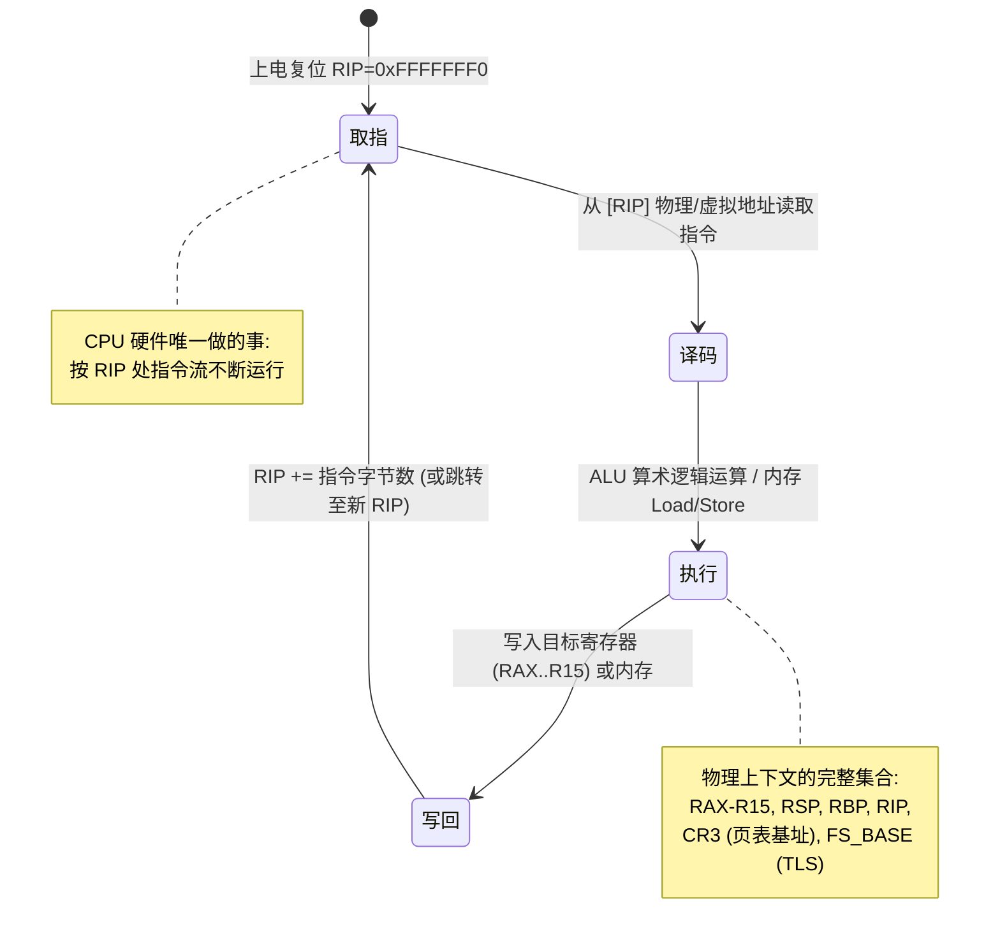
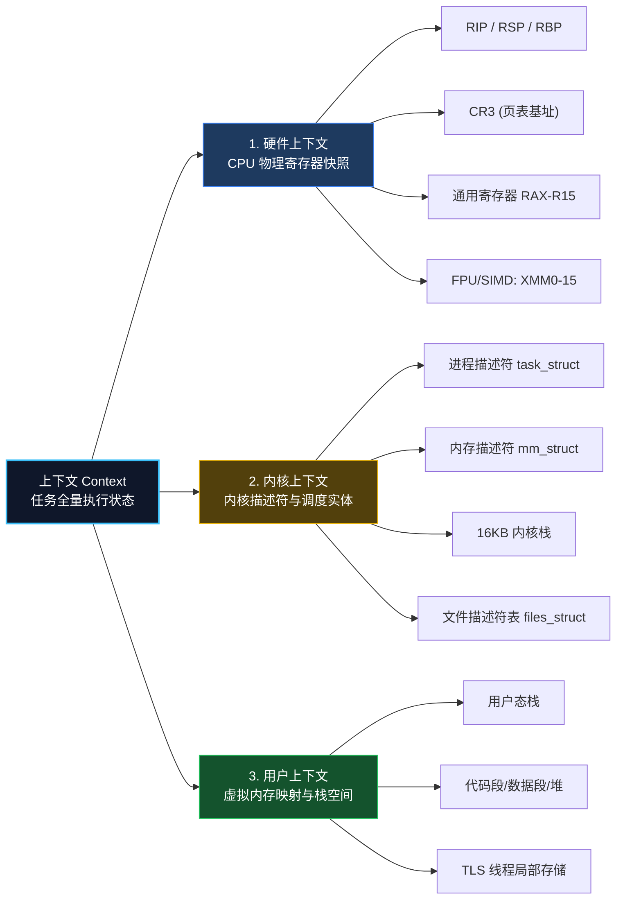
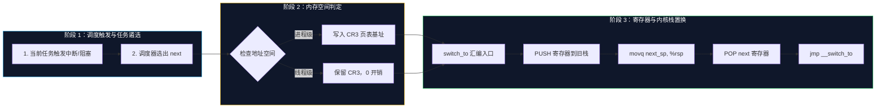
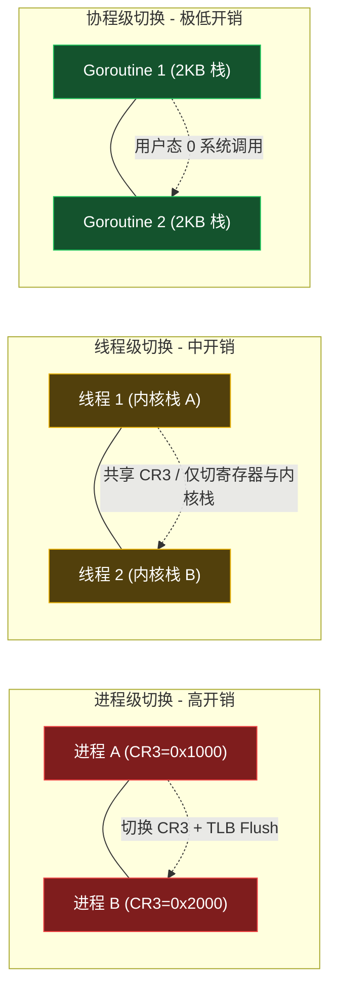
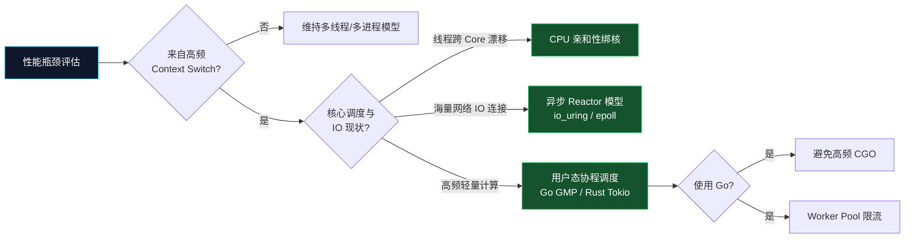

**TL;DR：**上下文切换的物理本质是 **CPU 寄存器快照的搬运与虚拟地址映射关系的替换**。从操作系统视角的进程切换（最高开销，切换 CR3 与刷新 TLB），到线程切换（共享地址空间，仅切换寄存器与内核栈），再到用户态 Goroutine 协程切换（2KB 动态栈、仅保存 8 个非易失寄存器、0 系统调用开销），每一次技术演进都是对硬件开销与调度精细度的极致重构。


*图注：上下文切换的完整演进图景——左为 CPU 硬件寄存器状态机与电路逻辑，中为内存页表及栈指针置换，右为 Go 在用户态实现的轻量级 Goroutine 协程调度栈。*

## 一、 核心本质：CPU 物理状态机与三层模型

在现代计算机体系中，CPU 本质上只是一个**无状态的指令执行引擎**。在物理电路上，操作系统所抽象出的“进程”或“线程”实体并不存在。CPU 仅仅是在时钟信号驱动下，不断重复“取指-译码-执行-写回”的流水线循环。

### 1.1 CPU 物理指令循环状态机



**物理本质**：所谓“进程 A 正在运行”，在晶体管与电子信号视角下，不过是 **CPU 通用寄存器 (RAX-R15)、栈指针 (RSP)、程序计数器 (RIP) 以及控制寄存器 (CR3) 中，恰好填充着属于进程 A 的数据数值**。

当操作系统决定暂停进程 A 换进程 B 执行时，必须把当前 CPU 内部的所有寄存器数值保存到内存中，并从内存中读取进程 B 此前保存的数值填充回 CPU 寄存器。这个**物理状态快照的备份与覆写过程**，就是上下文切换。

### 1.2 上下文的三层结构全景图

在 Linux 操作系统设计中，一个完整任务的上下文被细分为三层嵌套结构：



各层开销与保存位置详解：
1. **硬件上下文 (Hardware Context)**：
   - **保存位置**：`task_struct.thread`（x86-64）或 CPU 硬件寄存器堆。
   - **内容**：包含 16 个通用寄存器、`RIP`、`RSP`、`CR3`、`FS_BASE` 及扩展 FPU/AVX 寄存器。FPU/AVX 寄存器容量巨大（可达数 KB），早期内核（4.13 之前）采用 lazy FPU 按需保存；Linux 4.13 起一律 eager XSAVE/XRSTOR，浮点状态在切换时无条件保存。
2. **内核上下文 (Kernel Context)**：
   - **保存位置**：内核专有内存区。
   - **内容**：包含描述进程元数据的 `task_struct`、管理页表的 `mm_struct`、已打开文件句柄表 `files_struct`，以及为每个任务分配的独立 **16KB 内核栈**。
3. **用户上下文 (User Context)**：
   - **保存位置**：用户态虚拟内存空间。
   - **本质**：**在上下文切换过程中，用户态内存中的代码与数据完全静止、无需移动**。变化的仅仅是 CPU 内部指向这片内存区域的指针（即 `CR3` 页表基址与 `RSP` 栈指针）。

## 二、 内核硬核拆解：Linux 切换完整流程与汇编分析 (x86_64)

### 2.1 触发与决策：内核调度的入口

上下文切换并非随时随机发生，Linux 内核通过以下几种方式触发调度：
1. **时钟中断驱动**：硬件定时器中断触发 `scheduler_tick()`，若任务时间片耗尽，设置 `TIF_NEED_RESCHED` 标志位。
2. **阻塞式系统调用**：任务因等待磁盘 I/O、网络 Socket 或信号量主动调用 `schedule()` 休眠。
3. **抢占**：高优先级任务唤醒时，强行设置当前任务的抢占标记。

调度器入口 `__schedule()` 会调用 `pick_next_task()` 从 CFS（完全公平调度器）红黑树或 RT 优先级队列中选出下一个任务 `next`，最终进入核心函数 `context_switch()`。注：内核 6.6 起 CFS 已由 EEVDF 调度器取代，红黑树模型仍适用于理解调度的核心思想。



### 2.2 地址空间切换：switch_mm_irqs_off()

当发生进程级切换时，内核必须切换虚拟地址空间。该逻辑在 `arch/x86/mm/tlb.c` 中实现：

```c
void switch_mm_irqs_off(struct mm_struct *prev, struct mm_struct *next,
                        struct task_struct *tsk)
{
    unsigned long new_asid = mm_asid(next);
    
    // 如果 CPU 硬件支持 PCID (Process-Context Identifiers) 特性
    if (static_cpu_has(X86_FEATURE_PCID)) {
        // 构造带有 ASID 标记的 CR3 值，避免清空其他进程的 TLB 缓存
        write_cr3(build_cr3(next->pgd, new_asid));
    } else {
        // 无 PCID 支持时写入 CR3，硬件会自动全量 FlushTLB 缓存！
        write_cr3(__pa(next->pgd));
    }
}
```

### 2.3 寄存器与 CPU 内核栈原子替换：__switch_to_asm

真正的硬件栈指针置换与通用寄存器保存，由位于 `arch/x86/entry/entry_64.S` 的汇编代码完成：

`__switch_to_asm` 汇编源码逐行解析：

```assembly
SYM_FUNC_START(__switch_to_asm)
    /* -------------------------------------------------------------------
     * 1. 保存旧任务 prev 的 Callee-saved 寄存器到 prev 的内核栈中。
     *    根据 x86-64 64位 ABI 规范，RBP, RBX, R12-R15 必须由被调用者保存。
     * ------------------------------------------------------------------- */
    pushq   %rbp
    pushq   %rbx
    pushq   %r12
    pushq   %r13
    pushq   %r14
    pushq   %r15

    /* -------------------------------------------------------------------
     * 2. 将 CPU 当前的栈指针 RSP 保存至 prev->thread.sp 内存位置
     * ------------------------------------------------------------------- */
    movq    %rsp, TASK_thread_sp(%rdi)

    /* -------------------------------------------------------------------
     * 3. 【核心物理步骤】：直接将 CPU 的 RSP 寄存器覆写为 next->thread.sp！
     *    从这一条指令执行完毕的纳秒开始，硬件栈瞬间切到了 next 的内核栈！
     * ------------------------------------------------------------------- */
    movq    TASK_thread_sp(%rsi), %rsp

    /* -------------------------------------------------------------------
     * 4. 从 next 的内核栈中，弹出 next 此前保存的 Callee-saved 寄存器
     * ------------------------------------------------------------------- */
    popq    %r15
    popq    %r14
    popq    %r13
    popq    %r12
    popq    %rbx
    popq    %rbp

    /* -------------------------------------------------------------------
     * 5. 跳转到 C 函数 __switch_to 更新 TLS (FS_BASE) 与 FPU 状态。
     *    __switch_to 执行完后的 ret 指令，弹出的正是 next 保存在栈上的 RIP！
     * ------------------------------------------------------------------- */
    jmp     __switch_to
SYM_FUNC_END(__switch_to_asm)
```

## 三、 演进对比：进程 vs 线程 vs 协程 (Go Goroutine)

传统操作系统内核调度的最小粒度是 `task_struct`。随着高并发业务对吞吐量的极限追求，并发模型经历了一场持续降低硬件开销的演化流程。

### 3.1 三种并发模型的物理结构差异



### 3.2 切换流程与开销对比图


*图注：三层模型每往下一层，少搬一类状态——进程要换 CR3 并刷新 TLB，线程只切寄存器与内核栈，协程在用户态仅保存 8 个寄存器；开销从 ~2000ns 降到 ~10-30ns。*

### 3.3 精华对比矩阵

| 维度指标 | 进程 (Process) | 线程 (Kernel Thread) | 协程 (Goroutine) |
| :--- | :--- | :--- | :--- |
| **调度主体** | Linux 内核调度器 (CFS) | Linux 内核调度器 (CFS) | **Go runtime (GMP 模型)** |
| **执行特权级** | 内核态 (Ring 0) | 内核态 (Ring 0) | **用户态 (Ring 3)** |
| **内存映射切换** | **切换 CR3 写入新页表 PGD** | 共享 `mm_struct`（不切 CR3） | 共享进程虚拟地址空间 |
| **TLB 处理开销** | 强制清空 (无 PCID 时) | 0 影响 | 0 影响 |
| **栈内存开销** | 预分配 MB 级 (内核栈 16KB) | 静态分配 MB 级 (内核栈 16KB) | **按需动态扩展 (初始仅 2KB)** |
| **寄存器保存量** | 通用 + 控制 + FPU/AVX 全量 | 通用 + FPU/AVX | **仅 8 个 Callee-saved 寄存器** |
| **显性时间成本** | ~1000 ns - 2000 ns | ~300 ns - 800 ns | **~10 ns - 30 ns** |

注：内核 6.6 起 CFS 已由 EEVDF 调度器取代，上表“调度主体”一行的红黑树模型仍适用于理解调度的核心思想。

### 3.4 Go 协程极速切换源码：gogo 汇编逐行拆解

Go 语言在用户态实现了轻量级协程调度。当 Goroutine 发生 Channel 阻塞、网络 I/O 或显式 `Gosched()` 时，Goroutine 会通过 `mcall()` 切换到当前线程的 `g0` 栈，由 Go 调度器选出新 Goroutine，并调用 `runtime.gogo`（Go 1.25.1，`src/runtime/asm_amd64.s:404-421`）完成汇编级状态恢复：

```asm
; amd64(asm_amd64.s:404-421)
TEXT runtime·gogo(SB), NOSPLIT, $0-8
	MOVQ	buf+0(FP), BX		// gobuf
	MOVQ	gobuf_g(BX), DX
	MOVQ	0(DX), CX		// make sure g != nil
	JMP	gogo<>(SB)

TEXT gogo<>(SB), NOSPLIT, $0
	get_tls(CX)
	MOVQ	DX, g(CX)		// g 写入 TLS
	MOVQ	DX, R14			// set the g register
	MOVQ	gobuf_sp(BX), SP	// restore SP —— 换栈
	MOVQ	gobuf_ctxt(BX), DX
	MOVQ	gobuf_bp(BX), BP
	MOVQ	$0, gobuf_sp(BX)	// clear to help garbage collector
	MOVQ	$0, gobuf_ctxt(BX)
	MOVQ	$0, gobuf_bp(BX)
	MOVQ	gobuf_pc(BX), BX
	JMP	BX			// 直接跳到恢复点，无返回
```

这是“线程内长跳转”的完整实现，拆开看只有六组动作：

1. `MOVQ buf+0(FP), BX` / `MOVQ gobuf_g(BX), DX` / `MOVQ 0(DX), CX`：取出目标 goroutine 的 `gobuf`，读 `g` 字段自检非空，`JMP gogo<>(SB)` 进入内部函数；
2. `get_tls(CX)` + `MOVQ DX, g(CX)`：**把 g 写入线程本地存储**——登记“这个线程现在执行的是谁”，调度器与 GC 都靠 TLS 定位当前 g；
3. `MOVQ DX, R14`：**x86-64 下 R14 是 Go ABI 钦定的 g 寄存器**，此后任何汇编代码都能直接取当前 g；
4. `MOVQ gobuf_sp(BX), SP`：**一条指令完成换栈**——SP 从调度栈（g0）瞬间切到目标 goroutine 自己的栈；
5. 三次 `MOVQ $0, gobuf_*(BX)`：**清零 gobuf 字段帮助 GC**——若不清除，栈扫描会把 sp/ctxt/bp 里已过期的指针当成活的引用一路追踪；
6. `MOVQ gobuf_pc(BX), BX` + `JMP BX`：**PC 直接跳到恢复点，没有 ret、没有调用、不产生新栈帧**——恢复执行时连返回地址都不需要。

arm64 版（Go 1.25.1，`src/runtime/asm_arm64.s:188-209`）逻辑一致，差异在寄存器分配：

```asm
; arm64(asm_arm64.s:188-209)
TEXT runtime·gogo(SB), NOSPLIT|NOFRAME, $0-8
	MOVD	buf+0(FP), R5
	MOVD	gobuf_g(R5), R6
	MOVD	0(R6), R4	// make sure g != nil
	B	gogo<>(SB)

TEXT gogo<>(SB), NOSPLIT|NOFRAME, $0
	MOVD	R6, g
	BL	runtime·save_g(SB)
	MOVD	gobuf_sp(R5), R0
	MOVD	R0, RSP
	MOVD	gobuf_bp(R5), R29
	MOVD	gobuf_lr(R5), LR
	MOVD	gobuf_ctxt(R5), R26
	MOVD	$0, gobuf_sp(R5)	// 清零帮助 GC
	MOVD	$0, gobuf_bp(R5)
	MOVD	$0, gobuf_lr(R5)
	MOVD	$0, gobuf_ctxt(R5)
	CMP	ZR, ZR			// set condition codes for == test, needed by stack split
	MOVD	gobuf_pc(R5), R6
	B	(R6)
```

arm64 的关键差异：`MOVD R6, g` 把 g 写入 ABI 保留的专用寄存器（R28 即 g，源码注释原话），再用 `save_g` 同步回 TLS；RSP 恢复前先经 `R0` 中转；末尾 `CMP ZR, ZR` 先把条件码置零——**栈分裂 prologue 用 `==` 测试判断是否需要 morestack，gogo 返回时必须让条件标志处于已知状态**；最后 `B (R6)` 与 x86 的 `JMP BX` 一样是无返回跳转。两平台各自用寄存器（R14 / R28）固定存放 g，所以调用约定里永远没有“保存 g”的代码。

`gobuf` 只有六个字段（`src/runtime/runtime2.go:297-316`，Go 1.25.1）：

```go
type gobuf struct {
	sp   uintptr // 栈指针
	pc   uintptr // 程序计数器
	g    guintptr
	ctxt unsafe.Pointer
	lr   uintptr
	bp   uintptr // for framepointer-enabled architectures
}
```

源码注释特别说明：`sp`/`pc`/`g` 三字段的偏移被调试器（libmach）**硬编码引用**，不能随意调整；`ctxt` 在 GC 栈扫描中被当作**根**处理（它本质是“暂存在 gobuf 里的活跃寄存器”），所以 gogo 退出前必须清零它。

**与内核切换对照。** 上一节的 `__switch_to_asm` 与 gogo 解决的是同一个问题。Linux 内核 v6.6（`arch/x86/entry/entry_64.S`，L237-276）摘录：

```asm
__switch_to_asm:
	pushq	%rbp
	pushq	%rbx
	pushq	%r12
	pushq	%r13
	pushq	%r14
	pushq	%r15
	/* switch stack */
	movq	%rsp, TASK_threadsp(%rdi)   // 旧任务的内核栈指针存进 task_struct
	movq	TASK_threadsp(%rsi), %rsp   // 新任务的内核栈指针装入 RSP
	/* restore callee-saved registers */
	popq	%r15
	...
	popq	%rbp
	jmp	__switch_to
```

对照解读：**内核切换 = 6 个寄存器压入旧任务的内核栈 + RSP 切换 + 弹出新任务栈上的 6 个寄存器；Go 的 gogo = 恢复 SP/PC + 清零 gobuf。** 两者都是“换栈、换执行流”，差异只在现场保存在哪：内核把现场存在任务自己的 16KB 内核栈上（栈顶指针存进 `task_struct.thread.sp`），Go 把现场存在用户态的 `gobuf` 结构体里；调度决策则由 `kernel/sched/core.c` 的 `context_switch()`（v6.6，L5324 起）承接。可运行基准：`cd experiments && go test -bench=Switch ./context-switch`，在自己机器上量 goroutine 与线程切换的真实差距。

**为什么 Goroutine 切换如此高效？**
1. **0 特权级切换**：全部操作在用户态 (Ring 3) 完成，省去了 `syscall` / `sysret` 的陷落开销。
2. **极简寄存器保存**：Go 编译器在编译期利用 ABI 规则保证上下文切换点（Safe Points）只有 8 个 Callee-saved 寄存器需要保存。
3. **2KB 栈空间**：不同于线程动辄分配 8MB 栈空间导致的物理内存浪费，Goroutine 的栈从 2KB 开始，随调用深度自动进行扩容（`morestack`）与缩容。

### 3.5 一个常见的误解：goroutine 切换不是零开销

**“goroutine 切换是零开销”是错的。** gogo 本身确实省掉系统调用，但一次完整切换的账单远不止这几条指令：① 每次进出都有**栈分裂 prologue**——每个函数入口的边界检查与 `morestack` 判定；② 阻塞唤醒走 `gopark`/`ready`，要抢调度器锁、竞争 runq，极端时用 futex 唤醒睡眠的 M；③ GOMAXPROCS 下 goroutine 跨 P 漂移，cache 冷缺与分支预测失效的惩罚不亚于一次进程切换（见下一节）。只有纯用户态 `Gosched()` 接近“零 syscall”，而它不携带任何阻塞语义。

## 四、 隐性成本：微架构视角的真正杀手

许多系统工程师在评估上下文切换开销时，仅用 `sched_yield()` 做 Microbenchmark，得出“切换只需几十纳秒”的乐观结论。**这忽略了对 CPU 微架构影响巨大的隐性成本 (Indirect Cost)**。

```text
上下文切换总开销 = 显性物理耗时 (Direct Cost) + 隐性微架构污染 (Indirect Cost)
```


*图注：进程上下文切换对 CPU 微架构造成的隐性惩罚——写入 CR3 引发 TLB 清空，新进程执行初期遭遇高昂的 4 级页表遍历；原有 L1/L2 热点缓存行被驱逐，引发大量 Core Stall 停顿等待。*

### 4.1 隐性成本一：TLB Invalidation (页表高速缓存失效)

TLB (Translation Lookaside Buffer) 是 CPU 内部专门用于将虚拟地址快速翻译为物理地址的高速 SRAM 缓存。
当进程发生切换并写入新的 `CR3` 时，若未开启 PCID，CPU 会**强制清空所有非全局 TLB 缓存项**。这意味着新进程启动后的前几千次内存访问，CPU MMU 必须强行进行 4 级页表遍历（Page Table Walk：PGD $\rightarrow$ P4D $\rightarrow$ PUD $\rightarrow$ PMD $\rightarrow$ PTE）。每次 Page Table Walk 都需要多次访问物理 DRAM，带来高达 **50ns - 100ns** 的额外延迟。

### 4.2 隐性成本二：L1/L2/L3 Cache 污染 (Cold Cache)

CPU L1 Data/Instruction Cache 极其高速，但容量微小（通常每个 Core 仅 32KB - 64KB）。
当任务 A 被切走、任务 B 调入执行时，任务 B 读取的代码与数据会快速将任务 A 缓存的热点数据行（Warm Cache Lines）彻底驱逐。当任务 A 稍后重新被调回该 Core 时，由于遭遇高频的 **L1/L2 Cache Miss**，CPU 核心不得不频繁处于 **Core Stall** 状态，暂停流水线等待主存数据加载。

### 4.3 隐性成本三：分支预测器 (Branch Predictor) 冲刷

现代 CPU 依赖分支预测器（Branch Target Buffer, BTB）提前预测分支跳转。上下文切换后，分支预测器中积累的历史跳转规律不再适用于新代码段，导致 CPU 流水线频频发生预测错误（Mispredict），触发漫长的**流水线重置冲刷（Pipeline Flush）**。

### 4.4 怎么量：别用 sched_yield 给自己制造幻觉

前文说过，用 `sched_yield()` 做微基准会得出"切换只要几十纳秒"的乐观结论。那不是测量错了，是**测量对象错了**：`sched_yield` 只让出 CPU 然后立刻被调度回来，测的是"最轻的调度路径"，而真实负载里的切换至少带着唤醒（wakeup）——被切换走的线程要等另一侧的事件或数据，唤醒路径包含锁、等待队列与可能的睡眠，账单完全不是一回事。

可靠的做法有两种：

**管道乒乓（pipe ping-pong）**：两个线程交替向一个管道写、从同一个管道读。每次 `read` 返回都意味着：对端 `write` → 唤醒 → 调度 → 切换，一次往返天然包含两次完整的"切换 + 唤醒"。这个基准测的不是单次切换，而是真实线程通信的最小成本，Linux 内核自己也用它衡量调度延迟。量级概念：现代服务器上管道乒乓往返约在微秒量级，其中纯切换只占一小部分，其余是唤醒与调度器路径。

**计数而不是计时**：`perf stat -e context-switches` 看的是绝对次数，`vmstat`/`ps` 也能给出切换速率。计数器回答"切换多不多"，基准回答"一次多贵"——两者需要分开回答。判断切换是否是瓶颈时，先看速率：每秒几十万次上下文切换的机器，即使每次只有微秒级成本，也意味着 CPU 时间的大头在调度器里打转，此时优化方向是减少切换（事件驱动、绑核、协程），而不是纠结单次切换的纳秒数。

Go 侧的可运行基准已在本仓库：`cd experiments && go test -bench=Switch ./context-switch`，对比 goroutine 与线程在同一台机器上的真实差距。测量时记得固定 CPU 亲和性并关闭频率缩放（或至少做多次取中位数），否则测量结果里混进调度器的随机性，两个数字之间就失去可比性。

## 五、 工程优化决策路线图

基于对底层微架构与内核源码的深度理解，在系统架构设计中，我们可以采取以下优化策略：



### 5.1 CPU 亲和性与绑核 (CPU Affinity)

在 Linux 多核服务器上，避免线程在不同 CPU 核心之间漫无目的地漂移。使用 `pthread_setaffinity_np` 绑核不仅能保留 L1/L2 Cache 的热度，还能彻底消除 NUMA (Non-Uniform Memory Access) 架构下跨 CPU 节点访问远端内存的巨大惩罚：

```c
#define _GNU_SOURCE
#include <sched.h>
#include <pthread.h>

void bind_thread_to_core(int core_id) {
    cpu_set_t cpuset;
    CPU_ZERO(&cpuset);
    CPU_SET(core_id, &cpuset);

    pthread_t thread = pthread_self();
    int s = pthread_setaffinity_np(thread, sizeof(cpu_set_t), &cpuset);
    if (s != 0) {
        // 绑定失败处理
    }
}
```

### 5.2 事件驱动 I/O (Reactor / Proactor) 替代 Thread-per-request

传统网关的“一请求一线程”模型在并发突破上万时，CPU 将绝大部分算力浪费在了内核态线程的休眠与唤醒中。采用基于 `epoll` 或 Linux 最新的 `io_uring` 异步非阻塞模型，可用少量的 Worker 物理线程轻松处理数十万级别的并发 Connection。事件驱动模型的调度机制与上下文切换如何配合，见[事件循环不是一个循环](/writing/understanding-event-loops)。

### 5.3 Go 生产环境并发调优

1. **谨慎使用 CGO**：高频 CGO 调用会导致 Goroutine 所在的 M 脱离 Go 调度器的控制，被包装为标准 OS 线程处理，从而丢失协程切换的低开销优势。
2. **控制 Goroutine 池规模**：Goroutine 虽轻，但无节制的派生会产生海量 `g` 结构体，加重垃圾回收器（GC）扫描 Goroutine 栈空间的负担。使用带界限的 Worker Pool 维持吞吐与延迟的平衡。

协程之间超时、取消与传值的传递依赖 `context` 包，其传播机制与调度切换的配合，见[理解 Go Context 的边界](/writing/go-context-patterns)。

### 5.4 抢占与调度延迟：切换成本之外的另一笔账

切换成本说的是"一次切换多贵"，调度延迟说的是"任务要等多久才轮到"。两者经常被混为一谈，优化手段也不一样。

**Linux 侧的抢占模型。** 内核的抢占能力由配置决定：非抢占内核（`CONFIG_PREEMPT_NONE`）里，用户态进程只有主动让出或时间片耗尽才被切换，长时间运行的系统调用可能让低优先级任务等很久；完全抢占（`CONFIG_PREEMPT_FULL`）允许高优先级任务打断正在内核态执行的代码。`CONFIG_PREEMPT_DYNAMIC`（5.10+）把这个决策推迟到运行时。所以"调度延迟多少毫秒"不是固定常数，而是内核配置、任务优先级与负载的函数——排障时先确认内核用什么抢占模型，再谈延迟指标。

**Go 侧的抢占有两代实现。** Go 1.14 之前是协作式抢占：goroutine 只在函数调用点（栈检查）才会被调度器打断，一个不含调用的紧循环可以把整个 P 占死，其他 goroutine 全部饿肚子。Go 1.14 起引入基于信号的异步抢占（`asyncPreempt`，用 SIGURG 打断正在执行的 goroutine），紧循环也能被抢走——这是 Go 调度器行为的一次实质性升级。但要注意：被抢占点是编译期插桩决定的，某些临界区（GC 栈扫描、系统调用前后）仍不会被打断，理解这一点有助于解释"为什么我的 goroutine 看起来卡住了一会儿"。

**调度延迟的测量与切换成本要分开。** 管道乒乓测的是切换 + 唤醒；调度延迟要测的是"就绪 → 开始执行"的时间差，典型工具是调度器自带的延迟统计或 `perf sched`。诊断口诀：延迟高但切换计数不高，查抢占模型与优先级；切换计数高但单次成本低，查唤醒路径与锁竞争；两者都高，先减并发量、绑核或换事件驱动模型——本节与 4.4 的测量方法配合使用，才能把"慢"归因到正确的账上。

## 六、结语

上下文切换不是免费的抽象。**最好的切换，就是不发生切换**。无论是现代 Linux 内核引入 PCID 硬件加速，还是 Go 语言 GMP 模型对用户态协程的革新，体系结构演进的核心主线始终是：**尽量减少硬件状态的无谓搬运，最大限度保留 CPU Cache 与 TLB 的物理热度**。

> **适用读者**：本文假设读者具备基本的 C/Go 语言基础、系统编程经验及 x86-64 汇编概念。无论是追求极限吞吐的高并发服务端工程师，还是希望彻底打通计算机体系结构与内核边界的技术专家，都能从本文中获得清晰、系统的图景。

## 参考资料

1. Linux Kernel Source Code：`arch/x86/entry/entry_64.S`（`__switch_to_asm` 汇编实现）—— https://elixir.bootlin.com/linux/latest/source/arch/x86/entry/entry_64.S
2. Linux Kernel Source Code：`kernel/sched/core.c`（`__schedule` 与调度器入口）—— https://elixir.bootlin.com/linux/latest/source/kernel/sched/core.c
3. Go 1.25.1 Runtime Source：`src/runtime/asm_amd64.s`（gogo 汇编，L404-421）与 `src/runtime/asm_arm64.s`（gogo 汇编，L188-209）—— https://go.dev/src/runtime/asm_amd64.s
4. Go 1.25.1 Runtime Source：`src/runtime/runtime2.go`（gobuf 结构定义，L297-316）—— https://go.dev/src/runtime/runtime2.go
5. Linux v6.6 Kernel Source：`arch/x86/entry/entry_64.S`（`__switch_to_asm`，L237-276）—— https://github.com/torvalds/linux/blob/v6.6/arch/x86/entry/entry_64.S
6. Linux v6.6 Kernel Source：`kernel/sched/core.c`（`context_switch`，L5324 起）—— https://github.com/torvalds/linux/blob/v6.6/kernel/sched/core.c
7. Intel® 64 and IA-32 Architectures Software Developer Manual：Volume 3A, Chapter 7 (Task Management & PCID)—— https://www.intel.com/content/www/us/en/developer/articles/technical/intel-sdm.html

> 延伸阅读：Go 调度与生命周期——协程切换之后，超时、取消与传值的传递依赖 `context` 包，见[理解 Go Context 的边界](/writing/go-context-patterns)；服务退出时如何优雅地等待在途协程收尾，见[SIGTERM 之后发生了什么：把优雅停机做成一件确定的事](/writing/graceful-shutdown-in-go)。
