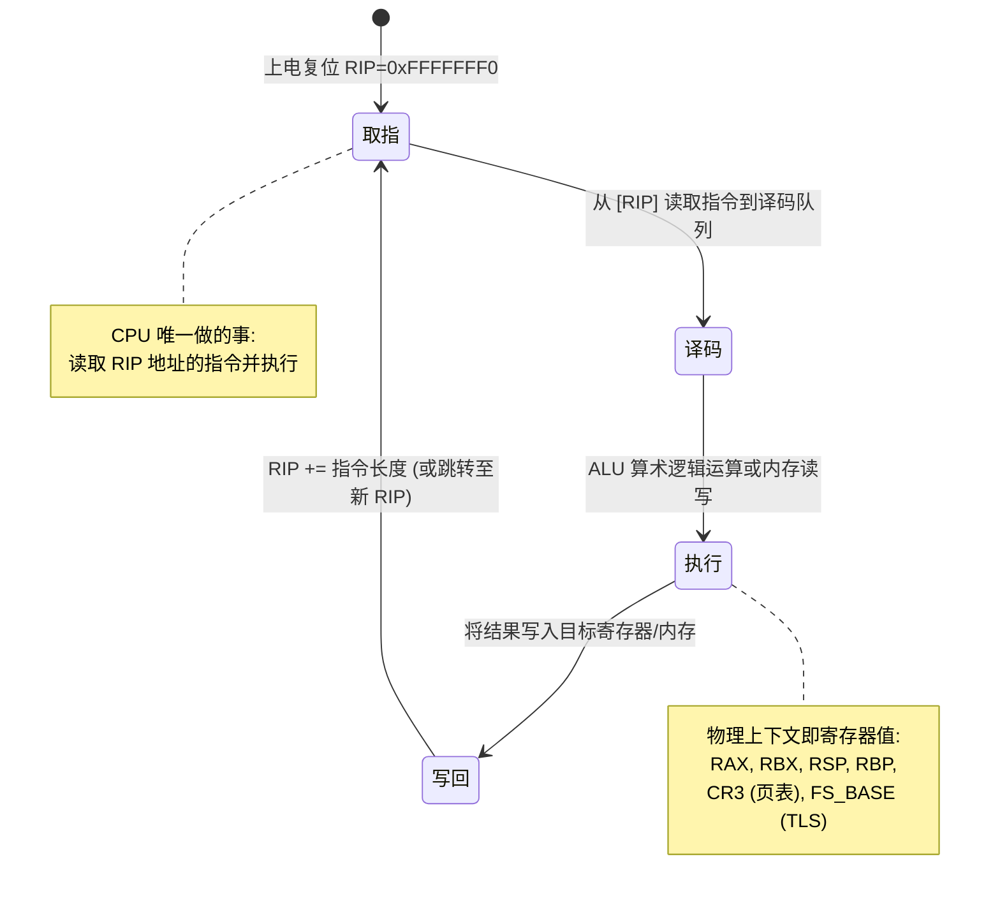
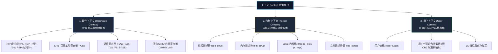
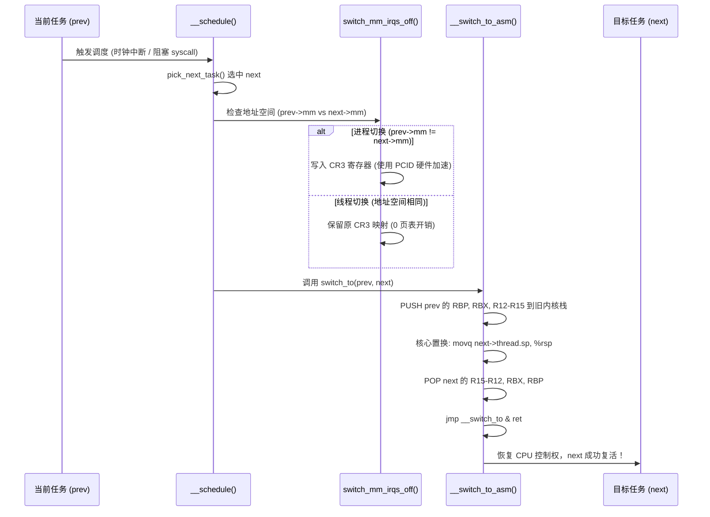
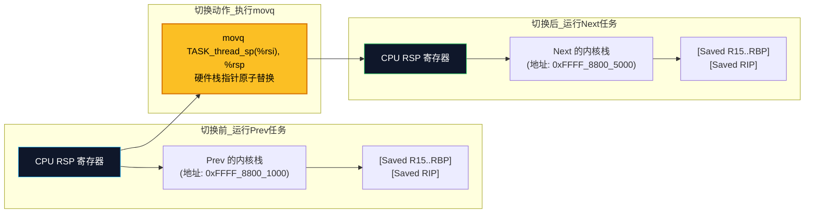
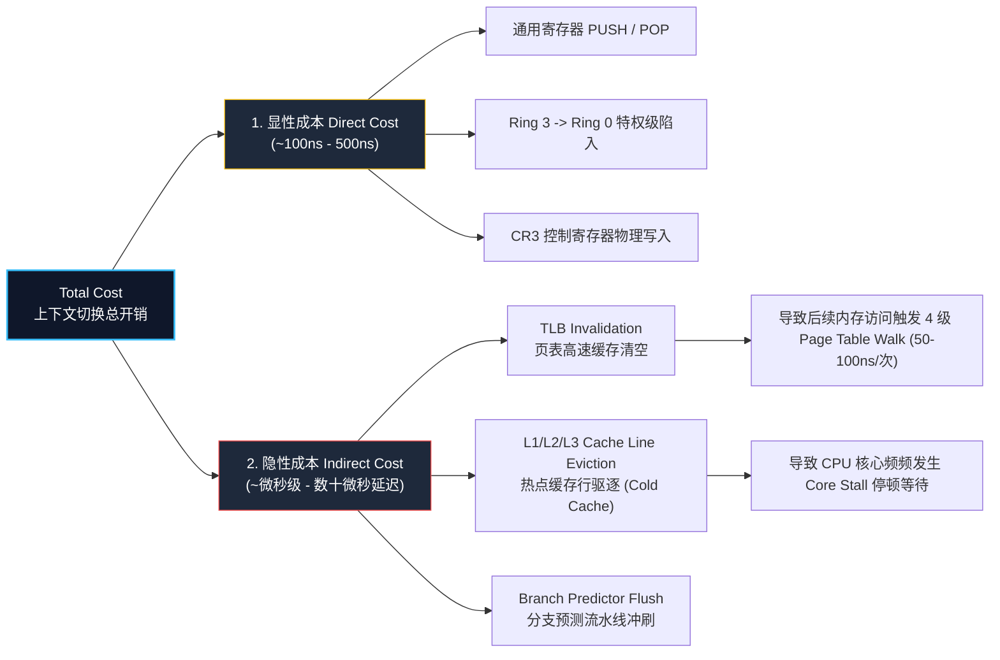
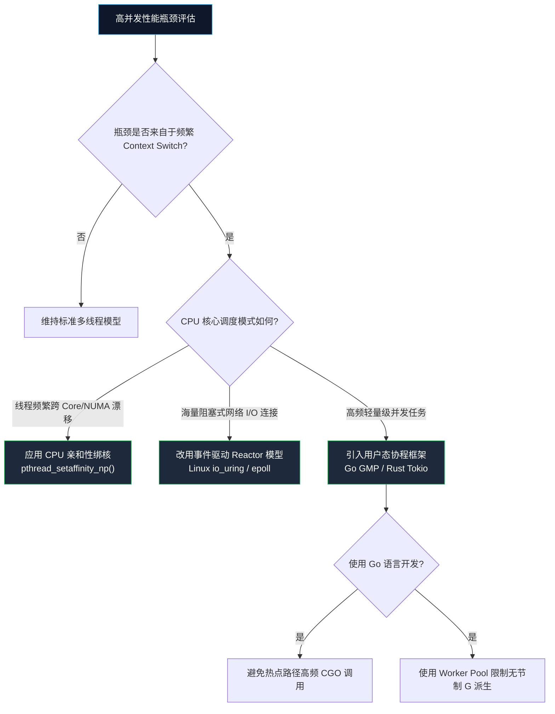

**TL;DR**：上下文切换的物理本质是 **CPU 寄存器快照的搬运与虚拟地址映射关系的替换**。从操作系统视角的进程切换（最高开销，切换 CR3 与刷新 TLB），到线程切换（共享地址空间，仅切换寄存器与内核栈），再到用户态 Goroutine 协程切换（2KB 动态栈、仅保存 8 个非易失寄存器、0 系统调用开销），每一次技术演进都是对硬件开销与调度精细度的极致重构。


---

## 一、 核心本质：CPU 物理状态机与三层模型

### 1.1 CPU 物理指令循环状态机

CPU 只是一个**无状态的指令执行引擎**。在物理世界上，根本不存在“进程”这个实体，CPU 只知道在每个时钟周期重复以下状态转换：



所谓“进程 A 正在运行”，物理本质就是：**CPU 寄存器（RAX-R15）、栈指针 (RSP) 以及控制寄存器 (CR3) 中，恰好存放着属于进程 A 的状态**。

### 1.2 上下文的三层结构全景图



- **硬件上下文**：寄存器的物理快照（RIP, RSP, CR3, 通用寄存器）。这是切换时真正需要搬运的硬件数据。
- **内核上下文**：`task_struct` 调度元数据与 16KB 内核栈。
- **用户上下文**：代码段、堆、用户栈。**切换时用户内存数据本身无需移动，移动的只是指向它们的基地址指针 (CR3 与 RSP)**。

---

## 二、 内核硬核拆解：Linux 切换完整时序与栈置换原理

### 2.1 内核 context_switch 调度的完整执行时序

在 Linux 内核（`__schedule()` $\rightarrow$ `context_switch()`）中，真正完成灵魂交接的是 `switch_mm_irqs_off`（地址空间）与汇编函数 `__switch_to_asm`（寄存器与栈）。



### 2.2 核心栈替换原理图解

内核栈指针替换是整个操作系统调度中最精妙的逻辑：



### 2.3 关键 5 行汇编解读 (__switch_to_asm)

真正的栈与寄存器交接位于 `arch/x86/entry/entry_64.S`：

```assembly
SYM_FUNC_START(__switch_to_asm)
    /* 1. 将旧任务 prev 的 Callee-saved 寄存器压入其内核栈 */
    pushq   %rbp
    pushq   %rbx
    pushq   %r12
    pushq   %r13
    pushq   %r14
    pushq   %r15

    /* 2. 保存旧任务的栈指针到 task_struct.thread.sp */
    movq    %rsp, TASK_thread_sp(%rdi)

    /* 3. 【最关键一步】：直接替换 RSP 为新任务 next 的内核栈指针！ */
    movq    TASK_thread_sp(%rsi), %rsp

    /* 4. 弹出新任务 next 保存在其内核栈中的 Callee-saved 寄存器 */
    popq    %r15
    popq    %r14
    popq    %r13
    popq    %r12
    popq    %rbx
    popq    %rbp

    /* 5. 跳转到 __switch_to，随后的 ret 将直接跳转到 next 之前保存的 RIP */
    jmp     __switch_to
SYM_FUNC_END(__switch_to_asm)
```

---

## 三、 演进对比：进程 vs 线程 vs 协程 (Go Goroutine)

为了突破操作系统内核调度的物理开销瓶颈，应用层演进出了用户态协程调度。

### 3.1 三种并发模型的物理结构差异对比

```mermaid
graph TD
    subgraph 进程级 (Process Switch)
        P1["进程 A (CR3 = 0x1000)"] --- P2["进程 B (CR3 = 0x2000)"]
        P1 -.->|切 CR3 + 全量 TLB Flush| P2
    end

    subgraph 线程级 (Thread Switch)
        T1["线程 1 (内核栈 A)"] --- T2["线程 2 (内核栈 B)"]
        T1 -.->|共享 CR3 / 仅切内核栈与通用寄存器| T2
    end

    subgraph 协程级 (Goroutine Switch)
        G1["Goroutine 1 (2KB 栈)"] --- G2["Goroutine 2 (2KB 栈)"]
        G1 -.->|用户态 runtime.gogo / 0 系统调用| G2
    end

    style P1 fill:#1e293b,stroke:#ef4444,color:#fff
    style P2 fill:#1e293b,stroke:#ef4444,color:#fff
    style T1 fill:#1e293b,stroke:#eab308,color:#fff
    style T2 fill:#1e293b,stroke:#eab308,color:#fff
    style G1 fill:#1e293b,stroke:#22c55e,color:#fff
    style G2 fill:#1e293b,stroke:#22c55e,color:#fff
```

### 3.2 开销甘特图对比

```mermaid
gantt
    title 切换开销与流程对比
    dateFormat  X
    axisFormat %s

    section 进程切换 (Process Switch)
    Trap 到内核 (Ring 3 -> Ring 0) :a1, 0, 20
    CR3 页表重映射 + TLB Invalidate :a2, 20, 50
    全量寄存器 PUSH/POP            :a3, 50, 80
    TLB Miss & Cache 污染 (隐性)   :active, a4, 80, 200

    section 线程切换 (Thread Switch)
    Trap 到内核 (Ring 3 -> Ring 0) :b1, 0, 20
    共享 CR3 (保留页表映射)       :b2, 20, 40
    保存/恢复线程寄存器与内核栈     :b3, 40, 70

    section Go 协程切换 (Goroutine)
    Go runtime 用户态 GMP 调度    :c1, 0, 5
    仅保存 8 个非易失寄存器        :c2, 5, 12
    0 系统调用 (留在 Ring 3)      :c3, 12, 15
```



### 3.3 精华对比矩阵

| 核心指标 | 进程 (Process) | 线程 (Kernel Thread) | 协程 (Goroutine) |
| :--- | :--- | :--- | :--- |
| **调度内核态** | 内核态 (Ring 0) | 内核态 (Ring 0) | **用户态 (Ring 3)** |
| **内存映射切换** | **切换 CR3，刷新页表** | 共享 `mm_struct` (不切 CR3) | 共享进程地址空间 |
| **TLB 影响** | 强制刷新 (无 PCID 时) | 无影响 | 无影响 |
| **栈内存开销** | MB 级 (内核栈 16KB) | MB 级 (内核栈 16KB) | **动态扩展 (初始仅 2KB)** |
| **寄存器保存量** | 全量通用 + 控制 + FPU/AVX | 全量通用 + FPU/AVX | **仅 8 个非易失寄存器** |
| **时间成本** | ~1000 ns - 2000 ns | ~300 ns - 800 ns | **~10 ns - 30 ns** |

### 3.4 Go 协程极速切换源码：gogo 汇编

在 Go runtime (`src/runtime/sys_x86.s`) 中，Goroutine 的切换由极简汇编完成：

```assembly
TEXT runtime·gogo(SB), NOSPLIT, $0-8
    MOVQ    buf+0(FP), BX       // 获取 gobuf 结构体
    MOVQ    gobuf_g(BX), DX     // 获取 g 结构体
    
    MOVQ    gobuf_sp(BX), SP    // 1. 恢复用户栈指针 SP
    MOVQ    gobuf_bp(BX), BP    // 2. 恢复帧指针 BP
    MOVQ    gobuf_tls(BX), SI   // 3. 恢复 TLS 内部绑定
    MOVQ    gobuf_pc(BX), BX    // 4. 读取待执行的 PC 指针
    
    JMP     BX                  // 5. 直接跳转！无 ret，无系统调用陷入
```

---

## 四、 隐性成本：真实的性能杀手

评估切换开销不能仅看显性的寄存器读写（几十纳秒），真正破坏高并发系统吞吐的是**微架构隐性开销**：

$$\text{上下文切换总开销} = \text{显性物理耗时 (Direct Cost)} + \text{隐性微架构污染 (Indirect Cost)}$$




1. **TLB Invalidation (页表缓存失效)**：写入 CR3 会使 TLB 缓存失效。进程恢复运行后的前几千次内存访问，必须触发漫长的 4 级页表查询（Page Table Walk），每次额外引入 **50ns - 100ns** 延迟。
2. **L1/L2 Cache 污染 (Cold Cache)**：新进程的数据迅速冲刷原有核心的 L1/L2 Cache。被切走的任务再次恢复时，将遭遇严重的 **Cache Miss**。
3. **分支预测器 (Branch Predictor) 清空**：CPU 硬件流水线的分支预测历史被擦除，导致后续代码执行时出现频繁的流水线冲刷。

---

## 五、 工程优化决策路线图

在工程设计中，我们应该如何针对上下文切换开销进行架构选型？



---

## 结论

上下文切换不是免费的抽象。**最好的切换，就是不发生切换**。无论是现代 Linux 内核对 PCID 的硬件利用，还是 Go 语言 GMP 模型对用户态协程的重构，体系结构演进的核心主线始终是：**尽量减少硬件状态的搬运，最大限度保留 CPU Cache 的热度**。
