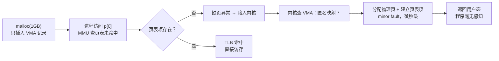

**TL;DR：** malloc 返回的是一张"欠条"：地址空间里的空洞，物理内存一点没给。第一次真正读写那个地址时才触发缺页，内核才分配物理页、建立页表项——这叫惰性分配（demand paging）。缺页分两种：minor fault 只是"页表没有映射"，微秒级；major fault 要把页从磁盘读回来，毫秒级，是延迟毛刺和 GC 停顿之外另一个隐形的性能刺客。理解虚拟内存 = 理解地址空间、多级页表、页缓存、COW 与 OOM 五个零件，它们的共同作用决定了一个 Go 进程的 RSS 和 P99 延迟。

## 一、 malloc 之后，内存真的到手了吗

写一个最简单的程序：

```go
p := make([]byte, 1<<30) // 申请 1GB
fmt.Println(len(p))      // 打印 1073741824
// 然后 sleep 一小时，什么都不做
```

进程申请了 1GB，但它真的占用了 1GB 物理内存吗？不。`/proc/<pid>/status` 里的 `VmRSS` 几乎不涨，涨的只有 `VmSize`。如果机器上恰好有足够多的这种进程，你会看到物理内存"借出"了远超实际使用的量，而系统居然不爆——因为大部分承诺从未被兑现。

这就是虚拟内存的第一课：**分配地址空间 ≠ 分配物理内存**。

Linux 上 `malloc`/`make` 大块内存时，glibc 调用 `mmap(NULL, size, PROT_READ|PROT_WRITE, MAP_PRIVATE|MAP_ANONYMOUS, ...)`。这个调用只在内核里干了两件事：找到一块足够大的空闲虚拟地址区间，在进程的 VMA（Virtual Memory Area）链表里插一条记录。没了。没有分配任何物理页，甚至没有建立任何页表项。那块内存现在是"账面上的资产"，是地址空间里的一个大洞。

等到程序第一次访问某个地址，比如 `p[0] = 1`，CPU 拿着这个虚拟地址去查页表——查不到映射，MMU 抛出一个**缺页异常**，CPU 陷入内核。内核在异常处理里翻出这条 VMA 记录：哦，这块区域是匿名映射，那就分配一个物理页，填好页表项，返回用户态。这一整套过程叫 **demand paging（按需分页）**，也就是惰性分配。

所以"缺页"不是错误，它是虚拟内存的正常工作方式。每一个你写过字节的内存页，都经历过一次缺页。



注意一个细节：缺页的次数不是一次，而是**每页一次**。1GB 内存按 4KB 页算，要 262144 次缺页才能全部"激活"。所以惰性分配也不全是免费的——它把成本推迟到了第一次访问的那一刻，而那一刻可能正在你的热路径上。

## 二、 页表：一张按需构建的稀疏树

虚拟内存要把"虚拟地址 → 物理地址"的映射关系记下来。最简单的做法是一张线性数组：虚拟地址按页分成 256TB / 4KB = 640 亿个页号，每个页号一个表项，一张表 640 亿 × 8 字节 ≈ 512GB——没有任何进程能背着这样的表运行。所以页表必须是**多级** 的：Linux x86-64 用四级（PGD → PUD → PMD → PTE），每级 512 项，把完整映射拆成一颗稀疏的树。没映射的子树根本不存在，占用的不是内存，只是"缺失"。


*图注：malloc 的大块内存只在 VMA 里有记录，页表树里没有对应分支；首次 touch 才分配物理页并补齐页表项。*

虚拟地址在硬件层面被切碎成四段，每段 9 位：

```text
虚拟地址 = [PGD 索引 9bit] [PUD 索引 9bit] [PMD 索引 9bit] [PTE 索引 9bit] [页内偏移 12bit]
```

CPU 从 `cr3` 寄存器拿到当前进程的 PGD 地址，逐级查下去。每查一级都是一次内存访问，四级表就是四次。如果不做优化，每次普通访存都要多出四次内存读——这就是 **TLB** 存在的原因：它把"虚拟页号 → 物理页号"的映射缓存起来，命中时一次搞定。TLB 命中率是内存子系统最重要的性能指标之一，TLB miss 之后的四级遍历才是真实的访存成本。

这里有一个工程上很常见的推论：**THP（Transparent Huge Page）** 把 4KB 页合并成 2MB 大页，一个 TLB 项能覆盖的地址范围扩大 512 倍，对 TLB miss 严重的负载（比如大数组扫描）有明显收益。但它的代价是页合并/分裂时的额外开销，以及在 fork 之后 COW 时把 2MB 拆成 512 个 4KB 页带来的瞬间 CPU 尖峰。云厂商的数据库实例踩坑大半与它有关，很多部署选择 `madvise` 模式或者直接关掉。

## 三、 缺页的两种档位：minor 与 major

缺页不是只有一种。按"缺的东西在哪"分两类，性能差四个数量级：

- **minor fault（次要缺页）**：物理页已经存在，只是这个进程的页表里没有映射。典型场景：匿名页第一次 touch（内核现场分配，实际很快）、被 swap 出去又换回时页还在内存、COW 时复制页、共享内存首次映射。成本是内核流程本身：微秒级，最多几百纳秒到几微秒。
- **major fault（主要缺页）**：需要的页在磁盘上，必须发起一次块设备 I/O。典型场景：程序启动时从可执行文件加载代码页、从磁盘读文件、从 swap 换入。成本是一次磁盘寻道 + 读取：机械盘 5~10ms，SSD 也至少要 100~500μs。对一次正常的函数调用来说，这是天文数字。

区分两者不需要工具，`/usr/bin/time -v` 直接给出答案：

```bash
$ /usr/bin/time -v ./my-server 2>&1 | grep -E "Minor|Major|Context"
	Minor (reclaiming a frame) page faults: 4183
	Major (requiring I/O) page faults: 3
	Voluntary context switches: 891
```

一个成熟的服务进程启动后，major fault 应该趋近于零——它的热代码和数据早已驻留页缓存。如果 major fault 持续出现，说明程序在用 `mmap` 随机读一个比物理内存大的文件（页缓存不断被换出），或者开了 swap 导致匿名页被换出。这两种情况都会表现为**毫无规律的服务延迟毛刺**，而且 profiling 里看不到（CPU 采样只统计运行态，缺页阻塞发生在内核的等待队列里，正是 off-CPU 区间）。

## 四、 文件页与页缓存：mmap 的零拷贝真相

虚拟内存机制不仅管匿名页，也管文件。Linux 读一个文件时，数据先进入**页缓存**（page cache），然后从页缓存拷贝到用户缓冲区。`read()` 的语义是"两段拷贝"：磁盘 → 页缓存 → 用户态。

`mmap` 做的则更激进：把文件所在的页缓存**直接映射进进程地址空间**。用户态指针访问的文件区域，如果页缓存里有就直接命中（本质是一次 minor fault 后建立映射，之后纯 TLB 命中）；没有就从磁盘读（major fault）。省掉了那次内核到用户态的拷贝——这是"mmap 零拷贝"说法的来源，代价是 mmap 区域与文件在语义上共享了同一份页缓存，写文件等于改页缓存，需要保证 flush 时机。

这解释了为什么数据库、搜索引擎这类"要反复读同一批文件"的软件偏爱 mmap：热数据留在页缓存里，访问路径从"系统调用 + 拷贝"变成"直接访存"，配合内核的 read-ahead 预读，顺序扫描吞吐极高。RocksDB 的 `use_mmap_reads`、LevelDB 的 mmap 选项、以及 Redis 的 `AOF`/`RDB` 加载都受益于此。而网络服务一类的场景每次读的数据不重复，mmap 反而把"缺页、TLS、页表维护"的固定成本摊到了一次性 I/O 上，往往不如 `read()` 稳定。

## 五、 写时复制：fork 为什么那么快

`fork()` 号称"复制整个进程"，但它没有复制任何物理页。内核只做了两件事：复制页表（并把所有可写页标记为只读），让父子进程共享同一份物理页。真正的复制被推迟到"有人要写"的那一刻：写的时候触发缺页，内核发现这是 COW 页，复制一份物理页给写入方，各自指向独立页——这就是 **COW（Copy-On-Write，写时复制）**。

```go
// Redis 的 RDB 持久化就是这个套路
pid := fork()          // 瞬间返回，不管进程多大
if pid == 0 {
    dumpRdb()          // 子进程读到的仍是 fork 时的内存快照
    exit(0)
}
wait(pid)              // 父进程继续服务请求
```

RDB 之所以能在不阻塞主线程的情况下生成快照，靠的就是 COW：fork 瞬间完成，子进程开始顺序写磁盘，父进程继续改内存；被改过的页才真正复制。这也是 fork 之后 RSS 会短暂翻倍的原因——复制的不是全部，而是"fork 后两边都写过的页"的并集。

COW 有两个经典坑。其一：fork 一个占 50GB 内存的进程，之后子进程只调用了 `exec` 或只读不写，复制量是零，但页表复制本身要遍历全部映射，几百万个 PTE 的建立也需要几十毫秒——所以"fork 之后第一笔请求延迟暴涨"是常见事故，本质是页表复制与 TLB 刷新的成本，不是"复制内存"。其二：THP 开启时一个 2MB 大页被拆成 512 个 4KB 页，COW 触发会放大缺页数量，这就是 Go 1.20 之后在部分发行版上把 `GOMEMLIMIT` 相关回收行为与 THP 干扰相联系的根源之一。

## 六、 overcommit 与 OOM：内存"不够"时谁死

虚拟内存的承诺可以超过物理内存，这个设计叫 **overcommit（过度承诺）**。Linux 默认策略 `0` 允许一定程度的超额——比如一个进程 malloc 了 1GB 但只用 100MB，另一个进程 malloc 了 2GB 但只用 200MB，物理内存 2GB 也转得动。崩溃发生在**承诺集中兑现** 的时刻：所有进程突然都去 touch 自己的内存，物理内存耗尽，页缓存被压到零，swap 也满了，内核必须开始杀人。

`OOM killer` 的裁决依据是 `oom_score`：进程占用的内存越多、存活时间越短、优先级越低，分越高，最先被杀。它的目标不是公平，是**快速恢复**：杀掉一个进程，让系统能继续运转。所以：

- 数据库实例的 `VmRSS` 巨大、又是后启动的，几乎必被杀——这就是为什么 `innodb_buffer_pool_size` 要小于物理内存、为什么 Java 的 `-Xmx` 要留余量、为什么容器里要开 cgroup 内存限制（限制内 OOM 由 cgroup 自行裁决，不会误杀宿主机上的其他进程）。
- `mmap` 出来的大块区域在 overcommit 计费里常被算成"可能提交"，默认策略下 2GB 的 mmap 与 2GB 的触摸内存对 `CommitLimit` 的占用不同——裸金属与容器下表现不一致，是诡异 OOM 的常见来源。
- swap 不是救命稻草：swap 使用率爬到高位后，页缓存的换入换出风暴（swap thrashing）会让整个系统卡到 SSH 都进不去，数据库宁可 OOM 也别上 swap，这是 DBA 的共识。

工程上的收尾结论可以浓缩成一句话：**内存优化先看 RSS 涨不涨、缺页是 major 还是 minor、有没有 swap 交换**——三者分别对应"谁分配了没用的内存、谁在把磁盘当内存用、谁的内存被偷走了"，比盯着 heap profile 更接近真相。

## 七、 回到 Go：RSS 为什么比 heap 大

把视角切回 Go。一个 Go 服务"明明只用了 500MB 堆"但 RSS 是 1.2GB，是泄漏吗？不一定，虚拟内存机制给出了几个合法解释：

1. **arena 预取**：Go 运行时向操作系统一次性 mmap 一大块，再切成小块分配给用户。堆增长是"按块向 OS 要"，块内利用率低时 RSS 天然大于 live heap。
2. **页缓存与 mmap 混合**：`os.ReadFile`、`mmap` 读文件会蹭页缓存，但那是"共享"的，RSS 的统计口径（`VmRSS` 含文件页）会让数字看起来偏大。
3. **GC 后归还**：Go 的 mheap 不把物理页还给 OS，`GOMEMLIMIT` + `debug.FreeOSMemory` 存在时才会归还。堆收缩后 RSS 不降是特性不是 bug，判断依据是 `sys` 与 `heapReleased` 两个指标，而不是 RSS 本身。
4. **COW 残留**：`fork` + COW 在 Go 里不常见（Go 用 `exec` 而非 `fork` 启动子进程），但 cgo 或 C 库可能调用 fork。

判断方法就一句话：先看 `/proc/<pid>/status` 的 `VmRSS` 与 `Swap`，再看 `vmstat` 的 `si`/`so` 是否非零，最后才轮到 heap profile。绝大多数"内存泄漏"排查的最后一步，都是回到缺页与 RSS 的分解上——虚拟内存的五个零件（地址空间、多级页表、页缓存、COW、overcommit）逐个排除，答案自然浮现[^1]。

[^1]: 延伸阅读：内核文档 `Documentation/mm/` 下的 `demand_paging` 与 `oom` 部分；《CSAPP》第 9 章对虚拟内存与缺页的图解比任何博客都清楚；`man 2 mmap` 的 man page 值得逐行读一遍。

## 八、参考资料：Linux 内核对地址空间的定义

- [Linux kernel：Process Address Space](https://docs.kernel.org/mm/process_addrs.html)：VMA、进程地址空间与映射关系。
- [Linux kernel：Overcommit Accounting](https://docs.kernel.org/mm/overcommit-accounting.html)：提交限制与 overcommit 策略。
- [Linux kernel：Transparent Hugepage Support](https://docs.kernel.org/admin-guide/mm/transhuge.html)：THP 的模式、收益与限制。
- [`mmap(2)` manual](https://man7.org/linux/man-pages/man2/mmap.2.html)：匿名映射、文件映射和保护属性。
- [`proc_pid_status(5)` manual](https://man7.org/linux/man-pages/man5/proc_pid_status.5.html)：`VmSize`、`VmRSS` 等进程内存统计字段。
